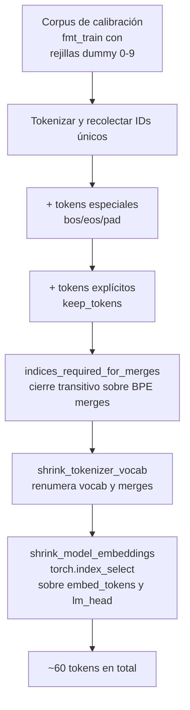
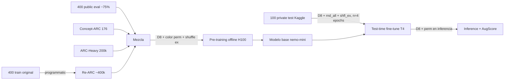
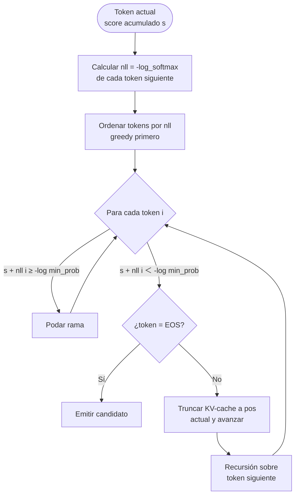
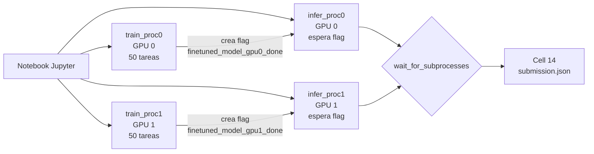

# Arquitectura de la solución "the ARChitects" — ARC Prize 2024

> Análisis detallado del notebook [arc-prize-2024-solution-by-the-architects.ipynb](arc-prize-2024-solution-by-the-architects.ipynb), la solución de Daniel Franzen y Jan Disselhoff que obtuvo el **2.º puesto** en el Kaggle ARC Prize 2024 con **53.5 puntos** en el set privado (56.5 post-deadline). Cada componente del código se conecta con su justificación teórica en *On the Measure of Intelligence* (Chollet, 2019) y en el paper técnico de los autores.

---

## Tabla de contenidos

1. [Marco conceptual: ARC-AGI y la medida de inteligencia](#1-marco-conceptual-arc-agi-y-la-medida-de-inteligencia)
2. [Visión general del pipeline](#2-visión-general-del-pipeline)
3. [Estructura del notebook y módulos generados](#3-estructura-del-notebook-y-módulos-generados)
4. [Modelado de datos: rejilla → texto (`ArcFormatter`)](#4-modelado-de-datos-rejilla--texto-arcformatter)
5. [Tokenizador reducido a ≤64 tokens](#5-tokenizador-reducido-a-64-tokens)
6. [Augmentación como principio rector](#6-augmentación-como-principio-rector) — D8, permutación de colores, niveles estructural vs superficie
7. [Datasets y reparto entre GPUs](#7-datasets-y-reparto-entre-gpus)
8. [Fine-tuning secundario (test-time training)](#8-fine-tuning-secundario-test-time-training)
9. [Inferencia: DFS guiado por probabilidad (`turbo_dfs`)](#9-inferencia-dfs-guiado-por-probabilidad-turbo_dfs)
10. [AugScore: selección del mejor candidato](#10-augscore-selección-del-mejor-candidato)
11. [Paralelización Kaggle (2×T4, 12 h)](#11-paralelización-kaggle-2t4-12-h)
12. [Generación de `submission.json`](#12-generación-de-submissionjson)
13. [Conexión con la teoría de Chollet](#13-conexión-con-la-teoría-de-chollet)
14. [Resumen y resultados](#14-resumen-y-resultados)

---

## 1. Marco conceptual: ARC-AGI y la medida de inteligencia

Chollet (2019) define inteligencia no como el rendimiento en una tarea concreta, sino como la **eficiencia de adquisición de habilidades** (*skill-acquisition efficiency*) relativa a tres factores:

$$
\text{Inteligencia} \;\propto\; \frac{\text{Generalización lograda}}{\text{Priors} \;+\; \text{Experiencia} \;+\; \text{Dificultad}}
$$

Para evaluarlo propone el **Abstraction and Reasoning Corpus (ARC)**:

- Cada tarea es un puzzle: 2-7 pares input/output de **rejillas** (1×1 a 30×30, 10 colores) que ilustran una transformación, más 1-2 rejillas test cuyo output debe predecirse.
- Cada solución se evalúa con **2 intentos** (`attempt_1`, `attempt_2`).
- Se asume solo los **Core Knowledge priors** (objetidad, agentidad, número, geometría/topología). No hay conocimiento de lenguaje natural ni cultural.
- Cada tarea es **única** — la generalización debe ocurrir desde 2-7 ejemplos.

Los LLMs estándar fracasan en ARC porque sus priors están sesgados hacia distribuciones lingüísticas y carecen de invariancias geométricas explícitas. La solución de los ARChitects inyecta esos priors faltantes mediante **diseño de pipeline**, no mediante cambios al modelo base.

---

## 2. Visión general del pipeline

El siguiente diagrama muestra el **flujo completo y, sobre cada arista, cómo crece o se reduce el número de muestras** desde las 400 tareas semilla de ARC hasta las 200 predicciones finales del `submission.json`.

```mermaid
flowchart LR
    %% --- Fuentes estructurales (offline) ---
    A1["ARC-AGI-1 train<br/>400 tareas"] -->|generador DSL Hodel| B1["Re-ARC<br/>~400.000 tareas"]
    A2["ARC public eval<br/>~300 tareas usadas ~75%"] --> MIX
    A3["Concept-ARC<br/>176 tareas"] --> MIX
    A4["ARC-Heavy LLM-synth<br/>~200.000 tareas"] --> MIX
    B1 --> MIX["Mezcla estructural<br/>~600.000 tareas únicas"]

    %% --- Augmentación de superficie offline ---
    MIX -->|"D8 × 8 + colores × 10! ≈ 2.9·10⁷ presentaciones/tarea"| SURF["Espacio efectivo<br/>~10¹³ presentaciones"]
    SURF --> PT["Pre-entrenamiento offline<br/>H100, LoRA r=256"]
    PT --> CK{{"Checkpoint<br/>wb55l_nemomini_fulleval"}}

    %% --- Notebook Kaggle (dentro) ---
    T0["Private test<br/>100 tareas"] --> SPLIT["Reparto por GPU<br/>50 + 50"]
    CK --> FT
    SPLIT -->|"D8 + rnd_all + shfl_ex<br/>n=4 epochs, ~×64 por tarea"| FT["Test-time fine-tune<br/>~6.400 muestras<br/>(LoRA r=64)"]
    FT --> INF["Inferencia DFS turbo<br/>100 tareas × ~16 vistas<br/>≈ 1.600 prompts"]
    INF -->|"min_prob=0.17"| CAND["Candidatos<br/>decenas-cientos por tarea"]
    CAND -->|"AugScore × 8 augmentaciones"| SCORE["Re-scoring por coherencia"]
    SCORE --> SEL["Top-2 por tarea"]
    SEL --> SUB[["submission.json<br/>100 × 2 = 200 predicciones"]]

    classDef inside fill:#e6f3ff,stroke:#1f6feb;
    classDef outside fill:#fff5e6,stroke:#bf6900;
    class T0,SPLIT,FT,INF,CAND,SCORE,SEL,SUB inside;
    class A1,A2,A3,A4,B1,MIX,SURF,PT,CK outside;
```



**Leyenda**: las cajas en **azul claro** son lo que ejecuta el notebook Kaggle; las cajas en **naranja claro** son el pre-entrenamiento offline que **no aparece** en el notebook y se asume cargado en el checkpoint `wb55l_nemomini_fulleval/transformers/default/1` (ver [línea 1379](arc-prize-2024-solution-by-the-architects.ipynb#L1379)).

**Cómo leer la progresión numérica**:

1. **400** tareas ARC-AGI-1 → **~400.000** vía Re-ARC (×1000 por generación DSL).
2. Sumando Concept-ARC + ARC-Heavy + eval pública: **~600.000 tareas estructuralmente únicas**.
3. Cada una se multiplica on-the-fly por **~29 millones de presentaciones** (8 simetrías D8 × 10! permutaciones de color), produciendo un espacio efectivo de pre-entrenamiento del orden de **10¹³**.
4. Dentro del notebook se parte solo de **100 tareas** del test privado; tras `augment(n=4)` con D8 y permutación de color se generan **~6.400 muestras de entrenamiento** (≈ 50 tareas × ~64 augmentaciones × 2 GPUs).
5. La inferencia evalúa cada tarea bajo **~16 vistas** (`tp=True, rot=True, n=2`) → **~1.600 prompts** que producen **decenas-cientos de candidatos por tarea** vía DFS.
6. El AugScore re-puntúa cada candidato bajo **8 augmentaciones** y se quedan **2 finalistas por tarea** → **200 predicciones** en `submission.json`.

**Idea central**: en lugar de razonar simbólicamente, el modelo *memoriza* la distribución de transformaciones ARC vía fine-tuning sobre un espacio aumentado masivo, y la inferencia es una **búsqueda probabilística guiada** sobre el espacio de outputs plausibles, validada por consistencia bajo simetrías.

---

## 3. Estructura del notebook y módulos generados

El notebook usa `%%writefile` para materializar 5 módulos Python que luego se ejecutan en subprocesos paralelos:

| # | Celda | Líneas | Archivo generado | Responsabilidad |
|---|---|---|---|---|
| 1-2 | `1f011e54`, `32924c61` | 2-19 | — | Licencia Apache + descripción |
| 3 | `4775d6e2` | 22-667 | `model_runner.py` | Shrinking de tokenizador, PEFT, entrenamiento, **DFS turbo**, scoring aumentado |
| 4 | `ddc017c2` | 670-1256 | `arc_loader.py` | `ArcDataset` (augment D8 + permutación de color + shuffling) y `ArcFormatter` (rejilla→tokens) |
| 5 | `e87e12a9` | 1259-1333 | `selection.py` | `score_full_probmul_3` (**AugScore**) y baselines |
| 6 | `9eddf5a3` | 1336-1361 | `async_tools.py` | Lanzador asíncrono de subprocesos |
| 7 | `67375f37` | 1364-1528 | `common_stuff.py` | Configuración global, `prepare_run`, `start_training`, `start_inference` |
| 8 | `d1b81735` | 1531-1557 | — | Instalación offline de unsloth + parches |
| 9-12 | `9f776f83`,`d752e4b4`,`07057557`,`072b37b3` | 1560-1576 | — | 4 subprocesos `%%python --bg`: 2 entrenamientos + 2 inferencias |
| 13 | `267d6389` | 1579-1582 | — | `await` síncrono de los 4 subprocesos |
| 14 | `8a6071ab` | 1585-1596 | — | Decodificación final, AugScore agregado, `submission.json` |

Esta arquitectura **multi-fichero dentro de un único notebook** es una respuesta directa a las restricciones de Kaggle: el notebook es la única unidad ejecutable, pero los subprocesos `%%python --bg` necesitan módulos importables.

---

## 4. Modelado de datos: rejilla → texto (`ArcFormatter`)

Esta es **la sección más importante para entender la solución**. Un LLM no entiende imágenes ni matrices; solo procesa secuencias de tokens (números enteros). El reto fundamental es: **¿cómo convertir una rejilla 2D de colores en una secuencia 1D de texto sin perder la estructura espacial?** Toda la solución de los ARChitects descansa sobre las decisiones tomadas aquí.

Implementado en [arc_loader.py:L1090-L1180](arc-prize-2024-solution-by-the-architects.ipynb#L1090-L1180), clase `ArcFormatter`.

### 4.1. Conceptos previos: qué es tokenización y por qué importa

Antes de explicar el código, es necesario entender dos conceptos básicos:

**Token**: la unidad mínima que procesa un LLM. Cada token tiene un ID numérico único. Cuando le das texto a un modelo, lo primero que ocurre es la **tokenización**: el string se divide en piezas y cada pieza se convierte en su ID.

**Tokenización BPE** (Byte Pair Encoding, la que usa Mistral): un algoritmo que aprende, durante el preentrenamiento del modelo, qué combinaciones de caracteres aparecen juntas con más frecuencia y las fusiona (*merges*) en un solo token. Por ejemplo:

| Texto | Tokens BPE típicos (Mistral) | IDs |
|---|---|---|
| `"Hello world"` | `["Hello", " world"]` | `[22557, 1526]` |
| `"123"` | `["123"]` (un solo token) | `[28740]` |
| `"12"` | `["12"]` (un solo token) | `[28740]` |
| `"00012"` | `["000", "12"]` | `[3328, 28740]` |

**El problema**: si tokenizamos `"00012"` como `["000", "12"]`, el modelo "ve" 2 tokens donde **nosotros queremos que vea 5 celdas individuales**. Pierde la correspondencia 1 carácter = 1 celda, y por tanto, pierde la noción de posición espacial. Si la rejilla mide 5×5 = 25 celdas, queremos que el modelo procese exactamente 25 tokens de contenido por fila (más el separador), no un número impredecible que depende de los dígitos concretos.

> **Idea clave**: para que el modelo aprenda geometría, **cada celda de la rejilla debe corresponder a exactamente un token**, sin importar el color. Esto requiere "engañar" al tokenizador BPE para que no fusione dígitos adyacentes.

Esta es la razón por la que la sección 5 (tokenizador reducido) existe: al eliminar todas las fusiones BPE entre dígitos del vocabulario, se garantiza que `"00012"` se tokenice como `["0", "0", "0", "1", "2"]`.

### 4.2. El problema concreto: una tarea ARC en formato JSON

Una tarea ARC viene en el JSON de Kaggle así (simplificado):

```json
{
  "0a1b2c3d": {
    "train": [
      {"input": [[0,0,1],[0,1,0],[1,0,0]],  "output": [[1,0,0],[0,1,0],[0,0,1]]},
      {"input": [[0,2,0],[2,0,0],[0,0,2]],  "output": [[0,0,2],[2,0,0],[0,2,0]]}
    ],
    "test": [
      {"input": [[0,0,3],[3,0,0],[0,3,0]]}
    ]
  }
}
```

- `train`: los ejemplos demo (input + output, **ambos visibles**).
- `test`: la consulta (solo input visible; el output es lo que hay que predecir).

El reto del `ArcFormatter` es convertir esta estructura en un único string que el LLM pueda procesar, **manteniendo la información espacial intacta** y dejando claro al modelo dónde tiene que generar la respuesta.

### 4.3. Construcción del string paso a paso (`fmt_array`)

La función más básica es [`fmt_array`](arc-prize-2024-solution-by-the-architects.ipynb#L1126), que serializa **una sola rejilla**:

```python
def fmt_array(self, array):
    return self.arr_beg + self.arr_sep.join(
        str(row).replace(' ', '').replace(',', '').replace('[', '').replace(']', '') + self.min_pad*max(0, self.min_wid-len(row))
        for row in array
    ) + self.arr_end
```

Vamos paso a paso con la rejilla `[[0,0,1],[0,1,0],[1,0,0]]`:

1. **Itera por filas**: `[0,0,1]`, `[0,1,0]`, `[1,0,0]`.
2. **Convierte cada fila a string** con `str(row)` → `"[0, 0, 1]"`.
3. **Limpia caracteres no deseados**: quita espacios, comas y corchetes → `"001"`.
4. **Une las filas con el separador `arr_sep = '\n'`** → `"001\n010\n100"`.
5. **Añade prefijo/sufijo** (`arr_beg=''`, `arr_end='\n'` en la config final) → `"001\n010\n100\n"`.

Resultado: la rejilla 2D se ha convertido en un string donde **cada dígito corresponde a una celda** y **cada salto de línea marca una fila**.

> **¿Por qué `\n` como separador de fila?** Porque las redes Transformer aprenden patrones de "distancia entre tokens". Si la rejilla mide 5 de ancho, el modelo descubre que **el token que está exactamente 6 posiciones atrás** (5 celdas + 1 salto de línea) corresponde a la celda inmediatamente superior. Esto da una **estructura geométrica predecible** que el mecanismo de atención puede aprovechar para razonar verticalmente. Si en cambio uses un separador variable (espacios, comas), esta regularidad se rompe.

### 4.4. Ejemplo completo: tarea ARC → texto serializado

Aplicando `fmt_train` + `fmt_query` ([L1135-L1148](arc-prize-2024-solution-by-the-architects.ipynb#L1135-L1148)) a la tarea anterior con el `ArcFormatter_premix_3` (la variante de competición, [L1234](arc-prize-2024-solution-by-the-architects.ipynb#L1234)):

```
ABCDEFGHJKLMNPQRSTUVWXYZabcdefghjklmnpqrstuvwxyz       ← pretext (línea 1)
I                                                       ← marcador "comienza input"
001                                                     ← fila 1 del input demo 1
010                                                     ← fila 2
100                                                     ← fila 3
                                                        ← (línea en blanco = arr_end)
+/-=                                                    ← pre_out (4 tokens "neutros")
O                                                       ← marcador "comienza output"
100                                                     ← fila 1 del output demo 1
010
001
<eos>                                                   ← fin del demo 1
                                                        ← separador entre demos (exa_sep='')
ABCDEFGHJKLMNPQRSTUVWXYZabcdefghjklmnpqrstuvwxyz       ← pretext, demo 2
I
020
200
002

+/-=
O
002
200
020
<eos>
ABCDEFGHJKLMNPQRSTUVWXYZabcdefghjklmnpqrstuvwxyz       ← pretext, query (test)
I
003
300
030

+/-=
O
                                                        ← AQUÍ EMPIEZA A GENERAR EL MODELO
```

Tras este último `O`, el modelo debe predecir tokens hasta el siguiente `<eos>`. Cada token será un dígito 0-9 (celda) o `\n` (fin de fila), y al alcanzar `<eos>` la rejilla está completa.

### 4.5. Por qué cada componente del formato existe

Cada elemento del string anterior no es decorativo: cumple una función pedagógica específica para el modelo. Vamos uno por uno.

#### 4.5.1. Pretext de letras `ABCDE...xyz` ([L1232](arc-prize-2024-solution-by-the-architects.ipynb#L1232))

```python
pretext='ABCDEFGHJKLMNPQRSTUVWXYZabcdefghjklmnpqrstuvwxyz'  # 48 letras, sin I,O,i,o
```

**¿Qué es?** Una cadena fija de 48 letras que se inserta antes de **cada** ejemplo (demos y query).

**¿Por qué existe?** Hay tres razones técnicas:

1. **Anclas de tokenización estables**. Tras reducir el vocabulario a ~60 tokens (sección 5), estas 48 letras se conservan explícitamente como tokens de "un carácter = un token". Sirven de "anchor tokens" que mantienen el modelo en una distribución conocida tras el shrink del vocabulario.

2. **Pre-prompt aprendido** (*soft prompt* implícito). Durante el fine-tuning, los embeddings de estas letras se entrenan (`embed_tokens` está en `target_modules`, [L1469](arc-prize-2024-solution-by-the-architects.ipynb#L1469)). El modelo aprende a usar esas 48 posiciones como un "espacio de cómputo previo" donde acumula representaciones útiles antes de empezar a procesar la rejilla. Es equivalente a darle al modelo "tiempo para pensar" antes de cada problema, una técnica conocida como *prompt tuning* aplicada de forma encubierta.

3. **Separación clara entre ejemplos**. Cuando aparece la secuencia `ABCDE...xyz` el modelo sabe inequívocamente que **empieza un nuevo ejemplo independiente**, lo que evita confusión cuando hay 3-7 demos consecutivos en el mismo contexto.

**¿Por qué se excluyen `I, O, i, o`?** Porque `I` y `O` se usan como marcadores de input/output (ver 4.5.3). Si aparecieran en el pretext, el modelo podría confundirlos con marcadores reales. Las minúsculas `i, o` se excluyen por simetría/consistencia.

> **Curiosidad**: existen variantes en el código ([L1231-L1234](arc-prize-2024-solution-by-the-architects.ipynb#L1231-L1234)). `ArcFormatter_pretext2` usa solo 24 letras mayúsculas; `pretext3` y `premix_3` usan 48. La elección final del paper (`premix_3`) maximiza la cantidad de "prompt aprendido".

#### 4.5.2. Salto de línea inicial implícito y separadores de filas (`arr_sep='\n'`)

Las filas se separan por `\n`. **Esto convierte el ancho de la rejilla en una distancia constante en el espacio de tokens**:

```
Rejilla 5x5:           Texto tokenizado:
00012                  0 0 0 1 2 \n
01210      →           0 1 2 1 0 \n
00000                  0 0 0 0 0 \n
00120                  0 0 1 2 0 \n
01200                  0 1 2 0 0 \n
```

Si el modelo está procesando el token en posición `p`, sabe que:

- El token de **la celda de su izquierda** está en `p-1`.
- El token de **la celda de su derecha** está en `p+1`.
- El token de **la celda directamente arriba** está en `p - (ancho + 1)` (porque hay que retroceder el ancho + un `\n`).
- El token de **la celda directamente abajo** está en `p + (ancho + 1)`.

Esta es una **estructura 2D codificada en 1D** que el mecanismo de atención puede aprender perfectamente. Si en lugar de `\n` usases comas o espacios variables, las distancias serían irregulares y el modelo tendría que reaprender la geometría para cada tarea.

> **Por qué importa para Transformers**: las redes de atención calculan, para cada par de tokens, un peso que depende tanto del contenido como de la **posición relativa** (RoPE en Mistral, por ejemplo). Con un layout 2D-en-1D regular, las "cabezas de atención" pueden especializarse: una para mirar al vecino izquierdo, otra para el vecino superior, etc. Es la base del procesamiento de imágenes con LLMs textuales.

#### 4.5.3. Marcadores `I` (input) y `O` (output) ([L1231](arc-prize-2024-solution-by-the-architects.ipynb#L1231))

```python
inp_prefix='I', out_prefix='O'
```

**¿Qué son?** Caracteres únicos que aparecen **inmediatamente antes** de cada rejilla, indicando si es un input o un output.

**¿Por qué letras concretas y por qué tan cortas?**

1. **Letras**, no símbolos arbitrarios, porque encajan en el vocabulario reducido: ya hay 48 letras como anclas, añadir 2 más es trivial. Cualquier símbolo `<INPUT>` o `<OUTPUT>` consumiría tokens especiales escasos.
2. **De 1 carácter**, porque queremos que sean **un solo token** tras la tokenización. `I` y `O` son letras que, tras eliminarse las fusiones BPE, se convierten en tokens atómicos.
3. **`I` y `O`** específicamente, porque son la inicial natural de Input y Output (mnemónicos).

**¿Para qué los usa el modelo?** Dos funciones:

1. **Delimitar regiones**: el modelo aprende que tras un `I` viene una rejilla input, y tras un `O` la transformación aplicada. Es como decirle "estos son los datos, esta es la respuesta".
2. **Anclar la atención del DataCollator**: la pérdida durante el entrenamiento se calcula **solo sobre los tokens que vienen después de `O`** (ver 4.5.6 más abajo). El `O` es el "interruptor" que activa el cálculo del loss.

#### 4.5.4. El `pre_out` enigmático: `+/-=` ([L1234](arc-prize-2024-solution-by-the-architects.ipynb#L1234))

```python
pre_out=['+/-=']*99
```

**¿Qué es?** La secuencia literal `+/-=` (4 caracteres) que se inserta **entre el input y el output** de cada ejemplo:

```
I 001\n010\n100\n+/-=O 100\n010\n001\n<eos>
        ↑       ↑
        |       |
        input   pre_out (4 tokens) — output
```

**¿Por qué existe?** Esta es una de las decisiones menos obvias pero más interesantes. Hay tres razones:

1. **"Tiempo de pensar" inducido** (*compute padding*). El mecanismo de atención de un Transformer procesa cada token con la misma cantidad de cómputo. Si insertamos 4 tokens "neutros" entre el input y el output, el modelo dispone de **4 capas de cómputo adicionales** (con sus respectivas atenciones globales) **antes de empezar a generar la respuesta**. Es análogo al *chain-of-thought*, pero sin pedirle al modelo que verbalice nada — solo le damos espacio para procesar.

2. **Tokens distintivos para localizar la frontera**. `+`, `/`, `-`, `=` son símbolos que **nunca aparecen** ni en las rejillas (que solo contienen 0-9) ni en el pretext (letras) ni como marcadores (`I`/`O`). Por tanto son **completamente inequívocos**: cuando el modelo los ve sabe con certeza que el input ha terminado y el output va a comenzar. Es una señal limpia.

3. **Resistencia a desplazamientos**. Si el modelo predice un dígito sobrante por error, el `pre_out` no aparece donde debería y el formato se "rompe" rápidamente, facilitando que el DFS pode esa rama (ver sección 9).

> **Conexión con la investigación reciente**: Goyal et al. (2024) demostraron que añadir tokens "pause" o "filler" antes de tareas de razonamiento mejora el rendimiento de los LLMs sin necesidad de cambios en la arquitectura. Los ARChitects descubrieron esto por intuición o experimentación: el `pre_out` es exactamente un *pause token*.

#### 4.5.5. El `<eos>` (end-of-sequence) y el fin de ejemplo

Cada output termina con `\n<eos>` ([L1166](arc-prize-2024-solution-by-the-architects.ipynb#L1166), método `fmt_reply`):

```python
def fmt_reply(self, reply, fault=None):
    ids = self.fmt_array(reply[0]) + self.exa_end + self.tokenizer.eos_token
    ...
```

**¿Por qué importa?**

- **Durante la generación**: el DFS detecta `<eos>` como condición de parada ([L546](arc-prize-2024-solution-by-the-architects.ipynb#L546)). Sin él, el modelo seguiría generando indefinidamente.
- **Durante el entrenamiento**: el modelo aprende a **emitir `<eos>` justo después de la última fila completa**, lo que implícitamente le enseña a respetar la altura correcta de la rejilla. Generar `<eos>` "demasiado pronto" o "demasiado tarde" produce salidas malformadas que se detectan en `decode_to_array` ([L1190](arc-prize-2024-solution-by-the-architects.ipynb#L1190)).

#### 4.5.6. Máscara de pérdida: enseñar solo lo importante (`MyDataCollator`, [L1300-L1349](arc-prize-2024-solution-by-the-architects.ipynb#L1300-L1349))

Este es un detalle crucial que afecta a **qué aprende exactamente el modelo durante el entrenamiento**.

**El problema**: por defecto, un LLM se entrena con *causal language modeling*: para cada token, intenta predecir el siguiente, y la pérdida es la suma de los errores sobre **todos los tokens** de la secuencia. Pero en ARC eso es ineficiente: no queremos que el modelo aprenda a predecir el pretext (siempre es igual) ni los inputs (no son la respuesta). Solo queremos que aprenda a predecir los **outputs**.

**La solución**: `MyDataCollator` hereda de [`DataCollatorForCompletionOnlyLM`](https://huggingface.co/docs/trl/sft_trainer#train-on-completions-only) (TRL) y **enmascara con `-100`** todos los tokens que no son outputs. El valor `-100` es una convención de PyTorch que indica "ignorar este token en el cálculo del loss".

Visualmente, sobre una secuencia de entrenamiento:

```
Tokens:  A B C D E ... I 0 0 1 ... +/-= O 1 0 0 ... <eos>
Labels: -100 -100 ...                    1 0 0 ... <eos>     ← solo se calcula loss aquí
```

**¿Cómo detecta dónde empieza el output?** [L1308](arc-prize-2024-solution-by-the-architects.ipynb#L1308):

```python
instruction_template=[self.inp_prefix, self.tokenizer.bos_token][self.masking - 1],
response_template=[self.out_prefix, ...][self.masking - 1],
```

Con `masking=1` (config final), `instruction_template='I'` y `response_template='O'`. El collator localiza el patrón `O` en la secuencia y enmascara todo lo que está antes.

**Funcionalidades adicionales**:

- **`mask_first_output`** ([L1340](arc-prize-2024-solution-by-the-architects.ipynb#L1340)): opcionalmente ignora también el output del **primer demo**, para que el modelo aprenda específicamente de los siguientes (donde ya tiene contexto). La config final usa `mask_first=0` (no se aplica), pero está disponible.

- **`fault_freq` / `fault_token_id`** ([L1320-L1335](arc-prize-2024-solution-by-the-architects.ipynb#L1320-L1335)): inyecta tokens incorrectos aleatorios en el output y marca los siguientes con un `fault_token_id` especial. Esto entrena al modelo a **detectar sus propios errores** (cuando se equivoca, los tokens posteriores deben emitir `fault_token_id`). No se usa en la versión final, pero es un experimento del paper.

**Por qué es crítico**: sin esta máscara, ~80% del cómputo del loss se gastaría en aprender a regenerar inputs que ya son visibles. Con la máscara, todo el "presupuesto de aprendizaje" se concentra en lo único que importa: la transformación input → output.

### 4.6. Variantes del formateador disponibles ([L1231-L1234](arc-prize-2024-solution-by-the-architects.ipynb#L1231-L1234))

El código define 4 variantes preconfiguradas:

| Nombre | Pretext (letras) | `pre_out` (relleno entre I y O) |
|---|---|---|
| `ArcFormatter_pretext2` | 24 mayúsculas | ninguno |
| `ArcFormatter_pretext3` | 48 (mayúsc. + minúsc.) | ninguno |
| `ArcFormatter_premix_2` | 24 mayúsculas | `+/-=` |
| **`ArcFormatter_premix_3`** ✓ | 48 (mayúsc. + minúsc.) | `+/-=` |

La marcada con ✓ es la que usa la solución final ([L1379](arc-prize-2024-solution-by-the-architects.ipynb#L1379): `MyFormatter = ArcFormatter_premix_3`). Es la más "rica": **maximiza tanto el prompt aprendido (48 letras) como el tiempo de cómputo previo a la respuesta (4 tokens `+/-=`)**.

### 4.7. Decodificación: invertir el proceso (`decode_to_array`, [L1183-L1207](arc-prize-2024-solution-by-the-architects.ipynb#L1183-L1207))

Cuando el modelo genera una respuesta, hay que convertirla **de vuelta** a una rejilla numpy. El proceso es la inversa:

```python
def decode_to_array_single(self, text, score=None, limit_rows=30):
    try:
        by_rows = [row for row in [[int(x) for x in line if x.isdigit()] for line in text.split(self.dec_sep)] if len(row)]
        ...
        decoded = np.array(by_rows, dtype=int)
        if self.is_valid_solution(decoded):
            return {'output': decoded, 'score': ..., ...}
    except: pass
    return {}
```

Pasos:

1. **Cortar en `<eos>`**: `cut_at_token` ([L673](arc-prize-2024-solution-by-the-architects.ipynb#L673)) descarta todo lo que el modelo haya generado tras `<eos>`.
2. **Dividir por `\n`** (`dec_sep`): cada elemento es una fila.
3. **Extraer dígitos**: filtra carácter por carácter, conservando solo los `0-9`. Esto es robusto: si el modelo emite ruido (letras, símbolos), se ignoran.
4. **Construir numpy array**: si todas las filas tienen la misma longitud, se forma una rejilla 2D válida.
5. **Validar**: `is_valid_solution` ([L1170](arc-prize-2024-solution-by-the-architects.ipynb#L1170)) comprueba que las dimensiones estén entre 1 y 30 (límite de ARC).
6. **Si falla**: se devuelve `{}` y el candidato se descarta sin error.

**Por qué tolera errores silenciosamente**: durante el DFS, miles de hojas pueden generar texto malformado. En vez de tratar cada error como excepción (lento), simplemente se descartan y se siguen explorando otras ramas.

### 4.8. Cálculo del scoring durante la decodificación

`decode_to_array_single` no solo devuelve la rejilla, sino también **5 matrices de scoring** alineadas celda a celda ([L1196-L1202](arc-prize-2024-solution-by-the-architects.ipynb#L1196-L1202)):

| Campo | Significado |
|---|---|
| `output` | La rejilla numpy decodificada |
| `score` | `log P(token_generado)` para cada celda (forma idéntica a la rejilla) |
| `score_cum` | Suma acumulada de log-probs hasta cada celda |
| `score_all` | Para cada celda, log-probs de los 10 dígitos posibles (forma `H × W × 10`) |
| `score_all_cum` | Igual, pero acumulado |

Esta información se usa después en el AugScore (sección 10) para combinar evidencia entre distintas augmentaciones. Es decir: el formateador no solo "decodifica", también **prepara el material estadístico** necesario para la selección final.

### 4.9. Resumen visual: el ciclo completo

```mermaid
flowchart LR
    A[Tarea ARC JSON<br/>matrices Python] --> B[ArcFormatter.fmt_train<br/>fmt_query<br/>fmt_reply]
    B --> C[String formateado<br/>pretext + I + grid + pre_out + O + grid + EOS]
    C --> D[Tokenizer reducido<br/>~60 tokens]
    D --> E[Secuencia de IDs<br/>1 token = 1 celda o separador]
    E --> F[LLM Mistral 8B<br/>4-bit + LoRA]
    F --> G[IDs generados]
    G --> H[Tokenizer.decode]
    H --> I[String de salida]
    I --> J[decode_to_array<br/>parsea dígitos<br/>extrae score por celda]
    J --> K[Rejilla numpy<br/>+ scoring matrices]
```



**Síntesis de las decisiones de diseño**:

| Decisión | Problema que resuelve |
|---|---|
| 1 token = 1 celda | Preserva geometría 2D en secuencia 1D |
| `\n` como separador | Distancia constante entre filas verticales |
| Pretext de 48 letras | Soft prompt aprendido + ancla de tokenización |
| Marcadores `I`/`O` | Delimitación inequívoca de regiones |
| `pre_out = +/-=` | Tokens "pause" para cómputo extra antes de responder |
| Vocabulario reducido | Garantiza que `12` no se fusione en un solo token |
| Máscara de pérdida en `O` | Concentra el aprendizaje en la transformación, no en el input |
| Codificación de augmentación en la clave | Permite invertir cualquier transformación al decodificar |

Todo el resto del pipeline (DFS, AugScore, fine-tuning) **depende** de estas decisiones. Si tokenizamos mal o perdemos la regularidad espacial, ninguna técnica posterior podría compensar la pérdida de información estructural.

---

## 5. Tokenizador reducido a ≤64 tokens

Implementado en [model_runner.py:L9-L120](arc-prize-2024-solution-by-the-architects.ipynb#L9-L120). El modelo base Mistral-NeMo-Minitron-8B tiene un vocabulario de ~131k tokens BPE. La función `shrink_embeddings` lo recorta a los ~60 tokens estrictamente necesarios.

### Algoritmo



### Tokens conservados

- `0`-`9` (los colores)
- 48 letras del pretext: `ABCDEFGHJKLMNPQRSTUVWXYZabcdefghjklmnpqrstuvwxyz`
- `I`, `O` (marcadores)
- `+`, `/`, `-`, `=` (relleno pre-output)
- `\n` (separador de fila)
- `<bos>`, `<eos>`, `<pad>` (tokens especiales)

### Por qué importa

- La matriz `embed_tokens` (originalmente `131072 × 4096 ≈ 537M` parámetros) se reduce a `~60 × 4096 ≈ 246K`. Lo mismo para `lm_head`.
- Esto libera VRAM crítica en las T4 de Kaggle (16 GB) y permite entrenar `embed_tokens` y `lm_head` como módulos LoRA (ver [L1469](arc-prize-2024-solution-by-the-architects.ipynb#L1469): `target_modules=[..., 'embed_tokens', 'lm_head']`).
- Elimina **toda ambigüedad de tokenización**: BPE original tokenizaría `"12"` como un único token, rompiendo la correspondencia 1 celda = 1 token. Con el vocab reducido, los merges BPE entre dígitos desaparecen.

---

## 6. Augmentación como principio rector

Las augmentaciones son la **innovación arquitectónica más importante** de los ARChitects. Antes de entrar al cómo y al cuándo, conviene distinguir **dos niveles** de augmentación que coexisten en el pipeline. Esta distinción es crucial para entender de dónde viene realmente la robustez del modelo.

### 6.1. Dos niveles de augmentación

| Nivel | Qué hace | Cuándo ocurre | Ejemplos |
|---|---|---|---|
| **Estructural** | Genera **tareas nuevas** con reglas equivalentes pero rejillas distintas | Una vez, **offline** (fuera del notebook) | Re-ARC (Hodel), ARC-Heavy (LLM-generado) |
| **De superficie** | Modifica la **presentación** de una tarea existente sin cambiar la regla subyacente | En tiempo real cada vez que el modelo ve la tarea | D8 (8 simetrías geométricas), permutación de colores, reordenamiento de demos |

> **Idea clave**: Re-ARC es ya una "augmentación" del training set ARC original — Hodel reimplementó las 400 tareas como **generadores DSL programáticos** y produce miles de variantes por tarea. Pero esa augmentación está congelada en el dataset. Lo que el notebook aplica en tiempo de ejecución es **otra capa encima**: D8 + permutación de colores + shuffling. Las dos capas son ortogonales y se multiplican.

### 6.2. ¿Qué es D8? — El grupo diedral de orden 8

**D8** (también escrito D₄ en otra notación) es el grupo matemático de todas las simetrías de un cuadrado: todas las transformaciones que puedes aplicar a una rejilla cuadrada para obtener otra rejilla "equivalente" sin deformarla. Tiene exactamente **8 elementos**:

| # | Transformación | Cómo se construye en el código |
|---|---|---|
| 1 | Identidad | `np.copy(a)` |
| 2 | Rotación 90° | `np.rot90(a)` |
| 3 | Rotación 180° | `np.rot90(a, 2)` |
| 4 | Rotación 270° | `np.rot90(a, 3)` |
| 5 | Transposición (reflexión sobre diagonal principal) | `np.transpose(a)` |
| 6 | Transposición + 90° | `np.rot90(np.transpose(a))` |
| 7 | Transposición + 180° (≡ reflexión horizontal) | `np.rot90(np.transpose(a), 2)` |
| 8 | Transposición + 270° (≡ reflexión vertical) | `np.rot90(np.transpose(a), 3)` |

**Visualmente, con una letra "F" asimétrica en una rejilla 3×3** (las celdas marcadas son el contenido):

```
Identidad     Rot 90°      Rot 180°     Rot 270°
■ ■ ■          ■ ■ .         . . .         . ■ ■
■ . .          ■ . ■         . . ■         ■ . ■
■ ■ .          ■ . .         ■ ■ ■         . . ■

Transpuesta   Tp + 90°     Tp + 180°    Tp + 270°
■ ■ ■          ■ ■ ■         . ■ ■         . . .
■ . ■          . . ■         . . ■         ■ . .
■ . .          . . .         ■ ■ ■         ■ ■ ■
```

Las **8 vistas** son la misma información presentada de 8 formas geométricamente equivalentes. **Cualquier regla ARC válida sobre la rejilla original debe seguir siendo válida sobre las 8 variantes**: una regla como "rotar el contenido 90° en sentido horario" sigue siendo la misma operación abstracta independientemente de la orientación en que la presentes.

**¿Por qué exactamente 8 elementos?** El cuadrado tiene 4 rotaciones distintas (0°, 90°, 180°, 270°) y un eje de reflexión (la transposición). Combinándolos se generan 4 × 2 = **8 simetrías** únicas. Cualquier otra combinación (por ejemplo "rotar 90°, transponer, rotar 180°") es equivalente a una de las 8.

**Cómo se aplica en el código** (`augment` en [L985](arc-prize-2024-solution-by-the-architects.ipynb#L985)):

```python
if tp:  d = d.mod(np.transpose, keep=True, ...)    # añade variantes transpuestas
if rot: d = d.mod(np.rot90, n=3, keep=True, ...)   # añade rot90, rot180, rot270
```

`keep=True` significa "conserva la versión original Y añade las variantes". Por tanto, `tp=True, rot=True` produce las **8 vistas D8** de cada tarea (original × {transposición o no} × {0°, 90°, 180°, 270°}).

> **Conexión con Chollet**: D8 codifica el prior de **geometría rígida** de Core Knowledge. Los humanos sabemos sin pensarlo que rotar un puzzle no cambia su solución. Los LLMs no lo saben — hay que enseñárselo presentándoles miles de variantes equivalentes para que la red aprenda esta invariancia implícitamente.

### 6.3. Permutación de colores

ARC usa **10 colores** numerados 0-9 (típicamente: 0=negro/fondo, 1=azul, 2=rojo, 3=verde, 4=amarillo, 5=gris, 6=magenta, 7=naranja, 8=cian, 9=marrón). Pero **los números son etiquetas arbitrarias**: para resolver el puzzle solo importa qué celdas tienen el mismo color, no qué color concreto es.

**Permutación de colores**: una función biyectiva `π: {0..9} → {0..9}` que renombra los colores. Por ejemplo, `π = [3, 7, 0, 5, 9, 1, 2, 8, 4, 6]` significa: "el color 0 pasa a ser 3, el color 1 pasa a ser 7, ..., el color 9 pasa a ser 6".

**Ejemplo con una rejilla pequeña**:

```
Original (colores 0, 1, 2):    Tras π = [3, 7, 0, ...]:
0 0 1                           3 3 7
0 1 2                           3 7 0
1 0 0                           7 3 3
```

La **forma del patrón** es idéntica: dos regiones del color de fondo arriba a la izquierda y abajo a la derecha, una diagonal de un color, una celda aislada de otro. Solo cambian los nombres. **Cualquier regla del estilo "rellena las regiones cerradas con el color de la celda aislada"** sigue produciendo el resultado correcto tras la permutación.

**Cuántas permutaciones hay**: 10! = **3.628.800**. Combinadas con las 8 simetrías D8, cada tarea genera **8 × 10! ≈ 29 millones de variantes superficiales distintas** sin alterar la regla subyacente.

**Implementación** ([L687-L716](arc-prize-2024-solution-by-the-architects.ipynb#L687-L716)):

```python
def permute_mod(a, descriptor, invert=False):
    permutation = [int(i) for i in descriptor if str(i).isdigit()]
    # ...
    a = np.asarray(permutation)[a]   # el truco: usar la rejilla como índice del array de permutación
    return a
```

Una sola línea NumPy (fancy indexing) aplica la permutación a toda la rejilla simultáneamente: `permutation[a]` reemplaza cada celda con valor `c` por `permutation[c]`.

**Tres variantes disponibles en el código**:

| Variante | Función | Diferencia |
|---|---|---|
| **`permute_rnd_all`** ✓ | `permute_rnd_all_` ([L706](arc-prize-2024-solution-by-the-architects.ipynb#L706)) | Permutación uniforme de los **10 colores**, incluso el fondo (0) |
| `permute_rnd_col` | `permute_rnd_col_` ([L702](arc-prize-2024-solution-by-the-architects.ipynb#L702)) | Permutación de **9 colores**, preserva el 0 como fondo |
| `permute_cnt_col` / `cnt_all` | `permute_cnt_col_` ([L710](arc-prize-2024-solution-by-the-architects.ipynb#L710)) | Reordena por **frecuencia**: el color más usado se mapea a 1, etc. (canonicalización) |

La solución final usa **`rnd_all`** ([L1390](arc-prize-2024-solution-by-the-architects.ipynb#L1390)): permutación totalmente aleatoria. La razón es que **no se asume** que el 0 sea siempre el fondo — en muchas tareas ARC el fondo es otro color, y preservar el 0 sesgaría el modelo.

> **Conexión con Chollet**: la permutación de colores codifica el prior de **objectness** — un objeto rojo y un objeto azul son "el mismo tipo de objeto" si tienen la misma forma. Los humanos lo entendemos automáticamente; los LLMs entrenados solo en texto pueden asociar "azul" con conceptos lingüísticos no deseados (cielo, frío, tristeza), introduciendo sesgos espurios.

### 6.4. ¿Sobre qué datasets se aplica cada tipo de augmentación?

Esta es una de las preguntas más sutiles del pipeline. La respuesta corta: **todos los datasets reciben augmentación de superficie en algún momento**, pero en fases distintas.

| Fase | Dataset(s) | Augmentación aplicada |
|---|---|---|
| **Pre-entrenamiento offline** (H100, **fuera** del notebook) | Re-ARC + Public eval + Concept-ARC + ARC-Heavy | D8 + permutación de color + shuffle ejemplos (según el paper, §3) |
| **Test-time fine-tune** ([L1448](arc-prize-2024-solution-by-the-architects.ipynb#L1448)) | Las 100 tareas del private test | D8 + `rnd_all` + `shfl_ex` + `shfl_keys`, **n=4 epochs** |
| **Inferencia con DFS** ([L1454](arc-prize-2024-solution-by-the-architects.ipynb#L1454)) | Las 100 tareas del private test | `tp=True, rot=True, n=2, perm=rnd_all` → ~16 vistas por tarea |
| **AugScore** ([L1396-L1398](arc-prize-2024-solution-by-the-architects.ipynb#L1396-L1398)) | Cada candidato decodificado | `tp=True, rot=True, perm=rnd_all, shfl_ex=True` → score promedio sobre 8 augmentaciones |

**Re-ARC NO recibe augmentación adicional en este notebook**, porque el notebook no lo carga — Re-ARC se consumió durante el pre-entrenamiento offline. Pero el paper describe explícitamente que **sí** se le aplicó D8 + permutación de colores durante ese pre-entrenamiento, **encima** de las variantes que Re-ARC ya genera programáticamente.

**¿Por qué aplicar D8 a un dataset que ya está "aumentado" como Re-ARC?** Porque Re-ARC genera **diversidad de contenido** (distintas tareas que respetan la misma regla), pero **no diversidad de orientación**. Si Re-ARC siempre presenta sus rejillas con la misma "cámara fija", el modelo memorizaría reglas para esa orientación. Aplicar D8 encima fuerza a aprender la regla **independientemente de cómo se presente**.

> **Resumen visual de los dos niveles**:
>
> ```
>  NIVEL ESTRUCTURAL                NIVEL DE SUPERFICIE
>  (genera tareas nuevas)           (cambia la presentación)
>
>  400 train ARC original           ┌─ D8 (×8 vistas)
>        │                          │
>        │ Re-ARC (DSL)             ├─ Permutación colores (×10! ≈ 3.6M)
>        ▼                          │
>  ~400.000 tareas       ──×──>     ├─ Shuffle demos (×n!)
>                                   │
>  Concept-ARC (176)                └─ Shuffle keys (irrelevante para reglas)
>  ARC-Heavy (200k)
>  Public eval (300)
> ```
>
> Con 400k tareas (estructural) × ~29M presentaciones (D8 + colores) = espacio efectivo de entrenamiento astronómico, sin coste de almacenamiento porque las augmentaciones de superficie se generan **on-the-fly**.



### 6.5. Otros tipos de augmentación

Además de D8 y permutación de colores, `ArcDataset.augment` ofrece dos transformaciones adicionales, ambas **activas** en la solución final:

| Transformación | Símbolo en clave | Implementación | Propósito |
|---|---|---|---|
| Reordenamiento de ejemplos demo | `.exYZ` | `shuffle_ex` ([L976](arc-prize-2024-solution-by-the-architects.ipynb#L976)) | El orden de los 3-7 demos no debe afectar la transformación aprendida |
| Reordenamiento de tareas en batch | (sin sufijo, se aplica al orden global) | `shfl_keys=True` ([L985](arc-prize-2024-solution-by-the-architects.ipynb#L985)) | Evita que el modelo aprenda patrones espurios del orden de presentación de las tareas |

Y dos más definidas en el código pero **no usadas** en la versión final:

| Símbolo en clave | Implementación | Propósito |
|---|---|---|
| `.rpYZ` | `shuffle_rp` ([L988](arc-prize-2024-solution-by-the-architects.ipynb#L988)) | Reordenar múltiples tests dentro de una tarea (relevante solo si hay más de 1 test por tarea) |
| Identidad | `np.copy` | Para mantener compatibilidad de la API cuando no se quiere ninguna transformación geométrica |

### 6.6. Trazabilidad: la clave codifica el grafo de operaciones

Cada augmentación se codifica como un sufijo en la clave de la tarea:

```
0a1b2c3d.transpose.rot90.permute0297318465.ex201
```

Las funciones [`forward_mod`](arc-prize-2024-solution-by-the-architects.ipynb#L723) e [`invert_mod`](arc-prize-2024-solution-by-the-architects.ipynb#L740) parsean este sufijo para aplicar / deshacer la transformación. Esto permite generar miles de variantes manteniendo la posibilidad de **mapear cualquier predicción de vuelta al sistema de coordenadas original** — una propiedad esencial para el AugScore (sección 10), que necesita comparar predicciones bajo distintas vistas en un marco común.

### 6.7. Configuración final y justificación teórica

[L1390](arc-prize-2024-solution-by-the-architects.ipynb#L1390): `perm_aug = 'rnd_all'` (permutación uniforme de los 10 colores, sin preservar el fondo).

> **Justificación teórica**: una solución verdaderamente correcta debe ser **invariante** bajo cualquier rotación, reflexión, permutación de colores y reordenamiento de demos. Es decir, si `f` es la transformación que aprende el modelo y `T` es una simetría del problema, debe cumplirse `f(T(x)) = T(f(x))`. Las augmentaciones convierten esta invariancia en señal explícita tanto para entrenar (el modelo debe predecir igual de bien todas las vistas) como para validar (el AugScore mide coherencia entre vistas).

---

## 7. Datasets y reparto entre GPUs

### Datasets usados

Solo se carga el set de test privado:

```python
arc_challenge_file = '/kaggle/input/arc-prize-2024/arc-agi_test_challenges.json'  # L1373
arc_test_set = ArcDataset.from_file(arc_challenge_file)                           # L1382
```

El paper menciona 4 datasets para el fine-tune offline (Re-ARC de Hodel, eval pública de ARC-AGI, Concept-ARC, ARC-Heavy), pero **ese entrenamiento no está en el notebook**: se asume completado en el checkpoint `wb55l_nemomini_fulleval`. El notebook solo hace el **segundo** fine-tune sobre las 100 tareas de test.

### Detección de fake test set

[L786](arc-prize-2024-solution-by-the-architects.ipynb#L786): si el MD5 del fichero coincide con la versión pública placeholder, `is_fake=True` activa modo debug (carga soluciones reales para verificar, reduce iteraciones).

### Reparto por GPU (`prepare_dataset`, [L1432](arc-prize-2024-solution-by-the-architects.ipynb#L1432))

```python
if multi_gpu_train and gpu is not None:
    if multi_gpu_random_split:
        ds = ds.shuffled(seed=123)
        ds = ds.split_at_pos(len(ds.keys)//2)[gpu]   # mitad para cada GPU
```

Cada T4 entrena sobre **50 tareas distintas**. En inferencia se usa `interleave` ([L824](arc-prize-2024-solution-by-the-architects.ipynb#L824)) para balanceo: las tareas ordenadas por longitud se intercalan en bloques entre GPUs, evitando que una GPU acapare todas las tareas largas.

### Pipeline de datos para entrenamiento

```python
ds = ds.remove_replies()                                       # quita test outputs
ds = ds.augment(tp=True, rot=True, perm=perm_aug,
                n=train_epochs, shfl_ex=True, shfl_keys=True)  # × 64 aprox
ds = ds.cut_to_len(formatter, name='text',
                   max_len=max_seq_length_train,
                   max_new_tokens=0)                            # ≤ 4224 tokens
```

`cut_to_len` ([L944](arc-prize-2024-solution-by-the-architects.ipynb#L944)) **elimina ejemplos demo** uno a uno hasta que la tarea quepa en el contexto. Esto sacrifica algo de información para tareas grandes pero garantiza que ninguna se quede fuera del entrenamiento.

---

## 8. Fine-tuning secundario (test-time training)

### 8.0. ¿No es trampa entrenar sobre las tareas de test?

Esta es **la pregunta más natural y crítica** sobre toda la arquitectura: si las 100 tareas son el conjunto de evaluación privada, ¿cómo es posible entrenar sobre ellas? La respuesta requiere entender la estructura interna de una tarea ARC.

#### Estructura de una tarea ARC

Cada entrada del JSON de test tiene **dos secciones**:

```json
"task_id": {
  "train": [                                          ← DEMOS (visibles, parte del prompt)
    {"input": [[...]], "output": [[...]]},
    {"input": [[...]], "output": [[...]]},
    {"input": [[...]], "output": [[...]]}
  ],
  "test": [                                           ← LA PREGUNTA
    {"input": [[...]]}                                ← solo input; el output es lo que hay que predecir
  ]
}
```

> **Atención al nombre**: la clave `"train"` dentro de cada tarea **no** se refiere al training split del benchmark — se refiere a los **ejemplos demostrativos** que el resolver puede observar para inferir la regla. Es vocabulario heredado del dataset original de Chollet (donde se llaman *training examples*). La competición permite explícitamente leerlos: son **el prompt**, no la respuesta.

Lo único prohibido es leer los outputs de la sección `"test"` (el fichero `arc-agi_test_solutions.json`), cosa que el notebook **no hace**: solo carga `arc-agi_test_challenges.json` ([L1373](arc-prize-2024-solution-by-the-architects.ipynb#L1373)).

#### `remove_replies()`: la salvaguarda explícita en el código

[L1107](arc-prize-2024-solution-by-the-architects.ipynb#L1107):

```python
def remove_replies(self):
    return self.__class__(queries=self.queries, replies={}, keys=[k for k in self.keys])
```

Antes de cualquier fine-tune, [L1438](arc-prize-2024-solution-by-the-architects.ipynb#L1438) llama a `ds.remove_replies()`, que **vacía literalmente el diccionario de respuestas**. Tras esta línea, el dataset contiene únicamente:

- Los pares input/output de los demos (`train`).
- El input del test (`test`).
- **NUNCA** el output del test.

#### Cómo se generan las muestras de fine-tune a partir de los demos

Para cada tarea con, por ejemplo, 4 demos `D1, D2, D3, D4` y un `test_input T`, el pipeline construye múltiples muestras de entrenamiento mediante una formulación **leave-one-out** combinada con augmentaciones:

```
  ┌─────────────────────────────────────────────────────────────┐
  │ Contexto: D1, D2, D3       →  Target a predecir: output(D4) │
  │ Contexto: D1, D2, D4       →  Target a predecir: output(D3) │
  │ Contexto: D1, D3, D4       →  Target a predecir: output(D2) │
  │ Contexto: D2, D3, D4       →  Target a predecir: output(D1) │
  └─────────────────────────────────────────────────────────────┘
                            × 8 simetrías D8
                            × permutación aleatoria de colores
                            × shuffle del orden de demos
                            × n=4 epochs
                       ≈ ~64 muestras por tarea
```

Cada "target" es el `output` **de un demo** (cuya respuesta ARC sí entrega como parte del prompt), nunca el `output(T)` del test. El modelo aprende la regla de transformación porque debe predecir un demo a partir de los otros.

#### De dónde sale el número ~6.400

| Factor | Valor |
|---|---:|
| Tareas privadas | 100 |
| Augmentaciones por tarea (D8 × perm × shuffle × n=4 epochs) | ~64 |
| **Total muestras de fine-tune** | **~6.400** |

Repartidas como ~3.200 por GPU tras el split 50/50 de [`prepare_dataset`](arc-prize-2024-solution-by-the-architects.ipynb#L1432).

#### Resumen: lo que el código ve vs. lo que NO ve

| Visible (parte del prompt permitido por ARC) | NO visible (constituiría trampa) |
|---|---|
| Inputs y outputs de los demos (`train`) de las 100 tareas | Outputs de `test` (las respuestas correctas) |
| Input del `test` (la pregunta) | Cualquier información del set privado más allá de la tarea actual |

> **La intuición esencial**: cada tarea ARC es un problema de **few-shot learning**. El modelo recibe 3-7 ejemplos y debe inferir la regla. El test-time fine-tune convierte ese *few-shot prompting* en **gradient updates reales**: en lugar de "leer los demos por encima" mediante la atención, el modelo **ajusta sus pesos LoRA** para que esos demos concretos queden codificados en los parámetros. Cuando luego se le pide predecir `output(T)`, las activaciones ya han sido moldeadas específicamente por la regla de esa tarea.
>
> Por eso el paper llama a este enfoque **"a model that is almost overfit to those 100 tasks"** — un sobreajuste que en este contexto **es la solución, no el problema**, porque cada tarea exige un transductor distinto y no buscamos generalizar entre tareas, sino dentro de cada una.

---

### 8.1. ¿Qué es LoRA? — Low-Rank Adaptation

**LoRA** (*Low-Rank Adaptation of Large Language Models*, Hu et al. 2021) es la **técnica de fine-tuning eficiente** que hace viable toda esta arquitectura. Sin LoRA, ajustar un modelo de 8.000 millones de parámetros en una T4 de 16 GB sería imposible. Conviene entenderla bien porque condiciona casi todas las decisiones del pipeline (4-bit, embeddings entrenables, multi-proceso, persistencia en disco).

#### El problema que resuelve

Un *full fine-tuning* tradicional actualiza **todos los pesos** del modelo. Para Mistral-NeMo-Minitron-8B:

| Recurso | Coste *full fine-tune* | Por qué |
|---|---|---|
| Memoria VRAM | ~80 GB | Hay que guardar pesos + gradientes + estados del optimizador Adam (×3 en memoria) |
| Disco por checkpoint | ~16 GB | Una copia entera del modelo |
| Riesgo de *catastrophic forgetting* | Alto | El modelo puede olvidar conocimientos generales aprendidos antes |

Imposible en una T4 de 16 GB.

#### La idea clave de LoRA

Observación empírica: cuando se ajusta un modelo grande a una tarea concreta, **el cambio en cada matriz de pesos suele ser de "rango bajo"** — es decir, la diferencia $\Delta W$ entre los pesos antes y después se puede aproximar como el **producto de dos matrices mucho más pequeñas**.

En lugar de actualizar la matriz $W \in \mathbb{R}^{d \times d}$ directamente, LoRA la deja **congelada** y le añade en paralelo una corrección de bajo rango:

$$
W_{\text{efectivo}} \;=\; W_{\text{original}} \;+\; \underbrace{B \cdot A}_{\Delta W \;\text{de rango}\; r}
$$

donde:

- $A \in \mathbb{R}^{r \times d}$ — matriz "compresor" (proyecta a un subespacio de dimensión $r$)
- $B \in \mathbb{R}^{d \times r}$ — matriz "expansor" (proyecta de vuelta a $d$)
- $r$ = **rango** de LoRA, hiperparámetro pequeño (típicamente 8, 16, 64, 256)

**Solo se entrenan $A$ y $B$**. $W_{\text{original}}$ permanece intacta para siempre.

#### Visualmente

```
Forward pass tradicional:           Forward pass con LoRA:

    x                                   x
    │                                   ├──────────┐
    ▼                                   ▼          ▼
  ┌─────┐                            ┌─────┐    ┌───┐
  │  W  │  (entrenable)              │  W  │    │ A │ r×d   (entrenable)
  │ d×d │                            │ d×d │    └─┬─┘
  └──┬──┘                            │FROZEN│      ▼
     │                               └──┬──┘    ┌───┐
     ▼                                  │       │ B │ d×r   (entrenable)
   y = Wx                               │       └─┬─┘
                                        ▼         ▼
                                        y = Wx + BAx
```

#### Cuánto se ahorra (caso real del notebook)

Para una matriz de atención $4096 \times 4096$ (típica del modelo Mistral) con $r=64$:

| Parámetros entrenables | *Full fine-tune* | LoRA r=64 |
|---:|---:|---:|
| Por matriz | 4096 × 4096 = **16,7 M** | (64 × 4096) + (4096 × 64) = **524 K** |
| Reducción | — | **×32 menos** |

A nivel de modelo completo, LoRA reduce los parámetros entrenables a **~1-2% del total**. En el notebook, los ~80 MB de pesos LoRA contrastan con los ~16 GB del modelo base.

#### Configuración concreta en este pipeline ([L1467-L1479](arc-prize-2024-solution-by-the-architects.ipynb#L1467-L1479))

| Parámetro | Valor | Significado |
|---|---|---|
| `r` | 64 | Rango del subespacio de adaptación |
| `lora_alpha` | 16 | Factor de escala del producto $BA$ (se multiplica por $\alpha/r$ o $\alpha/\sqrt{r}$ según variante) |
| `lora_dropout` | 0 | Sin regularización por dropout (los datos ya están muy augmentados) |
| `target_modules` | 9 módulos | A qué matrices se aplica (ver siguiente subsección) |
| `use_rslora=True` | rank-stabilized | Divide por $\sqrt{r}$ en vez de $r$ — estabiliza el entrenamiento con rangos altos |
| `bias="none"` | — | No se entrenan los términos de sesgo, solo $A$ y $B$ |

#### Por qué LoRA es perfecto para esta solución

1. **Cabe en T4 (16 GB)**: ~80 MB de pesos LoRA + sus gradientes y estados de optimizador, en vez de los ~80 GB de un *full fine-tune*.
2. **Combinable con cuantización 4-bit** ([L1463](arc-prize-2024-solution-by-the-architects.ipynb#L1463), `mode='unsloth_4bit'`): el modelo base **congelado** se carga en 4 bits (NF4, ~4 GB), y los adaptadores LoRA se entrenan en fp16. Esta combinación se llama **QLoRA** y es la única forma de hacer entrar 8B + entrenamiento en una T4.
3. **Rápido de guardar/cargar**: cada subproceso GPU serializa solo sus adaptadores LoRA (~80 MB) y el subproceso de inferencia los recarga, en vez de manejar checkpoints de 16 GB.
4. **Componible matemáticamente**: dos adaptadores LoRA pueden sumarse al modelo base ($W + B_1 A_1 + B_2 A_2$), lo que permite, por ejemplo, "apilar" el pre-entrenamiento offline con el test-time training.
5. **Sin *catastrophic forgetting***: como $W$ no cambia, el conocimiento previo del modelo queda intacto. Si los adaptadores fallan, el modelo base sigue siendo el mismo.

#### Los dos LoRA del pipeline completo

| Fase | Rango `r` | Dónde | Qué adapta |
|---|---:|---|---|
| Pre-entrenamiento offline (H100) | **256** | Mencionado en el paper, no en notebook | Adapta el modelo base a la distribución general de ARC (Re-ARC + Concept-ARC + ARC-Heavy + eval pública) |
| Test-time fine-tune (Kaggle T4) | **64** | [L1468](arc-prize-2024-solution-by-the-architects.ipynb#L1468) | Adapta el checkpoint resultante a las 100 tareas privadas concretas |

El rango más alto en pre-entrenamiento (256) se justifica porque ahí se necesita **mayor capacidad expresiva** para absorber una distribución amplia de tareas; el rango más bajo (64) en test-time es suficiente porque solo hay que especializarse en 100 tareas, y además ahorra memoria crítica en T4.

#### Por qué se entrenan `embed_tokens` y `lm_head` como módulos LoRA

La configuración incluye dos módulos **inusuales** en la lista de `target_modules`:

```python
target_modules=['q_proj', 'k_proj', 'v_proj', 'o_proj',        # atención
                'gate_proj', 'up_proj', 'down_proj',           # MLP
                'embed_tokens', 'lm_head']                      # ← clave aquí
```

Normalmente las capas de embedding y la cabeza de salida **no** se tocan en LoRA porque son enormes (`131072 × 4096 ≈ 537M` parámetros en el modelo original). Pero **después del *shrinking* del tokenizador** (sección 5), pasan a ser de solo `~60 × 4096 ≈ 246K` parámetros — un tamaño asumible. Que sean entrenables permite al modelo **ajustar las representaciones de los pocos tokens que importan** (dígitos, separadores, marcadores `I`/`O`), lo cual mejora notablemente la precisión sobre las rejillas.

#### Intuición geométrica final

Piensa en los pesos del modelo como **un punto en un espacio de billones de dimensiones**. Un *full fine-tune* puede mover ese punto a cualquier lugar de ese espacio. LoRA, en cambio, restringe el movimiento a un **subespacio plano de dimensión $r$** que pasa por el punto original.

```
                  ●  modelo después de fine-tune completo
                 /  (libre por todo el espacio)
                /
               /
           ───●═══════●  subespacio LoRA (plano de rango r)
              ▲    modelo después de LoRA
              │     (solo se mueve por el plano)
       modelo base original
       (W congelado)
```

La hipótesis empírica es que **la solución óptima para tu tarea concreta vive en ese subespacio plano**, así que no se necesita la libertad completa. Para ARC, esa hipótesis se cumple: $r=64$ basta para especializar el modelo en 100 tareas distintas.

> **Conexión con el resto del pipeline**: LoRA no es un detalle de implementación intercambiable — es **la pieza que hace economicamente viable** el resto de la arquitectura (test-time training, augmentación masiva, paralelización por subproceso). Sin LoRA habría que elegir entre tener un modelo grande **o** tener test-time training, no ambos.

---

### 8.2. Configuración LoRA en el código ([L1467-L1479](arc-prize-2024-solution-by-the-architects.ipynb#L1467-L1479))

```python
peft=[dict(
    r=64,
    target_modules=['q_proj', 'k_proj', 'v_proj', 'o_proj',
                    'gate_proj', 'up_proj', 'down_proj',
                    'embed_tokens', 'lm_head'],   # ← clave: tras shrink, son entrenables
    lora_alpha=16,
    lora_dropout=0,
    bias="none",
    use_gradient_checkpointing=True,
    random_state=42,
    use_rslora=True,                              # rank-stabilized LoRA
    loftq_config=None,
)]
```

### 8.3. Hiperparámetros de entrenamiento ([L1481-L1500](arc-prize-2024-solution-by-the-architects.ipynb#L1481-L1500))

| Parámetro | Valor | Comentario |
|---|---|---|
| `per_device_train_batch_size` | 2 | Limitado por 16 GB de VRAM |
| `gradient_accumulation_steps` | 2 | Batch efectivo = 4 |
| `warmup_steps` | 100 | |
| `num_train_epochs` | 1 | El paralelismo viene del `augment(n=4)` |
| `learning_rate` | `1e-4` | Estándar LoRA |
| `embedding_learning_rate` | `1e-5` | 10× menor — embeddings son más sensibles |
| `weight_decay` | 0.01 | |
| `lr_scheduler_type` | `cosine` | |
| `optim` | `adamw_8bit` | Reduce memoria del optimizador |

### 8.4. Carga del modelo en 4-bit NF4 vía unsloth ([L1463](arc-prize-2024-solution-by-the-architects.ipynb#L1463))

```python
mode='unsloth_4bit'   # FastLanguageModel.from_pretrained con load_in_4bit=True
```

Unsloth provee kernels optimizados de atención y MLP que aceleran ~2× sobre `transformers` puro y reducen ~30% el uso de VRAM. El notebook aplica varios parches a unsloth en [L1538-L1542](arc-prize-2024-solution-by-the-architects.ipynb#L1538-L1542):

- Desactiva `get_statistics()` (telemetría que ralentizaba).
- Comenta el bloqueo de multi-GPU (los autores ejecutan procesos independientes por GPU, no DataParallel real, así que la comprobación era espuria).

### 8.5. Por qué funciona: especialización extrema

El paper (§4) llama a esto **test-time training**. La idea: en lugar de un modelo general que vea las 100 tareas test como una distribución amplia, se crea un modelo *casi sobreajustado* a esas 100 tareas concretas. Como cada tarea aparece con docenas de augmentaciones distintas, el modelo no memoriza outputs literales sino **la transformación abstracta** que las generó.

---

## 9. Inferencia: DFS guiado por probabilidad (`turbo_dfs`)

### El problema con la generación estándar

Para una tarea ARC, el output puede ser una rejilla de hasta 30×30 = 900 tokens. Las estrategias estándar tienen problemas:

| Estrategia | Limitación |
|---|---|
| Greedy | 1 sola hipótesis, sin diversidad |
| Sampling (temperature) | No determinista, requiere muchas muestras |
| Beam search | Memoria O(beam_width × seq_len); cuello de botella en T4 |

### La solución: DFS probabilístico con poda

Implementado en [`turbo_dfs`](arc-prize-2024-solution-by-the-architects.ipynb#L535-L562) y [`inference_turbo_dfs`](arc-prize-2024-solution-by-the-architects.ipynb#L564-L583). Es el **Algorithm 1** del paper.



### Detalle de la poda ([L545](arc-prize-2024-solution-by-the-architects.ipynb#L545))

```python
allowed_max_score = max_score_greedy if i==greedy_index else max_score
if next_score < allowed_max_score:
    ...
```

- `max_score = -log(min_prob) = -log(0.17) ≈ 1.77`
- Una rama se explora solo si su **log-probabilidad acumulada** sigue ≥ `log(0.17) ≈ -1.77`. Es decir, se enumeran **todos los outputs cuya probabilidad ≥ 17%**.
- `max_score_greedy` permite ser **más permisivo en la rama greedy** (configurable vía `min_prob_greedy`), garantizando que al menos siempre se emita la respuesta más probable.

### Optimización turbo: reutilización del KV-cache

[L552](arc-prize-2024-solution-by-the-architects.ipynb#L552):

```python
if pos<cache[0][0][0].shape[2]:
    cache[0] = tuple(tuple(c[:, :, :pos] for c in l) for l in cache[0])
```

Al retroceder en el DFS, **se trunca el KV-cache** a la posición actual en lugar de recalcular. Esto es lo que hace viable enumerar miles de hojas con un solo `forward` por hoja, dentro de los límites de tiempo de Kaggle.

### Inyección del mejor candidato actual

[L596 / L646](arc-prize-2024-solution-by-the-architects.ipynb#L596) (`current_best`): si una augmentación previa ya produjo un candidato, su secuencia de tokens se pasa como `path` y el DFS la sigue primero. Beneficios:

1. Garantiza que el mejor candidato global se re-puntúe bajo la nueva augmentación.
2. Acelera la convergencia: si el candidato es bueno, su score establece un techo (`max_score`) ajustado para podar el resto.

### Ventaja vs alternativas

- **Memoria**: O(profundidad × ancho de hoja activa), muy inferior a beam search.
- **Completitud**: enumera todas las soluciones por encima del umbral, no un número fijo.
- **Sin temperatura**: determinista dado el modelo y el umbral.

---

## 10. AugScore: selección del mejor candidato

Tras el DFS, cada tarea tiene varios candidatos. ¿Cuáles 2 se envían? **AugScore** es el método de selección.

### Definición formal (paper §5)

Para una tarea `(C, S*)` (contexto `C`, solución `S*`) y un conjunto de candidatos `{S_k}`, el algoritmo escoge:

$$
\hat{S} \;=\; \arg\max_{k} \; \prod_{i=1}^{8} P_M\!\left(T_i(S_k) \,\big|\, T_i(C)\right)
\;=\; \arg\max_{k} \; \sum_{i=1}^{8} \log P_M\!\left(T_i(S_k) \,\big|\, T_i(C)\right)
$$

donde `{T_i}` son 8 augmentaciones (típicamente D8 × permutación de color).

### Intuición

Un candidato **correcto** sigue siendo coherente bajo cualquier rotación/permutación: el modelo lo asigna alta probabilidad sin importar cómo se le presente la tarea. Un candidato **espurio** (alucinación) tiene alta probabilidad solo bajo la orientación específica en que se generó; al rotar la tarea, su probabilidad colapsa. El producto a través de augmentaciones **amplifica esta diferencia**.

### Implementación ([model_runner.py:L451-L490](arc-prize-2024-solution-by-the-architects.ipynb#L451-L490))

```python
def calc_augmented_scores(self, model, base_keys=None, store=None, seed=0, **kwargs):
    for bk in base_keys:
        ...
        temp_dataset = self.dataset.__class__(keys=[bk], queries=..., replies=[v['output']])
        temp_dataset = temp_dataset.augment(**kwargs, seed=...)  # 8 augmentaciones
        ...
        for x in temp_dataset.as_list(self.formatter):
            calc_score(**x, formatter=..., model=model, decoder=temp_decoder)
        known_scores[id] = dict(
            score_multi=[np.sum(x['score']) for x in ...],
            score_multi_nl=[x['score_val'] for x in ...],
            ...
        )
```

`calc_score` ([L660](arc-prize-2024-solution-by-the-architects.ipynb#L660)) hace un único `forward` por augmentación y recupera el `log P_M(reply | input)`.

### Combinación final ([selection.py:L1318-L1325](arc-prize-2024-solution-by-the-architects.ipynb#L1318-L1325))

```python
def getter_full_probmul(p):
    def _getter(guesses, baseline=p):
        inf_score = sum([g['score_val']+baseline for g in guesses])
        aug_score = np.mean([sum(s+baseline for s in g['score_multi_nl']) for g in guesses])
        return inf_score + aug_score
    return _getter

def score_full_probmul_3(guesses):
    return score_sum(guesses, getter_full_probmul(3), prefer_common_shape=False)
```

- `inf_score`: log-probabilidad obtenida en inferencia.
- `aug_score`: media sobre las 8 re-evaluaciones augmentadas.
- `baseline=3` evita underflow numérico (añade 3 a cada log-prob; al ser una constante global no afecta el `argmax`).
- `prefer_common_shape=False`: en la config final, NO se prioriza la forma más común — el AugScore puro decide.

### Resultados del paper

Figura 6: AugScore mejora el accuracy entre **20-30%** respecto a usar solo el score de inferencia, y es la mayor contribución después del fine-tune secundario.

### Configuración usada ([L1396-L1398](arc-prize-2024-solution-by-the-architects.ipynb#L1396-L1398))

```python
use_aug_score = True
aug_score_params = dict(tp=True, rot=True, perm=perm_aug, shfl_ex=True,
                        make_unique=True, max_len=max_seq_length_infer)
submission_select_algo = score_full_probmul_3
```

---

## 11. Paralelización Kaggle (2×T4, 12 h)

### Restricciones del entorno

- 2 GPUs Tesla T4 (16 GB VRAM cada una)
- 12 horas wallclock totales
- Sin internet (instalación offline de unsloth: [L1534](arc-prize-2024-solution-by-the-architects.ipynb#L1534))

### Arquitectura de procesos



### Implementación

- Las celdas 9-12 usan la magic `%%python --bg --proc <name>` para lanzar el código como **subproceso independiente** del kernel. Cada subproceso importa `common_stuff` y obtiene su propia copia de unsloth/torch — necesario para evitar conflictos de inicialización CUDA.
- `start_inference` ([L1505](arc-prize-2024-solution-by-the-architects.ipynb#L1505)) hace polling sobre un **fichero-flag** (`{storage_path}_done`) para detectar cuándo el entrenamiento de su GPU ha terminado:

```python
while not os.path.exists(f'{storage_path}_done'): time.sleep(15)
```

- [`async_tools.py`](arc-prize-2024-solution-by-the-architects.ipynb#L1336-L1361) define `wait_for_subprocesses`, que agrega los 4 procesos con `asyncio.gather` y propaga stdout/stderr al notebook principal.

### Manejo robusto de OOM

[`RemapCudaOOM`](arc-prize-2024-solution-by-the-architects.ipynb#L1522-L1527): context manager que, si ocurre `CUDA out of memory`, escribe un `submission.json` con texto inválido. Truco: Kaggle marca ese run como "error de scoring" (no como timeout), permitiendo descartarlo limpiamente sin afectar la cuota diaria.

### Timing estimado

Según el paper (Figura 4): ~5 h 20 min de entrenamiento + ~6 h de inferencia + AugScore ≈ dentro del límite de 12 h. El reparto 50/50 garantiza ~paralelismo perfecto.

---

## 12. Generación de `submission.json`

Celda 14 ([L1585-L1596](arc-prize-2024-solution-by-the-architects.ipynb#L1585-L1596)):

```python
with RemapCudaOOM():
    model, formatter, dataset = None, MyFormatter(), None
    decoder = Decoder(formatter, arc_test_set.split_multi_replies(),
                      n_guesses=2, frac_score=True).from_store(infer_params['store'])
    if use_aug_score or arc_test_set.is_fake:
        decoder.calc_augmented_scores(model=model, store=score_temp_storage,
                                      **aug_score_params)
    submission = arc_test_set.get_submission(
        decoder.run_selection_algo(submission_select_algo))
    with open('submission.json', 'w') as f:
        json.dump(submission, f)
```

Pasos:

1. **Recarga** todos los outputs del DFS desde `infer_temp_storage` (los subprocesos los serializaron con `bz2.BZ2File` + `pickle`).
2. **AugScore agregado**: re-puntúa todos los candidatos con `calc_augmented_scores`. Los scores se almacenan en disco para no recalcular si se reejecuta la celda.
3. **Selección**: `run_selection_algo(score_full_probmul_3)` devuelve los 2 mejores candidatos por tarea.
4. **Formato Kaggle**: [`get_submission`](arc-prize-2024-solution-by-the-architects.ipynb#L1014-L1019) construye el dict `{task_id: [{attempt_1: ..., attempt_2: ...}, ...]}` esperado por la competición.
5. **Validación opcional** (modo fake): benchmarkea todos los algoritmos de selección y verifica el score recargando el JSON.

---

## 13. Conexión con la teoría de Chollet

Cada decisión técnica del pipeline puede leerse como una manera de **inyectar Core Knowledge priors** que el LLM no posee de fábrica. Esta es la conexión profunda con el ensayo *On the Measure of Intelligence*.

| Componente del pipeline | Prior inyectado | Sección de Chollet |
|---|---|---|
| **Tokenización 1 celda = 1 token** | Espacio discreto 2D | Geometry & topology |
| **Pretext de letras** | "Slots" sintácticos estables que el modelo puede usar como anclas | Numbers (counting positions) |
| **D8 augmentations** | Invariancia bajo rotación, reflexión y transposición | Geometry: rigid transformations |
| **Permutación de colores (rnd_all)** | Los colores son **etiquetas intercambiables**, no semánticas — solo su patrón de igualdad importa | Objectness (object identity ≠ surface color) |
| **`permute_cnt` (por frecuencia)** | Heurística de **canonicalización**: el color más frecuente suele ser el fondo | Objectness + statistical priors |
| **`shuffle_ex` (reordenar demos)** | El **orden de los ejemplos no informa** sobre la transformación | Invariancia de muestreo |
| **AugScore (∏ probabilidades)** | Una solución válida debe ser **coherente bajo todas las simetrías** | Generalización fuerte |
| **DFS con poda probabilística** | Espacio de hipótesis acotado, en lugar de exploración uniforme | Skill-acquisition efficiency |
| **Test-time fine-tuning** | Adaptación rápida usando experiencia limitada (los demos de cada tarea) | Sample efficiency |

### El argumento central

Chollet sostiene que un test honesto de inteligencia requiere una **distribución amplia de priors compartidos** entre el evaluador y el evaluado, además de **experiencia limitada** y **alta dificultad de generalización**. ARC fue diseñado para satisfacer estas tres propiedades.

La solución de los ARChitects **no contradice** a Chollet — al contrario, lo confirma: para resolver ARC, fue necesario codificar **explícitamente** los priors de Core Knowledge (objetidad, geometría, simetría) en el pipeline. El LLM proporciona la **capacidad de búsqueda y memorización**, pero los priors críticos vienen del diseño humano (tokenización, augmentaciones, AugScore).

> Esto sugiere que un sistema "verdaderamente inteligente" en el sentido de Chollet necesitaría **descubrir** estas augmentaciones por sí mismo, en lugar de recibirlas como input arquitectónico.

---

## 14. Resumen y resultados

### Totales numéricos del pipeline

La siguiente tabla cuantifica **cuántas muestras se procesan en cada fase**, mostrando los multiplicadores que las relacionan. Es la versión tabular del diagrama de la sección 2.

| Fase | Tareas base | Multiplicador aplicado | Muestras efectivas | Dónde se ejecuta |
|---|---:|---|---:|---|
| ARC-AGI-1 (semilla) | 400 | — | 400 | (fuente original) |
| Re-ARC (Hodel) | 400 | ×1000 vía generador DSL | ~400.000 | Offline (no en notebook) |
| Concept-ARC | 176 | — | 176 | Offline |
| ARC-Heavy (LLM-sintético) | ~200.000 | — | ~200.000 | Offline |
| ARC public eval | ~300 (≈75% de 400) | — | ~300 | Offline |
| **Mezcla estructural offline** | — | suma de las anteriores | **~600.000 tareas únicas** | Offline H100 |
| Augmentación de superficie | ~600.000 | × 8 (D8) × 10! (color) × n! (shuffle) ≈ ×10⁷ | **~10¹³ presentaciones** | Offline H100, *on-the-fly* |
| **Test-time fine-tune** | 100 (private test) | split 50/50 entre GPUs × n=4 epochs × ~16 vistas (D8 + perm) | **~6.400 muestras de entrenamiento** | Notebook, 2×T4 |
| **Inferencia DFS** | 100 | × ~16 vistas (`tp=True, rot=True, n=2, perm=rnd_all`) | **~1.600 prompts** | Notebook, 2×T4 |
| Candidatos generados por DFS | — | decenas-cientos por tarea (depende de `min_prob=0.17`) | ~10⁴-10⁵ candidatos totales | Notebook |
| **AugScore (re-puntuación)** | cada candidato | × 8 augmentaciones (`tp + rot + perm + shfl_ex`) | ~10⁵-10⁶ evaluaciones | Notebook |
| **Submission final** | 100 | × 2 intentos (`attempt_1`, `attempt_2`) | **200 predicciones** | Notebook, celda 14 |

> **Lectura rápida**: el pipeline va desde **400 tareas humanas** hasta un espacio efectivo de **~10¹³ presentaciones de entrenamiento** offline, se condensa en **100 tareas reales** en el notebook (que se expanden a ~6.400 muestras de fine-tune + ~1.600 prompts de inferencia + ~10⁵-10⁶ evaluaciones de AugScore) y se reduce finalmente a **200 predicciones** que constituyen la entrega. **Tres órdenes de magnitud de expansión, tres órdenes de magnitud de contracción.**

### Tabla resumen del flujo de ejecución

| Fase | Cuándo | Dónde | Output |
|---|---|---|---|
| **0. Bootstrap** | Off-Kaggle (offline) | H100, no en notebook | Checkpoint `wb55l_nemomini_fulleval` |
| **1. Instalación** | Inicio | Notebook celda 8 | `unsloth_installed/` flag |
| **2. Fine-tune secundario** | t=0 a t≈5h | 2 subprocesos GPU 0/1 | `finetuned_model_gpu{0,1}/` + LoRA weights |
| **3. Inferencia DFS** | Tras flag `_done` | 2 subprocesos GPU 0/1 | `inference_outputs/<task_key>` (pickle bz2) |
| **4. AugScore** | Tras inferencia | Mismos subprocesos | `inference_scoring_new/<task_key>` |
| **5. Submission** | Final | Notebook celda 14 | `submission.json` |

### Métricas finales (paper, Tabla 2)

| Modelo | Score privado |
|---|---|
| Mistral-NeMo-Minitron-8B + pipeline ARChitects | **53.5** (oficial) / **56.5** (post-deadline) |
| Llama-3.2-3B-instruct (uncensored) + mismo pipeline | ~48.5 |

### Lecciones de diseño

1. **El modelo no es el héroe**: el mismo pipeline aplicado a un 3B obtiene resultados comparables. Lo que marca la diferencia es la composición tokenización + augmentación + DFS + AugScore.
2. **Augmentar en todas las fases**: el factor común a todas las decisiones es que **cualquier simetría conocida del problema debe explotarse** — en datos, en inferencia y en evaluación.
3. **La búsqueda importa**: la inferencia greedy/sampling deja gran parte del rendimiento sobre la mesa. DFS con poda probabilística + AugScore es un sustituto barato de la búsqueda simbólica que dominó las soluciones top-1 históricas.
4. **Compute-budget engineering**: cada decisión (tokenizer shrink, 4-bit, LoRA, KV-cache truncado, paralelización por procesos) se justifica por las restricciones de Kaggle más que por elegancia teórica.

### Referencias cruzadas

- **Repositorio público**: <https://github.com/da-fr/arc-prize-2024>
- **Paper técnico**: "The LLM ARChitect: Solving ARC-AGI Is A Matter of Perspective" (Franzen, Disselhoff, Hartmann, 2024)
- **Marco teórico**: "On the Measure of Intelligence" (Chollet, 2019), arXiv:1911.01547
- **Benchmark**: <https://github.com/fchollet/ARC-AGI>

---

*Documento generado a partir del análisis directo del notebook (1596 líneas, 14 celdas) y la documentación técnica adjunta. Cada referencia `LXXX` apunta a la línea correspondiente del notebook.*
