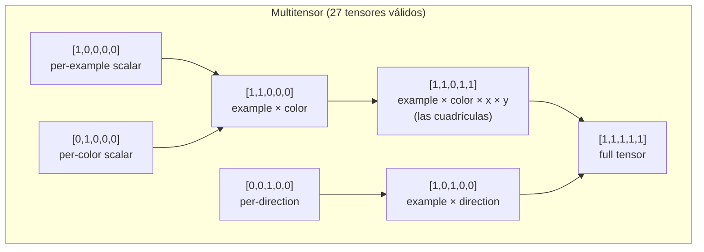
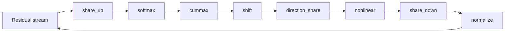

# CompressARC — Arquitectura, flujo y coste computacional

> Documentación técnica del repositorio [CompressARC](https://github.com/iliao2345/CompressARC), implementación de referencia del paper **"ARC-AGI Without Pretraining"** (Isaac Liao y Albert Gu, 2025).
>
> Este documento explica **por qué** el modelo está diseñado como está, **qué** hace cada componente, **cómo** fluye el sistema de principio a fin y **cuánto cómputo** consume (TFLOPS pico y VRAM pico).
>
> Todas las afirmaciones técnicas remiten a líneas concretas del código del repo: archivos como [arc_compressor.py](arc_compressor.py), [layers.py](layers.py), [multitensor_systems.py](multitensor_systems.py), etc.

---

## TL;DR

**CompressARC** es un decodificador **VAE** de **~76 000 parámetros** que se entrena **una vez por tarea** (sin pretraining, sin búsqueda externa) durante **2000 iteraciones** (~20 min en una NVIDIA RTX 4070) y resuelve el **20 %** del conjunto de evaluación y el **34,75 %** del conjunto de entrenamiento de **ARC-AGI-1** con métrica **pass@2**.

La idea central es **inteligencia = compresión** (principio MDL, *Minimum Description Length*): el modelo más corto que reconstruye los ejemplos de entrenamiento de una tarea es también el que mejor generaliza al ejemplo de test. CompressARC materializa esta idea con:

- Un **multitensor de 5 dimensiones** (`examples, colors, directions, x, y`) que separa explícitamente los tipos de información que aparecen en ARC.
- **Equivarianzas estructurales** *hardcoded* (a permutación de colores, a las 8 direcciones del grupo diédrico D₄ y al intercambio x↔y) que reducen la longitud de descripción.
- Un **decodificador VAE** cuya divergencia $\text{KL}$ mide directamente los *bits* del código latente.
- Un loop de capas: `share_up → softmax → cummax → shift → direction_share → nonlinear → share_down → normalize` ×4.
- Pérdida: $\mathcal{L} = \text{KL} + 10 \cdot \text{reconstruction\_error}$.
- Selección final pass@2 combinando la muestra actual y una media exponencial (EMA, decay=0.97).

---

## Tabla de contenidos

- [CompressARC — Arquitectura, flujo y coste computacional](#compressarc--arquitectura-flujo-y-coste-computacional)
  - [TL;DR](#tldr)
  - [Tabla de contenidos](#tabla-de-contenidos)
  - [1. Contexto: ARC-AGI y el problema de la inteligencia general](#1-contexto-arc-agi-y-el-problema-de-la-inteligencia-general)
  - [2. Principio fundamental: MDL ≡ inteligencia](#2-principio-fundamental-mdl--inteligencia)
  - [3. Decisiones de diseño justificadas](#3-decisiones-de-diseño-justificadas)
    - [3.1 ¿Por qué un modelo pequeño (~76 K parámetros)?](#31-por-qué-un-modelo-pequeño-76-k-parámetros)
    - [3.2 ¿Por qué un VAE y no un Transformer?](#32-por-qué-un-vae-y-no-un-transformer)
    - [3.3 ¿Por qué un multitensor en lugar de un solo tensor?](#33-por-qué-un-multitensor-en-lugar-de-un-solo-tensor)
    - [3.4 ¿Por qué 27 tensores y no 32?](#34-por-qué-27-tensores-y-no-32)
    - [3.5 ¿Por qué 8 direcciones?](#35-por-qué-8-direcciones)
    - [3.6 ¿Por qué scans direccionales (`cummax`, `shift`) y comunicación entre direcciones (`direction_share`)?](#36-por-qué-scans-direccionales-cummax-shift-y-comunicación-entre-direcciones-direction_share)
    - [3.7 ¿Por qué `symmetrize_xy` y `symmetrize_direction_sharing`?](#37-por-qué-symmetrize_xy-y-symmetrize_direction_sharing)
    - [3.8 ¿Por qué el coeficiente 10 entre KL y reconstrucción?](#38-por-qué-el-coeficiente-10-entre-kl-y-reconstrucción)
    - [3.9 ¿Por qué Adam con `lr=0.01` y `betas=(0.5, 0.9)`?](#39-por-qué-adam-con-lr001-y-betas05-09)
    - [3.10 ¿Por qué dos predicciones (pass@2) y por qué una de ellas es EMA?](#310-por-qué-dos-predicciones-pass2-y-por-qué-una-de-ellas-es-ema)
  - [4. Arquitectura completa del sistema](#4-arquitectura-completa-del-sistema)
    - [4.1 El multitensor — estructura de datos central](#41-el-multitensor--estructura-de-datos-central)
    - [4.2 Equivarianzas explícitas](#42-equivarianzas-explícitas)
    - [4.3 Capa de decodificación (VAE)](#43-capa-de-decodificación-vae)
    - [4.4 Capas centrales — orden y propósito](#44-capas-centrales--orden-y-propósito)
    - [4.5 Cabezas lineales y postprocesamiento de máscaras](#45-cabezas-lineales-y-postprocesamiento-de-máscaras)
  - [5. Flujo completo del sistema](#5-flujo-completo-del-sistema)
    - [5.1 Preprocesamiento](#51-preprocesamiento)
    - [5.2 Entrenamiento por inferencia](#52-entrenamiento-por-inferencia)
    - [5.3 Postprocesamiento y selección pass@2](#53-postprocesamiento-y-selección-pass2)
    - [5.4 Entrenamiento paralelo a escala](#54-entrenamiento-paralelo-a-escala)
  - [6. Capacidad de cómputo](#6-capacidad-de-cómputo)
    - [6.1 Hardware de referencia (RTX 4070)](#61-hardware-de-referencia-rtx-4070)
    - [6.2 Recuento de parámetros](#62-recuento-de-parámetros)
    - [6.3 FLOPS pico por forward pass](#63-flops-pico-por-forward-pass)
    - [6.4 VRAM pico](#64-vram-pico)
    - [6.5 Tiempo total y eficiencia observada](#65-tiempo-total-y-eficiencia-observada)
  - [7. Limitaciones (abilities / disabilities)](#7-limitaciones-abilities--disabilities)
  - [8. Referencias](#8-referencias)
    - [Papers](#papers)
    - [Archivos del repositorio](#archivos-del-repositorio)
    - [Recursos externos](#recursos-externos)

---

## 1. Contexto: ARC-AGI y el problema de la inteligencia general

**ARC-AGI** (*Abstraction and Reasoning Corpus*, Chollet 2019) es un benchmark de razonamiento abstracto compuesto por tareas en las que se ven 2-7 pares de cuadrículas (input, output) y se debe **inferir la regla** que las relaciona para aplicarla a una cuadrícula de test. Cada cuadrícula es una matriz de hasta 30×30 píxeles con hasta 10 colores discretos.

Lo distintivo de ARC-AGI frente a otros benchmarks es que:

- **No hay un dataset masivo de entrenamiento que cubra patrones similares.** Las 400 tareas de evaluación son todas conceptualmente distintas de las 400 de entrenamiento.
- **No hay transferencia útil desde corpora textuales o de imágenes naturales.** Las "reglas" requieren razonamiento composicional, no reconocimiento de patrones aprendidos.
- La métrica oficial es **pass@2**: el sistema entrega dos predicciones por test, y acierta si alguna coincide píxel a píxel con la solución.

Esto convierte a ARC-AGI en un test directo de **inteligencia general**, entendida como la capacidad de adquirir habilidades nuevas con **muy pocos ejemplos y sin pretraining transferible** (Chollet, *On the Measure of Intelligence*, 2019).

CompressARC ataca el problema sin ningún preentrenamiento: **entrena un modelo nuevo desde cero por cada tarea**, usando sólo los 2-7 ejemplos provistos por la tarea misma.

---

## 2. Principio fundamental: MDL ≡ inteligencia

La hipótesis central del paper Liao & Gu (2025) es:

> *La capacidad de comprimir los datos observados es equivalente a la capacidad de generalizar a partir de ellos.*

Esta es la formulación clásica del **principio de Mínima Longitud de Descripción** (MDL). Concretamente: si un modelo logra describir los ejemplos de entrenamiento de una tarea con un código más corto que el código trivial (enumerar píxeles), entonces ese modelo ha **descubierto la estructura de la tarea**, y esa estructura debería extrapolar al ejemplo de test.

En CompressARC esto se materializa con un **decodificador VAE**:

- Un código latente $z \sim \mathcal{N}(\mu, \Sigma)$ se aprende para cada tarea.
- La **divergencia KL** del posterior aprendido respecto al prior $\mathcal{N}(0, I)$ mide los **bits** necesarios para transmitir $z$.
- La **cross-entropy** sobre los píxeles reconstruidos mide los bits necesarios para corregir errores de reconstrucción.
- Se minimiza:

$$\mathcal{L} = \underbrace{D_{\text{KL}}\big(\mathcal{N}(\mu,\Sigma) \,\|\, \mathcal{N}(0,I)\big)}_{\text{coste del código}} \;+\; 10 \cdot \underbrace{H(\text{logits}, \text{píxeles})}_{\text{coste de los errores}}$$

El factor 10 es un balanceo empírico (ver [train.py:120](train.py)). Minimizar esta cantidad equivale a buscar **la descripción más corta posible** de los ejemplos.

Generalización al test: como la cuadrícula de test se procesa por las mismas capas con los mismos pesos aprendidos durante el entrenamiento, la regla descubierta se aplica automáticamente.

---

## 3. Decisiones de diseño justificadas

Esta es la sección **central** del documento. Cada decisión arquitectónica responde a un *porqué* concreto, casi siempre derivado del principio MDL o de la naturaleza de las tareas ARC.

### 3.1 ¿Por qué un modelo pequeño (~76 K parámetros)?

En MDL, **la longitud de descripción incluye el modelo**. Un modelo grande necesitaría que sus propios pesos fueran transmitidos como parte del código, inflando $\mathcal{L}$. Como CompressARC se entrena desde cero por tarea, el tamaño del modelo está acotado por: cuánto puedes "permitirte gastar" en pesos antes de que la regla a transmitir se vuelva más cara que enumerar píxeles. El número 76 K es el resultado empírico de ese equilibrio. Compárese con GPT-2 small (124 M) o con un transformer ARC-específico (>1 M): CompressARC es **1000–10000× más pequeño**.

### 3.2 ¿Por qué un VAE y no un Transformer?

Un Transformer normal **no mide bits directamente**: su loss (cross-entropy) sólo mide error de reconstrucción. Para implementar MDL hace falta un mecanismo explícito que mida **la longitud del código latente**. El VAE lo da gratis: la divergencia $\text{KL}$ es exactamente esa medida. Por eso CompressARC es un decodificador VAE, no un Transformer.

### 3.3 ¿Por qué un multitensor en lugar de un solo tensor?

Las tareas ARC mezclan información de naturalezas **muy distintas**: hay un eje de ejemplos (2-7 entradas/salidas), un eje de colores (hasta 10 categorías sin orden semántico), un eje de direcciones (relacionado con simetrías espaciales) y dos ejes espaciales (x e y). Tratar todo en un único tensor obligaría a la red a **redescubrir** que estos ejes son cualitativamente distintos. En cambio, un multitensor mantiene **27 tensores distintos**, uno por cada subconjunto de dimensiones, y permite que cada uno se procese localmente y se comunique con los demás de forma controlada (ver [§4.1](#41-el-multitensor--estructura-de-datos-central)).

### 3.4 ¿Por qué 27 tensores y no 32?

Las 5 dimensiones binarias dan $2^5 = 32$ combinaciones, pero hay dos reglas de validez en [multitensor_systems.py:35-50](multitensor_systems.py):

1. **Si x o y están activos, examples también debe estarlo.** Razón: un píxel sólo tiene sentido como parte de un ejemplo concreto; no hay un "píxel global".
2. **Al menos uno de [color, direction, x, y] debe estar activo.** Un tensor que sólo tuviera `examples` sería un escalar por ejemplo: no aporta información estructural.

Esto descarta 5 combinaciones (la combinación nula `[0,0,0,0,0]` más cuatro que violan la regla 1: `[0,0,0,1,0], [0,0,0,0,1], [0,0,0,1,1]` y la equivalente con examples=1 que falla otras reglas), dejando **27 tensores válidos**.

### 3.5 ¿Por qué 8 direcciones?

Las 8 direcciones (N, NE, E, SE, S, SO, O, NO) cubren el **grupo diédrico D₄** generado por rotaciones de 90° y reflejos. Las simetrías rotacionales y reflexivas son **ubicuas** en ARC (espejos, rotaciones, completar simetrías, propagación de patrones). Tener exactamente 8 direcciones permite implementar las equivarianzas correspondientes mediante *weight tying* (ver [§3.7](#37-por-qué-symmetrize_xy-y-symmetrize_direction_sharing)).

### 3.6 ¿Por qué scans direccionales (`cummax`, `shift`) y comunicación entre direcciones (`direction_share`)?

Muchísimas reglas en ARC son **propagaciones espaciales**: rellenar regiones desde un borde, extender líneas hasta colisionar con un obstáculo, copiar un patrón a lo largo de un eje. Estas operaciones son naturalmente **escaneadas** a lo largo de una dirección.

- `cummax` ([layers.py:436-460](layers.py)) implementa scans asociativos de máximo en las 4 direcciones cardinales y, para las diagonales, un scan recursivo en $\log(\min(x,y))$ pasos (idea de *blelloch scan*).
- `shift` ([layers.py:475-490](layers.py)) hace desplazamientos por un píxel en las 8 direcciones.
- `direction_share` ([layers.py:493-540](layers.py)) comunica información entre direcciones con coeficientes angulares fijos: $[1, 0.2, 0.4, 0.2, 1, 0.2, 0.4, 0.2]$, indexados por $(d_2 - d_1) \bmod 8$. Direcciones opuestas (offset 4) tienen coeficiente 1; ortogonales (offset 2, 6) tienen 0.4; vecinas (offset 1, 3, 5, 7) tienen 0.2. Esto es una **distancia angular suave** que refleja la geometría del grupo D₄.

### 3.7 ¿Por qué `symmetrize_xy` y `symmetrize_direction_sharing`?

Las tareas ARC son **invariantes** a la elección arbitraria del nombre "x" vs "y" (rotar 90° no cambia la regla) y a las reflexiones/rotaciones. Forzar esta invarianza en los pesos del modelo (en lugar de esperar que la red la aprenda) **reduce la longitud de descripción**: hay menos parámetros independientes que transmitir.

- `symmetrize_xy` ([initializers.py:100-104](initializers.py)) iguala los pesos del tensor `dims=[..,1,0]` y `dims=[..,0,1]` (intercambia las posiciones de x e y en cada `dims`).
- `symmetrize_direction_sharing` ([initializers.py:106-146](initializers.py)) restringe las 64 matrices del `direction_share` por capa al subespacio invariante bajo D₄ (rotaciones y reflejos del cuadrado).
- La cabeza de colores se simetriza también: `head_weights[0] = stack([w, w], dim=-1)` ([initializers.py:84-88](initializers.py)) hace que las dos salidas (input y output) compartan los pesos.

### 3.8 ¿Por qué el coeficiente 10 entre KL y reconstrucción?

Es un balanceo empírico (`loss = total_KL + 10 * reconstruction_error`, [train.py:120](train.py)). Sin este peso, el modelo *colapsa el posterior* (todo $\mu \to 0$) y deja de reconstruir. Con el peso 10, la reconstrucción tiene suficiente prioridad pero la compresión sigue presente. El valor 10 ha sido elegido por ensayo y error, no es un hiperparámetro especialmente sensible.

### 3.9 ¿Por qué Adam con `lr=0.01` y `betas=(0.5, 0.9)`?

- **`lr=0.01`**: alta, pero el entrenamiento es muy corto (2000 iteraciones) y empieza desde Xavier random, así que conviene un paso grande.
- **`β₁=0.5`** (en lugar del clásico 0.9): da menos peso al historial reciente y reacciona más rápido al gradiente actual. Como cada tarea es un dataset distinto y muy pequeño, el gradiente cambia mucho en los primeros pasos; un β₁ bajo lo absorbe mejor.
- **`β₂=0.9`** (en lugar del clásico 0.999): mismo razonamiento, el estimador de varianza se adapta más rápido.

Ver [train.py:135](train.py) y [solve_task.py:55](solve_task.py).

### 3.10 ¿Por qué dos predicciones (pass@2) y por qué una de ellas es EMA?

La métrica oficial de ARC-AGI permite **dos intentos** por test. CompressARC los usa así (ver [solution_selection.py:54-90](solution_selection.py)):

- **Candidato 1**: la **muestra actual** del VAE en la iteración $t$. Captura la mejor estimación instantánea pero es ruidosa (el VAE muestrea).
- **Candidato 2**: una **media exponencial** (EMA, decay=0.97) de los logits a lo largo del entrenamiento. Suaviza el ruido y suele converger a la moda del posterior.

Estas dos perspectivas suelen ser **complementarias**: cuando la red se aproxima a la solución pero aún oscila, la EMA captura el "centro" de las oscilaciones; cuando la red ya ha encontrado una respuesta determinista, la muestra y la EMA convergen al mismo punto. Las dos predicciones finales (`solution_most_frequent` y `solution_second_most_frequent`) se eligen agregando con `logaddexp` los scores de todas las iteraciones.

---

## 4. Arquitectura completa del sistema

### 4.1 El multitensor — estructura de datos central

El `MultiTensorSystem` ([multitensor_systems.py:11-93](multitensor_systems.py)) define **5 dimensiones binarias** y mantiene un tensor independiente por cada combinación válida.

| Índice | Dimensión | Longitud típica | Significado |
|--------|-----------|-----------------|-------------|
| 0 | examples | 2–7 (`n_examples`) | Pares (input, output) de la tarea |
| 1 | colors | 1–10 (`n_colors`) | Colores presentes en la tarea (sin orden semántico) |
| 2 | directions | **8** (fijo) | N, NE, E, SE, S, SO, O, NO |
| 3 | x | ≤ 30 (`n_x`) | Altura del grid |
| 4 | y | ≤ 30 (`n_y`) | Anchura del grid |

A esto se añade implícitamente un **canal** (última dimensión) cuya anchura la define `channel_dim_fn` en [arc_compressor.py:30-31](arc_compressor.py):

```text
channel_dim = 8  si dims[2] == 1  (tensor con dirección)
channel_dim = 16 si dims[2] == 0  (tensor sin dirección)
```

Razón: los tensores con dirección ya tienen un factor 8× más de información por la propia dimensión `direction`, así que se compensa con menos canales.

**Reglas de validez** ([multitensor_systems.py:35-50](multitensor_systems.py)):

1. Si `dims[3] == 1` o `dims[4] == 1`, entonces `dims[0] == 1` (un píxel pertenece a un ejemplo).
2. `sum(dims[1:]) > 0` (al menos una dimensión informativa además de examples).

Esto da **27 tensores válidos** de los 32 posibles. El siguiente diagrama clasifica un subconjunto representativo:



**El decorador `@multify`** ([multitensor_systems.py](multitensor_systems.py)) toma una función `f(dims, x, ...)` que opera sobre un tensor individual y la promueve a una función que opera sobre **todo el multitensor**, aplicándola a cada uno de los 27 tensores válidos con el `dims` correspondiente. Esto permite que el código de las capas sea genérico.

### 4.2 Equivarianzas explícitas

CompressARC implementa **tres equivarianzas estructurales** mediante *weight tying* en la inicialización (ver [initializers.py:100-146](initializers.py)).

| Grupo de simetría | Mecanismo | Dónde se aplica |
|-------------------|-----------|-----------------|
| **Intercambio x ↔ y** | `symmetrize_xy` copia el peso de `dims=[…,1,0]` en `dims=[…,0,1]` y al revés | A todas las pilas de pesos (`share_up`, `share_down`, `softmax`, `cummax`, `shift`, `nonlinear`) en cada capa |
| **Grupo diédrico D₄ (8 direcciones)** | `symmetrize_direction_sharing` restringe las 64 matrices del `direction_share` al subespacio invariante bajo rotaciones de 90° y reflejos | A `direction_share_weights` en cada capa |
| **Permutación de colores** | La dimensión `colors` se trata como **anónima**: ningún peso depende del índice de color (la cabeza emite logits por color, pero el orden interno es irrelevante) | A toda la red (estructural, no por weight tying) |

Estas tres equivarianzas reducen drásticamente la longitud de descripción del modelo y, por tanto, su KL efectiva.

### 4.3 Capa de decodificación (VAE)

El primer paso del forward pass es **decodificar el latente $z$** desde un posterior aprendido. Esto se hace en `decode_latents` ([layers.py:125-156](layers.py)), que delega en `channel_layer` ([layers.py:58-123](layers.py)) por cada tensor del multitensor.

**Para cada uno de los 27 tensores válidos:**

1. Se aprende un `mean` (media del posterior, shape = shape del tensor + canal `decoding_dim=4`) y un `local_capacity_adjustment` (varianza local, misma shape). Iniciados a 0.01·randn y 0 respectivamente.
2. Se aprende también un escalar `target_capacity` (capacidad global del tensor, reparametrizado: el valor real es $e^{10 \cdot \text{target\_capacity}} \cdot 10000 + 0.5$).
3. Se modela el canal como **AWGN** (Additive White Gaussian Noise) con capacidad ajustable. Las fórmulas clave:

$$\text{output\_scaling} = 1 - e^{-2 \cdot C_{\text{global}} / D}$$
$$\sigma_{\text{noise}} = e^{-C_{\text{local}} / D}, \qquad \sigma_{\text{signal}}^2 = 1 - \sigma_{\text{noise}}^2$$

donde $D$ es la dimensionalidad del tensor.

4. Se muestrea $z = \sigma_{\text{signal}} \cdot \hat{\mu} + \sigma_{\text{noise}} \cdot \epsilon$ con $\epsilon \sim \mathcal{N}(0, I)$ y $\hat{\mu}$ es `mean` normalizado.
5. Se calcula la KL explícitamente (no se usa la fórmula de capacidad AWGN, porque la señal transmitida es $\hat{\mu}$ y no tendría la varianza correcta para esa fórmula):

$$\text{KL} = \tfrac{1}{2}(\sigma_{\text{noise}}^2 + \sigma_{\text{signal}}^2 \cdot \hat{\mu}^2 - 1) + \tfrac{C_{\text{local}}}{D}$$

6. Una capa `affine` proyecta $z$ del espacio latente (`decoding_dim=4`) al espacio del residual stream (`channel_dim_fn(dims)`).

**¿Por qué este esquema?** Porque permite que **cada tensor del multitensor decida cuánta información transmitir** (cuánta KL gastar), y dentro de cada tensor, **cada elemento decida si es "señal" o "ruido"** (mediante `local_capacity_adjustment`). El optimizador asignará automáticamente más capacidad a los tensores y elementos que ayuden a reducir la reconstrucción y dejará en ruido los irrelevantes. **Esta es la verdadera "compresión" del modelo.**

### 4.4 Capas centrales — orden y propósito

Tras la decodificación, el residual stream pasa por **`n_layers = 4`** bloques idénticos. Cada bloque ejecuta esta secuencia exacta ([arc_compressor.py:113-130](arc_compressor.py)):



Cada operación está envuelta por **`add_residual`** ([layers.py:38-56](layers.py)), un decorador que añade proyecciones de bajada (residual → espacio interno) y subida (espacio interno → residual) más una conexión residual al estilo ResNet (He et al. 2015).

**Detalle de cada capa:**

| Capa | Función | Propósito |
|------|---------|-----------|
| `share_up` ([layers.py:256-265](layers.py)) | Para cada tensor de `dims` "alto" suma todos los tensores con `dims` "menor o igual" (con broadcast) | Propaga información agregada hacia tensores más específicos |
| `softmax` ([layers.py:298-321](layers.py)) | Por cada subconjunto no vacío de ejes ∈ {color, dir, x, y}, aplica softmax y concatena. Salida tiene $2^k - 1$ canales donde $k$ = nº dims activos | Selección suave de qué eje "atender", al estilo *gating* |
| `cummax` ([layers.py:436-460](layers.py)) | Scan máximo en cada una de las 8 direcciones. Diagonales con scan asociativo recursivo en $\log(\min(x,y))$ pasos | Propagación direccional tipo "extender hasta colisionar" |
| `shift` ([layers.py:475-490](layers.py)) | Desplazamiento por 1 píxel en cada dirección | Comparación entre celdas vecinas |
| `direction_share` ([layers.py:493-540](layers.py)) | 64 matrices lineales acopladas con coeficientes angulares $[1, 0.2, 0.4, 0.2, 1, 0.2, 0.4, 0.2]$ | Comunicación entre direcciones respetando D₄ |
| `nonlinear` ([layers.py:542-555](layers.py)) | SiLU (Swish): $x \cdot \sigma(x)$ | No-linealidad estándar |
| `share_down` ([layers.py:267-281](layers.py)) | Inverso de `share_up`: cada tensor "bajo" recibe el promedio (o suma con máscara cuando in/out tienen la misma forma) de los tensores "más altos" | Agrega información hacia tensores resumen |
| `normalize` ([layers.py:14-25](layers.py)) | Normaliza a varianza 1 por canal | Estabilidad numérica entre capas |

Las capas direccionales (`cummax`, `shift`) sólo se aplican a tensores que contienen `direction + x + y` (con o sin `color`), gracias al decorador `only_do_for_certain_shapes((1,1,1,1,1), (1,0,1,1,1))`. Para el resto, son la identidad.

### 4.5 Cabezas lineales y postprocesamiento de máscaras

Tras los 4 bloques, el residual stream produce tres salidas ([arc_compressor.py:131-142](arc_compressor.py)):

1. **Cabeza de colores** (`head_weights`, simetrizada): toma el tensor `dims=[1,1,0,1,1]` (`example × color × x × y`) y lo proyecta a 2 logits por píxel (canal 0 = input, canal 1 = output). Salida shape: `[n_examples, n_colors, n_x, n_y, 2]`. Se le añade `100 * head_weights[1]` como bias fuerte: una manera de "centrar" la predicción de la entrada cerca de la entrada observada.

2. **Máscara x** (`mask_weights`): toma el tensor `dims=[1,0,0,1,0]` (`example × x`) y emite 2 logits por índice (input/output). Indica qué filas pertenecen al output.

3. **Máscara y** (análoga, dimensión y).

**`postprocess_mask`** ([layers.py:557-583](layers.py)) añade un sumando de $-1000$ a los índices más allá del máximo observado en `task.shapes`, garantizando que el modelo no prediga grids más grandes de lo permitido por la tarea.

---

## 5. Flujo completo del sistema

### 5.1 Preprocesamiento

Implementado en [preprocessing.py](preprocessing.py). La clase `Task` ([preprocessing.py:9-148](preprocessing.py)) absorbe el JSON crudo de ARC-AGI y produce:

- `n_train`, `n_test`, `n_examples` (sumando train+test).
- `shapes`: lista de `[in_shape, out_shape]` por ejemplo.
- **Predicción del tamaño de salida** ([preprocessing.py:44-67](preprocessing.py)), por cascada de heurísticas:
  1. Si `in_out_same_size` (todos los pares de entrenamiento tienen input.shape == output.shape) → out_shape = in_shape.
  2. Si no, pero `all_out_same_size` (todos los outputs de entrenamiento tienen igual shape) → usar esa shape.
  3. En último caso, asumir output = `[max_x, max_y]` global y dejar que la red **prediga** las máscaras x, y (esto activa la ruta `grid_size_uncertain` en el loss).
- `colors`: lista ordenada de colores únicos (forzando incluir el negro/0).
- `n_colors`: `len(colors) - 1` (se trata el negro como "fondo").
- `multitensor_system`: `MultiTensorSystem(n_examples, n_colors, n_x, n_y, self)` con `n_x = max(shape[i][0] ...)` y análogo para y.
- `problem`: tensor `[n_examples, n_x, n_y, 2]` con índices de color (canal 0 = input, canal 1 = output).
- `masks`: tensor `[n_examples, n_x, n_y, 2]` con 1 dentro del grid y 0 fuera.
- `solution_hash`: hash de la tupla del output ground-truth, usado para comprobar correctitud sin exponer la solución al modelo.

### 5.2 Entrenamiento por inferencia

El loop está en `train.take_step` ([train.py:24-122](train.py)). Cada iteración:

1. `optimizer.zero_grad()`.
2. `model.forward()` produce `logits`, `x_mask`, `y_mask`, `KL_amounts`, `KL_names`.
3. Se añade una columna de ceros al canal de colores ([train.py:51](train.py)) para representar el color "negro" como logit 0 fijo.
4. **KL total**: suma de los 27 vectores de KL retornados por `decode_latents`.
5. **Reconstrucción**: para cada ejemplo y cada modo (input/output del par):
   - Si el grid size es incierto, aplica un coeficiente `0.01^max(0, 1-step/100)` al peso de la máscara durante los primeros 100 pasos (curriculum: que la red se enfoque en colores antes de pelearse con el tamaño).
   - **`mask_select_logprobs`** ([train.py:13-21](train.py)) trata el offset de la máscara como variable latente: para cada offset posible, calcula un log-probability proporcional al saldo de la máscara dentro/fuera. Luego `logsumexp` agrega.
   - Para cada par `(x_offset, y_offset)` válido, recorta el output del modelo a la subgrid, calcula `cross_entropy` contra el ground-truth y combina con los logprobs de máscaras.
   - `torch.logsumexp` agrega sobre todos los offsets → log-probabilidad marginal del output observado.
6. **Loss**:

$$\mathcal{L} = \text{total\_KL} + 10 \cdot \text{reconstruction\_error}$$

7. `loss.backward()`, `optimizer.step()`, `optimizer.zero_grad()`.
8. El `Logger` registra todas las métricas y postprocesa la solución (ver [§5.3](#53-postprocesamiento-y-selección-pass2)).

**Configuración:**

| Hiperparámetro | Valor | Archivo |
|----------------|-------|---------|
| Optimizador | Adam | [train.py:135](train.py), [solve_task.py:55](solve_task.py) |
| Learning rate | 0.01 | idem |
| `betas` | (0.5, 0.9) | idem |
| Iteraciones | 2000 | [train.py:140](train.py), [parallel_train.py:147](parallel_train.py) |
| Precisión | FP32 + TF32 matmul | [arc_compressor.py:10](arc_compressor.py), [parallel_train.py:39](parallel_train.py) |
| cuDNN benchmark | True | [parallel_train.py:38](parallel_train.py) |

### 5.3 Postprocesamiento y selección pass@2

Cada llamada a `Logger.log` ([solution_selection.py:40-91](solution_selection.py)) registra **dos candidatos**:

1. La predicción de la **muestra actual** (logits, máscaras tal cual salen del forward pass).
2. La predicción de la **EMA** de logits y máscaras (con `ema_decay = 0.97`).

Para cada candidato:

- Se extrae la solución con `_postprocess_solution`: argmax de logits dentro del recorte indicado por las máscaras + cálculo de `uncertainty` como `logsumexp - amax`.
- Se calcula un `score`:
  - Base: $-10 \cdot \text{uncertainty}$.
  - Penalización $-10$ si `train_step < 150` (no confiar en pasos tempranos).
  - Penalización $-4$ si el candidato es el de la EMA (preferir la muestra reciente cuando empatan).
- El score se acumula con `np.logaddexp` en `solution_hashes_count[hash]`: así una solución que aparece **muchas veces con bajo `uncertainty`** acumula mucho score.

Al terminar las 2000 iteraciones, las dos soluciones con mayor `solution_hashes_count` se asignan a `solution_most_frequent` (attempt_1) y `solution_second_most_frequent` (attempt_2) y se entregan en formato Kaggle.

### 5.4 Entrenamiento paralelo a escala

[parallel_train.py](parallel_train.py) ejecuta CompressARC sobre las 400 tareas de un split saturando una o varias GPUs. Estrategia:

1. **Fase de medición** ([parallel_train.py:144-146](parallel_train.py)): ejecuta 2 iteraciones de cada tarea midiendo `torch.cuda.max_memory_allocated()` para conocer el footprint real de cada puzzle (varía con `n_x · n_y · n_examples`).
2. **Fase de saturación** ([parallel_train.py:148-152](parallel_train.py)): un scheduler greedy ordena las tareas por memoria decreciente y va lanzándolas en las GPUs disponibles, manteniendo el total por GPU por debajo de `gpu_memory_total - 4 GB` (reserva para el sistema).
3. Cada tarea corre en un **proceso separado** (`multiprocessing.spawn`) ejecutando `solve_task.solve_task` ([solve_task.py:28-86](solve_task.py)), que es esencialmente el mismo loop de entrenamiento pero con captura de soluciones y de VRAM en un `Manager.dict()` compartido.
4. Al final, las soluciones se escriben en `submission.json` para evaluación.

Optimizaciones globales habilitadas en `parallel_train.py`:

- `torch.backends.cuda.matmul.allow_tf32 = True` → usa **Tensor Cores en TF32** para los matmul.
- `torch.backends.cudnn.benchmark = True` → autotuning de kernels cuDNN.

---

## 6. Capacidad de cómputo

> **Advertencia metodológica.** Los números de esta sección son **estimaciones de orden de magnitud** derivadas de las dimensiones declaradas en el código y de los benchmarks oficiales del paper. Para medidas exactas en tu hardware, ejecuta:
>
> - `torch.cuda.max_memory_allocated()` (ya está integrado en [solve_task.py:51,75](solve_task.py)) para VRAM real.
> - `torch.profiler` o `torch.utils.flop_counter.FlopCounterMode` para FLOPS reales por forward pass.

### 6.1 Hardware de referencia (RTX 4070)

El paper y el [README.md](README.md) mencionan **NVIDIA GeForce RTX 4070** como GPU de referencia. Especificaciones:

| Métrica | Valor |
|---------|-------|
| Arquitectura | Ada Lovelace (AD104) |
| CUDA cores | 5 888 |
| Tensor Cores (4ª gen) | 184 |
| **FP32 pico (sin Tensor Cores)** | **~29 TFLOPS** |
| **TF32 pico (con Tensor Cores)** | **~58 TFLOPS** |
| FP16 / BF16 pico | ~117 TFLOPS |
| INT8 pico | ~234 TOPS |
| **VRAM** | **12 GB GDDR6X** |
| Memory bandwidth | 504 GB/s |
| TDP | 200 W |

Como CompressARC habilita explícitamente `torch.backends.cuda.matmul.allow_tf32 = True`, **el pico relevante es ~58 TFLOPS en TF32** para los matmul y ~29 TFLOPS en FP32 para el resto.

### 6.2 Recuento de parámetros

El paper Liao & Gu (2025) reporta **~76 000 parámetros entrenables**. El desglose aproximado, derivado de [arc_compressor.py](arc_compressor.py) e [initializers.py](initializers.py):

| Componente | Cantidad | Notas |
|------------|----------|-------|
| `multiposteriors` (mean + capacity por tensor) | dominante en bytes pero **no** en parámetros entrenables porque cada `mean` es de tamaño task-dependiente | crece con `n_examples · n_colors · n_x · n_y` |
| `target_capacities` | 27 escalares | uno por tensor |
| `decode_weights` (lineal 4 → channel) | ~27 × ~60 = 1 600 | |
| Por cada una de las 4 capas: `share_up`, `share_down`, `softmax`, `cummax`, `shift`, `nonlinear` (multiresidual, 27 tensores cada uno) | ~5 000–7 000 por capa | dependiendo de `channel_dim_fn` |
| Por cada capa: `direction_share` (64 matrices `channel × channel` × tensores con dirección) | ~10 000 por capa | la pieza más pesada por capa |
| `head_weights` + `mask_weights` | ~200 | |

La cifra "76 K parámetros" del paper se refiere a los **pesos del modelo per se** (excluyendo los `mean` y `local_capacity_adjustment` del posterior, que son specific a cada tarea y considerados "datos" más que "modelo"). Esto es coherente con la filosofía MDL: lo que se transmite como modelo son los pesos compartidos; el latente $z$ es el "código" de la tarea.

> Para un recuento exacto, abre una sesión Python y ejecuta:
> ```python
> import preprocessing, arc_compressor
> task = preprocessing.preprocess_tasks('training', [0])[0]
> model = arc_compressor.ARCCompressor(task)
> total = sum(w.numel() for w in model.weights_list)
> print(total)
> ```

### 6.3 FLOPS pico por forward pass

Para una tarea **típica** con `n_examples = 4`, `n_colors = 10`, `n_x = n_y = 30`, los tensores más grandes del multitensor (los que contienen `x` e `y`) tienen forma del orden de $4 \cdot 10 \cdot 30 \cdot 30 = 36\,000$ elementos por canal (y hasta 8× más para los que añaden `direction`). Las operaciones dominantes en FLOPS son:

| Operación | FLOPS aprox. por capa | Comentario |
|-----------|----------------------|------------|
| `affine` de las proyecciones down/up de cada `add_residual` | ~$10^8$ | matmul sobre tensor más grande |
| `direction_share`: 64 matrices `8×8` aplicadas a cada tensor con dirección | ~$5 \cdot 10^8$ | dominante |
| `softmax` (genera $2^k - 1$ canales) | ~$10^8$ | |
| `cummax` direccional (8 direcciones + scan log diagonal) | ~$10^8$ | |
| `shift`, `nonlinear`, `normalize` | ~$10^7$ cada una | |

**Estimación por capa**: ~$10^9$ FLOPS.
**Por forward pass (4 capas + decode + heads)**: ~$5 \cdot 10^9$ FLOPS ≈ **5 GFLOPS**.
**Por iteración (forward + backward ≈ 3×)**: ~**15 GFLOPS**.
**Por puzzle (2000 iteraciones)**: ~$3 \cdot 10^{13}$ FLOPS ≈ **30 TFLOPs totales por puzzle**.

**Contraste con el pico de hardware:**
- 20 min × 60 s × 58 TFLOPS pico = ~70 000 TFLOPs disponibles por GPU en 20 min.
- 30 TFLOPs usados ≈ **0,04 %** del pico teórico.

La utilización efectiva es bajísima — algo **completamente esperado** en modelos diminutos como este: el overhead de lanzar cientos de kernels CUDA pequeños por iteración (un kernel por tensor, por capa, por dirección) domina sobre el tiempo de cómputo puro. Si CompressARC se reescribiera con kernels fusionados (Triton, torch.compile agresivo) la utilización podría subir 10–100×, pero el modelo es lo suficientemente rápido como está.

### 6.4 VRAM pico

CompressARC mide su pico real en cada puzzle con `torch.cuda.max_memory_allocated()` ([solve_task.py:50, 80](solve_task.py)). Componentes principales:

| Componente | VRAM aprox. (tarea típica) | Notas |
|------------|----------------------------|-------|
| Pesos del modelo (76 K params × 4 bytes FP32) | ~0,3 MB | despreciable |
| Estados del optimizador Adam (2× pesos) | ~0,6 MB | despreciable |
| **Activaciones del forward pass** (multitensor, 27 tensores × 4 capas) | **~200–500 MB** | dominante; crece con `n_x · n_y · n_examples` |
| **Gradientes** (~igual que activaciones) | **~200–500 MB** | dominante |
| Buffer de muestras y EMA (`Logger`) | ~10 MB | |
| Overhead PyTorch/CUDA | ~200 MB | |

**Estimación de pico VRAM por tarea**: **~500 MB – 1 GB** (típica), con picos de **hasta 2 GB** para tareas con grids de 30×30 y `n_examples = 7`.

**En una RTX 4070 (12 GB) con `parallel_train.py`:**
- Margen reservado al sistema: 4 GB.
- VRAM aprovechable: 8 GB.
- Tareas concurrentes: típicamente **4–10**.

### 6.5 Tiempo total y eficiencia observada

| Métrica | Valor reportado | Fuente |
|---------|-----------------|--------|
| Tiempo por puzzle (secuencial, RTX 4070) | ~20 min (2000 iteraciones) | [README.md:27](README.md) |
| Tiempo total para el split de entrenamiento (400 puzzles) | ~130 h | paper y `results_for_the_blog_post/timing_result_training.txt` |
| Tiempo total para el split de evaluación (400 puzzles) | ~138 h | idem |
| Tiempo de pared con `parallel_train.py` (saturando 1 RTX 4070) | ~15–30 h | depende del solapamiento alcanzado |

**Throughput observado:** ~2 it/s por puzzle, ~1,7 it/s combinando varios puzzles en paralelo. La ganancia de la paralelización no es lineal porque las GPUs pequeñas como la 4070 saturan PCIe y memory bandwidth antes que cómputo.

---

## 7. Limitaciones (abilities / disabilities)

El paper Liao & Gu (2025) analiza cuidadosamente lo que el modelo **sabe** y **no sabe** hacer.

**Abilities (habilidades demostradas en los puzzles resueltos):**

- Completar patrones espaciales (extensión de líneas, propagación de colores).
- Llenar regiones cerradas.
- Detectar y completar simetrías (espejos, rotaciones).
- Agrupar, reagrupar y reordenar objetos.
- Aplicar transformaciones afines simples a regiones.
- Identificar el objeto "distinto" en una colección uniforme.

**Disabilities (incapacidades sistemáticas):**

- **Contar.** No hay bucle interno: no puede contar cuántas regiones hay ni cuántos píxeles de un color.
- **Reglas no espaciales.** Si la regla involucra aritmética, comparación numérica o lógica simbólica, falla.
- **Planificación a largo plazo.** Reglas con múltiples pasos secuenciales raramente se descubren.
- **Generalización fuera del marco geométrico.** Si la tarea requiere conceptos abstractos no codificados por el grupo D₄, no hay forma de que la red los aprenda con tan pocos parámetros y ejemplos.

**Costes prácticos:**

- ~20 min por puzzle es **alto** comparado con un LLM zero-shot (segundos). A cambio, CompressARC no requiere pretraining y obtiene mejor pass@2 en este benchmark concreto que la mayoría de soluciones zero-shot.
- El consumo energético es modesto: una RTX 4070 a 200 W × 20 min = ~0,07 kWh por puzzle.

---

## 8. Referencias

### Papers

- **Liao, I.; Gu, A. (2025).** *ARC-AGI Without Pretraining.* [Blog post](https://iliao2345.github.io/blog_posts/arc_agi_without_pretraining/arc_agi_without_pretraining.html). PDF en el repo: [2512.06104v1_ARC_AGI_WITHOUT_PRETRAINING.pdf](2512.06104v1_ARC_AGI_WITHOUT_PRETRAINING.pdf).
- **Chollet, F. (2019).** *On the Measure of Intelligence.* arXiv:1911.01547. PDF: [1911.01547v2_On_The_Measure_of_Intelligence.pdf](1911.01547v2_On_The_Measure_of_Intelligence.pdf).
- **He, K.; Zhang, X.; Ren, S.; Sun, J. (2015).** *Deep Residual Learning for Image Recognition.* arXiv:1512.03385. PDF: [1512.03385v1_Deep_Residual_Learning_For_Image_Recognition.pdf](1512.03385v1_Deep_Residual_Learning_For_Image_Recognition.pdf). Referencia para las conexiones residuales usadas por `add_residual`.

### Archivos del repositorio

| Archivo | Contenido |
|---------|-----------|
| [arc_compressor.py](arc_compressor.py) | Clase `ARCCompressor`, hiperparámetros, forward pass |
| [multitensor_systems.py](multitensor_systems.py) | `MultiTensorSystem`, `MultiTensor`, decorador `@multify` |
| [layers.py](layers.py) | Implementación de todas las capas (`channel_layer`, `share_*`, `softmax`, `cummax`, `shift`, `direction_share`, `nonlinear`, `normalize`, `postprocess_mask`) |
| [initializers.py](initializers.py) | Inicialización Xavier, `symmetrize_xy`, `symmetrize_direction_sharing`, `initialize_head` |
| [preprocessing.py](preprocessing.py) | Clase `Task`, predicción de shapes, construcción del multitensor |
| [train.py](train.py) | `take_step`, `mask_select_logprobs`, cómputo del loss, loop secuencial |
| [solve_task.py](solve_task.py) | Entry point para una tarea individual, captura de VRAM pico |
| [solution_selection.py](solution_selection.py) | Clase `Logger`, EMA, scoring, selección pass@2 |
| [parallel_train.py](parallel_train.py) | Scheduler greedy multi-GPU, TF32, cudnn benchmark |
| [analyze_example.py](analyze_example.py) | Script interactivo para analizar una tarea con visualizaciones |
| [scoring.py](scoring.py) | Validación de submissions contra ground-truth |
| [list_solved_puzzles.py](list_solved_puzzles.py) | Tabla de puzzles resueltos a partir de un `.npz` |
| [plot_problems.py](plot_problems.py) / [plot_accuracy.py](plot_accuracy.py) / [visualization.py](visualization.py) | Utilidades de visualización |
| [README.md](README.md) | Instrucciones de uso, tips de lectura |
| [requirements.txt](requirements.txt) | Dependencias Python |

### Recursos externos

- Repositorio en GitHub: <https://github.com/iliao2345/CompressARC>
- Blog post original: <https://iliao2345.github.io/blog_posts/arc_agi_without_pretraining/arc_agi_without_pretraining.html>
- Kaggle notebook: <https://www.kaggle.com/code/iliao2345/arc-agi-without-pretraining/notebook?scriptVersionId=232760209>
- ARC-AGI benchmark: <https://arcprize.org/>
