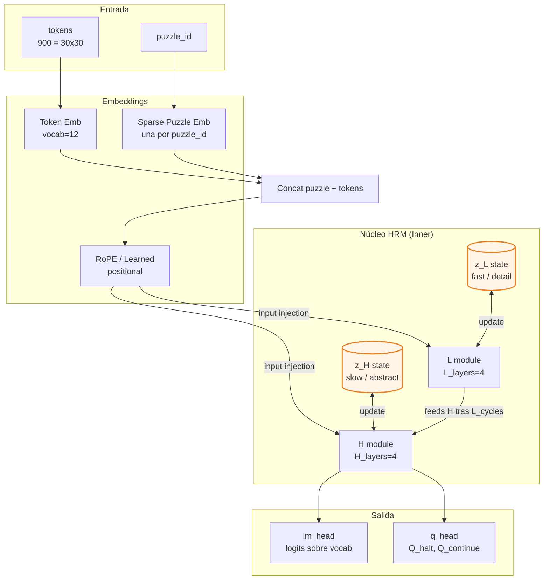
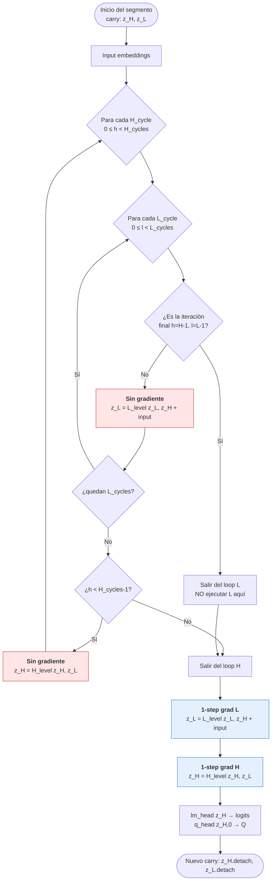
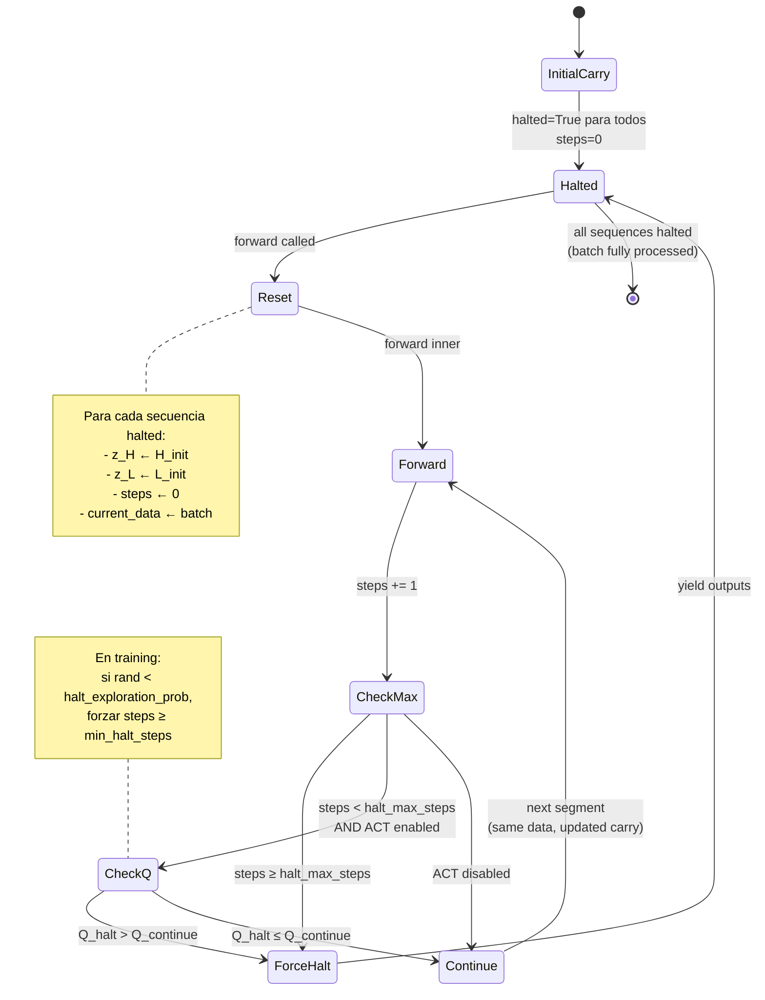
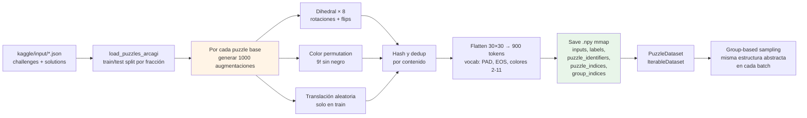
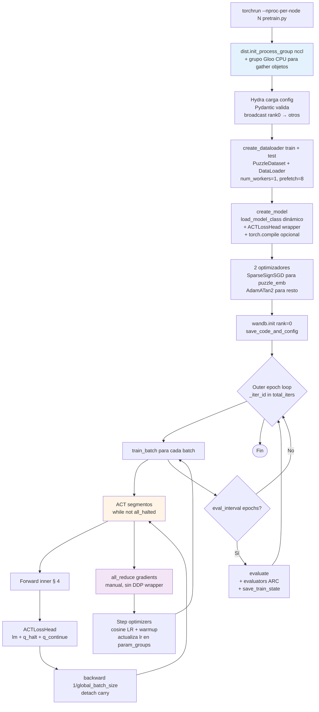
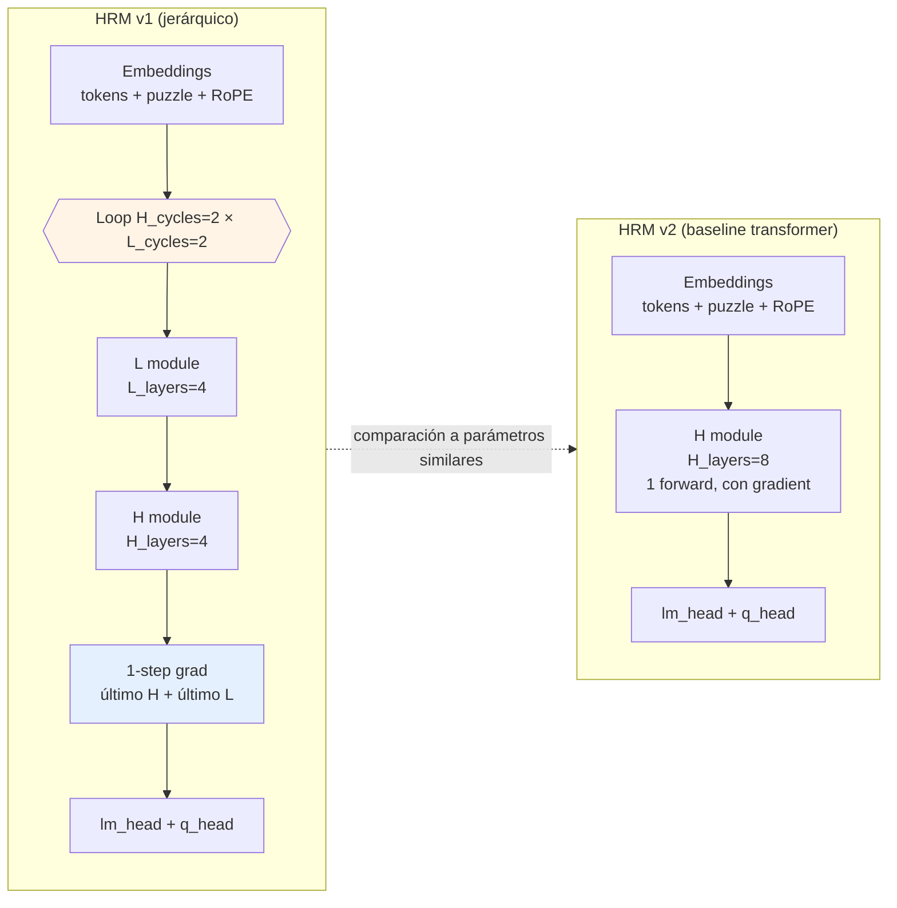

# Arquitectura del Hierarchical Reasoning Model (HRM)

> **Documento de referencia** sobre la arquitectura, los flujos de datos/entrenamiento/inferencia, y las **decisiones de diseño** del Hierarchical Reasoning Model implementado en este repositorio.
>
> El objetivo de este documento es **explicar el porqué** de cada decisión técnica, conectando el código con los tres trabajos de referencia:
> 1. **HRM** — Wang et al., *Hierarchical Reasoning Model* ([arXiv:2506.21734](https://arxiv.org/abs/2506.21734))
> 2. **Chollet** — *On the Measure of Intelligence* ([arXiv:1911.01547](https://arxiv.org/abs/1911.01547))
> 3. **ARC-AGI-2** — *ARC-AGI-2: A New Challenge for Frontier AI Reasoning Systems* ([arXiv:2505.11831](https://arxiv.org/abs/2505.11831))

---

## Tabla de contenidos

1. [Introducción y contexto](#1-introducción-y-contexto)
2. [Fundamentos teóricos: el "porqué" general](#2-fundamentos-teóricos-el-porqué-general)
3. [Arquitectura del modelo (estructura estática)](#3-arquitectura-del-modelo-estructura-estática)
4. [El flujo de razonamiento interno (hierarchical convergence)](#4-el-flujo-de-razonamiento-interno-hierarchical-convergence)
5. [Adaptive Computational Time (ACT) — bucle externo](#5-adaptive-computational-time-act--bucle-externo)
6. [Flujo de preparación de datos](#6-flujo-de-preparación-de-datos)
7. [Flujo de entrenamiento](#7-flujo-de-entrenamiento)
8. [Flujo de inferencia y evaluación](#8-flujo-de-inferencia-y-evaluación)
9. [Decisiones de diseño explicadas](#9-decisiones-de-diseño-explicadas)
10. [HRM v1 vs HRM v2: el ablation explicado](#10-hrm-v1-vs-hrm-v2-el-ablation-explicado)
11. [Apéndices](#11-apéndices)

---

## 1. Introducción y contexto

### 1.1 ¿Qué es HRM?

El **Hierarchical Reasoning Model (HRM)** es una arquitectura recurrente compacta (≈27M parámetros) diseñada para resolver problemas de **razonamiento simbólico abstracto** —ARC-AGI, Sudoku-Extreme, Maze-Hard— con muy pocos ejemplos de entrenamiento (del orden de 1.000 puzzles base, ampliados a un millón vía augmentación). Su contribución central es combinar **tres ideas** que en transformers convencionales no aparecen juntas:

1. **Dos módulos recurrentes acoplados** que operan a escalas temporales distintas: un módulo *H* (alto nivel, lento, abstracto) y un módulo *L* (bajo nivel, rápido, detalle).
2. Un esquema de **1-step gradient** (inspirado en *Deep Equilibrium Models*) que permite entrenar muchas iteraciones recurrentes con memoria **O(1)** en lugar de O(T) de BPTT.
3. **Adaptive Computational Time (ACT)** con halt mediante Q-learning, permitiendo "pensar más" en puzzles difíciles.

### 1.2 ¿Por qué importa?

Los grandes modelos de lenguaje (LLMs) tienen profundidad fija. Cuando un problema requiere razonamiento de muchos pasos —encadenar reglas, explorar el espacio de soluciones, retroceder ante contradicciones— el LLM no puede "pensar más"; sólo puede generar más texto vía *chain-of-thought*. Esto es lento, costoso y depende de un *prompt scaffold* externo.

HRM propone que el razonamiento debe ser una propiedad **interna y adaptativa** de la red: la profundidad efectiva no es la profundidad del grafo de cómputo escrito en código, sino el número de pasos que el modelo decide ejecutar para un input dado. En los benchmarks objetivo HRM alcanza resultados competitivos con LLMs mucho mayores sin necesidad de *pretraining* masivo ni *chain-of-thought*.

### 1.3 Contexto de este repositorio

Este repositorio es un **fork de análisis** mantenido por [arcprize/hierarchical-reasoning-model-analysis](https://github.com/arcprize/hierarchical-reasoning-model-analysis), basado en el [repo oficial](https://github.com/sapientinc/HRM) de Sapient Intelligence. Añade:

- Un evaluador estándar de ARC-AGI con *test-time augmentation* y *voting agregado* ([evaluators/arc.py](evaluators/arc.py))
- Un ablation que limita el número de augmentaciones usadas en inferencia ([evaluators/arc_augmentation_ablation.py](evaluators/arc_augmentation_ablation.py))
- Un baseline transformer no-jerárquico ([models/hrm/hrm_act_v2.py](models/hrm/hrm_act_v2.py)) para aislar el aporte real de la jerarquía
- Scripts standalone para evaluación de checkpoints ([evaluate_trained_model.py](evaluate_trained_model.py), [run_augmentation_ablation_eval.py](run_augmentation_ablation_eval.py))

Los hallazgos del equipo de ARC Prize están documentados en su [blog post sobre el análisis de HRM](http://arcprize.org/blog/hrm-analysis).

### 1.4 Resumen ejecutivo (lectura en 30 segundos)

> HRM procesa un grid 30×30 como una secuencia de 900 tokens. Adjunta un *puzzle embedding* sparse (un vector aprendido por cada puzzle único). Itera dos módulos transformer encadenados —H lento, L rápido— en un bucle anidado `H_cycles × L_cycles` que **sólo retropropaga el último paso** (1-step gradient). Sobre este núcleo, un wrapper ACT decide segmento a segmento cuándo parar usando Q-learning. El entrenamiento usa *deep supervision*: múltiples *forward passes* con `detach` del *carry* entre cada uno. En inferencia se generan ~1000 augmentaciones por puzzle, se invierten al espacio original y se **vota** por consenso ponderado por confianza Q-halt.

---

## 2. Fundamentos teóricos: el "porqué" general

Antes de mirar el código conviene entender los problemas que HRM intenta resolver. Cada decisión arquitectónica responde a una limitación bien documentada de modelos previos.

### 2.1 Inspiración neurocientífica: jerarquía cortical y oscilaciones theta/gamma

En la corteza, regiones de orden superior (prefrontal, parietal asociativo) integran información a escalas temporales lentas (segundos), mientras que regiones sensoriales primarias procesan rápido (milisegundos). Esta separación se refleja en oscilaciones cerebrales acopladas: las **ondas theta (4–8 Hz)** marcan el ritmo lento de las áreas integradoras y dentro de cada ciclo theta se anidan múltiples **ondas gamma (30–100 Hz)** de procesamiento detallado.

HRM traslada esta idea: el módulo **H** se actualiza **una vez** por cada ciclo en que el módulo **L** se actualiza **L_cycles** veces. L "subordina" su cómputo rápido al ritmo lento de H, y H lee el resultado convergido de L para tomar su siguiente paso. Esto evita que ambos módulos compitan por la misma escala temporal.

### 2.2 El problema clásico de las RNN profundas

Las redes recurrentes (RNNs, LSTMs, GRUs) profundizadas en el tiempo sufren dos males:

1. **Convergencia prematura del estado oculto**: tras pocas iteraciones el estado deja de cambiar significativamente; los gradientes se hacen casi nulos y el modelo no aprovecha el cómputo adicional.
2. **Memoria O(T) de BPTT**: para retropropagar T pasos hay que almacenar todas las activaciones intermedias, lo cual escala mal y bloquea entrenar con T grande.

HRM ataca ambos:

- **Hierarchical convergence** (§4) rompe la convergencia prematura: cuando L "se asienta", H da un paso y reinjecta un nuevo contexto a L, que vuelve a tener algo no trivial que computar.
- **1-step gradient** (§2.3, §4) sustituye BPTT por una aproximación O(1) en memoria.

### 2.3 Deep Equilibrium Models (DEQ) y el 1-step gradient

Un *Deep Equilibrium Model* (Bai et al., 2019) es una red que iteramos hasta un punto fijo $z^* = f(z^*, x)$ y devuelve $z^*$. Por el **teorema de la función implícita**, el gradiente de la pérdida respecto a los parámetros $\theta$ en el punto fijo se puede calcular **sin** desenrollar la iteración:

$$
\frac{\partial z^*}{\partial \theta} = \left(I - \frac{\partial f}{\partial z}\bigg|_{z^*}\right)^{-1} \frac{\partial f}{\partial \theta}\bigg|_{z^*}
$$

En la práctica esta inversa se aproxima con un único producto, lo que en código se reduce a: **forward sin gradiente hasta casi converger, luego un último forward con gradiente**. Es exactamente lo que hace HRM ([models/hrm/hrm_act_v1.py](models/hrm/hrm_act_v1.py) líneas 184–203):

- Los `H_cycles × L_cycles - 1` pasos iniciales corren bajo `torch.no_grad()`.
- El paso final (1 H + 1 L) corre con gradiente.

El coste de memoria es el de un único forward pass del bloque interno, independientemente de cuántos cycles hagamos. HRM no exige convergencia exacta (no es un DEQ puro), pero la justificación matemática es la misma.

### 2.4 Adaptive Computational Time (ACT)

Graves (2016) propuso ACT para que una RNN decidiera cuántas iteraciones aplicar por token según la dificultad. La idea: aprender una función de halt $h_t \in [0,1]$ y parar cuando la masa acumulada supere un umbral. El problema clásico de ACT con softmax-halt es la **inestabilidad en el entrenamiento**: el gradiente se propaga raro y depende de cómo penalices el número de pasos.

HRM reemplaza la mecánica de Graves por **Q-learning**: el modelo aprende dos Q-values, $Q_{\text{halt}}$ y $Q_{\text{continue}}$, y para cuando $Q_{\text{halt}} > Q_{\text{continue}}$. La señal de entrenamiento de $Q_{\text{halt}}$ es **si la secuencia ya es correcta** (BCE contra `seq_is_correct`); la de $Q_{\text{continue}}$ es **bootstrapping** del Q-value del siguiente paso. Sin replay buffer ni target network: el batch es tan grande que ya hay suficiente diversidad de "entornos" paralelos para estabilizar el aprendizaje, similar al enfoque de [PQN](https://arxiv.org/abs/2407.04811).

### 2.5 Chollet: skill vs intelligence

Chollet (2019) distingue **skill** (rendimiento en una tarea específica con experiencia ilimitada) de **inteligencia** (eficiencia con la que se adquieren skills nuevos a partir de muestras escasas y *priors* mínimos). Bajo esta definición, un LLM entrenado con todo internet **memorizó skills** pero no demuestra inteligencia si no generaliza a tareas nuevas con pocos ejemplos.

ARC-AGI fue diseñado como un benchmark donde:

- Cada tarea es **única** (no aparece en pretraining)
- Sólo hay **3–5 ejemplos** del par input→output por tarea
- Las tareas usan solo *Core Knowledge priors* del bebé humano: objetos, conteos básicos, geometría elemental, simetría, agrupamiento por color

HRM puntúa 40.3% en ARC-AGI-1 con sólo ~1000 puzzles base de entrenamiento (Wang et al.). El modelo no "ha visto" los puzzles de evaluación; debe abstraer la regla a partir de los ejemplos y aplicarla al input de test. Esto se acerca mucho más a la definición de inteligencia de Chollet que un LLM con *chain-of-thought*.

### 2.6 ARC-AGI-2: el listón más alto

ARC-AGI-2 (Chollet et al., 2025) endurece el benchmark filtrando puzzles que LLMs y técnicas de búsqueda de programa resolvían trivialmente, y añadiendo puzzles con mayor profundidad de razonamiento, composicionalidad y dependencia simbólica. Las puntuaciones de los mejores sistemas caen drásticamente al pasar de v1 a v2, lo que sugiere que **memorización de patrones no escala**: hace falta un mecanismo de razonamiento genuino. Este es el contexto en el que HRM cobra interés como dirección arquitectónica.

---

## 3. Arquitectura del modelo (estructura estática)

Esta sección describe los componentes "sin movimiento": qué módulos hay, cómo se conectan y cómo están parametrizados.

### 3.1 Visión general



**Lectura del diagrama**:
- El input son los **tokens del grid** (900 valores entre 0–11) y un **identificador de puzzle**.
- El *puzzle embedding* se concatena al inicio de la secuencia como un "token abstracto" extra, equivalente al rol de `[CLS]` en BERT pero específico por puzzle.
- Hay **dos estados ocultos persistentes** entre iteraciones del bucle interno: `z_H` y `z_L`.
- Las cabezas `lm_head` y `q_head` leen siempre de `z_H` (no de `z_L`).

### 3.2 Embeddings de entrada

Implementado en [models/hrm/hrm_act_v1.py](models/hrm/hrm_act_v1.py) método `_input_embeddings` (líneas 154–176).

Tres fuentes se combinan:

1. **Token embeddings**: tabla de tamaño `vocab_size × hidden_size` inicializada con `trunc_normal_init_` con `std = 1/sqrt(hidden_size)`. Para ARC, `vocab_size = 12` (PAD=0, EOS=1, dígitos de color 2–11).
2. **Puzzle embeddings**: vector aprendido **por puzzle único** (no por puzzle augmentado: las augmentaciones del mismo puzzle base comparten ID). Implementado como [CastedSparseEmbedding](models/sparse_embedding.py) — ver §3.6.
3. **Position embeddings**: por defecto **RoPE** (Rotary Positional Encoding); alternativa `learned`. RoPE rota cada par de dimensiones del query/key en función de la posición; permite generalización a longitudes no vistas y evita parámetros extra.

Estos tres se combinan así:

```python
embedding = concat([puzzle_embedding, token_embedding], dim=seq)   # puzzle tokens delante
embedding = embedding * sqrt(hidden_size)                          # escala forward variance
# RoPE no se suma aquí; se aplica dentro de Attention sobre q, k
```

El factor `sqrt(hidden_size)` (variable `embed_scale`) compensa que la inicialización use `std = 1/sqrt(hidden_size)`, lo que mantiene varianza ≈1 en el forward — práctica estándar en transformers tipo Llama.

### 3.3 Bloque transformer

Un único tipo de bloque ([models/hrm/hrm_act_v1.py](models/hrm/hrm_act_v1.py) líneas 61–80) compone tanto el módulo H como el L. Cada bloque tiene:

```
hidden ← rms_norm( hidden + self_attn(hidden) )       # Post-Norm + RMSNorm
hidden ← rms_norm( hidden + mlp(hidden) )
```

Detalles importantes:

- **Self-attention bidireccional** (`causal=False` en [models/hrm/hrm_act_v1.py L66](models/hrm/hrm_act_v1.py)): el grid no tiene orden temporal natural, todas las posiciones se atienden mutuamente.
- **Flash Attention 2/3** ([models/layers.py L98-L130](models/layers.py)): kernels fusionados que reducen lectura/escritura de memoria HBM; se prefiere FA3 (Hopper/H100) con fallback a FA2.
- **SwiGLU** ([models/layers.py L133-L141](models/layers.py)): MLP con *gated linear units* — `down(silu(gate) * up)`. Mejor curva de pérdida que GELU en transformers grandes (usado por Llama, PaLM).
- **RMSNorm sin parámetros** ([models/layers.py L144-L150](models/layers.py)): `x / sqrt(mean(x²) + eps)`. **No incluye `scale` ni `bias` aprendibles**, contrario a la RMSNorm de Llama. Esto reduce parámetros y, sobre todo, **estabiliza la rama de Q-learning** (escalas aprendibles pueden interactuar mal con BCE logits).
- **Linear sin bias** ([models/layers.py L43-L57](models/layers.py)): todas las proyecciones lineales omiten el bias (estilo Llama).

**Post-Norm** (norm *después* de la suma residual) en lugar del Pre-Norm habitual: se ha observado que Post-Norm con RMSNorm da mejor estabilidad de Q-learning en este setup, aunque requiere warmup más cuidadoso del LR.

### 3.4 Módulos H y L

Estructuralmente idénticos: cada uno es una pila de bloques transformer ([models/hrm/hrm_act_v1.py L83-L96](models/hrm/hrm_act_v1.py)):

```python
class HierarchicalReasoningModel_ACTV1ReasoningModule(nn.Module):
    def forward(self, hidden_states, input_injection, **kwargs):
        hidden_states = hidden_states + input_injection   # inyección de input al inicio
        for layer in self.layers:
            hidden_states = layer(hidden_states=hidden_states, **kwargs)
        return hidden_states
```

La diferencia entre H y L es **funcional, no estructural**: viene dada por **dónde se conectan en el bucle interno** (§4) y **qué input_injection reciben**:

- `L_level(z_L, input_injection = z_H + input_embeddings)` → L se actualiza muchas veces por cada paso de H, viendo siempre el estado actual de H más el input
- `H_level(z_H, input_injection = z_L)` → H se actualiza una vez por ciclo, viendo el estado convergido de L

Por defecto `H_layers = L_layers = 4` (8 bloques transformer en total, repartidos por igual).

### 3.5 Heads de salida

Dos heads lineales leen de `z_H` ([models/hrm/hrm_act_v1.py L107-L109](models/hrm/hrm_act_v1.py)):

```python
self.lm_head = CastedLinear(hidden_size, vocab_size, bias=False)
self.q_head  = CastedLinear(hidden_size, 2,         bias=True)
```

- **`lm_head`**: produce logits sobre el vocabulario para cada posición de la secuencia. Es la salida principal del modelo (predicción del grid de salida del puzzle).
- **`q_head`**: salida de 2 dimensiones interpretadas como `(Q_halt, Q_continue)`. Sólo se usa la **primera posición** de la secuencia (el primer puzzle token): `q_logits = self.q_head(z_H[:, 0])` ([models/hrm/hrm_act_v1.py L205](models/hrm/hrm_act_v1.py)).

**Init especial del Q-head** ([models/hrm/hrm_act_v1.py L138-L142](models/hrm/hrm_act_v1.py)):

```python
self.q_head.weight.zero_()
self.q_head.bias.fill_(-5)
```

`weight = 0` significa que al inicio del entrenamiento las Q-values son constantes (= bias). `bias = -5` hace que `sigmoid(-5) ≈ 0.007` → ambas Q-values empiezan casi en cero. Esto evita que el modelo halt-ee aleatoriamente al inicio antes de aprender nada (un halt prematuro destruiría el aprendizaje).

### 3.6 Sparse puzzle embeddings

Implementado en [models/sparse_embedding.py](models/sparse_embedding.py).

El reto: queremos un embedding **por cada puzzle único** (~1000 IDs en train), pero en cada batch sólo aparecen ~`batch_size` IDs. Un embedding denso entrenado con SGD/Adam regular gastaría memoria y cómputo masivos en `(num_ids, hidden_size)` updates inútiles.

La solución tiene **tres componentes**:

1. **Storage**: tabla densa `weights` de tamaño `(num_puzzle_identifiers, embedding_dim)` (no entrenable, `nn.Buffer`).
2. **Working set**: dos buffers locales por batch ([models/sparse_embedding.py L23-L26](models/sparse_embedding.py)):
   - `local_weights` de tamaño `(batch_size, embedding_dim)` con `requires_grad=True`
   - `local_ids` con los IDs actuales del batch
   En cada forward (training), se copian los pesos correspondientes a los IDs del batch a `local_weights`. El gradiente se acumula en `local_weights`, no en la tabla grande.
3. **Optimizador distribuido custom** [`CastedSparseEmbeddingSignSGD_Distributed`](models/sparse_embedding.py):
   - All-gather de `local_weights.grad` y `local_ids` entre ranks
   - Deduplicación por ID
   - Aplicación de **SignSGD** + *weight decay* desacoplado
   - Escritura selectiva en la tabla grande

**¿Por qué SignSGD?** Para gradientes ultra-sparse (un único embedding actualizado por puzzle visto), Adam ≈ SignSGD (el momentum y el segundo momento se estabilizan al signo del gradiente). SignSGD evita estado de optimizador adicional → menos memoria, comunicación más simple. Ver §9.5 para más detalle.

### 3.7 Estados iniciales H_init y L_init

Los estados ocultos `z_H` y `z_L` necesitan un valor de partida cuando empieza un nuevo problema (carry "halted"). HRM no usa ceros: aprende dos vectores ([models/hrm/hrm_act_v1.py L131-L132](models/hrm/hrm_act_v1.py)):

```python
self.H_init = nn.Buffer(trunc_normal_init_(torch.empty(hidden_size), std=1), persistent=True)
self.L_init = nn.Buffer(trunc_normal_init_(torch.empty(hidden_size), std=1), persistent=True)
```

Notas:
- Son `nn.Buffer` persistentes (se guardan en el state_dict) pero **no son `nn.Parameter`** → no reciben gradiente del optimizador directamente. Su valor queda fijo tras la inicialización.
- Se expanden por broadcasting a `(batch, seq_len, hidden_size)` al resetear el carry ([models/hrm/hrm_act_v1.py L150-L152](models/hrm/hrm_act_v1.py)).
- Truncated LeCun normal `std=1` (no `1/sqrt(hidden_size)`) porque son el estado completo, no una transformación lineal.

### 3.8 Configuración por defecto

De [config/arch/hrm_v1.yaml](config/arch/hrm_v1.yaml):

| Parámetro                  | Valor       | Significado                                                       |
| -------------------------- | ----------- | ----------------------------------------------------------------- |
| `hidden_size`              | 512         | Dimensión del modelo                                              |
| `num_heads`                | 8           | Cabezas de atención (`head_dim = 64`)                             |
| `expansion`                | 4           | Factor MLP (intermediate ≈ `2/3 * 4 * 512` redondeado a 256)      |
| `H_layers`                 | 4           | Bloques transformer en el módulo H                                |
| `L_layers`                 | 4           | Bloques transformer en el módulo L                                |
| `H_cycles`                 | 2           | Pasos de H por forward inner                                      |
| `L_cycles`                 | 2           | Pasos de L por cada paso de H                                     |
| `halt_max_steps`           | 16          | Máximo de segmentos ACT (forward inner)                           |
| `halt_exploration_prob`    | 0.1         | Probabilidad de forzar segmentos mínimos durante training         |
| `puzzle_emb_ndim`          | 512         | Dimensión del puzzle embedding (= hidden_size)                    |
| `pos_encodings`            | `rope`      | Codificación posicional                                           |
| `rope_theta`               | 10000.0     | Base de RoPE                                                      |
| `rms_norm_eps`             | 1e-5        | Epsilon de RMSNorm                                                |
| `forward_dtype`            | `bfloat16`  | Tipo de las activaciones forward                                  |

Total ≈ **27M parámetros** (incluyendo puzzle embeddings).

---

## 4. El flujo de razonamiento interno (hierarchical convergence)

Esta es **la idea central de HRM**. Una vez clara la estructura estática (§3), todo lo demás cuelga de aquí.

### 4.1 El bucle anidado H × L

Implementado en [models/hrm/hrm_act_v1.py](models/hrm/hrm_act_v1.py) método `forward` del *Inner* (líneas 178–209).



El código real (simplificado del fragmento de [models/hrm/hrm_act_v1.py L184-L203](models/hrm/hrm_act_v1.py)):

```python
with torch.no_grad():
    z_H, z_L = carry.z_H, carry.z_L
    for _H_step in range(self.config.H_cycles):
        for _L_step in range(self.config.L_cycles):
            if not ((_H_step == H_cycles - 1) and (_L_step == L_cycles - 1)):
                z_L = self.L_level(z_L, z_H + input_embeddings)
        if not (_H_step == H_cycles - 1):
            z_H = self.H_level(z_H, z_L)

assert not z_H.requires_grad and not z_L.requires_grad

# 1-step grad: el ÚNICO paso que contribuye al backward
z_L = self.L_level(z_L, z_H + input_embeddings)
z_H = self.H_level(z_H, z_L)

new_carry = HierarchicalReasoningModel_ACTV1InnerCarry(
    z_H=z_H.detach(),  # carry detached → no propaga al siguiente segmento
    z_L=z_L.detach()
)
```

### 4.2 Interpretación paso a paso (con H_cycles=2, L_cycles=2)

| Paso | Acción                                          | Gradiente | Comentario                                              |
| ---- | ----------------------------------------------- | --------- | ------------------------------------------------------- |
| 1    | `z_L = L_level(z_L, z_H + input)`               | ❌        | L "piensa" sobre z_H inicial                            |
| 2    | `z_L = L_level(z_L, z_H + input)`               | ❌        | L termina su primer "ciclo" de iteraciones              |
| 3    | `z_H = H_level(z_H, z_L)`                       | ❌        | H da un paso usando el L convergido                     |
| 4    | `z_L = L_level(z_L, z_H + input)`               | ❌        | L re-piensa con el nuevo z_H (L "se reinicia")          |
| 5    | (saltado: la iteración final del bucle no se ejecuta aquí; se hace fuera con gradiente) |
| 6    | `z_L = L_level(z_L, z_H + input)` **con grad**  | ✅        | 1-step grad de L                                        |
| 7    | `z_H = H_level(z_H, z_L)` **con grad**          | ✅        | 1-step grad de H                                        |

**Total**: 4 forwards de L + 2 forwards de H, pero **sólo 1 + 1 contribuyen al backward**. La memoria de activaciones es la de 2 bloques transformer, no de 6.

### 4.3 ¿Por qué hierarchical convergence evita el "estancamiento" de las RNN?

En una RNN profunda:
1. El estado oculto converge tras pocos pasos.
2. Los siguientes pasos no aportan información nueva.
3. Los gradientes hacia esos pasos son ≈ 0.
4. El modelo no aprovecha el cómputo extra.

En HRM:
1. L converge a una sub-solución (por ejemplo: "para este sub-grid, la regla es X").
2. **H lee esa sub-solución y da un paso**, cambiando su estado.
3. El siguiente ciclo de L recibe un nuevo `z_H + input` distinto → tiene algo no trivial que computar.
4. L vuelve a converger a una nueva sub-solución.
5. Y así sucesivamente.

La jerarquía actúa como un **reset implícito de L** cada `L_cycles` iteraciones. L nunca se queda atascado porque siempre recibe contexto fresco.

### 4.4 ¿Por qué funciona el 1-step gradient?

Justificación informal (la formal está en §2.3):

- Si L y H convergieran exactamente a un punto fijo, el teorema de la función implícita dice que basta con el gradiente en ese punto.
- En la práctica L y H **no** convergen exactamente, pero **están cerca** del punto fijo tras varias iteraciones sin gradiente.
- El gradiente del último paso aproxima el gradiente "real" suficientemente bien para entrenar.

Coste: **memoria O(1) en `cycles`** vs O(`H_cycles × L_cycles`) de BPTT. Esto desbloquea poder aumentar `H_cycles` y `L_cycles` sin coste de memoria adicional (sólo coste de tiempo lineal). El [README](README.md) documenta ablations con `H_cycles=4, L_cycles=4` ejecutables sin cambios de hardware.

### 4.5 El detach del carry: aislamiento entre segmentos

`new_carry = (z_H.detach(), z_L.detach())` ([models/hrm/hrm_act_v1.py L201-L202](models/hrm/hrm_act_v1.py)) es **crucial**: garantiza que el siguiente segmento ACT (§5) parta de un tensor sin grafo computacional asociado. Sin este detach, los segmentos se encadenarían en un único grafo enorme que reventaría memoria.

Cada segmento es entonces una **unidad de cómputo independiente** desde la óptica del autograd. La supervisión se aplica segmento a segmento, no a un grafo global — este es el concepto de **deep supervision** (§7.4).

---

## 5. Adaptive Computational Time (ACT) — bucle externo

Si §4 es "qué hace HRM en un segmento", esta sección es "cuántos segmentos hace y por qué decide parar".

### 5.1 Máquina de estados ACT

Implementado como wrapper en [models/hrm/hrm_act_v1.py](models/hrm/hrm_act_v1.py) clase `HierarchicalReasoningModel_ACTV1` (líneas 212–278).



### 5.2 El flujo del forward ACT

Reescritura comentada del código ([models/hrm/hrm_act_v1.py L226-L277](models/hrm/hrm_act_v1.py)):

```python
def forward(self, carry, batch, compute_target_q=False):
    # 1. Reset selectivo: para secuencias halted, restaurar H_init, L_init
    new_inner_carry = self.inner.reset_carry(carry.halted, carry.inner_carry)
    # 2. Reset selectivo: para secuencias halted, cargar nuevo input del batch
    new_steps = torch.where(carry.halted, 0, carry.steps)
    new_current_data = {
        k: torch.where(carry.halted.view(...), batch[k], v)
        for k, v in carry.current_data.items()
    }

    # 3. Forward inner (la sección §4)
    new_inner_carry, logits, (q_halt, q_continue) = self.inner(new_inner_carry, new_current_data)

    outputs = {"logits": logits, "q_halt_logits": q_halt, "q_continue_logits": q_continue}

    with torch.no_grad():
        # 4. Decidir halt
        new_steps = new_steps + 1
        is_last_step = new_steps >= self.config.halt_max_steps
        halted = is_last_step

        if use_adaptive:                                   # ACT enabled
            q_halt_signal = q_halt > q_continue            # halt cuando Q_halt gana
            halted = halted | q_halt_signal

            if self.training:
                # 5. Exploración: forzar segmentos extra al azar
                min_halt_steps = (torch.rand_like(q_halt) < halt_exploration_prob) * \
                                 torch.randint_like(new_steps, low=2, high=halt_max_steps+1)
                halted = halted & (new_steps >= min_halt_steps)

            # 6. Target Q (sólo training, sólo cada target_q_update_every pasos)
            if self.training and compute_target_q:
                next_q_halt, next_q_continue = self.inner(new_inner_carry, new_current_data)[-1]
                outputs["target_q_continue"] = sigmoid(where(
                    is_last_step, next_q_halt, max(next_q_halt, next_q_continue)
                ))

    return HierarchicalReasoningModel_ACTV1Carry(new_inner_carry, new_steps, halted, new_current_data), outputs
```

### 5.3 El loss de Q-learning

En [models/losses.py](models/losses.py) `ACTLossHead.forward` (líneas 41–92):

```python
q_halt_loss = F.binary_cross_entropy_with_logits(
    outputs["q_halt_logits"],
    seq_is_correct.to(...),               # target: ¿es correcta la secuencia ya?
    reduction="sum"
)

q_continue_loss = 0
if "target_q_continue" in outputs:
    q_continue_loss = F.binary_cross_entropy_with_logits(
        outputs["q_continue_logits"],
        outputs["target_q_continue"],     # target bootstrapped
        reduction="sum"
    )

return ..., lm_loss + 0.5 * (q_halt_loss + q_continue_loss), ...
```

- `q_halt_loss` aprende a predecir **si el modelo ya tiene la respuesta correcta** (entonces conviene parar).
- `q_continue_loss` es **bootstrapping**: aprende el valor del estado siguiente. Se calcula con un forward extra (más costoso) solo cada `target_q_update_every = 4` pasos.

El peso `0.5` balancea el loss de razonamiento (`lm_loss`) vs el de halt.

### 5.4 ¿Por qué exploración aleatoria durante el training?

Sin exploración, si al inicio del entrenamiento el Q-head sugiere halt rápido, el modelo nunca aprenderá a usar más segmentos (porque nunca los ejecuta). El mecanismo `halt_exploration_prob = 0.1` ([config/arch/hrm_v1.yaml](config/arch/hrm_v1.yaml)) fuerza con probabilidad 10% un mínimo de segmentos aleatorio entre 2 y `halt_max_steps`. Es el equivalente de epsilon-greedy en RL.

### 5.5 act_enabled vs act_inference

Hay dos flags ([models/hrm/hrm_act_v1.py L52-L53](models/hrm/hrm_act_v1.py)):

- `act_enabled` (default `True`): permite halt temprano **durante training**. Si `False`, siempre se hacen `halt_max_steps` segmentos.
- `act_inference` (default `False`): permite halt temprano **durante inferencia**. Por defecto en inferencia se hacen `halt_max_steps` segmentos para máxima precisión.

Esta asimetría es deliberada: en training, ACT acelera y enseña al modelo a halt-ear; en inferencia, queremos el máximo cómputo posible por puzzle (es barato, ya no hay backward).

### 5.6 Carga implícita del siguiente batch

Una sutileza del wrapper: `current_data` mantiene el input **mientras la secuencia no ha haltado**. Cuando halt-ea, `new_current_data[k] = torch.where(carry.halted, batch[k], v)` **sobrescribe con el siguiente input del batch externo**. Esto significa que dentro de un mismo "batch" del DataLoader pueden coexistir secuencias en distintos estados de razonamiento, y el wrapper las recicla individualmente. Esto es lo que permite el patrón `while True: ...; if all_finish: break` del loop de evaluación ([pretrain.py L370-L382](pretrain.py)).

---

## 6. Flujo de preparación de datos

### 6.1 Visión general



### 6.2 Vocabulary y representación de los grids

Definido en [dataset/build_arc_dataset.py L218-L224](dataset/build_arc_dataset.py):

```python
metadata = PuzzleDatasetMetadata(
    seq_len=ARCMaxGridSize * ARCMaxGridSize,  # 900
    vocab_size=10 + 2,                        # 12: PAD + EOS + 10 colores
    pad_id=0,
    ignore_label_id=0,
    blank_identifier_id=0,
    ...
)
```

| Token | Significado    |
| ----- | -------------- |
| 0     | PAD            |
| 1     | EOS (borde del grid real) |
| 2     | Color 0 (negro)|
| 3     | Color 1        |
| ...   | ...            |
| 11    | Color 9        |

Por qué desplazar los colores +2: los tokens 0 y 1 quedan reservados para padding y marcador de fin, lo que permite recortar el grid real desde una grilla "canvas" 30×30 ([evaluators/arc.py L13-L37](evaluators/arc.py) función `_crop`).

### 6.3 Augmentaciones

Cada puzzle base se expande a hasta `num_aug + 1` variantes (la original + las augmentadas). En `arc-aug-1000`, esto produce ≈1001 puzzles "lógicamente equivalentes" por cada puzzle base.

#### 6.3.1 Transformaciones diedrales (8 simetrías del cuadrado)

[dataset/common.py L24-L46](dataset/common.py):

```python
def dihedral_transform(arr, tid):
    if tid == 0: return arr                           # identidad
    elif tid == 1: return np.rot90(arr, k=1)          # 90°
    elif tid == 2: return np.rot90(arr, k=2)          # 180°
    elif tid == 3: return np.rot90(arr, k=3)          # 270°
    elif tid == 4: return np.fliplr(arr)              # flip horizontal
    elif tid == 5: return np.flipud(arr)              # flip vertical
    elif tid == 6: return arr.T                       # transposición (diagonal)
    elif tid == 7: return np.fliplr(np.rot90(arr, k=1))  # antidiagonal
```

El grupo $D_4$ de simetrías del cuadrado (8 elementos) es el espacio natural de invariancias geométricas en grids. Si un puzzle ARC es resoluble, su rotación 90° también lo es **con la misma regla rotada**.

#### 6.3.2 Permutación de colores

[dataset/build_arc_dataset.py L99-L111](dataset/build_arc_dataset.py):

```python
mapping = np.concatenate([
    np.arange(0, 1, dtype=np.uint8),                       # negro (0) fijo
    np.random.permutation(np.arange(1, 10, dtype=np.uint8))  # colores 1-9 permutados
])
```

El negro queda fijo porque suele ser fondo/ausencia en ARC. Los colores 1–9 se permutan aleatoriamente. Hay $9! = 362.880$ permutaciones posibles, así que el espacio combinado con dihedrales (8) tiene $9! \times 8 \approx 2.9 \times 10^6$ variantes lógicamente equivalentes, ampliamente suficiente para `num_aug=1000`.

#### 6.3.3 Traslación aleatoria (sólo en train)

[dataset/build_arc_dataset.py L43-L73](dataset/build_arc_dataset.py) función `np_grid_to_seq_translational_augment`:

```python
if do_translation:
    pad_r = np.random.randint(0, ARCMaxGridSize - max(inp.shape[0], out.shape[0]) + 1)
    pad_c = np.random.randint(0, ARCMaxGridSize - max(inp.shape[1], out.shape[1]) + 1)
```

El puzzle real puede ser, por ejemplo, 5×7. Se inserta con offset aleatorio dentro del canvas 30×30. Esto fuerza al modelo a no depender de coordenadas absolutas — debe aprender posiciones **relativas**, lo que se combina bien con RoPE (que codifica precisamente posición relativa).

En test la traslación se desactiva para que el resultado sea determinista y comparable.

#### 6.3.4 Deduplicación por hash

[dataset/build_arc_dataset.py L137-L150](dataset/build_arc_dataset.py): si la combinación (dihedral, permutación) genera un puzzle idéntico a otro ya producido (poco común pero posible para puzzles simétricos), se descarta. El hash es `SHA256` sobre los grids concatenados ([L82-L96](dataset/build_arc_dataset.py)).

### 6.4 Storage: memory-mapped .npy

Resultado del preprocessing ([dataset/build_arc_dataset.py L240-L264](dataset/build_arc_dataset.py)): por cada split (`train`, `test`) se guarda:

| Archivo                             | Contenido                                       |
| ----------------------------------- | ----------------------------------------------- |
| `all__inputs.npy`                   | `(total_examples, 900)` uint8: grids de input  |
| `all__labels.npy`                   | `(total_examples, 900)` uint8: grids de output |
| `all__puzzle_identifiers.npy`       | `(total_puzzles,)` int32: ID por puzzle        |
| `all__puzzle_indices.npy`           | `(total_puzzles+1,)` int32: offsets en inputs   |
| `all__group_indices.npy`            | `(total_groups+1,)` int32: offsets en puzzles   |
| `dataset.json`                      | metadata (vocab, seq_len, …)                   |
| `identifiers.json`                  | mapping `puzzle_id → string nombre`            |
| `test_puzzles.json`                 | puzzles de test originales para evaluación      |

El loader los abre con `mmap_mode="r"` ([puzzle_dataset.py L75-L81](puzzle_dataset.py)) — el SO mapea las páginas del disco a memoria virtual bajo demanda. Esto permite manejar datasets de varios GB sin cargarlos enteros en RAM.

### 6.5 PuzzleDataset: el loader

[puzzle_dataset.py](puzzle_dataset.py). Es un `IterableDataset` (sin `__len__`) que opera con dos modos:

#### 6.5.1 Modo train (`_iter_train`, líneas 142–175)

```python
for set_name, dataset in self._data.items():
    rng = np.random.Generator(np.random.Philox(seed=...))
    # 1. Barajar índices de grupos
    group_order = np.concatenate([rng.permutation(num_groups) for _ in range(epochs_per_iter)])
    start_index = 0
    while start_index < group_order.size:
        # 2. Tomar un grupo, samplear puzzles de ese grupo SIN reemplazo
        start_index, batch_indices, batch_puzzle_indices = _sample_batch(
            rng, group_order, puzzle_indices, group_indices, start_index, global_batch_size
        )
        # 3. Yield del batch correspondiente a este rank
        ...
```

**El sampling jerárquico** ([puzzle_dataset.py L15-L40](puzzle_dataset.py)): un *grupo* en HRM agrupa todas las augmentaciones de un mismo puzzle base. El sampler:

1. Baraja los grupos.
2. Para cada grupo, samplea un *puzzle* (= una augmentación específica) sin reemplazo.
3. Cuando el batch global se llena, lo devuelve.

**¿Por qué?** Garantiza que en cada batch aparezcan **muchas variantes del mismo puzzle base**. El modelo recibe simultáneamente la misma regla abstracta en 8 rotaciones × N colores → señal de consistencia muy fuerte para aprender la abstracción y no el bitmap.

#### 6.5.2 Modo test (`_iter_test`, líneas 116–140)

Iteración determinística sobre todos los ejemplos en orden, sin shuffle, para asegurar evaluación reproducible.

#### 6.5.3 Distribución por rank

`local_batch_size = global_batch_size // num_replicas`. Cada rank ve sólo su porción ([puzzle_dataset.py L163-L172](puzzle_dataset.py)):

```python
batch_indices = batch_indices[rank * local_batch_size : (rank + 1) * local_batch_size]
```

El padding (`_collate_batch`, líneas 92–114) garantiza batches del mismo tamaño aunque el último grupo no llene completamente.

### 6.6 Comandos de construcción

```powershell
python -m dataset.build_arc_dataset `
  --input-file-prefix kaggle/input `
  --output-dir data/arc-aug-1000 `
  --subsets concept training evaluation `
  --test-set-name evaluation
```

Para variar las augmentaciones:

```powershell
python -m dataset.build_arc_dataset `
  --input-file-prefix kaggle/input `
  --output-dir data/arc-aug-600 `
  --num-aug 600 `
  --subsets concept training evaluation `
  --test-set-name evaluation
```

---

## 7. Flujo de entrenamiento

### 7.1 Visión general



### 7.2 Inicialización distribuida

[pretrain.py L520-L536](pretrain.py):

```python
if "LOCAL_RANK" in os.environ:
    dist.init_process_group(backend="nccl")
    RANK = dist.get_rank()
    WORLD_SIZE = dist.get_world_size()
    torch.cuda.set_device(int(os.environ["LOCAL_RANK"]))
    # Grupo Gloo extra para gather de objetos Python (los evaluadores lo necesitan)
    CPU_PROCESS_GROUP = dist.new_group(backend="gloo")
```

- **NCCL** para tensores (GPU-GPU, alta banda ancha).
- **Gloo** para objetos Python (gather de los buckets de votos en el evaluador ARC).

La configuración se sincroniza vía broadcast desde rank 0 ([pretrain.py L494-L514](pretrain.py)) para que todos los ranks usen exactamente los mismos hiperparámetros y nombres aleatorios (`coolname` genera un slug aleatorio que debe ser idéntico en todos los ranks).

### 7.3 Construcción del modelo

[pretrain.py L109-L152](pretrain.py) función `create_model`:

```python
model_cfg = dict(
    **config.arch.__pydantic_extra__,  # parámetros extra del YAML arch
    batch_size=config.global_batch_size // world_size,
    vocab_size=train_metadata.vocab_size,
    seq_len=train_metadata.seq_len,
    num_puzzle_identifiers=train_metadata.num_puzzle_identifiers,
    causal=False,
)
model_cls = load_model_class(config.arch.name)         # 'hrm.hrm_act_v1@HierarchicalReasoningModel_ACTV1'
loss_head_cls = load_model_class(config.arch.loss.name)  # 'losses@ACTLossHead'

with torch.device("cuda"):
    model = model_cls(model_cfg)
    model = loss_head_cls(model, **config.arch.loss.__pydantic_extra__)  # envuelve con ACT loss
    if "DISABLE_COMPILE" not in os.environ:
        model = torch.compile(model, dynamic=False)
    if rank == 0:
        load_checkpoint(model, config)
    # broadcast pesos rank 0 → resto
    if world_size > 1:
        for param in list(model.parameters()) + list(model.buffers()):
            dist.broadcast(param, src=0)
```

Notas:
- `load_model_class` ([utils/functions.py](utils/functions.py)) parsea el formato `"módulo@Clase"` y hace `importlib.import_module`. Esto permite intercambiar HRM v1 ↔ HRM v2 únicamente cambiando el YAML.
- `torch.compile(dynamic=False)` produce un grafo optimizado (fusion de kernels, plan estático). Se puede desactivar con `DISABLE_COMPILE=1` para debugging.
- El **broadcast inicial** garantiza pesos idénticos en todos los ranks (importante porque la inicialización aleatoria sería distinta por rank).

### 7.4 Los dos optimizadores

[pretrain.py L132-L148](pretrain.py):

```python
optimizers = [
    CastedSparseEmbeddingSignSGD_Distributed(
        model.model.puzzle_emb.buffers(),    # buffers: local_weights, local_ids, weights
        lr=0,                                 # set por scheduler
        weight_decay=config.puzzle_emb_weight_decay,
        world_size=world_size,
    ),
    AdamATan2(
        model.parameters(),                   # TODOS los parámetros aprendibles
        lr=0,
        weight_decay=config.weight_decay,
        betas=(config.beta1, config.beta2),
    ),
]
optimizer_lrs = [config.puzzle_emb_lr, config.lr]
```

- **Optimizador 1**: SparseSignSGD para los buffers del puzzle embedding. Ver §3.6 y §9.5.
- **Optimizador 2**: AdamATan2 para **todos** los parámetros (incluye también `local_weights` del puzzle embedding, pero ese parámetro está aislado en el grupo del primer optimizador por el asserts de §3.6). En la práctica AdamATan2 actualiza pesos transformer, embeddings de tokens, lm_head, q_head, etc.

**¿Por qué AdamATan2 en lugar de AdamW?**
- AdamATan2 reemplaza el *bias correction* tradicional por una operación `atan2` que hace el update **invariante a escala** del gradiente.
- Más estable cuando hay heads con escalas muy distintas (lm_head con logits de muchas dimensiones, q_head con sólo 2). Ver paper de Everett et al. ([arXiv:2407.05872](https://arxiv.org/abs/2407.05872)).
- Particularmente útil para el head de Q-learning, donde el loss BCE puede tener gradientes muy pequeños o muy grandes según la confianza.

### 7.5 Schedule de learning rate

[pretrain.py L155-L168](pretrain.py) función `cosine_schedule_with_warmup_lr_lambda`:

```python
if current_step < num_warmup_steps:
    return base_lr * current_step / max(1, num_warmup_steps)   # warmup lineal
progress = (current_step - num_warmup_steps) / max(1, num_training_steps - num_warmup_steps)
return base_lr * (min_ratio + max(0.0, (1 - min_ratio) * 0.5 * (1.0 + cos(π * progress))))
```

Configuración por defecto en [config/cfg_pretrain.yaml](config/cfg_pretrain.yaml):
- `lr = 1e-4`, `lr_min_ratio = 1.0` → **el cosine queda plano**: tras el warmup el LR se mantiene constante. (Pongan `lr_min_ratio < 1.0` para reactivar el decay).
- `lr_warmup_steps = 2000`
- `puzzle_emb_lr = 1e-2` (100× mayor que el del resto, porque los updates son muy escasos por embedding y por SignSGD)
- `beta1 = 0.9`, `beta2 = 0.95`, `weight_decay = 0.1` (hiperparámetros estándar Llama).

### 7.6 train_batch: deep supervision en acción

[pretrain.py L252-L323](pretrain.py):

```python
def train_batch(config, train_state, batch, global_batch_size, rank, world_size):
    train_state.step += 1
    batch = {k: v.cuda() for k, v in batch.items()}

    # 1. Carry vacío en el primer batch
    if train_state.carry is None:
        with torch.device("cuda"):
            train_state.carry = train_state.model.initial_carry(batch)

    # 2. Forward = UN segmento ACT (no el loop completo)
    compute_target_q = train_state.step % config.target_q_update_every == 0
    train_state.carry, loss, metrics, _, _ = train_state.model(
        carry=train_state.carry,
        batch=batch,
        return_keys=[],
        compute_target_q=compute_target_q,
    )

    # 3. Backward escalado por 1/global_batch_size
    ((1 / global_batch_size) * loss).backward()

    # 4. AllReduce manual de gradientes
    if world_size > 1:
        for param in train_state.model.parameters():
            if param.grad is not None:
                dist.all_reduce(param.grad)

    # 5. Step de los dos optimizadores con LR computado
    for optim, base_lr in zip(train_state.optimizers, train_state.optimizer_lrs):
        lr_this_step = compute_lr(base_lr, config, train_state)
        for pg in optim.param_groups:
            pg["lr"] = lr_this_step
        optim.step()
        optim.zero_grad()
```

**Puntos clave**:

- **Cada `train_batch` ejecuta UN segmento**, no todo el ACT loop. El siguiente batch del DataLoader continúa con el carry de las secuencias que no haltaron y carga input nuevo para las que sí. Esto es **deep supervision en su forma más pura**: cada segmento es un step de gradient descent independiente.
- El `carry` persiste **a través de batches del DataLoader** vía `train_state.carry`. Esto es perfectamente compatible con el sampling jerárquico (§6.5) porque dentro de un mismo grupo el modelo está procesando el mismo puzzle base aunque distintas augmentaciones.
- **AllReduce manual**, no DDP. Razones:
  - HRM tiene optimizadores custom que DDP no maneja bien.
  - Control fino sobre cuándo se sincroniza (siempre tras backward, antes de step).
  - El overhead es aceptable para batches grandes.

### 7.7 ACTLossHead: el wrapper de pérdida

[models/losses.py L41-L92](models/losses.py):

```python
class ACTLossHead(nn.Module):
    def __init__(self, model, loss_type):
        self.model = model
        self.loss_fn = globals()[loss_type]  # 'stablemax_cross_entropy' o 'softmax_cross_entropy'

    def forward(self, return_keys, **model_kwargs):
        new_carry, outputs = self.model(**model_kwargs)
        labels = new_carry.current_data["labels"]

        with torch.no_grad():
            outputs["preds"] = torch.argmax(outputs["logits"], dim=-1)
            mask = labels != IGNORE_LABEL_ID
            loss_counts = mask.sum(-1)
            is_correct = mask & (outputs["preds"] == labels)
            seq_is_correct = is_correct.sum(-1) == loss_counts
            valid_metrics = new_carry.halted & (loss_counts > 0)
            metrics = {
                "count": valid_metrics.sum(),
                "accuracy": ...,                # accuracy por token
                "exact_accuracy": ...,          # accuracy por secuencia completa
                "q_halt_accuracy": ...,         # ¿predice bien Q_halt?
                "steps": ...,                   # cuántos segmentos usó
            }

        lm_loss = (self.loss_fn(outputs["logits"], labels, ignore_index=IGNORE_LABEL_ID) / loss_divisor).sum()
        q_halt_loss = F.binary_cross_entropy_with_logits(outputs["q_halt_logits"], seq_is_correct.float(), reduction="sum")
        q_continue_loss = 0
        if "target_q_continue" in outputs:
            q_continue_loss = F.binary_cross_entropy_with_logits(outputs["q_continue_logits"], outputs["target_q_continue"], reduction="sum")

        return new_carry, lm_loss + 0.5 * (q_halt_loss + q_continue_loss), metrics, detached_outputs, new_carry.halted.all()
```

Aspectos clave:
- **`return_keys`**: protocolo para que el caller solicite qué outputs quiere materializados; ahorra memoria devolviendo sólo lo necesario.
- **`new_carry.halted.all()`** es la señal `all_finish` que rompe el loop de evaluación.
- Las **métricas son contadores acumulables** (sumas, no medias). La división por count se hace después en `train_batch` y `evaluate`.

### 7.8 Stablemax cross-entropy

[models/losses.py L11-L29](models/losses.py):

```python
def s(x, epsilon=1e-30):
    return torch.where(x < 0, 1 / (1 - x + epsilon), x + 1)

def log_stablemax(x, dim=-1):
    s_x = s(x)
    return torch.log(s_x / torch.sum(s_x, dim=dim, keepdim=True))

def stablemax_cross_entropy(logits, labels, ignore_index=-100):
    logprobs = log_stablemax(logits.to(torch.float64), dim=-1)
    ...
```

**¿Qué es `s(x)`?** Una función monótona positiva (sustituye a `exp(x)`):
- Si $x \geq 0$: $s(x) = x + 1$ (lineal, no explota)
- Si $x < 0$: $s(x) = 1/(1-x+\epsilon)$ (acotada en $(0,1]$)

A diferencia de softmax, **no usa exponencial**, lo que evita:
- Overflow en $\exp(\text{logit})$ para logits grandes.
- Vanishing gradients para logits muy negativos.

Es particularmente útil cuando:
- El modelo tiende a producir logits extremos (puede ocurrir con pocos datos / overfitting).
- Se está en `torch.float64` (donde el exp es más caro y propenso a NaN).

Cast a `float64` en [models/losses.py L26](models/losses.py): la pérdida se calcula en precisión doble (las activaciones siguen en bfloat16) para que el backward del Q-learning y del LM sean robustos.

### 7.9 Checkpointing y W&B

- Cada `eval_interval` epochs ([pretrain.py L194-L201](pretrain.py)): `torch.save(train_state.model.state_dict(), checkpoint_path/step_N)`.
- `save_code_and_config` ([pretrain.py L473-L491](pretrain.py)): copia el código del modelo y el config al directorio del checkpoint **antes** del primer paso. Esto garantiza reproducibilidad incluso si el código cambia después.
- W&B: solo rank 0 inicializa run ([pretrain.py L587-L595](pretrain.py)). Loguea métricas, número de parámetros, código copiado.
- `load_checkpoint` ([pretrain.py L205-L226](pretrain.py)) maneja el caso especial de que el shape del puzzle embedding cambie entre runs (si reentrenas con más/menos puzzles): re-inicializa con la **media** del embedding actual, lo que sirve como inicialización razonable para los nuevos puzzles.

### 7.10 Comandos de entrenamiento

Single-node con 8 GPUs:

```powershell
$env:OMP_NUM_THREADS = 8
torchrun --nproc-per-node 8 pretrain.py
```

Multi-node:

```powershell
torchrun `
  --nnodes $NNODES `
  --node_rank $NODE_RANK `
  --nproc_per_node $GPUS_PER_NODE `
  --rdzv_backend c10d `
  --rdzv_endpoint "${MASTER_ADDR}:${MASTER_PORT}" `
  pretrain.py
```

Ablations de cycles:

```powershell
torchrun --nproc-per-node 8 pretrain.py arch.H_cycles=4 arch.L_cycles=4
```

Ablation de ACT:

```powershell
torchrun --nproc-per-node 8 pretrain.py arch.halt_max_steps=16 +arch.act_enabled=false
```

Variar dataset:

```powershell
torchrun --nproc-per-node 8 pretrain.py data_path=data/arc-aug-600
```

### 7.11 Hardware y capacidad computacional pico

Las replicaciones de este repositorio se realizan en **2 nodos con 8 GPUs NVIDIA H100 cada uno** (16 H100 en total), tal como documenta el [README](README.md). Esta sección cuantifica el techo de cómputo y memoria que esa configuración pone a disposición, y aclara qué cifras del datasheet son realmente relevantes para HRM y cuáles no.

#### Especificaciones por GPU (H100 SXM5 80 GB)

La variante SXM5 80 GB es la habitual en entrenamientos multinodo con `torchrun` + NCCL; la PCIe presenta cifras algo menores (~756 TFLOPS BF16, 350 W). Fuente: [NVIDIA H100 Tensor Core GPU datasheet](https://resources.nvidia.com/en-us-tensor-core/nvidia-tensor-core-gpu-datasheet).

| Recurso                              | Valor por GPU       |
| ------------------------------------ | ------------------- |
| VRAM                                 | 80 GB HBM3          |
| Ancho de banda HBM                   | 3.35 TB/s           |
| FP64 vector                          | 33.5 TFLOPS         |
| FP64 Tensor Core                     | 67 TFLOPS           |
| FP32                                 | 67 TFLOPS           |
| TF32 Tensor Core (dense)             | 494.7 TFLOPS        |
| **BF16 / FP16 Tensor Core (dense)**  | **989.4 TFLOPS**    |
| BF16 / FP16 Tensor Core (sparsity 2:4) | 1 978.9 TFLOPS    |
| FP8 Tensor Core (dense)              | 1 978.9 TFLOPS      |
| FP8 Tensor Core (sparsity 2:4)       | 3 957.8 TFLOPS      |
| NVLink 4 (bidireccional)             | 900 GB/s            |
| TDP                                  | 700 W               |

#### Totales agregados del cluster (16 × H100 SXM5)

| Recurso                              | Total cluster         |
| ------------------------------------ | --------------------- |
| **VRAM agregada**                    | **1 280 GB (1.28 TB)** |
| Ancho de banda HBM agregado          | ~53.6 TB/s            |
| FP64 vector                          | ~536 TFLOPS           |
| FP64 Tensor Core                     | ~1.07 PFLOPS          |
| FP32                                 | ~1.07 PFLOPS          |
| TF32 Tensor Core (dense)             | ~7.92 PFLOPS          |
| **BF16 / FP16 Tensor Core (dense)**  | **~15.83 PFLOPS**     |
| BF16 / FP16 Tensor Core (sparsity 2:4) | ~31.66 PFLOPS       |
| FP8 Tensor Core (dense)              | ~31.66 PFLOPS         |
| FP8 Tensor Core (sparsity 2:4)       | ~63.32 PFLOPS         |
| TDP agregado                         | ~11.2 kW              |

#### Qué cifras importan realmente para HRM

No todas las cifras del datasheet son aplicables. La ruta de cómputo efectiva de HRM es la siguiente:

1. **Forward en `bfloat16`** ([models/hrm/hrm_act_v1.py](models/hrm/hrm_act_v1.py) — `forward_dtype` por defecto): toda la pila transformer (attention, SwiGLU, RMSNorm) corre sobre Tensor Cores BF16. El **techo realista es ~15.83 PFLOPS** agregados (dense), porque HRM no aplica pruning estructurado 2:4.
2. **Atención con Flash Attention 3** ([models/layers.py L98-L130](models/layers.py)): kernel fusionado optimizado para Hopper que acerca el MFU (Model FLOPs Utilization) al rango ~60-75 % del pico BF16, frente a ~30-40 % con atención clásica.
3. **Loss en `float64`** ([models/losses.py L26](models/losses.py)): el cálculo de Stablemax cross-entropy se promociona a FP64 por estabilidad numérica. Esta etapa usa los Tensor Cores FP64 (techo ~1.07 PFLOPS agregados). Es una fracción minúscula del cómputo total, pero es la única razón por la que el pico FP64 importa.
4. **FP8 y sparsity 2:4 NO se utilizan**: aunque la H100 ofrece hasta ~63 PFLOPS en FP8 sparse, HRM no aprovecha esas rutas. La elección bfloat16/dense es deliberada — más estabilidad numérica que FP8 a cambio de la mitad del throughput pico.

#### Cuánta VRAM consume realmente HRM

A pesar de tener 1.28 TB disponibles, **HRM v1 (~27 M parámetros) usa una fracción mínima por GPU**:

| Componente                                                   | Tamaño aproximado |
| ------------------------------------------------------------ | ----------------- |
| Parámetros (~27 M × 2 B BF16)                                | ~54 MB            |
| Master weights FP32 (referencia AdamATan2)                   | ~108 MB           |
| Estado del optimizador AdamATan2 (`m`, `v` en FP32)          | ~216 MB           |
| Puzzle embeddings sparse (~1 000 × 512 FP32)                 | ~2 MB             |
| Activaciones forward (seq=900, hidden=512, batch local=48, 8 capas, **1-step grad → sólo último paso retiene grad**) | ~200 MB |
| Carry state (`z_H`, `z_L`, `current_data`) por rank          | ~50 MB            |
| Buffers NCCL + workspace Flash Attention                     | ~500 MB           |
| **Total estimado por GPU**                                   | **~1.1 GB**       |

Es decir, **HRM ocupa menos del 1.5 % de la VRAM de cada H100**. Este margen no es desperdicio sino **propiedad emergente del diseño**:

- El **1-step gradient** (decisión #2) hace que el coste de memoria sea O(1) en `H_cycles × L_cycles`. Aumentar la profundidad de razonamiento no consume más VRAM, sólo más tiempo. El [README](README.md) documenta correr `H_cycles=4 L_cycles=4` sin cambios de hardware.
- El **forward bfloat16** (decisión #11) divide por 2 el coste de activaciones frente a FP32.
- Los **puzzle embeddings sparse** (decisión #5) evitan materializar `(num_puzzles × hidden_size)` en cada step.
- El **batch local pequeño** (`global_batch_size=768 / 16 GPUs = 48 por rank`) limita el coste de activaciones.

Consecuencia práctica: HRM puede entrenarse también en GPUs mucho más modestas (A100 40 GB, RTX 4090 24 GB, e incluso 16 GB para experimentos a escala reducida) sin cambiar nada del código — solo ajustando `global_batch_size`.

#### Comunicación entre GPUs

Aunque cada GPU está infrautilizada en VRAM, la **comunicación distribuida sí pesa en el tiempo de paso**:

- **Intra-nodo (8 GPUs)**: NVLink 4 a 900 GB/s bidireccional por GPU + NVSwitch. Un `all_reduce` de los 27 M parámetros (~108 MB en FP32) tarda < 1 ms.
- **Inter-nodo (2 nodos)**: típicamente InfiniBand NDR (~400 Gb/s) o equivalente. El `all_reduce` inter-nodo es 10-100× más lento que intra-nodo pero sigue siendo despreciable frente al coste de un forward/backward HRM completo.
- **NCCL** transporta tensores (gradientes, `target_q`); **Gloo** transporta objetos Python (métricas agregadas). Detalles en [§7.2](#72-inicialización-distribuida).

#### Conclusión

HRM es **compute-bound en BF16 Tensor Cores**, no memory-bound. Las 16 H100 ponen ~**15.83 PFLOPS** de cómputo BF16 útil para forward/backward y **1.28 TB** de VRAM agregada; HRM aprovecha el primero al máximo (Flash Attention 3) y usa apenas un ~1 % del segundo. Esa holgura de memoria es la que permite los ablations descritos en [§10](#10-hrm-v1-vs-hrm-v2-el-ablation-explicado) (variar `H_cycles`, `L_cycles`, `halt_max_steps`, número de augmentaciones) sin necesidad de reingeniería de la arquitectura ni del sharding.

---

## 8. Flujo de inferencia y evaluación

### 8.1 Visión general

```mermaid
flowchart TB
    Puzzle[Test puzzle base] --> Augs[≈1000 augmentaciones precomputadas<br/>data/arc-aug-1000/test]
    Augs --> Loader[PuzzleDataset test mode<br/>iter determinístico]
    Loader --> Batch[Batch a GPU]
    Batch --> InitC[initial_carry batch]
    InitC --> ACT[ACT loop:<br/>while not all_finish]
    ACT --> Fwd[model.forward<br/>inner § 4 + halt § 5]
    Fwd --> Check{all_finish?}
    Check -- "No" --> ACT
    Check -- "Sí" --> Out[preds, q_halt_logits]
    Out --> Update[evaluator.update_batch<br/>inverse augment + crop + hash]
    Update --> NextBatch{¿más batches?}
    NextBatch -- "Sí" --> Batch
    NextBatch -- "No" --> Result[evaluator.result<br/>gather + vote + pass@K]
    Result --> Sub[submission.json<br/>top-2 attempts/puzzle]
    Result --> Metrics[pass@1, @2, @5, @10, @100, @1000]

    style ACT fill:#fff4e6
    style Result fill:#e8f5e9
```

### 8.2 El loop de evaluación

[pretrain.py L326-L470](pretrain.py) función `evaluate`. La parte central:

```python
for set_name, batch, global_batch_size in eval_loader:
    batch = {k: v.cuda() for k, v in batch.items()}
    with torch.device("cuda"):
        carry = train_state.model.initial_carry(batch)

    inference_steps = 0
    while True:
        carry, loss, metrics, preds, all_finish = train_state.model(
            carry=carry, batch=batch, return_keys=return_keys
        )
        inference_steps += 1
        if all_finish:
            break

    for evaluator in evaluators:
        evaluator.update_batch(batch, preds)
```

Diferencia clave con training:
- El loop es **por batch externo**, no acumulativo: cada batch arranca con `initial_carry` fresco.
- Se itera ACT hasta que `all_finish` (todas las secuencias halt-ean), no se detiene a un step.
- En inferencia el `compute_target_q=False` (no se necesita bootstrapping).

### 8.3 El evaluador ARC: voting agregado con TTA

[evaluators/arc.py](evaluators/arc.py).

#### 8.3.1 `update_batch` (por batch)

Líneas 56–96:

```python
def update_batch(self, batch, preds):
    outputs = {}
    q_values = None
    for collection in (batch, preds):
        for k, v in collection.items():
            if k in self.required_outputs:
                if k == "q_halt_logits":
                    q_values = v.to(torch.float64).sigmoid().cpu()  # confianza ∈ [0,1]
                else:
                    outputs[k] = v.cpu()

    # Quita padding (puzzle_id == blank_identifier_id)
    mask = outputs["puzzle_identifiers"] != self.blank_identifier_id
    outputs = {k: v[mask] for k, v in outputs.items()}

    for identifier, input, pred, q in zip(outputs["puzzle_identifiers"], outputs["inputs"], outputs["preds"], q_values):
        name = self.identifier_map[identifier]                       # "abc123|||t3|||012345678"
        orig_name, _inverse_fn = inverse_aug(name)                   # "abc123", fn que deshace
        input_hash = grid_hash(_inverse_fn(_crop(input)))            # hash del input en espacio original
        pred = _inverse_fn(_crop(pred))                              # predicción en espacio original
        assert np.all((pred >= 0) & (pred <= 9))
        pred_hash = grid_hash(pred)

        self._local_hmap[pred_hash] = pred                           # storage de grids únicos
        self._local_preds.setdefault(orig_name, {}) \
                         .setdefault(input_hash, []) \
                         .append((pred_hash, float(q)))              # acumula (hash, confianza)
```

Pasos:
1. Mueve outputs requeridos a CPU.
2. `q_halt_logits → sigmoid` → confianza en parar.
3. Filtra padding (puzzles "blank" añadidos para llenar el batch).
4. Por cada muestra:
   - Recupera el nombre completo (e.g. `"abc123|||t3|||012345678"` codifica el puzzle base + augmentación)
   - `inverse_aug` ([dataset/build_arc_dataset.py L113-L127](dataset/build_arc_dataset.py)) parsea el nombre y devuelve la función inversa que mapea grid augmentado → grid en espacio original
   - `_crop` ([evaluators/arc.py L13-L37](evaluators/arc.py), compilado con `@njit`): encuentra el rectángulo máximo del canvas 30×30 sin tokens EOS/PAD dentro → recupera el grid real
   - Hash de la predicción inversa → puede agruparse con otras predicciones idénticas de otras augmentaciones

#### 8.3.2 `result` (al final, gather + voting)

[evaluators/arc.py L99-L181](evaluators/arc.py):

```python
def result(self, save_path, rank, world_size, group):
    # 1. Gather de todos los buckets locales a rank 0
    global_hmap_preds = [None] * world_size if rank == 0 else None
    dist.gather_object((self._local_hmap, self._local_preds), global_hmap_preds, dst=0, group=group)
    if rank != 0: return

    # 2. Por cada puzzle de test (en espacio original)
    submission = {}
    correct = [0.0] * len(self.pass_Ks)
    for name, puzzle in self.test_puzzles.items():
        submission[name] = []
        num_test_correct = [0] * len(self.pass_Ks)
        for pair in puzzle["test"]:
            input_hash = grid_hash(arc_grid_to_np(pair["input"]))
            label_hash = grid_hash(arc_grid_to_np(pair["output"]))

            # 3. Recolectar todas las predicciones de todas las augmentaciones
            p_map = {}
            for hmap, preds in global_hmap_preds:
                for h, q in preds.get(name, {}).get(input_hash, []):
                    p_map.setdefault(h, [0, 0])
                    p_map[h][0] += 1          # count: cuántas augmentaciones votaron por h
                    p_map[h][1] += q          # suma de confianzas

            # 4. Score = count, tie-breaker = mean confianza
            for h, stats in p_map.items():
                stats[1] /= stats[0]
            p_map = sorted(p_map.items(), key=lambda kv: kv[1], reverse=True)

            # 5. pass@K
            for i, k in enumerate(self.pass_Ks):
                ok = any(h == label_hash for h, _ in p_map[:k])
                num_test_correct[i] += ok

            # 6. Submission: top-2 grids
            pred_grids = []
            for h, _ in p_map[:self.submission_K]:
                for hmap, _ in global_hmap_preds:
                    if h in hmap:
                        pred_grids.append(hmap[h])
                        break
            while len(pred_grids) < self.submission_K:
                pred_grids.append(pred_grids[0])
            submission[name].append({f"attempt_{i+1}": grid.tolist() for i, grid in enumerate(pred_grids)})

        for i in range(len(self.pass_Ks)):
            correct[i] += num_test_correct[i] / len(puzzle["test"])

    # 7. Save submission
    if save_path:
        with open(os.path.join(save_path, "submission.json"), "w") as f:
            json.dump(submission, f)

    return {f"{self.__class__.__name__}/pass@{k}": correct[i] / len(self.test_puzzles)
            for i, k in enumerate(self.pass_Ks)}
```

**Tres niveles de agregación**:
1. Por puzzle base + input → cuántas augmentaciones predijeron el mismo grid de salida
2. Por hash de grid → score `(count, mean_q_value)`
3. Top-K → pass@K

`pass@K = 1` significa que al menos uno de los K candidatos más votados coincide con el label. Es la métrica nativa de Kaggle ARC (donde puedes enviar 2 intentos por puzzle).

### 8.4 ¿Por qué TTA + voting agregado?

- **Una sola predicción** puede fallar por un error local del modelo.
- **1000 augmentaciones** = 1000 "vistas" del mismo problema en distintos frames geométricos/de color.
- Si la regla aprendida por el modelo es genuinamente abstracta, **debería predecir lo mismo** en todas las vistas (tras invertir la augmentación).
- El voting → ensemble implícito de 1000 modelos sin entrenar ninguno extra.
- La confianza Q-halt sirve como **tie-breaker** y como peso suave para descartar predicciones poco confiables.

Es uno de los mecanismos donde HRM "compra rendimiento con cómputo de inferencia" — análogo a *self-consistency* en LLMs pero a nivel de input, no de cadena de razonamiento.

### 8.5 Evaluación standalone y ablation de augmentaciones

[evaluate_trained_model.py](evaluate_trained_model.py): script independiente que toma un checkpoint y un dataset, ejecuta `evaluate` y guarda métricas. Útil para:
- Evaluar el mismo checkpoint contra distintos datasets (entrenado con 600 aug, evaluado con 1000)
- Variar `halt_max_steps` en inferencia (`config_overrides={'arch': {'halt_max_steps': 32}}`)

[run_augmentation_ablation_eval.py](run_augmentation_ablation_eval.py) + [evaluators/arc_augmentation_ablation.py](evaluators/arc_augmentation_ablation.py): mide cómo cae el rendimiento al limitar artificialmente el número de augmentaciones usadas en voting (1, 2, 5, ..., 1000). Responde la pregunta empírica: **¿cuánta TTA necesitas realmente?**

Comandos:

```powershell
# Evaluación standalone
torchrun --nproc-per-node 8 evaluate_trained_model.py `
  --checkpoint-path checkpoints/arc-aug-1000/run_name/step_XXXXX `
  --data-path data/arc-aug-1000 `
  --output-dir eval_results/run_name

# Ablation de TTA
python run_augmentation_ablation_eval.py `
  --checkpoint checkpoints/your_model/step_XXXXX `
  --data-path data/arc-aug-1000 `
  --augmentation-counts 1,2,5,10,100,1000 `
  --output-dir augmentation_eval_results
```

---

## 9. Decisiones de diseño explicadas

Esta sección consolida el "porqué" de cada decisión técnica con foco en **trade-offs**.

### Tabla resumen

| #  | Decisión                            | Dónde está                                          | Por qué (en una línea)                                                              |
| -- | ----------------------------------- | --------------------------------------------------- | ----------------------------------------------------------------------------------- |
| 1  | Jerarquía H/L                       | [models/hrm/hrm_act_v1.py](models/hrm/hrm_act_v1.py)| Separar escalas temporales evita convergencia prematura de RNN                      |
| 2  | 1-step gradient                     | [models/hrm/hrm_act_v1.py](models/hrm/hrm_act_v1.py)| DEQ approximation → memoria O(1) en cycles                                          |
| 3  | Deep supervision (segmentos ACT)    | [pretrain.py](pretrain.py) `train_batch`            | Cada segmento es un step de gradient independiente → regulariza + supervisa         |
| 4  | ACT con Q-learning                  | [models/hrm/hrm_act_v1.py](models/hrm/hrm_act_v1.py)| Halt diferenciable adaptativo → System 1 / System 2 emergente                       |
| 5  | Sparse puzzle embedding + SignSGD   | [models/sparse_embedding.py](models/sparse_embedding.py) | Gradient ultra-sparse: Adam degenera en SignSGD, evita estado del optim         |
| 6  | AdamATan2 para el resto             | [pretrain.py](pretrain.py) `create_model`           | Scale-invariant → estabiliza heads de escalas dispares (lm vs q)                    |
| 7  | Stablemax cross-entropy             | [models/losses.py](models/losses.py)                | Sin exponencial → estable con logits extremos y float64                             |
| 8  | Post-Norm + RMSNorm sin escala      | [models/layers.py](models/layers.py) `rms_norm`     | Sin parámetros aprendibles de norm → estabiliza Q-learning                          |
| 9  | RoPE positional                     | [models/layers.py](models/layers.py) `RotaryEmbedding` | Generaliza a posiciones no vistas, complementa traslación aleatoria             |
| 10 | Linear sin bias + Trunc. LeCun init | [models/common.py](models/common.py), [models/layers.py](models/layers.py) | Init JAX correcto (PyTorch trunc_normal no lo es)                |
| 11 | bfloat16 forward + Flash Attention  | [models/layers.py](models/layers.py)                | Throughput H100 sin pérdida significativa de calidad — ver [§7.11](#711-hardware-y-capacidad-computacional-pico) |
| 12 | 1000 augmentaciones                 | [dataset/build_arc_dataset.py](dataset/build_arc_dataset.py) | Core Knowledge priors (Chollet): geometría, color → fuerza abstracción         |
| 13 | Group-based sampling                | [puzzle_dataset.py](puzzle_dataset.py)              | Mismo puzzle base en cada batch → señal de consistencia                             |
| 14 | TTA + voting agregado               | [evaluators/arc.py](evaluators/arc.py)              | Ensemble implícito masivo en inferencia, ponderado por Q-halt                       |

### 9.1 Jerarquía H/L (#1)

**Trade-off**: añade un hyperparámetro (`H_cycles`, `L_cycles`) y duplica el coste de un forward inner respecto a un transformer plano.

**Razón**: sin jerarquía, una RNN profunda converge a un punto fijo tras pocos pasos y deja de aprovechar el cómputo extra. Con jerarquía, L se "reinicia" cada `L_cycles` iteraciones al recibir un nuevo `z_H + input` → siempre hay trabajo no trivial. Esto se valida directamente con el ablation v1 vs v2 (§10).

### 9.2 1-step gradient (#2)

**Trade-off**: aproximación, no gradiente exacto. Si los módulos no estuvieran cerca del punto fijo, el gradiente sería ruidoso.

**Razón**: BPTT a través de muchos cycles costaría memoria O(`cycles`), bloqueando configuraciones con `H_cycles = L_cycles = 4` o mayores. El 1-step grad mantiene la memoria en O(1) — el coste del backward es **idéntico** sea cual sea el número de cycles. La justificación matemática (DEQ, §2.3) garantiza que la aproximación es razonable cuando hay convergencia parcial.

### 9.3 Deep supervision (#3)

**Trade-off**: el modelo no ve un grafo de razonamiento "completo" para retropropagar; cada segmento es un step independiente.

**Razón**: si el carry se propagara con gradiente entre segmentos (BPTT a través de todos los segmentos ACT), el grafo sería enorme y la memoria estallaría. Detach + supervisión por segmento es lo que hace el sistema entrenable. Bonus: actúa como regularización (cada segmento debe producir una salida razonable, no "ahorrar" para el final).

### 9.4 ACT con Q-learning (#4)

**Trade-off**: añade pesos extra (q_head, 2 parámetros por dimensión) y un loss BCE adicional. Requiere bootstrapping del target Q.

**Razón**: alternativas:
- **Sin ACT**: siempre ejecutar `halt_max_steps` segmentos → desperdicia cómputo en puzzles fáciles.
- **ACT clásico de Graves (softmax-halt)**: gradiente inestable, dependía de penalizaciones manuales del número de pasos.
- **ACT con Q-learning**: el halt es una decisión RL natural, con target supervisado claro (`seq_is_correct`). Sin replay buffer porque el batch ya es enorme.

La inicialización conservadora (bias=-5, weight=0) garantiza que al inicio no halt-ee aleatoriamente.

### 9.5 Sparse puzzle embedding + SignSGD (#5)

**Trade-off**: optimizador custom con `world_size` cableado, sin compatibilidad con DDP.

**Razón**: hay ~1000 puzzle IDs en train. En un batch ven ~`batch_size` IDs. Con un optimizador denso:
- Adam tendría que guardar momentum + segundo momento para `(1000, 512) = 512K` parámetros que se actualizan en `<batch_size>` filas por step.
- Estado del optimizer: `2 × 512K × 4 bytes = 4 MB` por puzzle_emb — pequeño en absoluto pero ineficiente.

Con SignSGD distribuido:
- Sin estado del optimizador → ahorro de memoria.
- Update = `sign(grad)`, lo que para gradientes ultra-sparse equivale al límite de Adam.
- All-gather + dedup eficiente: cada rank reporta sus puzzles vistos, se agrega global y se aplica un único update.

### 9.6 AdamATan2 (#6)

**Trade-off**: requiere dependencia externa (`adam-atan2` package), compilación con CUDA.

**Razón**: el update de Adam tradicional es `lr * m / (sqrt(v) + eps)`. AdamATan2 reemplaza esto por `lr * atan2(m, sqrt(v))`, que:
- Es **scale-invariant** (no depende de la magnitud absoluta de `m` y `v`).
- Está acotado en $[-\pi/2, \pi/2]$ × `lr`, lo que limita updates explosivos.
- Estabiliza heads con escalas muy distintas (lm con vocab=12, q con 2 dimensiones).

Particularmente importante para el q_head, donde los gradientes BCE pueden ser muy pequeños cuando el sigmoid se satura.

### 9.7 Stablemax (#7)

**Trade-off**: no es softmax estándar, comportamiento ligeramente distinto en distribuciones casi uniformes.

**Razón**: con 12 tokens y pocas muestras, el modelo puede producir logits muy desbalanceados (e.g. confianza 0.99 en un color, casi 0 en los demás). Softmax + cross-entropy en float64 puede dar NaN por overflow. Stablemax usa `s(x) = x+1` para positivos y `1/(1-x+ε)` para negativos → monotona, sin exponencial, sin overflow.

### 9.8 Post-Norm + RMSNorm sin escala (#8)

**Trade-off**: Pre-Norm es más común y suele ser más estable de inicializar.

**Razón**: HRM tiene la rama de Q-learning que es sensible a la escala de las activaciones. Post-Norm + RMSNorm sin parámetros aprendibles:
- Normaliza las activaciones tras la suma residual, manteniendo escala constante a través de los bloques.
- Sin `scale` aprendible → no introduce inestabilidad si su valor crece descontroladamente.

Trade-off práctico: requiere warmup más cuidadoso del LR para no diverger en los primeros pasos.

### 9.9 RoPE (#9)

**Trade-off**: requiere implementación específica (rotación en pares de dimensiones); no es trivialmente intercambiable con learned positional.

**Razón**:
- **Codifica posición relativa**, lo que se combina perfectamente con la traslación aleatoria de los grids (§6.3.3): el modelo aprende que dos celdas adyacentes tienen una relación específica, independientemente de dónde estén en el canvas 30×30.
- **Generaliza a posiciones no vistas**: si se entrena con grids 20×20 y se evalúa con 30×30, learned-positional no funciona; RoPE sí.
- Sin parámetros adicionales (las tablas `cos/sin` son `nn.Buffer` no entrenables).

### 9.10 Truncated LeCun normal + linear sin bias (#10)

**Trade-off**: hay que reimplementar `trunc_normal_init_` ([models/common.py](models/common.py)) porque la versión de PyTorch tiene un error matemático conocido (la desviación estándar resultante no es la pedida).

**Razón**:
- La versión JAX (Flax default) es matemáticamente correcta: aplica un factor de corrección basado en la PDF/CDF normal para que el resultado tenga exactamente la varianza pedida tras el truncamiento.
- Linear sin bias es estándar Llama: el bias se absorbe en la siguiente normalización y suele dar mejores resultados a escala.

### 9.11 bfloat16 + Flash Attention (#11)

**Trade-off**: bfloat16 tiene menos precisión que float32. Flash Attention requiere kernels específicos (instalación más compleja).

**Razón**:
- **bfloat16** en H100: misma exponente que float32 (no underflow/overflow en attention scores), pero la mitad de memoria. Throughput ~2x.
- **Flash Attention**: fusiona softmax + matmul de attention en un solo kernel sin materializar la matriz de scores `(seq, seq)`. Reduce HBM I/O dramáticamente. Para `seq_len = 900 + puzzle_tokens`, la diferencia es notable.

El loss se calcula en float64 ([models/losses.py L26](models/losses.py)) para precisión numérica del Q-learning bootstrapping; las activaciones internas siguen en bfloat16.

### 9.12 1000 augmentaciones (#12)

**Trade-off**: dataset 1000× más grande en disco. Tiempo de entrenamiento más largo.

**Razón**: este es el mecanismo principal por el que HRM **alinea con los Core Knowledge priors de Chollet**:
- **Geometría**: dihedral × 8 enseña que rotaciones/flips son simetrías de la regla.
- **Color**: permutaciones enseñan que los colores son etiquetas intercambiables (excepto negro = fondo).
- **Topología**: traslación enseña que las relaciones espaciales son relativas, no absolutas.

El modelo es forzado a aprender la **estructura abstracta** del puzzle. Sin augmentación, sólo memorizaría los bitmaps concretos. La evidencia empírica del [blog de ARC Prize](http://arcprize.org/blog/hrm-analysis) muestra que reducir augmentaciones degrada el rendimiento muy rápido.

### 9.13 Group-based sampling (#13)

**Trade-off**: no es shuffle uniforme. El loader es más complejo.

**Razón**: si las augmentaciones del mismo puzzle se distribuyen al azar por todo el dataset, en cada batch el modelo ve ~`batch_size` puzzles diferentes una sola vez. La señal de "esta regla se aplica en 1000 frames distintos" se diluye en muchos pasos.

Con group sampling, en cada batch hay **muchas augmentaciones del mismo puzzle** → la consistencia es comparable entre batches consecutivos. El modelo aprende que las predicciones deben ser equivalentes módulo la transformación, lo que es exactamente la señal de abstracción que queremos.

### 9.14 TTA + voting agregado (#14)

**Trade-off**: inferencia 1000× más costosa que una sola pasada. Requiere infrastructure de hashing/voting.

**Razón**: ver §8.4. En resumen: si la regla aprendida es genuina, las 1000 augmentaciones deberían **converger al mismo grid invertido**. El voting filtra ruido individual y mide consistencia. La confianza Q-halt como tie-breaker añade una segunda señal de calidad. La métrica pass@K (2 intentos por puzzle) es lo que pide Kaggle, así que el sistema está alineado con la evaluación final.

---

## 10. HRM v1 vs HRM v2: el ablation explicado

### 10.1 ¿Para qué este ablation?

El paper de HRM atribuye su rendimiento a la jerarquía. Pero ¿cuánto de la mejora viene de **la jerarquía** vs de **otros componentes** (puzzle embeddings, augmentación, ACT)? La forma honesta de medirlo es:
- Tomar HRM v1 (jerárquico)
- Quitar **sólo** la jerarquía
- Mantener idénticamente todo lo demás
- Comparar a igualdad de parámetros

Eso es exactamente [models/hrm/hrm_act_v2.py](models/hrm/hrm_act_v2.py). El README lo formula claro: *"the transformer is plugged into the H-module, with hierarchical computation removed"*.

### 10.2 Comparación side-by-side



### 10.3 Qué cambia (deltas exactos)

Tomando como referencia [models/hrm/hrm_act_v2.py](models/hrm/hrm_act_v2.py):

**ELIMINADO en v2**:
- `z_L` (el estado del módulo L). El `Carry` sólo tiene `z_H` ([models/hrm/hrm_act_v2.py L32-L33](models/hrm/hrm_act_v2.py)).
- `L_level`, `L_layers`, `L_cycles`. No existe módulo L.
- El bucle `for _H_step ... for _L_step ...`. El `forward` de v2 es ([models/hrm/hrm_act_v2.py L233-L242](models/hrm/hrm_act_v2.py)):
  ```python
  def forward(self, carry, batch):
      input_embeddings = self._input_embeddings(...)
      # 1-step grad: SOLO un forward de H
      z_H = self.H_level(carry.z_H, input_embeddings)
      output = self.lm_head(z_H)[:, self.puzzle_emb_len:]
      q_logits = self.q_head(z_H[:, 0]).to(torch.float32)
      new_carry = HierarchicalReasoningModel_ACTV2InnerCarry(z_H=z_H.detach())
      return new_carry, output, (q_logits[..., 0], q_logits[..., 1])
  ```
  → desaparece toda la lógica de iteraciones sin gradiente.

**CONSERVADO en v2** (idéntico a v1):
- Wrapper ACT externo ([models/hrm/hrm_act_v2.py L260+](models/hrm/hrm_act_v2.py)).
- Q-learning, exploration, target Q.
- Puzzle embedding sparse + SignSGD.
- Bloques transformer (mismo Block, mismo Attention, mismo SwiGLU, mismo RMSNorm).
- RoPE / learned positional encoding.
- Embeddings, lm_head, q_head, init.
- `H_init` (sin `L_init`).

### 10.4 Compensación de parámetros

Para que la comparación sea justa, v2 debe tener **aproximadamente los mismos parámetros** que v1. Como v1 tiene H_layers=4 + L_layers=4 = 8 capas transformer en total, v2 usa `H_layers=8` y `num_heads=12` ([config/arch/hrm_v2_params_matched.yaml](config/arch/hrm_v2_params_matched.yaml)):

```yaml
name: hrm.hrm_act_v2@HierarchicalReasoningModel_ACTV2
H_cycles: 1     # mantenido por compatibilidad, no se usa
H_layers: 8
hidden_size: 512
num_heads: 12
expansion: 4
```

(El `num_heads=12` no divide exactamente `hidden_size=512`, pero se permite porque `head_dim = hidden_size // num_heads = 42` da una geometría válida con FlashAttention).

### 10.5 ¿Qué responde este ablation?

Es una pregunta causal directa: **"si entrenas v1 y v2 con las mismas augmentaciones, los mismos optimizadores, el mismo ACT, y v1 supera a v2, entonces el delta de rendimiento proviene específicamente de la estructura jerárquica + los inner cycles"**.

Los resultados experimentales documentados en el [blog post](http://arcprize.org/blog/hrm-analysis) responden esta pregunta cuantitativamente. La existencia del ablation en este repositorio es lo que hace **comprobable** la atribución arquitectónica del paper original.

### 10.6 Cómo ejecutarlo

```powershell
torchrun --nproc-per-node 8 pretrain.py arch=hrm_v2_params_matched
```

Hydra detecta que `arch` apunta al nuevo YAML, carga la clase v2 vía `load_model_class`, y todo el resto del pipeline funciona sin cambios.

---

## 11. Apéndices

### 11.1 Glosario

| Término                         | Significado                                                                                       |
| ------------------------------- | ------------------------------------------------------------------------------------------------- |
| **ACT**                         | Adaptive Computational Time. Mecanismo para decidir cuántos pasos de cómputo aplicar por input.   |
| **BPTT**                        | Backpropagation Through Time. Retropropagación clásica en RNNs con memoria O(T).                   |
| **Carry**                       | Estado persistente entre forward calls. En HRM contiene `z_H, z_L, steps, halted, current_data`.  |
| **DEQ**                         | Deep Equilibrium Models (Bai et al., 2019). Redes que iteran hasta punto fijo.                    |
| **Deep supervision**            | Aplicar pérdida en múltiples puntos intermedios de la red, no solo al final.                      |
| **Dihedral group D_4**          | Grupo de 8 simetrías del cuadrado: 4 rotaciones × 2 reflexiones.                                  |
| **GLU / SwiGLU**                | Gated Linear Unit. MLP con compuerta multiplicativa. SwiGLU usa SiLU como activación de la compuerta. |
| **Hierarchical convergence**    | Patrón H/L donde L converge antes que H actualice. Idea central de HRM.                           |
| **NCCL**                        | NVIDIA Collective Communications Library. Backend GPU para distributed PyTorch.                   |
| **Post-Norm**                   | Aplicar layer-norm después de la suma residual: `LN(x + sublayer(x))`.                            |
| **RMSNorm**                     | Root Mean Square normalization: `x / sqrt(mean(x²) + ε)`. Sin centrado.                           |
| **RoPE**                        | Rotary Positional Encoding (Su et al., 2021). Codifica posición rotando pares de dims de Q,K.    |
| **Stablemax**                   | Reemplazo de softmax sin función exponencial, definido en [models/losses.py](models/losses.py).   |
| **TTA**                         | Test-Time Augmentation. Generar múltiples vistas del input en inferencia y agregar.               |
| **Truncated LeCun normal**      | Inicialización normal truncada con factor de corrección para que la std final sea la pedida.       |
| **1-step gradient**             | Aproximación DEQ: forward sin grad hasta casi converger, último paso con grad.                    |
| **Q-halt / Q-continue**         | Los dos Q-values aprendidos para decidir parar o seguir.                                          |
| **target_q_continue**           | Target bootstrapped para el loss de Q-continue, calculado con un forward extra.                   |
| **Puzzle embedding**            | Vector aprendido por puzzle único (identifier), concatenado al inicio de la secuencia.             |
| **Group (en sampling)**         | Conjunto de todas las augmentaciones de un mismo puzzle base.                                     |

### 11.2 Referencias bibliográficas

**Papers principales**:
- Wang et al. (2024). *Hierarchical Reasoning Model*. [arXiv:2506.21734](https://arxiv.org/abs/2506.21734)
- Chollet, F. (2019). *On the Measure of Intelligence*. [arXiv:1911.01547](https://arxiv.org/abs/1911.01547)
- Chollet et al. (2025). *ARC-AGI-2: A New Challenge for Frontier AI Reasoning Systems*. [arXiv:2505.11831](https://arxiv.org/abs/2505.11831)

**Componentes técnicos**:
- Bai, Kolter, Koltun (2019). *Deep Equilibrium Models*. [arXiv:1909.01377](https://arxiv.org/abs/1909.01377)
- Graves (2016). *Adaptive Computation Time for Recurrent Neural Networks*. [arXiv:1603.08983](https://arxiv.org/abs/1603.08983)
- Su et al. (2021). *RoFormer: Enhanced Transformer with Rotary Position Embedding*. [arXiv:2104.09864](https://arxiv.org/abs/2104.09864)
- Touvron et al. (2023). *LLaMA: Open and Efficient Foundation Language Models*. [arXiv:2302.13971](https://arxiv.org/abs/2302.13971)
- Dao (2023). *FlashAttention-2*. [arXiv:2307.08691](https://arxiv.org/abs/2307.08691)
- Shah et al. (2024). *FlashAttention-3*. [arXiv:2407.08608](https://arxiv.org/abs/2407.08608)
- Everett et al. (2024). *Scaling Exponents Across Parameterizations and Optimizers* (Adam-atan2). [arXiv:2407.05872](https://arxiv.org/abs/2407.05872)
- Gallici et al. (2024). *Simplifying Deep Temporal Difference Learning* (PQN, sin replay buffer). [arXiv:2407.04811](https://arxiv.org/abs/2407.04811)
- Shazeer (2020). *GLU Variants Improve Transformer*. [arXiv:2002.05202](https://arxiv.org/abs/2002.05202)
- Zhang & Sennrich (2019). *Root Mean Square Layer Normalization*. [arXiv:1910.07467](https://arxiv.org/abs/1910.07467)

**Recursos del proyecto**:
- Repositorio oficial HRM: [github.com/sapientinc/HRM](https://github.com/sapientinc/HRM)
- Blog de análisis ARC Prize: [arcprize.org/blog/hrm-analysis](http://arcprize.org/blog/hrm-analysis)
- ARC-AGI: [arcprize.org](https://arcprize.org)

### 11.3 Comandos de reproducción (resumen)

#### Setup

```powershell
# venv con uv
sudo snap install astral-uv --classic
uv venv .venv -p 3.12
. .venv/Scripts/Activate.ps1

# PyTorch CUDA 12.8
$env:PYTORCH_INDEX_URL = "https://download.pytorch.org/whl/cu128"
uv pip install torch torchvision torchaudio --index-url $env:PYTORCH_INDEX_URL

# adam-atan2 (requiere CUDA build)
uv pip install packaging ninja wheel setuptools setuptools-scm
uv pip install --no-cache-dir --no-build-isolation adam-atan2

# Flash Attention 3 (Hopper) o 2 (Ampere y anteriores)
# Hopper:
git clone git@github.com:Dao-AILab/flash-attention.git
cd flash-attention/hopper
python setup.py install
cd ../../
# Ampere o anterior:
# uv pip install flash-attn

# Resto de dependencias
uv pip install -r requirements.txt

# W&B
$env:WANDB_API_KEY = "<YOUR_WANDB_API_KEY>"
```

#### Construcción del dataset

```powershell
python -m dataset.build_arc_dataset `
  --input-file-prefix kaggle/input `
  --output-dir data/arc-aug-1000 `
  --subsets concept training evaluation `
  --test-set-name evaluation
```

#### Entrenamiento

```powershell
# Single-node, 8 GPUs (replicación estándar)
$env:OMP_NUM_THREADS = 8
torchrun --nproc-per-node 8 pretrain.py

# Multi-node (2 nodos, ejecutar en cada uno)
torchrun `
  --nnodes 2 `
  --node_rank $NODE_RANK `
  --nproc_per_node 8 `
  --rdzv_backend c10d `
  --rdzv_endpoint "${MASTER_ADDR}:${MASTER_PORT}" `
  pretrain.py

# Ablation: transformer baseline (v2)
torchrun --nproc-per-node 8 pretrain.py arch=hrm_v2_params_matched

# Ablation: variar cycles
torchrun --nproc-per-node 8 pretrain.py arch.H_cycles=4 arch.L_cycles=4

# Ablation: deshabilitar ACT
torchrun --nproc-per-node 8 pretrain.py arch.halt_max_steps=16 +arch.act_enabled=false
```

#### Evaluación

```powershell
# Evaluación standalone
torchrun --nproc-per-node 8 evaluate_trained_model.py `
  --checkpoint-path checkpoints/PROJECT/RUN/step_XXXXX `
  --data-path data/arc-aug-1000 `
  --output-dir eval_results/RUN

# Ablation de TTA (cuántas augmentaciones realmente importan)
torchrun --nproc-per-node 8 run_augmentation_ablation_eval.py `
  --checkpoint checkpoints/PROJECT/RUN/step_XXXXX `
  --data-path data/arc-aug-1000 `
  --augmentation-counts 1,2,5,10,100,1000 `
  --output-dir augmentation_eval_results
```

### 11.4 Tabla completa de hiperparámetros

#### Training (de [config/cfg_pretrain.yaml](config/cfg_pretrain.yaml))

| Parámetro                  | Valor               | Notas                                                |
| -------------------------- | ------------------- | ---------------------------------------------------- |
| `data_path`                | `data/arc-aug-1000` | Override con `data_path=...`                        |
| `evaluators`               | `arc@ARC`           | Lista; añadir más con `+evaluators=...`              |
| `global_batch_size`        | 768                 | Distribuido entre todos los ranks                    |
| `epochs`                   | 100_000             | Largo; ajustar para experimentos rápidos             |
| `eval_interval`            | 10_000              | Cada cuánto evaluar + checkpoint                     |
| `checkpoint_every_eval`    | `True`              | Guardar peso cada eval                               |
| `lr`                       | 1e-4                | LR para AdamATan2 (todos los pesos no-puzzle)        |
| `lr_min_ratio`             | 1.0                 | LR constante tras warmup (no decay)                  |
| `lr_warmup_steps`          | 2000                | Warmup lineal                                        |
| `target_q_update_every`    | 4                   | Cada cuántos steps calcular target_q (forward extra) |
| `beta1`                    | 0.9                 | AdamATan2                                            |
| `beta2`                    | 0.95                | AdamATan2 (Llama-style)                              |
| `weight_decay`             | 0.1                 | Decoupled weight decay                               |
| `puzzle_emb_lr`            | 1e-2                | 100× lr porque updates ultra-sparse                 |
| `puzzle_emb_weight_decay`  | 0.1                 | Decoupled weight decay del puzzle embedding          |
| `seed`                     | 0                   | Override con `seed=N`                                |

#### Arquitectura HRM v1 (de [config/arch/hrm_v1.yaml](config/arch/hrm_v1.yaml))

| Parámetro                  | Valor                               | Notas                                       |
| -------------------------- | ----------------------------------- | ------------------------------------------- |
| `name`                     | `hrm.hrm_act_v1@HierarchicalReasoningModel_ACTV1` | Clase a instanciar              |
| `loss.name`                | `losses@ACTLossHead`                | Wrapper de pérdida                          |
| `loss.loss_type`           | `stablemax_cross_entropy`           | Cambiable a `softmax_cross_entropy`         |
| `halt_exploration_prob`    | 0.1                                 | Epsilon-greedy para ACT                     |
| `halt_max_steps`           | 16                                  | Máximo de segmentos ACT                     |
| `H_cycles`                 | 2                                   | Pasos de H por forward inner                |
| `L_cycles`                 | 2                                   | Pasos de L por cada paso de H               |
| `H_layers`                 | 4                                   | Bloques transformer en H                    |
| `L_layers`                 | 4                                   | Bloques transformer en L                    |
| `hidden_size`              | 512                                 | Dimensión modelo                            |
| `num_heads`                | 8                                   | `head_dim = 64`                             |
| `expansion`                | 4                                   | Factor MLP                                  |
| `puzzle_emb_ndim`          | `${.hidden_size}` (= 512)           | Dimensión del puzzle embedding              |
| `pos_encodings`            | `rope`                              | Alternativa: `learned`                      |
| `rms_norm_eps`             | 1e-5                                | (default del Config Pydantic)               |
| `rope_theta`               | 10000.0                             | (default del Config Pydantic)               |
| `forward_dtype`            | `bfloat16`                          | (default del Config Pydantic)               |

#### Arquitectura HRM v2 (de [config/arch/hrm_v2_params_matched.yaml](config/arch/hrm_v2_params_matched.yaml))

| Parámetro       | Valor v2 | Comentario vs v1                       |
| --------------- | -------- | -------------------------------------- |
| `H_cycles`      | 1        | Mantenido por compatibilidad, no usado |
| `H_layers`      | 8        | = v1.H_layers + v1.L_layers            |
| `hidden_size`   | 512      | Idéntico a v1                          |
| `num_heads`     | 12       | Diferente para ajustar parámetros       |
| (sin L_cycles, L_layers) | — | Eliminados                       |

### 11.5 Mapa del repositorio

```
hierarchical-reasoning-model-analysis/
├── pretrain.py                           # Training script (distribuido)
├── evaluate_trained_model.py             # Eval standalone de un checkpoint
├── run_augmentation_ablation_eval.py     # Ablation TTA
├── puzzle_dataset.py                     # IterableDataset + group sampling
├── README.md                             # Setup y comandos
├── requirements.txt                      # Deps Python
├── config/
│   ├── cfg_pretrain.yaml                 # Config principal (Hydra)
│   └── arch/
│       ├── hrm_v1.yaml                   # HRM v1 (jerárquico)
│       └── hrm_v2_params_matched.yaml    # HRM v2 (ablation transformer)
├── dataset/
│   ├── build_arc_dataset.py              # Preprocessing ARC + augmentación
│   ├── build_maze_dataset.py             # (Maze-Hard, no usado en blog post)
│   ├── build_sudoku_dataset.py           # (Sudoku-Extreme, no usado en blog post)
│   └── common.py                         # PuzzleDatasetMetadata, dihedral_transform
├── models/
│   ├── common.py                         # trunc_normal_init_ (JAX-style)
│   ├── layers.py                         # Attention, SwiGLU, RoPE, RMSNorm, CastedLinear
│   ├── losses.py                         # stablemax, softmax, ACTLossHead
│   ├── sparse_embedding.py               # CastedSparseEmbedding + SignSGD distribuido
│   └── hrm/
│       ├── hrm_act_v1.py                 # ★ HRM v1: hierarchical convergence + ACT
│       └── hrm_act_v2.py                 # HRM v2: baseline transformer + ACT
├── evaluators/
│   ├── arc.py                            # ★ ARC: TTA + voting agregado + pass@K
│   └── arc_augmentation_ablation.py      # Variante con sampling de augmentaciones
├── utils/
│   └── functions.py                      # load_model_class dinámico
├── kaggle/input/                         # Datos brutos ARC (JSON challenges + solutions)
└── assets/
    └── npyjs.js                          # Visualización (no relevante para training)
```

Los archivos marcados con ★ son los que merece la pena leer primero para entender el sistema.

---

> **Fin del documento**.
>
> Para preguntas o aclaraciones sobre decisiones específicas, los puntos de entrada recomendados son:
> - Arquitectura: [models/hrm/hrm_act_v1.py](models/hrm/hrm_act_v1.py)
> - Training loop: [pretrain.py](pretrain.py)
> - Datos: [dataset/build_arc_dataset.py](dataset/build_arc_dataset.py) + [puzzle_dataset.py](puzzle_dataset.py)
> - Inferencia: [evaluators/arc.py](evaluators/arc.py) + [evaluate_trained_model.py](evaluate_trained_model.py)
