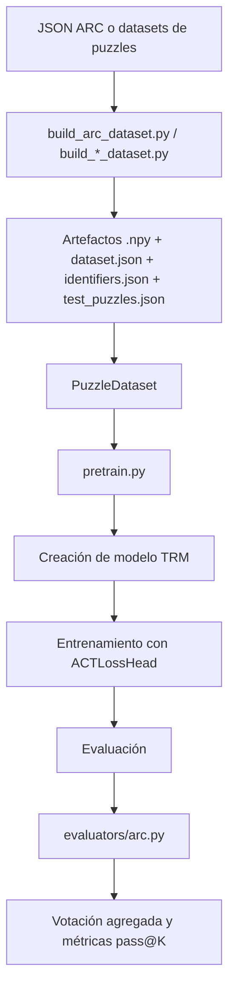
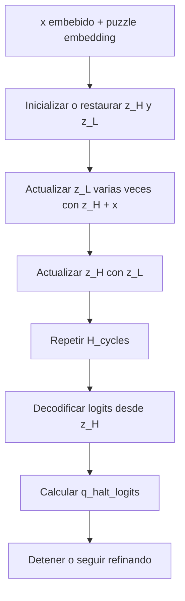

# Arquitectura y Flujo Completo de TinyRecursiveModels

## 1. Objetivo del documento

Este documento explica, de forma práctica y apoyada en el código del repositorio, cómo está construido el sistema `TinyRecursiveModels`, cuál es su flujo completo desde la preparación de datos hasta la inferencia, y por qué el modelo principal, `TRM` (Tiny Recursive Model), está diseñado de esta manera.

El foco principal está en `TRM`, porque es la arquitectura por defecto del repositorio y la que estructura tanto la configuración principal como los experimentos descritos en la documentación. Cuando aparece `HRM` (Hierarchical Reasoning Model) o variantes como `TRM-singlez`, se usan solo como contraste breve para entender mejor las decisiones de diseño.

## 2. Visión general del sistema

La idea central del proyecto es que para ciertos problemas de razonamiento estructurado no siempre hace falta un modelo enorme. En vez de aumentar el tamaño de la red de forma agresiva, `TRM` reutiliza una red pequeña varias veces sobre su propio estado interno para ir refinando una solución.

En términos simples:

1. El sistema recibe un problema discretizado como secuencia.
2. Convierte esa secuencia a embeddings.
3. Mantiene dos estados latentes, `z_H` y `z_L`.
4. Ejecuta varios ciclos recursivos para refinar esos estados.
5. Produce una predicción de salida.
6. Decide si ya debería detenerse o si necesita más pasos de refinamiento.

La apuesta de diseño es muy clara: sustituir anchura y profundidad estática por reutilización recursiva del mismo bloque de razonamiento.

## 3. Mapa de componentes del repositorio

Los archivos más importantes para entender el sistema son estos:

- `pretrain.py`: orquestación completa de entrenamiento y evaluación.
- `puzzle_dataset.py`: carga, mezcla y batchificación de datasets.
- `dataset/build_arc_dataset.py`: preparación de ARC y conversión a secuencias.
- `models/recursive_reasoning/trm.py`: implementación principal de TRM.
- `models/recursive_reasoning/hrm.py`: baseline HRM para comparación.
- `models/layers.py`: bloques base, atención, SwiGLU, RoPE y capas lineales.
- `models/losses.py`: pérdida principal y lógica de halting.
- `models/sparse_embedding.py`: embeddings dispersos de puzzle.
- `evaluators/arc.py`: reconstrucción de predicciones y métricas `pass@K`.
- `config/cfg_pretrain.yaml`: configuración global de entrenamiento.
- `config/arch/trm.yaml`: configuración arquitectónica base de TRM.

## 4. Flujo completo del sistema

### 4.1 Flujo general

### 4.2 Preparación de datos

La preparación de datos convierte puzzles de rejilla en secuencias discretas que el modelo puede procesar.

#### Qué hace `build_arc_dataset.py`

El script `dataset/build_arc_dataset.py` hace varias cosas importantes:

1. Lee los archivos JSON de ARC.
2. Inserta soluciones si existen archivos `*_solutions.json`.
3. Convierte cada grid a un array NumPy validado.
4. Aplica augmentations geométricas y de color.
5. Convierte cada ejemplo a una secuencia fija de tamaño `30 x 30 = 900` tokens.
6. Genera artefactos listos para entrenamiento y evaluación.

#### Representación de un grid

El espacio de entrada se normaliza a un grid máximo de `30x30`, definido por `ARCMaxGridSize = 30`.

Cada celda se codifica así:

- `0`: padding
- `1`: EOS estructural
- `2..11`: colores originales `0..9` de ARC desplazados en `+2`

Eso permite que cada input y cada output se conviertan en una secuencia plana de longitud 900, manteniendo una codificación uniforme.

#### Augmentations

El script genera augmentations con dos mecanismos principales:

- transformaciones del grupo diédrico
- permutaciones de color

Además, al convertir a secuencia puede introducir traslación aleatoria dentro del lienzo `30x30` en entrenamiento. La idea no es solo aumentar datos, sino obligar al modelo a aprender reglas más invariantes y menos atadas a posiciones absolutas.

#### Artefactos generados

Por split se generan arrays y metadatos:

- `inputs.npy`
- `labels.npy`
- `puzzle_identifiers.npy`
- `puzzle_indices.npy`
- `group_indices.npy`
- `dataset.json`

Y, a nivel del dataset, también:

- `identifiers.json`
- `test_puzzles.json`

Estos dos últimos son importantes en evaluación porque permiten volver desde un identificador interno a un puzzle concreto y recombinar predicciones de sus distintas augmentations.

### 4.3 Carga de datos y construcción de batches

`puzzle_dataset.py` implementa un `IterableDataset` con dos modos distintos:

- modo entrenamiento
- modo test

#### En entrenamiento

El dataset no recorre ejemplos sueltos de forma plana. En su lugar, organiza ejemplos por grupos y por puzzle. Esto tiene dos objetivos:

1. mantener afinidad entre ejemplos relacionados
2. muestrear batches completos de forma eficiente en un régimen distribuido

La función `_sample_batch()` va llenando el batch cogiendo grupos y puzzles hasta alcanzar `global_batch_size`.

#### En evaluación

En test, el dataset recorre los ejemplos secuencialmente y conserva la información necesaria para reconstruir qué predicción corresponde a qué puzzle y a qué input.

#### Padding y etiquetas ignoradas

Antes de convertir a tensor:

- las etiquetas de ignore se convierten a `IGNORE_LABEL_ID = -100`
- si un batch local no se llena, se paddea

Esto permite que la pérdida estándar de clasificación ignore posiciones no válidas sin introducir ruido en la señal de entrenamiento.

## 5. Arquitectura interna de TRM

### 5.1 Configuración base

La configuración base está en `config/arch/trm.yaml`:

- `hidden_size: 512`
- `num_heads: 8`
- `expansion: 4`
- `H_cycles: 3`
- `L_cycles: 6`
- `L_layers: 2`
- `forward_dtype: bfloat16`
- `puzzle_emb_len: 16`
- `halt_max_steps: 16`

Sin embargo, en los comandos del `README`, los experimentos de ARC y Maze sobrescriben `L_cycles` a `4`. Eso significa que hay que distinguir entre:

- arquitectura base del archivo YAML
- configuración concreta de ciertos experimentos del README

### 5.2 Estructura conceptual

TRM puede entenderse como una red pequeña que se aplica repetidamente sobre su propio estado.

Mantiene tres piezas activas durante el razonamiento:

- `x`: embeddings del input
- `z_L`: estado latente de razonamiento fino
- `z_H`: estado latente del que finalmente se decodifica la respuesta

La implementación está en `models/recursive_reasoning/trm.py`.

### 5.3 Entradas y embeddings

Dentro de `TinyRecursiveReasoningModel_ACTV1_Inner` se construyen estas partes:

1. `embed_tokens`: embedding de tokens del grid.
2. `puzzle_emb`: embedding disperso por identificador de puzzle.
3. `RotaryEmbedding`: codificación posicional RoPE cuando `pos_encodings = rope`.
4. `lm_head`: proyección final al vocabulario.
5. `q_head`: cabeza binaria para la decisión de halting.

#### Embedding de puzzle

`puzzle_emb` es una decisión importante. No se usa un embedding global denso entrenado como una tabla estándar con Adam sobre toda la matriz, sino una tabla dispersa actualizada por índices activos.

Esto permite que el sistema incorpore una señal específica del puzzle sin convertir esa tabla en el principal cuello de memoria o de optimización.

Además, `puzzle_emb_len = 16` hace que el embedding del puzzle no se inserte como un único token, sino como un bloque previo de longitud 16 en la secuencia embebida. Así, el modelo dispone de un prefijo aprendido asociado al puzzle.

### 5.4 Bloque base de razonamiento

Cada bloque `TinyRecursiveReasoningModel_ACTV1Block` contiene:

1. atención self-attention no causal, o alternativamente `mlp_t`
2. MLP tipo `SwiGLU`
3. residual + RMSNorm post-activación

La atención viene de `models/layers.py` y usa:

- `scaled_dot_product_attention`
- RoPE opcional
- proyecciones lineales casteadas al dtype del forward

La MLP usa `SwiGLU`, con una dimensión intermedia alineada a múltiplos de 256.

### 5.5 Módulo recursivo

`L_level` es el núcleo que se reutiliza una y otra vez. En TRM no hay un segundo módulo distinto para alto nivel, como sí ocurre en HRM. Se reutiliza el mismo tipo de módulo para actualizar tanto `z_L` como `z_H`.

Eso simplifica el diseño y reduce parámetros.

### 5.6 Carry y persistencia del estado

El modelo usa dos estructuras de estado:

- `TinyRecursiveReasoningModel_ACTV1InnerCarry`
- `TinyRecursiveReasoningModel_ACTV1Carry`

El carry guarda:

- `z_H`
- `z_L`
- número de pasos
- máscara de secuencias detenidas
- copia del batch actual

Esto permite que el sistema no trate cada paso de halting como una inferencia totalmente nueva, sino como un refinamiento sobre estado persistente.

### 5.7 Ciclo interno de razonamiento

En el forward interno, TRM hace esto:

1. construye `input_embeddings`
2. itera `H_cycles - 1` sin gradiente
3. ejecuta el último ciclo con gradiente
4. decodifica salida desde `z_H`
5. calcula logits de halting con `q_head`

La lógica exacta es:

- `z_L` se actualiza `L_cycles` veces usando `z_H + input_embeddings`
- luego `z_H` se actualiza usando `z_L`

El dato más importante aquí es que la mayor parte del razonamiento se hace dentro de `torch.no_grad()`, y solo la última ventana de refinamiento queda en el grafo de autograd.

## 6. Por qué TRM está diseñado así

### 6.1 Decisión: usar una red pequeña en vez de una mucho más grande

#### Implementación

TRM usa `hidden_size = 512`, `L_layers = 2` y reutiliza el mismo bloque varias veces.

#### Beneficio

- reduce el riesgo de sobreajuste en datasets pequeños
- mantiene el número de parámetros alrededor de 7M
- traslada parte de la capacidad desde el ancho hacia la reutilización iterativa

#### Trade-off

- el coste por muestra depende del número de ciclos
- el razonamiento es más secuencial que en una red profunda estática

### 6.2 Decisión: usar recursión explícita

#### Implementación

La red ejecuta varios ciclos `H_cycles x L_cycles` sobre el estado latente.

#### Beneficio

- permite refinar gradualmente la solución
- corrige respuestas parciales sin tener que regenerar toda la red
- da una forma eficiente de “pensar más tiempo” con casi los mismos parámetros

#### Trade-off

- aumenta el tiempo de inferencia por ejemplo
- complica algo la estimación del coste real por paso

### 6.3 Decisión: mantener dos estados latentes, `z_H` y `z_L`

#### Implementación

`z_L` actúa como estado de razonamiento intermedio y `z_H` como estado desde el que se decodifica la respuesta.

#### Beneficio

- separa el espacio de refinamiento del espacio de lectura final
- evita forzar al modelo a almacenar toda la respuesta y todo el proceso en un único estado

#### Trade-off

- duplica parte del estado activado frente a una variante single-state

La existencia de `trm_singlez.yaml` indica precisamente que esta decisión fue lo bastante relevante como para estudiarse como variante.

### 6.4 Decisión: no usar un módulo H distinto, como HRM

#### Implementación

TRM solo define `L_level` y lo reutiliza tanto para actualizar `z_L` como `z_H`.

#### Beneficio

- simplifica el modelo
- recorta parámetros
- reduce el número de hipótesis arquitectónicas innecesarias

#### Trade-off

- se pierde una separación arquitectónica explícita entre niveles “alto” y “bajo”

La lectura del código sugiere que la autora prefiere una explicación funcional y minimalista frente al diseño más cargado de supuestos de HRM.

### 6.5 Decisión: propagar gradientes solo por la última fase recursiva

#### Implementación

En `trm.py`, los primeros `H_cycles - 1` ciclos se ejecutan sin gradiente y solo el último pasa por autograd.

#### Beneficio

- reduce memoria
- limita el coste de backpropagation
- preserva la ventaja de tener muchos pasos de razonamiento sin pagar el precio completo de BPTT sobre todos ellos

#### Trade-off

- la señal de entrenamiento no atraviesa todos los refinamientos
- es una aproximación pragmática, no una reconstrucción exacta de todo el proceso recurrente

### 6.6 Decisión: usar halting adaptativo

#### Implementación

`q_head` produce logits binarios de parada. La pérdida la implementa `ACTLossHead` en `models/losses.py`.

#### Beneficio

- el modelo puede detenerse antes cuando ya resolvió el ejemplo
- evita gastar el máximo número de pasos en todos los casos

#### Trade-off

- añade otra cabeza y otra señal de entrenamiento
- en evaluación, el código fuerza batching homogéneo y usa `halt_max_steps` como tope efectivo

### 6.7 Decisión: usar embeddings dispersos de puzzle

#### Implementación

`models/sparse_embedding.py` implementa:

- `CastedSparseEmbedding`
- `CastedSparseEmbeddingSignSGD_Distributed`

#### Beneficio

- actualiza solo las filas usadas en el batch
- evita tratar una tabla muy grande como parámetro denso estándar
- reduce el coste de sincronización en entrenamiento distribuido

#### Trade-off

- la tabla sigue ocupando memoria completa en cada GPU
- su tamaño depende del número total de identificadores de puzzle

### 6.8 Decisión: usar `bfloat16` en forward

#### Implementación

El YAML de TRM fija `forward_dtype: bfloat16`.

#### Beneficio

- reduce memoria de activaciones
- aprovecha mejor GPUs modernas orientadas a entrenamiento tensorial
- mantiene más rango dinámico que `fp16`

#### Trade-off

- la velocidad real depende del hardware
- los parámetros siguen almacenándose en `float32` en esta implementación

### 6.9 Decisión: usar EMA

#### Implementación

`pretrain.py` permite activar `EMAHelper` con `ema=True`.

#### Beneficio

- estabiliza evaluación
- reduce degradaciones bruscas por oscilaciones de entrenamiento

#### Trade-off

- mantiene una copia suavizada adicional del modelo
- añade coste de memoria y de gestión al entrenamiento

## 7. Diferencia breve entre TRM y HRM

`HRM` existe en el repositorio y sirve como punto de referencia, pero el sistema está organizado para que `TRM` sea la opción principal.

### HRM

- usa dos módulos separados: `H_level` y `L_level`
- define una jerarquía explícita entre ambos
- en su configuración base usa `H_layers = 4` y `L_layers = 4`

### TRM

- elimina el segundo módulo diferenciado
- mantiene dos estados, pero reutiliza un único bloque
- baja a `L_layers = 2`
- conserva la idea de refinamiento iterativo, pero con menos complejidad estructural

En otras palabras, TRM no abandona la idea de razonamiento recursivo. Lo que hace es destilarla a una forma más compacta y más fácil de entrenar.

## 8. Flujo de entrenamiento

### 8.1 Entrada principal

El entrenamiento arranca en `pretrain.py` con Hydra:

- carga configuración desde `config/cfg_pretrain.yaml`
- permite sobrescritura por CLI
- sincroniza configuración entre procesos si se usa `torchrun`

### 8.2 Creación del modelo

La función `create_model()`:

1. mezcla la configuración arquitectónica con metadatos del dataset
2. instancia la clase del modelo mediante `load_model_class`
3. envuelve el modelo con la loss head indicada en el YAML
4. intenta compilar con `torch.compile()` si no está desactivado

### 8.3 Optimizadores

El entrenamiento puede usar dos optimizadores a la vez:

- `AdamATan2` para los parámetros normales del modelo
- `CastedSparseEmbeddingSignSGD_Distributed` para los embeddings dispersos de puzzle

Eso refleja una decisión muy concreta: separar el tratamiento de los pesos densos del tratamiento de una gran tabla dispersa indexada por puzzle.

### 8.4 TrainState

`TrainState` guarda:

- modelo
- optimizadores
- learning rates base
- carry
- paso actual
- total de pasos estimados

Este objeto centraliza el estado del entrenamiento para que el loop principal sea bastante limpio.

### 8.5 Bucle por batch

`train_batch()` hace lo siguiente:

1. mueve el batch a GPU
2. inicializa el carry si hace falta
3. ejecuta `model(carry, batch)`
4. escala la pérdida por `global_batch_size`
5. hace `backward()`
6. all-reduce de gradientes si hay entrenamiento distribuido
7. aplica optimizadores
8. reduce métricas

### 8.6 Scheduler

El learning rate se calcula con `cosine_schedule_with_warmup_lr_lambda()`:

- warmup inicial
- luego coseno con `lr_min_ratio`

Es un esquema estándar, sencillo y suficientemente robusto para este tipo de entrenamiento largo.

### 8.7 EMA y checkpoints

Si `ema=True`:

- se registra una copia EMA del modelo
- la evaluación se hace sobre la copia suavizada

Los checkpoints se guardan desde `save_train_state()` y también se copian el código fuente y la configuración efectiva del run para trazabilidad.

## 9. Flujo de inferencia y evaluación

### 9.1 Inferencia dentro de `evaluate()`

La evaluación en `pretrain.py`:

1. resetea evaluadores
2. crea un carry nuevo por batch
3. ejecuta el modelo repetidamente hasta que `all_finish` sea verdadero
4. guarda predicciones si el run lo pide
5. pasa el resultado al evaluador

Esto es importante: el modelo no se ejecuta una sola vez por batch, sino que puede consumir varios pasos de razonamiento antes de darse por finalizado.

### 9.2 Evaluador ARC

`evaluators/arc.py` realiza varias tareas clave:

1. recoge logits de halting y predicciones discretas
2. invierte augmentations para volver al espacio original del puzzle
3. recorta grids al contenido útil
4. hace hashing de entradas y salidas
5. agrega predicciones repetidas sobre el mismo puzzle
6. realiza votación
7. calcula métricas `pass@K`

La votación agregada es una decisión práctica fuerte: si varias augmentations del mismo problema convergen a una misma predicción, el sistema gana robustez en evaluación.

## 10. Configuraciones de experimento más importantes

### 10.1 Sudoku-Extreme

Según el `README`:

- 1 GPU `L40S` con 48 GB
- runtime aproximado: 18 a 20 horas
- variante destacada: `mlp_t=True`

### 10.2 Maze-Hard

Según el `README`:

- configuración principal: 4 `L40S`
- alternativa: 1 `L40S` reduciendo batch global a 128
- runtime: menos de 24 horas

### 10.3 ARC-AGI-1 y ARC-AGI-2

Según el `README`:

- 4 GPUs `H100`
- runtime aproximado: 3 días
- sobrescritura explícita: `H_cycles=3`, `L_cycles=4`, `L_layers=2`

Este detalle importa para los cálculos de coste, porque la estimación relevante para ARC debe hacerse con la configuración del comando del README, no solo con el YAML base.

## 11. Capacidad de cómputo usada: hardware pico

Esta sección distingue entre dos cosas distintas:

1. capacidad pico teórica del hardware utilizado
2. coste aproximado del modelo por paso

No son lo mismo. La primera está en TFLOPS o PFLOPS pico por segundo del hardware. La segunda es la cantidad de operaciones que una pasada del modelo necesita ejecutar.

### 11.1 GPUs documentadas en el repositorio

Del `README` salen tres escenarios principales:

| Escenario | Hardware | VRAM por GPU | VRAM total | Observación |
| --- | --- | ---: | ---: | --- |
| Sudoku-Extreme | 1x L40S | 48 GB | 48 GB | Run pequeño, una sola GPU |
| Maze-Hard | 4x L40S | 48 GB | 192 GB | Configuración principal |
| ARC-AGI-1 / ARC-AGI-2 | 4x H100 | no especificado en README | depende de variante | Se asume abajo una variante concreta |

### 11.2 Especificación pico de L40S

Según la página oficial de NVIDIA consultada para `L40S`:

- VRAM: `48 GB`
- FP32: `91.6 TFLOPS`
- TF32 Tensor Core: `366 TFLOPS` publicados con sparsity
- FP16 Tensor Core: `733 TFLOPS` publicados con sparsity
- FP8 Tensor Core: `1,466 TFLOPS` publicados con sparsity

Como TRM trabaja en precisión de 16 bits para el forward, la referencia más útil aquí es el tensor peak de 16 bits.

Si se usa la cifra publicada tal cual:

- `1x L40S`: `733 TFLOPS` pico FP16 tensor con sparsity
- `4x L40S`: `2,932 TFLOPS = 2.932 PFLOPS` pico agregado con sparsity

Si se quiere una lectura conservadora para cómputo denso, una aproximación razonable es dividir esas cifras entre dos:

- `1x L40S`: ~`366.5 TFLOPS` densos a 16 bits
- `4x L40S`: ~`1.466 PFLOPS` densos a 16 bits

### 11.3 Especificación pico de H100

El `README` no indica si las GPUs H100 usadas son `SXM 80GB` o `PCIe 94GB`. Para poder dar una cifra concreta, hace falta declarar un supuesto.

#### Supuesto principal usado en este documento

Se asume `H100 SXM 80GB`, que es una elección razonable para un escenario de entrenamiento de 4 GPUs.

Según la página oficial de NVIDIA consultada para `H100`:

- VRAM: `80 GB` por GPU en la variante SXM
- BF16 Tensor Core: `1,979 TFLOPS` publicados con sparsity
- FP16 Tensor Core: `1,979 TFLOPS` publicados con sparsity
- FP8 Tensor Core: `3,958 TFLOPS` publicados con sparsity

Por tanto:

- `4x H100 SXM 80GB`: `320 GB` de VRAM total
- pico BF16 agregado publicado: `7,916 TFLOPS = 7.916 PFLOPS`

Si se quiere aproximar el throughput denso a BF16 sin sparsity estructural:

- `4x H100 SXM 80GB`: ~`3,958 TFLOPS = 3.958 PFLOPS`

#### Variante alternativa si fueran H100 PCIe

La propia página también publica para `H100 PCIe`:

- VRAM: `94 GB` por GPU
- BF16 Tensor Core publicado: `1,671 TFLOPS` con sparsity

Entonces:

- `4x H100 PCIe`: `376 GB` de VRAM total
- pico BF16 agregado publicado: `6,684 TFLOPS = 6.684 PFLOPS`
- aproximación densa: ~`3.342 PFLOPS`

### 11.4 Resumen rápido de capacidad pico usada

| Escenario | Supuesto de precisión útil | Pico agregado publicado | Aproximación densa | VRAM total |
| --- | --- | ---: | ---: | ---: |
| 1x L40S | FP16 tensor | 733 TFLOPS | ~366.5 TFLOPS | 48 GB |
| 4x L40S | FP16 tensor | 2.932 PFLOPS | ~1.466 PFLOPS | 192 GB |
| 4x H100 SXM | BF16 tensor | 7.916 PFLOPS | ~3.958 PFLOPS | 320 GB |
| 4x H100 PCIe | BF16 tensor | 6.684 PFLOPS | ~3.342 PFLOPS | 376 GB |

## 12. Coste teórico aproximado del modelo

Aquí ya no hablamos del pico del hardware, sino de cuánto cómputo necesita TRM por muestra y por paso.

### 12.1 Supuestos para el cálculo

Para que la estimación sea útil y represente las corridas de ARC del `README`, uso estos valores:

- secuencia base ARC: `900`
- prefijo de puzzle: `16`
- longitud total: `N = 916`
- hidden size: `D = 512`
- heads: `8`
- expansión SwiGLU: `4`
- dimensión intermedia efectiva de SwiGLU: `1536`
- `L_layers = 2`
- `H_cycles = 3`
- `L_cycles = 4` en ARC, porque así aparece en los comandos del README
- batch global ARC: `768`
- batch local con `4 GPUs`: `192`

### 12.2 FLOPs aproximados por bloque

Un bloque TRM con atención + SwiGLU tiene, de forma aproximada:

$$
\text{FLOPs bloque} \approx 26ND^2 + 4N^2D
$$

Sustituyendo `N = 916` y `D = 512`:

$$
\text{FLOPs bloque} \approx 7.96 \text{ GFLOPs por muestra}
$$

Como `L_level` contiene `2` bloques:

$$
\text{FLOPs por llamada a } L\_level \approx 15.92 \text{ GFLOPs por muestra}
$$

### 12.3 FLOPs aproximados por forward interno en ARC

Con `H_cycles = 3` y `L_cycles = 4`, TRM llama a `L_level`:

$$
H\_cycles \times L\_cycles + H\_cycles = 3 \times 4 + 3 = 15
$$

Entonces el forward interno por muestra cuesta aproximadamente:

$$
15 \times 15.92 \approx 238.85 \text{ GFLOPs por muestra}
$$

Para el batch local de `192` muestras:

$$
238.85 \times 192 \approx 45.86 \text{ TFLOPs por forward y por GPU}
$$

Esto no es throughput por segundo; es volumen de cómputo por pasada hacia delante.

### 12.4 FLOPs aproximados por paso de entrenamiento

No todo el forward lleva gradiente. En la configuración ARC del README:

- bloques sin gradiente: `20`
- bloques con gradiente: `10`

Si aproximamos que una región con gradiente cuesta `forward + backward ≈ 3x` el coste de solo forward, obtenemos:

$$
\text{Coste entrenamiento por muestra} \approx 398.08 \text{ GFLOPs}
$$

Para batch local `192`:

$$
398.08 \times 192 \approx 76.43 \text{ TFLOPs por paso y por GPU}
$$

Para batch global `768`:

$$
398.08 \times 768 \approx 305.73 \text{ TFLOPs por paso global}
$$

### 12.5 Lectura práctica de estas cifras

Si se asumiera un techo ideal de `4x H100 SXM` con ~`3.958 PFLOPS` densos efectivos en BF16, el límite inferior puramente computacional para un paso global sería:

$$
305.73 / 3958 \approx 0.077 \text{ s por paso}
$$

Ese número no debe interpretarse como tiempo real esperado. Solo sirve para ubicar el orden de magnitud del coste frente al techo teórico del hardware. En la práctica, el tiempo real empeora por:

- movimiento de memoria
- sincronización distribuida
- kernels no perfectamente saturados
- overhead de PyTorch y del dataloader
- tablas dispersas y control de flujo del halting

## 13. Estimación de memoria del modelo

### 13.1 Parámetros entrenables principales

Aunque el `README` resume TRM como un modelo de unos `7M` parámetros, el número entrenable principal sale de una arquitectura muy compacta.

Una cuenta aproximada para la configuración base de TRM da:

- dos bloques TRM: ~`6.82M` parámetros
- embeddings y cabezas: ~`0.01M`
- total principal: ~`6.83M` parámetros

Eso encaja bien con el redondeo a `7M` del README.

### 13.2 Memoria de pesos y optimizador

En esta implementación los parámetros se almacenan en `float32`, aunque el forward se ejecute en `bfloat16`.

Entonces, para ~`6.83M` parámetros:

- pesos: ~`26 MB`
- gradientes: ~`26 MB`
- estados de Adam: ~`52 MB`

Total aproximado de la parte densa entrenable:

- ~`104 MB`

Esto deja claro algo importante: la memoria no la dominan los parámetros del backbone, sino el estado activado y la tabla de embeddings dispersos de puzzle.

### 13.3 Memoria de activaciones y carry

Para ARC con batch local `192`, longitud `916`, hidden `512` y `bfloat16`:

Un tensor latente de forma `[192, 916, 512]` ocupa aproximadamente:

$$
192 \times 916 \times 512 \times 2 \text{ bytes} \approx 171.8 \text{ MiB}
$$

Por tanto:

- `z_H`: ~`171.8 MiB`
- `z_L`: ~`171.8 MiB`
- input embeddings: ~`171.8 MiB`

Solo esas tres piezas ya suman alrededor de:

- ~`515 MiB`

Eso es un suelo, no el pico real, porque durante la parte con gradiente hacen falta también activaciones intermedias de atención, MLP y residuales.

### 13.4 Memoria de puzzle embeddings

La tabla de `puzzle_emb` no es un parámetro estándar, pero sí ocupa memoria real en GPU porque vive como buffer.

Su tamaño es:

$$
\text{num\_puzzle\_identifiers} \times 512 \times 4 \text{ bytes}
$$

En datasets ARC con `num_aug = 1000`, el número de identificadores puede acercarse al orden de un millón. Si se toma como ejemplo un total de ~`961k` identificadores:

$$
961000 \times 512 \times 4 \approx 1.83 \text{ GiB}
$$

Eso significa que la tabla de embeddings dispersos puede rondar por sí sola los `~2 GiB` por GPU, y además está replicada entre procesos, no fragmentada.

### 13.5 Lectura final de VRAM

Una estimación razonable por GPU en una corrida ARC grande es:

- ~`0.10 GiB` para pesos, grads y optimizador densos
- ~`1.8–2.0 GiB` para `puzzle_emb`
- ~`0.5 GiB` para carry e input embeddings base
- varios GiB adicionales para activaciones reales con gradiente, atención, buffers temporales y overhead de runtime

Por eso el uso de `H100` para ARC tiene sentido aunque el backbone sea pequeño: el cuello de memoria no está en los 7M parámetros, sino en el coste de activaciones, batch grande y tablas auxiliares.

## 14. Qué explica bien este diseño y qué no

### Lo que el diseño deja muy claro

- el proyecto prioriza razonamiento iterativo sobre tamaño bruto de modelo
- la arquitectura está optimizada para datasets pequeños y estructurados
- el halting y la recursión son piezas centrales, no añadidos cosméticos
- el uso de embeddings dispersos es una decisión deliberada para escalar el componente por puzzle

### Lo que conviene no sobrerinterpretar

- el cálculo de FLOPs de este documento es una estimación analítica, no un perfilador real
- la variante exacta de H100 no está especificada en el README
- la VRAM pico real depende de kernels, allocator, compilación, batch exacto y fragmentación

## 15. Resumen ejecutivo

`TinyRecursiveModels` está construido alrededor de una idea simple pero potente: reutilizar una red pequeña muchas veces para refinar una solución, en vez de entrenar una red mucho más grande para resolver todo en un solo paso.

Las decisiones clave del repositorio encajan con esa idea:

- secuencias discretas uniformes para representar puzzles
- embeddings específicos por puzzle
- dos estados latentes para separar razonamiento y lectura final
- un único bloque pequeño reutilizado recursivamente
- halting adaptativo para no gastar siempre el máximo número de pasos
- optimización separada para pesos densos y embeddings dispersos

Desde el punto de vista de hardware, el sistema usa GPUs potentes no porque el backbone sea enorme, sino porque el coste real aparece en la combinación de:

- batchs grandes
- activaciones largas (`916` tokens)
- múltiples ciclos recursivos
- tabla de embeddings de puzzle

Eso hace que TRM sea, a la vez, un modelo pequeño en parámetros y un sistema no trivial en coste operacional. Esa es precisamente una de las ideas más interesantes del diseño: reducir tamaño de red no elimina automáticamente la complejidad computacional, pero sí cambia dónde está esa complejidad y cómo se aprovecha.