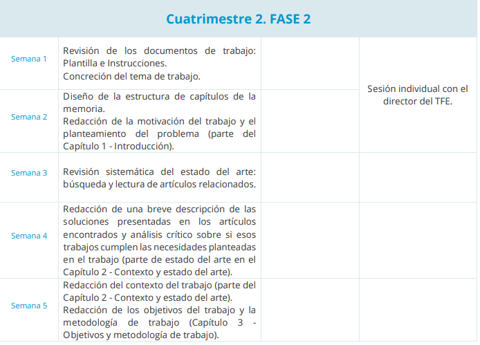

# Sessions

## Session 1

## Session 2

- Cómo lo vamos a vender -> punto de vista de eficiencia computacional TFLOPS FP16
- Qué se va a conseguir -> mejorar un modelo eficiente; CompressARC
  - Mejora x3 de tiempo de inferencia -> autocast a BF16 + torch.compile + Triton-ROCm
  - Explotar mejor las primitivas existentes
  - Nuevas primitivas mediante cambio ligero de la arquitectura
- Cómo se va a comparar -> graficas y metricas

- Duda sobre graficas grandes -> rotacion de hoja

---

- Entregar lo que pueda pre-deposito, intentarlo