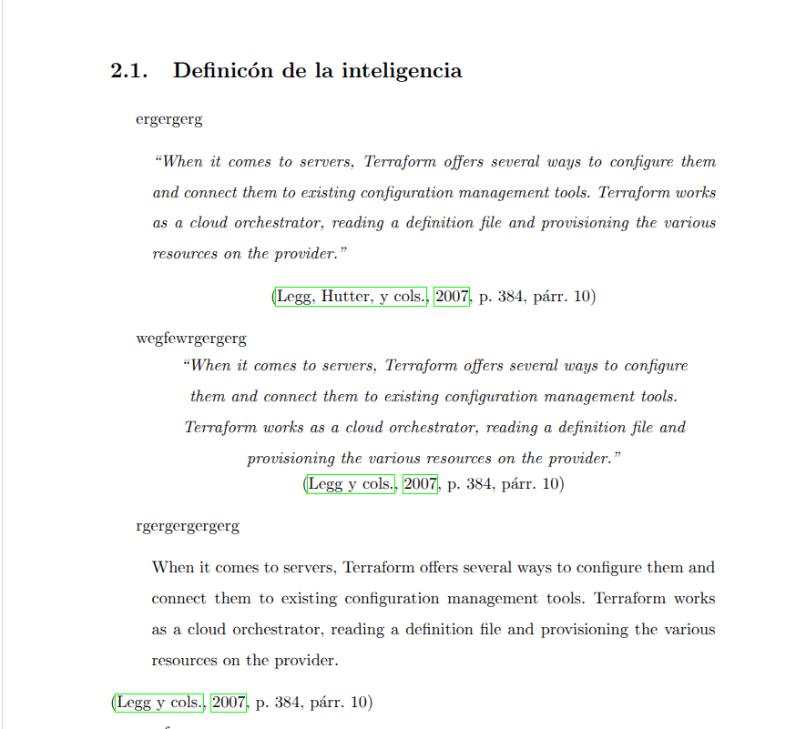

# Cita básica

```latex
% 1. Cita parentética
La inteligencia general sigue siendo difícil de medir \cite{chollet2019measure}.

% Resultado aproximado:
% (Chollet, 2019)

% 2. Cita narrativa
\citeA{chollet2019measure} propone una definición operativa de inteligencia.

% Resultado aproximado:
% Chollet (2019) propone una definición operativa de inteligencia.

% 3. Cita sin paréntesis
Según \citeNP{chollet2019measure}, la generalización debe evaluarse fuera del ajuste estadístico superficial.

% Resultado aproximado:
% Según Chollet, 2019, la generalización...

% 4. Solo autor
\citeauthor{spelke2007core} defienden la idea de conocimiento nuclear.

% Resultado aproximado:
% Spelke y Kinzler

% 5. Solo año
El concepto fue formalizado en \citeyear{spelke2007core}.

% Resultado aproximado:
% 2007

% 6. Autor + año separados
\citeauthor{vaswani2017attention} publicaron este trabajo en \citeyear{vaswani2017attention}.

% Resultado aproximado:
% Vaswani et al. publicaron este trabajo en 2017.

% 7. Varias referencias en una sola cita
Diversos trabajos han estudiado esta cuestión \cite{spelke2007core,chollet2019measure,vaswani2017attention}.

% Resultado aproximado:
% (Spelke & Kinzler, 2007; Chollet, 2019; Vaswani et al., 2017)

% 8. Cita con página concreta
La noción de "core knowledge" se introduce de forma explícita \cite[p.~89]{spelke2007core}.

% Resultado aproximado:
% (Spelke & Kinzler, 2007, p. 89)

% 9. Cita narrativa con página
\citeA[p.~89]{spelke2007core} introducen el concepto de conocimiento nuclear.

% Resultado aproximado:
% Spelke y Kinzler (2007, p. 89) introducen...

% 10. Cita textual corta
Como afirma \citeA[p.~89]{spelke2007core}, "core knowledge" constituye una base cognitiva temprana.

% 11. Cita textual al final de la frase
El razonamiento abstracto requiere medir la generalización más allá del entrenamiento previo
\cite[p.~2]{chollet2019measure}.
```

Si quieres una plantilla rápida para tu TFM, esta cubre casi todo lo habitual:

```latex
La evaluación de la inteligencia sigue abierta \cite{legg2007collection}.

\citeA{chollet2019measure} sostiene que la inteligencia debe medirse por la eficiencia de generalización.

La idea de conocimiento nuclear es relevante para ARC-AGI \cite{spelke2007core}.

Los transformadores cambiaron el campo \cite{vaswani2017attention}.

Diversos enfoques recientes estudian ARC-AGI desde perspectivas distintas
\cite{alford2021neurosymbolic,ainooson2023neurodiversity,chollet2024arc}.
```

Regla práctica:
1. Usa `\cite{...}` cuando la referencia vaya entre paréntesis.
2. Usa `\citeA{...}` cuando el autor forme parte de la frase.
3. Usa `\cite[p.~xx]{...}` cuando necesites página concreta.
4. Usa `\citeauthor{...}` y `\citeyear{...}` solo cuando quieras separar autor y año manualmente.

# Cita literal con más información

La forma más simple, con autor, año, página y párrafo, es esta:

## Cita más formal
```latex
\begin{quote}
\itshape
``When it comes to servers, Terraform offers several ways to configure them and
connect them to existing configuration management tools. Terraform works as a
cloud orchestrator, reading a definition file and provisioning the various
resources on the provider.''
\end{quote}

\begin{center}
\cite[p.~384, párr.~10]{carvalho2020terraform}
\end{center}
```

Si en tu `.bib` existe la clave `carvalho2020terraform`, eso generará algo del estilo:

```latex
(de Carvalho \& Patricia Favacho de Araujo, 2020, p. 384, párr. 10)
```

##  Deusto
Si quieres exactamente el efecto visual que has descrito, con el texto centrado y en cursiva, mejor usa este bloque:

```latex
\begin{center}
\begin{minipage}{0.8\textwidth}
\centering
\itshape
``When it comes to servers, Terraform offers several ways to configure them and
connect them to existing configuration management tools. Terraform works as a
cloud orchestrator, reading a definition file and provisioning the various
resources on the provider.''
\end{minipage}

\vspace{0.5em}
\cite[p.~384, párr.~10]{carvalho2020terraform}
\end{center}
```

## Manual
Si prefieres escribir la referencia final totalmente manual, sin depender del comando de cita para la parte visible, puedes hacerlo así:

```latex
\begin{center}
\begin{minipage}{0.8\textwidth}
\centering
\itshape
``When it comes to servers, Terraform offers several ways to configure them and
connect them to existing configuration management tools. Terraform works as a
cloud orchestrator, reading a definition file and provisioning the various
resources on the provider.''
\end{minipage}

\vspace{0.5em}
(de Carvalho \& Patricia Favacho de Araujo, 2020, p.~384, párr.~10)
\end{center}

\nocite{carvalho2020terraform}
```

Eso es útil cuando quieres controlar exactamente el texto mostrado. `\nocite{...}` hace que la obra siga apareciendo en la bibliografía aunque no uses `\cite{...}` de forma normal.

Dos detalles prácticos:
1. En LaTeX, las comillas tipográficas correctas son ` ``texto'' `, no `"texto"`.
2. Si la cita es larga y sigues APA estrictamente, lo más correcto sería bloque sangrado, sin comillas y sin centrado.

Versión APA más estándar:

```latex
\begin{quote}
When it comes to servers, Terraform offers several ways to configure them and
connect them to existing configuration management tools. Terraform works as a
cloud orchestrator, reading a definition file and provisioning the various
resources on the provider.
\end{quote}

\noindent \cite[p.~384, párr.~10]{carvalho2020terraform}
```

Si quieres, te puedo dar ahora la entrada `@article` o `@inproceedings` de `BibTeX` para ese ejemplo de Carvalho, o prepararte una plantilla completa para citas literales cortas y largas dentro de tu TFM.

