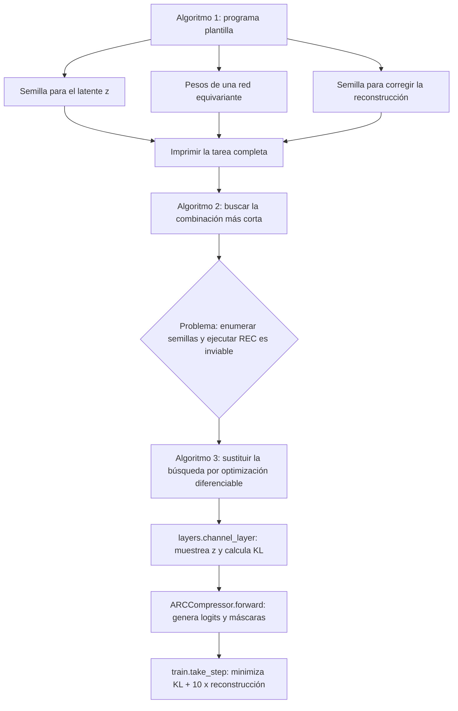
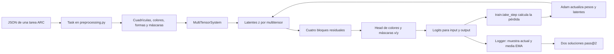
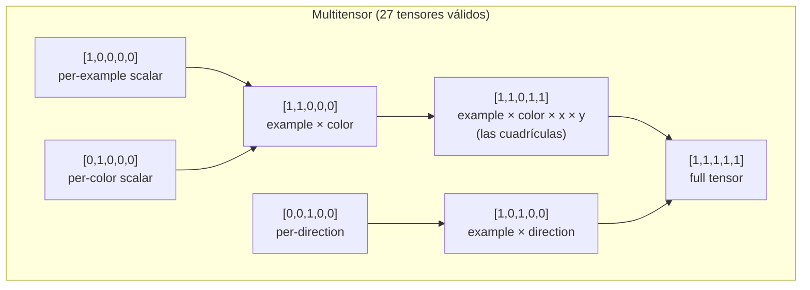
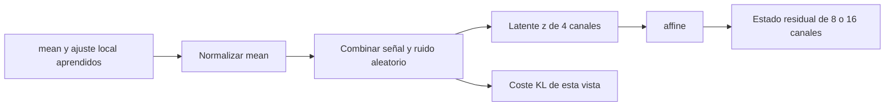
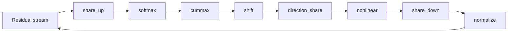
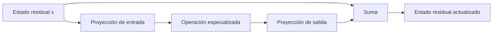
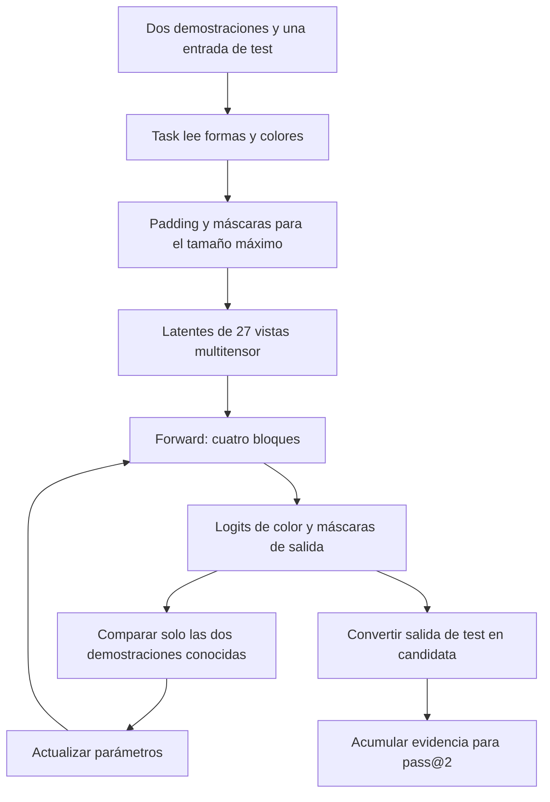
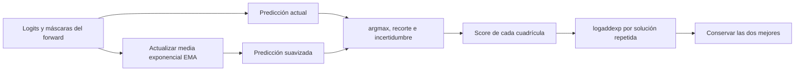

# CompressARC — Arquitectura, flujo y coste computacional

> Documentación técnica del repositorio [CompressARC](https://github.com/iliao2345/CompressARC), implementación de referencia del paper **"ARC-AGI Without Pretraining"** (Isaac Liao y Albert Gu, 2025).
>
> Este documento explica **por qué** el modelo está diseñado como está, **qué** hace cada componente, **cómo** fluye el sistema de principio a fin y **cuánto cómputo** consume (TFLOPS pico y VRAM pico).
>
> Todas las afirmaciones técnicas remiten a líneas concretas del código del repo: archivos como [arc_compressor.py](arc_compressor.py), [layers.py](layers.py), [multitensor_systems.py](multitensor_systems.py), etc.

---

## TL;DR

**CompressARC** es un decodificador **VAE** de **~76 000 parámetros** que se entrena **una vez por tarea** (sin pretraining, sin búsqueda externa) durante **2000 iteraciones** (~20 min en una NVIDIA RTX 4070) y resuelve el **20 %** del conjunto de evaluación y el **34,75 %** del conjunto de entrenamiento de **ARC-AGI-1** con métrica **pass@2**.

La idea central es **inteligencia = compresión** (principio MDL, *Minimum Description Length*): el modelo más corto que reconstruye los ejemplos de entrenamiento de una tarea es también el que mejor generaliza al ejemplo de test. CompressARC materializa esta idea con:

- Un **multitensor de 5 dimensiones** (`examples, colors, directions, x, y`) que separa explícitamente los tipos de información que aparecen en ARC.
- **Equivarianzas estructurales** *hardcoded* (a permutación de colores, a las 8 direcciones del grupo diédrico D₄ y al intercambio x↔y) que reducen la longitud de descripción.
- Un **decodificador VAE** cuya divergencia $\text{KL}$ mide directamente los *bits* del código latente.
- Un loop de capas: `share_up → softmax → cummax → shift → direction_share → nonlinear → share_down → normalize` ×4.
- Pérdida: $\mathcal{L} = \text{KL} + 10 \cdot \text{reconstruction\_error}$.
- Selección final pass@2 combinando la muestra actual y una media exponencial (EMA, decay=0.97).

---

## Tabla de contenidos

- [CompressARC — Arquitectura, flujo y coste computacional](#compressarc--arquitectura-flujo-y-coste-computacional)
  - [TL;DR](#tldr)
  - [Tabla de contenidos](#tabla-de-contenidos)
  - [1. Contexto: ARC-AGI y el problema de la inteligencia general](#1-contexto-arc-agi-y-el-problema-de-la-inteligencia-general)
  - [2. Principio fundamental: MDL ≡ inteligencia](#2-principio-fundamental-mdl--inteligencia)
    - [2.1 Vocabulario mínimo antes de empezar](#21-vocabulario-mínimo-antes-de-empezar)
    - [2.2 De un programa ideal a la aproximación que ejecuta CompressARC](#22-de-un-programa-ideal-a-la-aproximación-que-ejecuta-compressarc)
    - [2.3 Intuición de MDL: una regla corta vence a una lista larga](#23-intuición-de-mdl-una-regla-corta-vence-a-una-lista-larga)
    - [2.4 Qué aprende y qué no puede mirar el sistema](#24-qué-aprende-y-qué-no-puede-mirar-el-sistema)
  - [3. Decisiones de diseño justificadas](#3-decisiones-de-diseño-justificadas)
    - [3.1 ¿Por qué un modelo pequeño (~76 K parámetros)?](#31-por-qué-un-modelo-pequeño-76-k-parámetros)
    - [3.2 ¿Por qué un VAE y no un Transformer?](#32-por-qué-un-vae-y-no-un-transformer)
    - [3.3 ¿Por qué un multitensor en lugar de un solo tensor?](#33-por-qué-un-multitensor-en-lugar-de-un-solo-tensor)
    - [3.4 ¿Por qué 27 tensores y no 32?](#34-por-qué-27-tensores-y-no-32)
    - [3.5 ¿Por qué 8 direcciones?](#35-por-qué-8-direcciones)
    - [3.6 ¿Por qué scans direccionales (`cummax`, `shift`) y comunicación entre direcciones (`direction_share`)?](#36-por-qué-scans-direccionales-cummax-shift-y-comunicación-entre-direcciones-direction_share)
    - [3.7 ¿Por qué `symmetrize_xy` y `symmetrize_direction_sharing`?](#37-por-qué-symmetrize_xy-y-symmetrize_direction_sharing)
    - [3.8 ¿Por qué el coeficiente 10 entre KL y reconstrucción?](#38-por-qué-el-coeficiente-10-entre-kl-y-reconstrucción)
    - [3.9 ¿Por qué Adam con `lr=0.01` y `betas=(0.5, 0.9)`?](#39-por-qué-adam-con-lr001-y-betas05-09)
    - [3.10 ¿Por qué dos predicciones (pass@2) y por qué una de ellas es EMA?](#310-por-qué-dos-predicciones-pass2-y-por-qué-una-de-ellas-es-ema)
  - [4. Arquitectura completa del sistema](#4-arquitectura-completa-del-sistema)
    - [4.0 Mapa del sistema: de una tarea al conjunto de candidatos](#40-mapa-del-sistema-de-una-tarea-al-conjunto-de-candidatos)
    - [4.1 El multitensor — estructura de datos central](#41-el-multitensor--estructura-de-datos-central)
      - [4.1.1 Cómo leer una representación multitensor](#411-cómo-leer-una-representación-multitensor)
    - [4.2 Equivarianzas explícitas](#42-equivarianzas-explícitas)
      - [4.2.1 Qué significa que una regla sea equivariante](#421-qué-significa-que-una-regla-sea-equivariante)
    - [4.3 Capa de decodificación (VAE)](#43-capa-de-decodificación-vae)
      - [4.3.1 Del ruido al estado inicial de la red](#431-del-ruido-al-estado-inicial-de-la-red)
    - [4.4 Capas centrales — orden y propósito](#44-capas-centrales--orden-y-propósito)
      - [4.4.1 Una actualización residual, paso a paso](#441-una-actualización-residual-paso-a-paso)
    - [4.5 Cabezas lineales y postprocesamiento de máscaras](#45-cabezas-lineales-y-postprocesamiento-de-máscaras)
      - [4.5.1 De puntuaciones continuas a una cuadrícula discreta](#451-de-puntuaciones-continuas-a-una-cuadrícula-discreta)
  - [5. Flujo completo del sistema](#5-flujo-completo-del-sistema)
    - [5.0 Ejemplo guiado: seguir una tarea pequeña](#50-ejemplo-guiado-seguir-una-tarea-pequeña)
    - [5.1 Preprocesamiento](#51-preprocesamiento)
      - [5.1.1 Del JSON a los tensores y las máscaras](#511-del-json-a-los-tensores-y-las-máscaras)
    - [5.2 Entrenamiento por inferencia](#52-entrenamiento-por-inferencia)
      - [5.2.1 Una iteración de optimización, sin saltos](#521-una-iteración-de-optimización-sin-saltos)
    - [5.3 Postprocesamiento y selección pass@2](#53-postprocesamiento-y-selección-pass2)
      - [5.3.1 Por qué se acumulan candidatos en vez de usar el último](#531-por-qué-se-acumulan-candidatos-en-vez-de-usar-el-último)
    - [5.4 Entrenamiento paralelo a escala](#54-entrenamiento-paralelo-a-escala)
  - [6. Capacidad de cómputo](#6-capacidad-de-cómputo)
    - [6.1 Hardware de referencia (RTX 4070)](#61-hardware-de-referencia-rtx-4070)
    - [6.2 Recuento de parámetros](#62-recuento-de-parámetros)
    - [6.3 FLOPS pico por forward pass](#63-flops-pico-por-forward-pass)
    - [6.4 VRAM pico](#64-vram-pico)
    - [6.5 Tiempo total y eficiencia observada](#65-tiempo-total-y-eficiencia-observada)
  - [7. Limitaciones (abilities / disabilities)](#7-limitaciones-abilities--disabilities)
  - [8. Análisis profundo de limitaciones y vías de mejora arquitectónica](#8-análisis-profundo-de-limitaciones-y-vías-de-mejora-arquitectónica)
    - [8.1 Limitaciones del paradigma MDL aproximado](#81-limitaciones-del-paradigma-mdl-aproximado)
      - [8.1.1 Subespacio de programas restringido por la arquitectura](#811-subespacio-de-programas-restringido-por-la-arquitectura)
      - [8.1.2 Optimización local, no búsqueda combinatoria](#812-optimización-local-no-búsqueda-combinatoria)
      - [8.1.3 θ no se comprime — admisión explícita del paper](#813-θ-no-se-comprime--admisión-explícita-del-paper)
      - [8.1.4 El coeficiente β = 10 es puramente empírico](#814-el-coeficiente-β--10-es-puramente-empírico)
    - [8.2 Limitaciones estructurales del modelo neuronal](#82-limitaciones-estructurales-del-modelo-neuronal)
      - [8.2.1 Profundidad fija de 4 capas — contraste con ResNet](#821-profundidad-fija-de-4-capas--contraste-con-resnet)
      - [8.2.2 Ausencia de recurrencia y profundidad adaptativa](#822-ausencia-de-recurrencia-y-profundidad-adaptativa)
      - [8.2.3 Sin operación de copia/replicación de formas](#823-sin-operación-de-copiareplicación-de-formas)
      - [8.2.4 Posterior collapse y fragilidad estocástica](#824-posterior-collapse-y-fragilidad-estocástica)
      - [8.2.5 Tamaño del modelo limitado por la propia premisa MDL](#825-tamaño-del-modelo-limitado-por-la-propia-premisa-mdl)
    - [8.3 Limitaciones de representación e inductive biases](#83-limitaciones-de-representación-e-inductive-biases)
      - [8.3.1 El multitensor tiene exactamente 5 dimensiones — y sólo 5](#831-el-multitensor-tiene-exactamente-5-dimensiones--y-sólo-5)
      - [8.3.2 Equivarianza atada exactamente al grupo D₄](#832-equivarianza-atada-exactamente-al-grupo-d)
      - [8.3.3 Sin representación a nivel de objeto](#833-sin-representación-a-nivel-de-objeto)
      - [8.3.4 Sin primitivas simbólicas o discretas](#834-sin-primitivas-simbólicas-o-discretas)
      - [8.3.5 Sin memoria ni compresión conjunta entre puzzles](#835-sin-memoria-ni-compresión-conjunta-entre-puzzles)
    - [8.4 Limitaciones del flujo de entrenamiento por inferencia](#84-limitaciones-del-flujo-de-entrenamiento-por-inferencia)
      - [8.4.1 Número de iteraciones fijo (2000) e hiperparámetros estáticos](#841-número-de-iteraciones-fijo-2000-e-hiperparámetros-estáticos)
      - [8.4.2 Selección pass@2 con constantes mágicas](#842-selección-pass2-con-constantes-mágicas)
      - [8.4.3 Ausencia total de curriculum](#843-ausencia-total-de-curriculum)
      - [8.4.4 Coste computacional: 20 min/puzzle a 0,04 % del pico GPU](#844-coste-computacional-20-minpuzzle-a-004--del-pico-gpu)
    - [8.5 Marco de Chollet: ¿por qué el techo está en ~20 %?](#85-marco-de-chollet-por-qué-el-techo-está-en-20-)
    - [8.6 Síntesis: vías de mejora ordenadas por impacto esperado](#86-síntesis-vías-de-mejora-ordenadas-por-impacto-esperado)
  - [9. Marco teórico extendido de mejoras sobre hardware RX 9070 XT](#9-marco-teórico-extendido-de-mejoras-sobre-hardware-rx-9070-xt)
    - [9.1 Hardware objetivo: análisis comparado RTX 4070 → RX 9070 XT](#91-hardware-objetivo-análisis-comparado-rtx-4070--rx-9070-xt)
    - [9.2 Implicaciones del cambio CUDA → ROCm 7.2.3](#92-implicaciones-del-cambio-cuda--rocm-723)
    - [9.3 Eje A: expansión del scope del lenguaje de programas](#93-eje-a-expansión-del-scope-del-lenguaje-de-programas)
      - [9.3.1 Operador de copia/replicación basado en cross-attention](#931-operador-de-copiareplicación-basado-en-cross-attention)
      - [9.3.2 Slot attention para representación a nivel objeto](#932-slot-attention-para-representación-a-nivel-objeto)
      - [9.3.3 Primitivas simbólicas: cuantización y conteo](#933-primitivas-simbólicas-cuantización-y-conteo)
    - [9.4 Eje B: robustez y consistencia del flujo de optimización](#94-eje-b-robustez-y-consistencia-del-flujo-de-optimización)
      - [9.4.1 KL floor con free-bits scheduling](#941-kl-floor-con-free-bits-scheduling)
      - [9.4.2 Ensemble multi-semilla en paralelo (free pass@N → pass@2)](#942-ensemble-multi-semilla-en-paralelo-free-passn--pass2)
      - [9.4.3 Curriculum y active sampling sobre demonstration pairs](#943-curriculum-y-active-sampling-sobre-demonstration-pairs)
      - [9.4.4 Selección pass@2 aprendida en lugar de constantes mágicas](#944-selección-pass2-aprendida-en-lugar-de-constantes-mágicas)
    - [9.5 Eje C: compresión cross-puzzle (meta-aprendizaje MDL-compatible)](#95-eje-c-compresión-cross-puzzle-meta-aprendizaje-mdl-compatible)
    - [9.6 Eje D: eficiencia computacional y aprovechamiento del silicio](#96-eje-d-eficiencia-computacional-y-aprovechamiento-del-silicio)
      - [9.6.1 Mixed precision BF16/FP16 sobre AI Accelerators](#961-mixed-precision-bf16fp16-sobre-ai-accelerators)
      - [9.6.2 Fusión de kernels: torch.compile + Triton-ROCm](#962-fusión-de-kernels-torchcompile--triton-rocm)
      - [9.6.3 Paralelización extendida con 16 GB VRAM y 94 GB RAM](#963-paralelización-extendida-con-16-gb-vram-y-94-gb-ram)
    - [9.7 Eje E: profundidad adaptativa y razonamiento iterativo](#97-eje-e-profundidad-adaptativa-y-razonamiento-iterativo)
    - [9.8 Síntesis: presupuesto de cómputo, roadmap experimental y riesgos](#98-síntesis-presupuesto-de-cómputo-roadmap-experimental-y-riesgos)
    - [9.9 Eje F: interpretabilidad activa como mecanismo de control](#99-eje-f-interpretabilidad-activa-como-mecanismo-de-control)
    - [9.10 Eje G: compresión explícita de θ (MDL completo)](#910-eje-g-compresión-explícita-de-θ-mdl-completo)
    - [9.11 Eje H: eliminación del cuello de botella de CPU (dispatch, sincronización y sobre-concurrencia) — **PRIORIDAD 0**](#911-eje-h-eliminación-del-cuello-de-botella-de-cpu-dispatch-sincronización-y-sobre-concurrencia--prioridad-0)
      - [9.11.1 Diagnóstico: ¿por qué la CPU está al 100 %?](#9111-diagnóstico-por-qué-la-cpu-está-al-100-)
      - [9.11.2 Estrategia: optimizar el dispatch actual **antes** que reescribir a kernels nativos](#9112-estrategia-optimizar-el-dispatch-actual-antes-que-reescribir-a-kernels-nativos)
      - [9.11.3 Plan de acción ordenado por coste/beneficio (todo semánticamente neutro)](#9113-plan-de-acción-ordenado-por-costebeneficio-todo-semánticamente-neutro)
      - [9.11.4 Instrumentación de medición (contrato con el script de perfilado)](#9114-instrumentación-de-medición-contrato-con-el-script-de-perfilado)
  - [Glosario rápido](#glosario-rápido)
  - [10. Referencias](#10-referencias)
    - [Papers](#papers)
    - [Archivos del repositorio](#archivos-del-repositorio)
    - [Recursos externos](#recursos-externos)

---

## 1. Contexto: ARC-AGI y el problema de la inteligencia general

**ARC-AGI** (*Abstraction and Reasoning Corpus*, Chollet 2019) es un benchmark de razonamiento abstracto compuesto por tareas en las que se ven 2-7 pares de cuadrículas (input, output) y se debe **inferir la regla** que las relaciona para aplicarla a una cuadrícula de test. Cada cuadrícula es una matriz de hasta 30×30 píxeles con hasta 10 colores discretos.

Lo distintivo de ARC-AGI frente a otros benchmarks es que:

- **No hay un dataset masivo de entrenamiento que cubra patrones similares.** Las 400 tareas de evaluación son todas conceptualmente distintas de las 400 de entrenamiento.
- **No hay transferencia útil desde corpora textuales o de imágenes naturales.** Las "reglas" requieren razonamiento composicional, no reconocimiento de patrones aprendidos.
- La métrica oficial es **pass@2**: el sistema entrega dos predicciones por test, y acierta si alguna coincide píxel a píxel con la solución.

Esto convierte a ARC-AGI en un test directo de **inteligencia general**, entendida como la capacidad de adquirir habilidades nuevas con **muy pocos ejemplos y sin pretraining transferible** (Chollet, *On the Measure of Intelligence*, 2019).

CompressARC ataca el problema sin ningún preentrenamiento: **entrena un modelo nuevo desde cero por cada tarea**, usando sólo los 2-7 ejemplos provistos por la tarea misma.

---

## 2. Principio fundamental: MDL ≡ inteligencia

La hipótesis central del paper Liao & Gu (2025) es:

> *La capacidad de comprimir los datos observados es equivalente a la capacidad de generalizar a partir de ellos.*

Esta es la formulación clásica del **principio de Mínima Longitud de Descripción** (MDL). Concretamente: si un modelo logra describir los ejemplos de entrenamiento de una tarea con un código más corto que el código trivial (enumerar píxeles), entonces ese modelo ha **descubierto la estructura de la tarea**, y esa estructura debería extrapolar al ejemplo de test.

En CompressARC esto se materializa con un **decodificador VAE**:

- Un código latente $z \sim \mathcal{N}(\mu, \Sigma)$ se aprende para cada tarea.
- La **divergencia KL** del posterior aprendido respecto al prior $\mathcal{N}(0, I)$ mide los **bits** necesarios para transmitir $z$.
- La **cross-entropy** sobre los píxeles reconstruidos mide los bits necesarios para corregir errores de reconstrucción.
- Se minimiza:

$$\mathcal{L} = \underbrace{D_{\text{KL}}\big(\mathcal{N}(\mu,\Sigma) \,\|\, \mathcal{N}(0,I)\big)}_{\text{coste del código}} \;+\; 10 \cdot \underbrace{H(\text{logits}, \text{píxeles})}_{\text{coste de los errores}}$$

El factor 10 es un balanceo empírico (ver [train.py:120](train.py)). Minimizar esta cantidad equivale a buscar **la descripción más corta posible** de los ejemplos.

Generalización al test: como la cuadrícula de test se procesa por las mismas capas con los mismos pesos aprendidos durante el entrenamiento, la regla descubierta se aplica automáticamente.

### 2.1 Vocabulario mínimo antes de empezar

Esta sección introduce los términos necesarios para seguir el resto del documento.
No presupone experiencia previa con redes neuronales.

**Cuadrícula, píxel y color.** Una tarea ARC es una colección de dibujos muy
pequeños. Cada dibujo es una cuadrícula; cada casilla es un **píxel**; y cada
número es una etiqueta de color, no una cantidad que se pueda sumar. Por ejemplo:

```text
Entrada                  Salida observada
0 0 0                    0 0 0
0 2 0       regla        0 1 0
0 0 0       posible      0 0 0
```

Aquí `0`, `1` y `2` significan colores. Una explicación breve de los dos
ejemplos sería: "cambiar cada píxel de color 2 por color 1". El objetivo de
ARC no es recibir esa frase: es deducir una regla equivalente a partir de
varios pares entrada-salida y aplicarla a una entrada cuya salida está oculta.

**Ejemplo de demostración y ejemplo de test.** Una tarea contiene normalmente
entre dos y siete demostraciones completas y una o más entradas de test. Una
demostración incluye su entrada y su salida; el test incluye solo la entrada.
El programa debe producir la salida que falta. Por tanto, el test no es un
examen posterior a un entrenamiento con miles de tareas: forma parte de la
misma tarea, pero conserva su respuesta escondida.

**Tensor.** Un tensor es una tabla de números con uno o más ejes. Una lista es
un tensor de un eje; una matriz como la cuadrícula anterior es un tensor de dos
ejes: fila y columna. Si apilamos tres cuadrículas de $3 \times 3$, obtenemos
un tensor de forma `[3, 3, 3]`: `ejemplo × fila × columna`. La palabra
"forma" (*shape*) solo enumera cuántas posiciones tiene cada eje.

**Parámetro.** Un parámetro es un número que el programa puede ajustar. En una
red neuronal, muchos parámetros forman matrices de pesos. Al principio son
valores aleatorios; durante el entrenamiento cambian para que las predicciones
se parezcan más a las demostraciones. CompressARC crea parámetros nuevos para
cada tarea: no conserva los ajustados para resolver la tarea anterior.

**Entrenamiento e inferencia.** Entrenar significa ajustar parámetros usando
datos conocidos. Inferir significa producir una predicción con los parámetros
actuales. En este proyecto ambos ocurren dentro de la resolución de una única
tarea: se entrenan los parámetros con las demostraciones y, durante esas mismas
iteraciones, se generan predicciones para el test. Por ello se habla de
*aprendizaje durante la inferencia* (*test-time learning*).

**Probabilidad, logit y `argmax`.** En lugar de elegir directamente un color,
la red emite un **logit**, una puntuación para cada color posible. Si para un
píxel los logits fueran `[0.2, 3.1, -0.8]`, el color de índice `1` sería el
más probable. La operación `argmax` selecciona precisamente el índice de la
puntuación mayor. Los logits permiten entrenar el modelo de forma gradual antes
de convertirlos en colores discretos.

**VAE, latente y KL.** Un *variational autoencoder* (VAE) es un modelo que
genera datos a partir de un código interno aleatorio llamado **latente**. En
CompressARC, ese código se llama $z$. La cantidad **KL** mide cuánto debe
alejarse la distribución de $z$ del ruido normal de referencia para transportar
información específica de la tarea. Menor KL significa que se necesitó menos
información adicional. Las secciones siguientes explican por qué ese coste se
interpreta como longitud de descripción.

### 2.2 De un programa ideal a la aproximación que ejecuta CompressARC

El paper no empieza proponiendo una red neuronal. Empieza con una pregunta de
compresión: "¿cuál sería el programa autónomo más corto que imprime una tarea
ARC completa, incluida una salida de test que todavía no conocemos?". La idea
evoluciona en tres pasos.



1. **Algoritmo 1: una plantilla de programa.** El programa contiene una
   arquitectura fija, unos pesos y dos fuentes de aleatoriedad o *semillas*.
   La primera genera el código latente $z$. La segunda fuerza los pequeños
   errores que aún queden para que el programa imprima exactamente las
   cuadrículas conocidas. Si la regla de la tarea está bien capturada, ambas
   semillas necesitan pocos bits.
2. **Algoritmo 2: la búsqueda ideal.** En principio se podrían probar muchas
   semillas y pesos, medir la longitud total de cada programa y guardar el más
   corto. La técnica de *Relative Entropy Coding* (REC) justifica que el coste
   medio de modificar la primera semilla se relacione con KL. Sin embargo,
   realizar esa búsqueda y REC literalmente tiene un coste computacional
   impracticable.
3. **Algoritmo 3: CompressARC.** El código sustituye esa búsqueda discreta por
   descenso por gradiente. `layers.channel_layer` crea una muestra de $z$ y su
   coste KL; `ARCCompressor.forward()` transforma $z$ en predicciones; y
   `train.take_step()` ajusta los parámetros para reducir la suma de costes.
   No se ejecuta REC: se optimiza una aproximación diferenciable de la longitud
   que REC requeriría.

La red no "traduce" una regla escrita en lenguaje natural. Sus pesos y sus
latentes son una forma numérica de representar una explicación compacta que
permite reconstruir las demostraciones. El paper usa la metáfora de *code golf*:
resolver equivale a escribir el programa más corto que reproduce los datos.

### 2.3 Intuición de MDL: una regla corta vence a una lista larga

MDL significa *Minimum Description Length* o **longitud mínima de
descripción**. Su principio es sencillo: entre dos explicaciones que describen
correctamente los datos conocidos, se prefiere la que necesita menos
información para expresarse.

Volvamos al ejemplo anterior. Supongamos que hay cuatro demostraciones y en
todas el color `2` pasa a `1`, mientras que todo lo demás se conserva.

```text
Descripción A: memorizar las cuatro cuadrículas de salida
  "la salida 1 es ..., la salida 2 es ..., la salida 3 es ..."

Descripción B: guardar una regla
  "reemplazar 2 por 1; conservar el resto"
```

La descripción B es más corta y también puede aplicarse a una quinta cuadrícula
nunca vista. Esta es la intuición que conecta compresión y generalización: una
regla que elimina redundancia en las demostraciones tiene más posibilidades de
seguir funcionando cuando cambia la entrada de test.

CompressARC reparte el coste de describir una tarea en dos términos:

$$
\mathcal{L} =
\underbrace{D_{\mathrm{KL}}\big(q(z)\,\|\,\mathcal{N}(0,I)\big)}_{
  ext{información que debe llevar el latente}}
+ 10 \cdot
\underbrace{H(\text{logits}, \text{píxeles conocidos})}_{
  ext{información necesaria para corregir la reconstrucción}}
$$

- **KL:** compara el latente aprendido con ruido normal estándar. Si el modelo
  necesita alterar mucho ese ruido para codificar detalles de la tarea, el
  coste aumenta.
- **Reconstrucción o cross-entropy:** penaliza que el modelo asigne baja
  puntuación al color que realmente aparece en un píxel conocido. Si la red ya
  produce el color correcto con mucha probabilidad, hace falta poca información
  adicional para corregirlo.
- **Factor 10:** el código implementa `total_KL + 10 * reconstruction_error`.
  Es un equilibrio empírico: da prioridad suficiente a reconstruir las
  demostraciones sin eliminar la presión de compresión. No es una constante
  deducida directamente de MDL.

Esta pérdida es una aproximación útil, no una prueba de que se haya encontrado
la explicación más corta entre todos los programas imaginables. Solo busca la
explicación más corta dentro de la familia que puede expresar esta arquitectura
y dentro de la trayectoria que alcanza el optimizador.

### 2.4 Qué aprende y qué no puede mirar el sistema

Cada tarea produce un objeto `Task` independiente en
`preprocessing.py`. Sus pares de demostración incluyen entrada y salida; para
las entradas de test, `Task._create_problem_tensor()` deja sin rellenar el
canal de salida. En `train.take_step()`, el bucle omite explícitamente el modo
de salida de cada ejemplo de test al calcular la reconstrucción.

Por tanto, la optimización puede usar:

- las entradas y salidas de las demostraciones;
- las entradas de test, sus tamaños y los colores que contienen;
- las regularidades que la arquitectura ya incorpora, como desplazamientos y
  simetrías.

No puede usar la cuadrícula objetivo del test para reducir la pérdida. Esa
salida se genera como una consecuencia de haber comprimido las demostraciones
con una regla que también actúa sobre la entrada de test.

> **Lectura del flujo.** En las secciones 4 y 5 se seguirá exactamente este
> recorrido: convertir JSON en tensores y máscaras, generar un latente,
> transformarlo con cuatro bloques, medir la pérdida solo sobre datos visibles y
> seleccionar dos respuestas finales. Cada término técnico se introduce antes
> de usarse en detalle.

---

## 3. Decisiones de diseño justificadas

Esta es la sección **central** del documento. Cada decisión arquitectónica responde a un *porqué* concreto, casi siempre derivado del principio MDL o de la naturaleza de las tareas ARC.

### 3.1 ¿Por qué un modelo pequeño (~76 K parámetros)?

En MDL, **la longitud de descripción incluye el modelo**. Un modelo grande necesitaría que sus propios pesos fueran transmitidos como parte del código, inflando $\mathcal{L}$. Como CompressARC se entrena desde cero por tarea, el tamaño del modelo está acotado por: cuánto puedes "permitirte gastar" en pesos antes de que la regla a transmitir se vuelva más cara que enumerar píxeles. El número 76 K es el resultado empírico de ese equilibrio. Compárese con GPT-2 small (124 M) o con un transformer ARC-específico (>1 M): CompressARC es **1000–10000× más pequeño**.

### 3.2 ¿Por qué un VAE y no un Transformer?

Un Transformer normal **no mide bits directamente**: su loss (cross-entropy) sólo mide error de reconstrucción. Para implementar MDL hace falta un mecanismo explícito que mida **la longitud del código latente**. El VAE lo da gratis: la divergencia $\text{KL}$ es exactamente esa medida. Por eso CompressARC es un decodificador VAE, no un Transformer.

### 3.3 ¿Por qué un multitensor en lugar de un solo tensor?

Las tareas ARC mezclan información de naturalezas **muy distintas**: hay un eje de ejemplos (2-7 entradas/salidas), un eje de colores (hasta 10 categorías sin orden semántico), un eje de direcciones (relacionado con simetrías espaciales) y dos ejes espaciales (x e y). Tratar todo en un único tensor obligaría a la red a **redescubrir** que estos ejes son cualitativamente distintos. En cambio, un multitensor mantiene **27 tensores distintos**, uno por cada subconjunto de dimensiones, y permite que cada uno se procese localmente y se comunique con los demás de forma controlada (ver [§4.1](#41-el-multitensor--estructura-de-datos-central)).

### 3.4 ¿Por qué 27 tensores y no 32?

Las 5 dimensiones binarias dan $2^5 = 32$ combinaciones, pero hay dos reglas de validez en [multitensor_systems.py:35-50](multitensor_systems.py):

1. **Si x o y están activos, examples también debe estarlo.** Razón: un píxel sólo tiene sentido como parte de un ejemplo concreto; no hay un "píxel global".
2. **Al menos uno de [color, direction, x, y] debe estar activo.** Un tensor que sólo tuviera `examples` sería un escalar por ejemplo: no aporta información estructural.

Esto descarta 5 combinaciones (la combinación nula `[0,0,0,0,0]` más cuatro que violan la regla 1: `[0,0,0,1,0], [0,0,0,0,1], [0,0,0,1,1]` y la equivalente con examples=1 que falla otras reglas), dejando **27 tensores válidos**.

### 3.5 ¿Por qué 8 direcciones?

Las 8 direcciones (N, NE, E, SE, S, SO, O, NO) cubren el **grupo diédrico D₄** generado por rotaciones de 90° y reflejos. Las simetrías rotacionales y reflexivas son **ubicuas** en ARC (espejos, rotaciones, completar simetrías, propagación de patrones). Tener exactamente 8 direcciones permite implementar las equivarianzas correspondientes mediante *weight tying* (ver [§3.7](#37-por-qué-symmetrize_xy-y-symmetrize_direction_sharing)).

### 3.6 ¿Por qué scans direccionales (`cummax`, `shift`) y comunicación entre direcciones (`direction_share`)?

Muchísimas reglas en ARC son **propagaciones espaciales**: rellenar regiones desde un borde, extender líneas hasta colisionar con un obstáculo, copiar un patrón a lo largo de un eje. Estas operaciones son naturalmente **escaneadas** a lo largo de una dirección.

- `cummax` ([layers.py:436-460](layers.py)) implementa scans asociativos de máximo en las 4 direcciones cardinales y, para las diagonales, un scan recursivo en $\log(\min(x,y))$ pasos (idea de *blelloch scan*).
- `shift` ([layers.py:475-490](layers.py)) hace desplazamientos por un píxel en las 8 direcciones.
- `direction_share` ([layers.py:493-540](layers.py)) comunica información entre direcciones con coeficientes angulares fijos: $[1, 0.2, 0.4, 0.2, 1, 0.2, 0.4, 0.2]$, indexados por $(d_2 - d_1) \bmod 8$. Direcciones opuestas (offset 4) tienen coeficiente 1; ortogonales (offset 2, 6) tienen 0.4; vecinas (offset 1, 3, 5, 7) tienen 0.2. Esto es una **distancia angular suave** que refleja la geometría del grupo D₄.

### 3.7 ¿Por qué `symmetrize_xy` y `symmetrize_direction_sharing`?

Las tareas ARC son **invariantes** a la elección arbitraria del nombre "x" vs "y" (rotar 90° no cambia la regla) y a las reflexiones/rotaciones. Forzar esta invarianza en los pesos del modelo (en lugar de esperar que la red la aprenda) **reduce la longitud de descripción**: hay menos parámetros independientes que transmitir.

- `symmetrize_xy` ([initializers.py:100-104](initializers.py)) iguala los pesos del tensor `dims=[..,1,0]` y `dims=[..,0,1]` (intercambia las posiciones de x e y en cada `dims`).
- `symmetrize_direction_sharing` ([initializers.py:106-146](initializers.py)) restringe las 64 matrices del `direction_share` por capa al subespacio invariante bajo D₄ (rotaciones y reflejos del cuadrado).
- La cabeza de colores se simetriza también: `head_weights[0] = stack([w, w], dim=-1)` ([initializers.py:84-88](initializers.py)) hace que las dos salidas (input y output) compartan los pesos.

### 3.8 ¿Por qué el coeficiente 10 entre KL y reconstrucción?

Es un balanceo empírico (`loss = total_KL + 10 * reconstruction_error`, [train.py:120](train.py)). Sin este peso, el modelo *colapsa el posterior* (todo $\mu \to 0$) y deja de reconstruir. Con el peso 10, la reconstrucción tiene suficiente prioridad pero la compresión sigue presente. El valor 10 ha sido elegido por ensayo y error, no es un hiperparámetro especialmente sensible.

### 3.9 ¿Por qué Adam con `lr=0.01` y `betas=(0.5, 0.9)`?

- **`lr=0.01`**: alta, pero el entrenamiento es muy corto (2000 iteraciones) y empieza desde Xavier random, así que conviene un paso grande.
- **`β₁=0.5`** (en lugar del clásico 0.9): da menos peso al historial reciente y reacciona más rápido al gradiente actual. Como cada tarea es un dataset distinto y muy pequeño, el gradiente cambia mucho en los primeros pasos; un β₁ bajo lo absorbe mejor.
- **`β₂=0.9`** (en lugar del clásico 0.999): mismo razonamiento, el estimador de varianza se adapta más rápido.

Ver [train.py:135](train.py) y [solve_task.py:55](solve_task.py).

### 3.10 ¿Por qué dos predicciones (pass@2) y por qué una de ellas es EMA?

La métrica oficial de ARC-AGI permite **dos intentos** por test. CompressARC los usa así (ver [solution_selection.py:54-90](solution_selection.py)):

- **Candidato 1**: la **muestra actual** del VAE en la iteración $t$. Captura la mejor estimación instantánea pero es ruidosa (el VAE muestrea).
- **Candidato 2**: una **media exponencial** (EMA, decay=0.97) de los logits a lo largo del entrenamiento. Suaviza el ruido y suele converger a la moda del posterior.

Estas dos perspectivas suelen ser **complementarias**: cuando la red se aproxima a la solución pero aún oscila, la EMA captura el "centro" de las oscilaciones; cuando la red ya ha encontrado una respuesta determinista, la muestra y la EMA convergen al mismo punto. Las dos predicciones finales (`solution_most_frequent` y `solution_second_most_frequent`) se eligen agregando con `logaddexp` los scores de todas las iteraciones.

---

## 4. Arquitectura completa del sistema

### 4.0 Mapa del sistema: de una tarea al conjunto de candidatos

Antes de inspeccionar capas individuales, conviene situarlas dentro del
recorrido completo. Cada caja del diagrama representa una responsabilidad, no
un modelo distinto. `Task` prepara datos de una única tarea; `ARCCompressor`
construye una red nueva para ella; y `Logger` conserva las mejores respuestas
generadas durante su optimización.



| Parte | Estructura real | Responsabilidad sencilla |
| --- | --- | --- |
| Preparación | `preprocessing.Task` | Leer la tarea, uniformar tamaños y ocultar las salidas de test. |
| Representación | `MultiTensorSystem` | Mantener vistas de la tarea con distintos ejes relevantes. |
| Generación | `layers.decode_latents` | Convertir ruido y parámetros ajustables en un estado inicial. |
| Razonamiento geométrico | `ARCCompressor.forward` | Intercambiar y transformar información durante cuatro bloques. |
| Predicción | `head_weights`, `mask_weights` | Puntuar colores y decidir qué zona de la cuadrícula es válida. |
| Aprendizaje y elección | `train.take_step`, `Logger` | Actualizar parámetros y seleccionar dos soluciones robustas. |

Un detalle importante: el ciclo `J → E` no reutiliza el modelo de otra tarea.
Solo representa las 2 000 actualizaciones que refinan el mismo modelo mientras
resuelve una tarea concreta.

### 4.1 El multitensor — estructura de datos central

El `MultiTensorSystem` ([multitensor_systems.py:11-93](multitensor_systems.py)) define **5 dimensiones binarias** y mantiene un tensor independiente por cada combinación válida.

> **Nota sobre la documentación del paper**: el Apéndice C del paper Liao & Gu describe el multitensor con **4 dimensiones** (`examples, colors, x, y`) y **16 tensores** ($2^4$) como simplificación expositiva. La **implementación real** ([multitensor_systems.py:9](multitensor_systems.py), `NUM_DIMENSIONS = 5`) añade la dimensión `directions` → **5 dimensiones y 27 tensores válidos**. Este documento describe siempre el código real.

| Índice | Dimensión | Longitud típica | Significado |
|--------|-----------|-----------------|-------------|
| 0 | examples | 2–7 (`n_examples`) | Pares (input, output) de la tarea |
| 1 | colors | 1–10 (`n_colors`) | Colores presentes en la tarea (sin orden semántico) |
| 2 | directions | **8** (fijo) | N, NE, E, SE, S, SO, O, NO |
| 3 | x | ≤ 30 (`n_x`) | Altura del grid |
| 4 | y | ≤ 30 (`n_y`) | Anchura del grid |

A esto se añade implícitamente un **canal** (última dimensión) cuya anchura la define `channel_dim_fn` en [arc_compressor.py:30-31](arc_compressor.py):

```text
channel_dim = 8  si dims[2] == 1  (tensor con dirección)
channel_dim = 16 si dims[2] == 0  (tensor sin dirección)
```

Razón: los tensores con dirección ya tienen un factor 8× más de información por la propia dimensión `direction`, así que se compensa con menos canales.

**Reglas de validez** ([multitensor_systems.py:35-50](multitensor_systems.py)):

1. Si `dims[3] == 1` o `dims[4] == 1`, entonces `dims[0] == 1` (un píxel pertenece a un ejemplo).
2. `sum(dims[1:]) > 0` (al menos una dimensión informativa además de examples).

Esto da **27 tensores válidos** de los 32 posibles. El siguiente diagrama clasifica un subconjunto representativo:



**El decorador `@multify`** ([multitensor_systems.py](multitensor_systems.py)) toma una función `f(dims, x, ...)` que opera sobre un tensor individual y la promueve a una función que opera sobre **todo el multitensor**, aplicándola a cada uno de los 27 tensores válidos con el `dims` correspondiente. Esto permite que el código de las capas sea genérico.

#### 4.1.1 Cómo leer una representación multitensor

Un tensor no es más que una colección de valores organizada por ejes. El
multitensor es una colección de esas colecciones. Su propósito es evitar que
todo el conocimiento tenga que ocupar una cuadrícula completa cuando quizá solo
depende del color o de la posición de una fila.

Partamos de dos demostraciones, cada una con una cuadrícula de $3 \times 3$ y
dos colores no negros. Un tensor de cuadrícula podría tener la forma:

```text
[ejemplo, color, x, y, canal]
[2,       2,     3, 3, 16]
```

La lectura es: para cada una de las 2 demostraciones, para cada uno de los 2
colores, para cada una de las 9 posiciones y para cada uno de los 16 números de
representación interna, hay un valor. El último eje, **canal**, no es una nueva
coordenada del dibujo: contiene rasgos que la red aprende, como ocurre con las
capas de una imagen en visión por computador.

Pero una regla como "el color rojo pasa a azul" no necesita saber la posición
de cada píxel. Puede vivir en un tensor más pequeño:

```text
[ejemplo, color, canal]
[2,       2,     16]
```

Y una regla como "la fila central es especial" puede vivir en otro:

```text
[ejemplo, x, canal]
[2,       3, 16]
```

El multitensor guarda simultáneamente estas vistas y otras compatibles. Las
operaciones `share_up` y `share_down` permiten que un hallazgo pequeño, por
ejemplo una relación entre colores, se comunique con una vista grande que sí
incluye posiciones. No son 27 copias independientes de la cuadrícula: son 27
niveles de detalle para expresar regularidades con el menor espacio posible.

Las dos reglas de validez del código se entienden con ejemplos:

- `[0, 1, 0, 0, 0]` es válido: representa información que depende solo del
  color, como una tabla color → color.
- `[1, 0, 0, 1, 0]` es válido: representa una señal por fila dentro de cada
  ejemplo, por ejemplo la probabilidad de que una fila pertenezca a la salida.
- `[0, 0, 0, 1, 0]` es inválido: tendría filas sin indicar a qué ejemplo
  pertenecen.
- `[1, 0, 0, 0, 0]` es inválido: sería solo un número por ejemplo y no tiene
  ningún eje informativo adicional según `dims_valid`.

El Apéndice C del paper usa una explicación simplificada de cuatro ejes y 16
tensores. La implementación de este repositorio es la fuente de verdad para
el comportamiento real: añade `directions`, usa cinco ejes binarios y conserva
las 27 combinaciones que pasan `MultiTensorSystem.dims_valid()`.

### 4.2 Equivarianzas explícitas

CompressARC implementa **tres equivarianzas estructurales** mediante *weight tying* en la inicialización (ver [initializers.py:100-146](initializers.py)).

| Grupo de simetría | Mecanismo | Dónde se aplica |
|-------------------|-----------|-----------------|
| **Intercambio x ↔ y** | `symmetrize_xy` copia el peso de `dims=[…,1,0]` en `dims=[…,0,1]` y al revés | A todas las pilas de pesos (`share_up`, `share_down`, `softmax`, `cummax`, `shift`, `nonlinear`) en cada capa |
| **Grupo diédrico D₄ (8 direcciones)** | `symmetrize_direction_sharing` restringe las 64 matrices del `direction_share` al subespacio invariante bajo rotaciones de 90° y reflejos | A `direction_share_weights` en cada capa |
| **Permutación de colores** | La dimensión `colors` se trata como **anónima**: ningún peso depende del índice de color (la cabeza emite logits por color, pero el orden interno es irrelevante) | A toda la red (estructural, no por weight tying) |

Estas tres equivarianzas reducen drásticamente la longitud de descripción del modelo y, por tanto, su KL efectiva.

#### 4.2.1 Qué significa que una regla sea equivariante

Una **simetría** es una transformación que cambia la apariencia de una
cuadrícula sin cambiar la naturaleza de la regla. Girar un dibujo 90 grados o
intercambiar los nombres de dos colores son ejemplos habituales en ARC. Una
función es **equivariante** si transforma su resultado de la misma manera que
se transformó la entrada.

```text
Entrada original        Entrada girada       Salida esperada girada
0 2 0                   0 0 0                0 0 0
0 2 0      girar        2 2 2   regla        1 1 1
0 0 0                   0 0 0                0 0 0
```

Si la regla era "prolongar una línea hacia abajo", después de girar el dibujo
la misma regla geométrica debe prolongar una línea hacia la derecha. No se pide
que la salida sea idéntica a la original; se pide que gire de forma coherente.
Eso es equivarianza. La **invariancia**, en contraste, exigiría que el resultado
no cambiase tras la transformación, algo distinto.

CompressARC incorpora parte de este comportamiento sin tener que aprenderlo de
cero:

- `Initializer.symmetrize_xy()` comparte los pesos de las vistas que cambian
  los ejes `x` e `y`. Ayuda a que tratar filas y columnas tenga el mismo coste
  paramétrico.
- `Initializer.symmetrize_direction_sharing()` comparte los pesos de
  comunicación entre las ocho direcciones compatibles con rotaciones y
  reflexiones del cuadrado.
- La red opera sobre los colores como categorías anónimas: no recibe un peso
  reservado para "el color número 2" por el hecho de ser el número 2.

El propio comentario de `ARCCompressor.__init__()` advierte que simetrizar todas
las operaciones es difícil. Por tanto, esta arquitectura induce equivarianza
en componentes importantes, pero no debe interpretarse como una demostración
de equivarianza perfecta de punta a punta para toda transformación imaginable.

### 4.3 Capa de decodificación (VAE)

El primer paso del forward pass es **decodificar el latente $z$** desde un posterior aprendido. Esto se hace en `decode_latents` ([layers.py:125-156](layers.py)), que delega en `channel_layer` ([layers.py:58-123](layers.py)) por cada tensor del multitensor.

**Para cada uno de los 27 tensores válidos:**

1. Se aprende un `mean` (media del posterior, shape = shape del tensor + canal `decoding_dim=4`) y un `local_capacity_adjustment` (varianza local, misma shape). Iniciados a 0.01·randn y 0 respectivamente.
2. Se aprende también un escalar `target_capacity` (capacidad global del tensor, reparametrizado: el valor real es $e^{10 \cdot \text{target\_capacity}} \cdot 10000 + 0.5$).
3. Se modela el canal como **AWGN** (Additive White Gaussian Noise) con capacidad ajustable. Las fórmulas clave:

$$\text{output\_scaling} = 1 - e^{-2 \cdot C_{\text{global}} / D}$$
$$\sigma_{\text{noise}} = e^{-C_{\text{local}} / D}, \qquad \sigma_{\text{signal}}^2 = 1 - \sigma_{\text{noise}}^2$$

donde $D$ es la dimensionalidad del tensor.

4. Se muestrea $z = \sigma_{\text{signal}} \cdot \hat{\mu} + \sigma_{\text{noise}} \cdot \epsilon$ con $\epsilon \sim \mathcal{N}(0, I)$ y $\hat{\mu}$ es `mean` normalizado.
5. Se calcula la KL explícitamente (no se usa la fórmula de capacidad AWGN, porque la señal transmitida es $\hat{\mu}$ y no tendría la varianza correcta para esa fórmula):

$$\text{KL} = \tfrac{1}{2}(\sigma_{\text{noise}}^2 + \sigma_{\text{signal}}^2 \cdot \hat{\mu}^2 - 1) + \tfrac{C_{\text{local}}}{D}$$

6. Una capa `affine` proyecta $z$ del espacio latente (`decoding_dim=4`) al espacio del residual stream (`channel_dim_fn(dims)`).

**¿Por qué este esquema?** Porque permite que **cada tensor del multitensor decida cuánta información transmitir** (cuánta KL gastar), y dentro de cada tensor, **cada elemento decida si es "señal" o "ruido"** (mediante `local_capacity_adjustment`). El optimizador asignará automáticamente más capacidad a los tensores y elementos que ayuden a reducir la reconstrucción y dejará en ruido los irrelevantes. **Esta es la verdadera "compresión" del modelo.**

#### 4.3.1 Del ruido al estado inicial de la red

La palabra "decodificar" puede sugerir que existe un texto oculto que se
traduce, pero aquí significa otra cosa: convertir un código numérico aleatorio
en los primeros valores con los que trabajará la red. Para cada una de las 27
vistas del multitensor, `decode_latents()` hace el siguiente recorrido:



- **`mean`:** es una tabla de parámetros ajustables, con la forma de la vista
  correspondiente. Indica en qué dirección debe desviarse el código respecto
  al ruido genérico.
- **Ruido:** `torch.randn(...)` crea valores aleatorios normales. Mantener una
  parte de ruido evita que el código se convierta en una tabla de memoria sin
  coste.
- **Señal frente a ruido:** `local_capacity_adjustment` controla, posición a
  posición, cuánto pesa la señal aprendida frente al ruido. `target_capacity`
  controla una capacidad global para esa vista.
- **KL:** se calcula al mismo tiempo. Si una vista necesita transportar mucha
  señal específica, aporta más a la pérdida. Si no resulta útil, puede quedar
  cerca del ruido y aportar poco.
- **`affine`:** es una transformación lineal sobre el último eje. Convierte los
  4 canales del latente en los 8 o 16 canales que usa el flujo residual.

Una analogía útil es una emisora con ruido: `mean` es el mensaje que se quiere
emitir, `local_capacity_adjustment` decide la intensidad de cada parte de la
señal y KL factura cuánta información distinguible se ha transmitido. La red
posterior solo recibe la mezcla $z$; debe usar su estructura para reconstruir
las cuadrículas visibles y proponer las ocultas.

### 4.4 Capas centrales — orden y propósito

Tras la decodificación, el residual stream pasa por **`n_layers = 4`** bloques idénticos. Cada bloque ejecuta esta secuencia exacta ([arc_compressor.py:113-130](arc_compressor.py)):



Cada operación está envuelta por **`add_residual`** ([layers.py:38-56](layers.py)), un decorador que añade proyecciones de bajada (residual → espacio interno) y subida (espacio interno → residual) más una conexión residual al estilo ResNet (He et al. 2015).

**Detalle de cada capa:**

| Capa | Función | Propósito |
|------|---------|-----------|
| `share_up` ([layers.py:256-265](layers.py)) | Para cada tensor de `dims` "alto" suma todos los tensores con `dims` "menor o igual" (con broadcast) | Propaga información agregada hacia tensores más específicos |
| `softmax` ([layers.py:298-321](layers.py)) | Por cada subconjunto no vacío de ejes ∈ {color, dir, x, y}, aplica softmax y concatena. Salida tiene $2^k - 1$ canales donde $k$ = nº dims activos | Selección suave de qué eje "atender", al estilo *gating* |
| `cummax` ([layers.py:436-460](layers.py)) | Scan máximo en cada una de las 8 direcciones. Diagonales con scan asociativo recursivo en $\log(\min(x,y))$ pasos | Propagación direccional tipo "extender hasta colisionar" |
| `shift` ([layers.py:475-490](layers.py)) | Desplazamiento por 1 píxel en cada dirección | Comparación entre celdas vecinas |
| `direction_share` ([layers.py:493-540](layers.py)) | 64 matrices lineales acopladas con coeficientes angulares $[1, 0.2, 0.4, 0.2, 1, 0.2, 0.4, 0.2]$ | Comunicación entre direcciones respetando D₄ |
| `nonlinear` ([layers.py:542-555](layers.py)) | SiLU (Swish): $x \cdot \sigma(x)$ | No-linealidad estándar |
| `share_down` ([layers.py:267-281](layers.py)) | Inverso de `share_up`: cada tensor "bajo" recibe el promedio (o suma con máscara cuando in/out tienen la misma forma) de los tensores "más altos" | Agrega información hacia tensores resumen |
| `normalize` ([layers.py:14-25](layers.py)) | Normaliza a varianza 1 por canal | Estabilidad numérica entre capas |

Las capas direccionales (`cummax`, `shift`) sólo se aplican a tensores que contienen `direction + x + y` (con o sin `color`), gracias al decorador `only_do_for_certain_shapes((1,1,1,1,1), (1,0,1,1,1))`. Para el resto, son la identidad.

#### 4.4.1 Una actualización residual, paso a paso

Las operaciones de la tabla no sustituyen de golpe el estado de la red. Cada
una se envuelve mediante `add_residual()`, que mantiene una copia de la
representación anterior y suma una propuesta de cambio. Para una operación
genérica, la idea es:

```text
estado_nuevo = estado_anterior
             + proyectar_salida(
                 operación_especializada(
                   proyectar_entrada(estado_anterior)))
```

El código de `layers.add_residual` implementa exactamente esa suma final
`return x + z`. Las proyecciones `affine` cambian solo el eje de canales; no
mezclan arbitrariamente filas, columnas o ejemplos. La operación especializada
es la que aporta una capacidad concreta, como desplazar información o calcular
máximos acumulados.



Un ejemplo de intuición espacial ayuda a leer la secuencia completa. Supongamos
que una demostración contiene un punto rojo y la salida prolonga una línea desde
ese punto hasta un borde:

```text
Entrada                  Posible salida
0 0 0 0 0                0 0 0 0 0
0 0 2 0 0                0 0 2 0 0
0 0 0 0 0                0 0 2 0 0
0 0 0 0 0                0 0 2 0 0
```

- `share_up` puede llevar una señal resumida sobre el color o el ejemplo a una
  vista que incluye coordenadas de píxel.
- `softmax` transforma puntuaciones en comparaciones relativas a lo largo de
  ejes presentes, lo que permite seleccionar posiciones o colores de modo suave.
- `cummax` propaga un máximo siguiendo una dirección y es útil para detectar
  que ya apareció una señal antes en ese recorrido.
- `shift` pone a disposición de un píxel información de su vecino inmediato.
- `direction_share` intercambia información entre las ocho orientaciones, por
  ejemplo entre la dirección vertical y sus diagonales cercanas.
- `share_down` devuelve resúmenes de esas vistas espaciales a vistas más
  compactas; `normalize` mantiene escalas numéricas comparables.

Ninguna de estas operaciones codifica por sí sola "dibujar una línea". Los
pesos aprendidos deciden qué señales son relevantes y las cuatro repeticiones
componen operaciones elementales. Además, `cummax` y `shift` se limitan a las
dos formas que contienen dirección, `x` e `y`; en las demás vistas actúan como
identidad, tal como impone `only_do_for_certain_shapes`.

### 4.5 Cabezas lineales y postprocesamiento de máscaras

Tras los 4 bloques, el residual stream produce tres salidas ([arc_compressor.py:131-142](arc_compressor.py)):

1. **Cabeza de colores** (`head_weights`, simetrizada): toma el tensor `dims=[1,1,0,1,1]` (`example × color × x × y`) y lo proyecta a 2 logits por píxel (canal 0 = input, canal 1 = output). Salida shape: `[n_examples, n_colors, n_x, n_y, 2]`. Se le añade `100 * head_weights[1]` como bias fuerte: una manera de "centrar" la predicción de la entrada cerca de la entrada observada.

2. **Máscara x** (`mask_weights`): toma el tensor `dims=[1,0,0,1,0]` (`example × x`) y emite 2 logits por índice (input/output). Indica qué filas pertenecen al output.

3. **Máscara y** (análoga, dimensión y).

**`postprocess_mask`** ([layers.py:557-583](layers.py)) añade un sumando de $-1000$ a los índices más allá del máximo observado en `task.shapes`, garantizando que el modelo no prediga grids más grandes de lo permitido por la tarea.

#### 4.5.1 De puntuaciones continuas a una cuadrícula discreta

Después de los cuatro bloques todavía no existe una respuesta ARC, porque el
estado residual contiene números continuos. Las tres cabezas convierten esos
números en decisiones de salida:

1. La **cabeza de color** entrega una puntuación por color, por píxel y por
  modo (`input` u `output`). `train.take_step()` añade después una columna de
  logits cero para el negro, que se trata como color de fondo de referencia.
2. Las **máscaras `x` e `y`** entregan una puntuación por fila y columna. Sirven
  para recortar el área que el sistema considera perteneciente a la cuadrícula
  de salida si su tamaño no se conoce de antemano.
3. `postprocess_mask()` descarta de forma determinista índices imposibles. Una
  puntuación muy negativa, como `-1000`, hace que elegir esos índices sea
  prácticamente imposible.

Para un solo píxel, supongamos que la cabeza produce estos logits después de
añadir el negro:

```text
color real:       negro   rojo   azul
logit:              0.0    4.2   1.1
probabilidad:      baja    alta  muy baja
argmax:                    rojo
```

`argmax` transforma esa elección en el índice de color que ARC espera. Las
máscaras actúan de manera análoga sobre filas y columnas. Si la mejor región es
filas `0..2` y columnas `0..4`, el postprocesado conserva exactamente ese
rectángulo y descarta el padding usado internamente para que todas las
cuadrículas compartan un tamaño máximo.

---

## 5. Flujo completo del sistema

### 5.0 Ejemplo guiado: seguir una tarea pequeña

El siguiente caso es **sintético**: sirve para entender los datos y el flujo,
no para afirmar que una ejecución concreta de CompressARC siempre descubra esta
regla. Las dos demostraciones sugieren que cada píxel de color `2` debe pasar a
color `1`; los demás se conservan.

```text
Demostración 1             Demostración 1
entrada                    salida
0 2 0                      0 1 0
0 0 0                      0 0 0

Demostración 2             Demostración 2
entrada                    salida
2 0 2                      1 0 1
0 0 0                      0 0 0

Test
entrada                    salida que debe proponer el sistema
0 2 2                      ? ? ?
2 0 0                      ? ? ?
```

El camino de esta tarea por el sistema es el siguiente:



El paso clave está entre `F` y `G`: los logits de salida de las demostraciones
se comparan con sus colores correctos, pero los logits de salida del test no se
comparan con nada porque la respuesta no está disponible. Aun así, el forward
calcula ambos. El ajuste que ayuda a explicar las demostraciones modifica la
predicción producida para el test por los mismos pesos y latentes.

### 5.1 Preprocesamiento

Implementado en [preprocessing.py](preprocessing.py). La clase `Task` ([preprocessing.py:9-148](preprocessing.py)) absorbe el JSON crudo de ARC-AGI y produce:

- `n_train`, `n_test`, `n_examples` (sumando train+test).
- `shapes`: lista de `[in_shape, out_shape]` por ejemplo.
- **Predicción del tamaño de salida** ([preprocessing.py:44-67](preprocessing.py)), por cascada de heurísticas:
  1. Si `in_out_same_size` (todos los pares de entrenamiento tienen input.shape == output.shape) → out_shape = in_shape.
  2. Si no, pero `all_out_same_size` (todos los outputs de entrenamiento tienen igual shape) → usar esa shape.
  3. En último caso, asumir output = `[max_x, max_y]` global y dejar que la red **prediga** las máscaras x, y (esto activa la ruta `grid_size_uncertain` en el loss).
- `colors`: lista ordenada de colores únicos (forzando incluir el negro/0).
- `n_colors`: `len(colors) - 1` (se trata el negro como "fondo").
- `multitensor_system`: `MultiTensorSystem(n_examples, n_colors, n_x, n_y, self)` con `n_x = max(shape[i][0] ...)` y análogo para y.
- `problem`: tensor `[n_examples, n_x, n_y, 2]` con índices de color (canal 0 = input, canal 1 = output).
- `masks`: tensor `[n_examples, n_x, n_y, 2]` con 1 dentro del grid y 0 fuera.
- `solution_hash`: hash de la tupla del output ground-truth, usado para comprobar correctitud sin exponer la solución al modelo.

#### 5.1.1 Del JSON a los tensores y las máscaras

El archivo original de ARC es JSON y contiene listas anidadas de números. Una
lista puede tener un tamaño distinto de otra, pero una GPU necesita normalmente
tablas rectangulares. `Task` resuelve esta diferencia creando una cuadrícula de
tamaño máximo y usando **padding** y **máscaras** para señalar qué zona es real.

| Dato del JSON | Atributo de `Task` | Para qué se usa |
| --- | --- | --- |
| `train` y `test` | `n_train`, `n_test`, `n_examples` | Separar demostraciones completas de entradas con salida oculta. |
| Tamaño de cada entrada/salida | `shapes` | Inferir o limitar el tamaño de la salida. |
| Colores presentes | `colors`, `n_colors` | Convertir etiquetas ARC en índices internos; se incluye siempre `0` como negro. |
| Cuadrículas conocidas | `problem` | Calcular la reconstrucción de entradas y salidas de demostración. |
| Zona válida de cada grid | `masks` | Ignorar padding y restringir operaciones espaciales. |
| Solución de evaluación, cuando existe | `solution`, `solution_hash` | Medir resultados fuera de la pérdida del modelo. |

Para la tarea sintética anterior, el formato conceptual sería:

```text
shapes = [
  [[2, 3], [2, 3]],  # demostración 1: input y output
  [[2, 3], [2, 3]],  # demostración 2
  [[2, 3], [2, 3]],  # test: se predice la forma por la heurística
]

problem[ejemplo, x, y, modo]
modo 0 = input
modo 1 = output
```

En los dos primeros ejemplos, `problem[..., 1]` contiene el output conocido.
En el ejemplo de test, `_create_problem_tensor()` no rellena ese canal. Los
ceros que pudieran existir en el almacenamiento no representan una respuesta
conocida: la condición `if example_num >= task.n_train and in_out_mode == 1`
de `train.take_step()` evita que esa región contribuya a la pérdida.

La forma de la salida se determina antes de entrenar con una cascada sencilla:

1. Si todas las demostraciones conservan tamaño, la salida de test conserva el
  tamaño de su input.
2. Si todas las salidas de demostración tienen el mismo tamaño, se adopta ese
  tamaño para el test.
3. Si ninguna regla anterior aplica, se reserva el tamaño máximo observado y
  las máscaras `x` e `y` deben localizar el rectángulo de salida.

Esto no equivale a conocer la solución: solo evita pedir al modelo una forma
imposible o desperdiciar capacidad fuera de los límites observados.

### 5.2 Entrenamiento por inferencia

El loop está en `train.take_step` ([train.py:24-122](train.py)). Cada iteración:

1. `optimizer.zero_grad()`.
2. `model.forward()` produce `logits`, `x_mask`, `y_mask`, `KL_amounts`, `KL_names`.
3. Se añade una columna de ceros al canal de colores ([train.py:51](train.py)) para representar el color "negro" como logit 0 fijo.
4. **KL total**: suma de los 27 vectores de KL retornados por `decode_latents`.
5. **Reconstrucción**: para cada ejemplo y cada modo (input/output del par):
   - Si el grid size es incierto, aplica un coeficiente `0.01^max(0, 1-step/100)` al peso de la máscara durante los primeros 100 pasos (curriculum: que la red se enfoque en colores antes de pelearse con el tamaño).
   - **`mask_select_logprobs`** ([train.py:13-21](train.py)) trata el offset de la máscara como variable latente: para cada offset posible, calcula un log-probability proporcional al saldo de la máscara dentro/fuera. Luego `logsumexp` agrega.
   - Para cada par `(x_offset, y_offset)` válido, recorta el output del modelo a la subgrid, calcula `cross_entropy` contra el ground-truth y combina con los logprobs de máscaras.
   - `torch.logsumexp` agrega sobre todos los offsets → log-probabilidad marginal del output observado.
6. **Loss**:

$$\mathcal{L} = \text{total\_KL} + 10 \cdot \text{reconstruction\_error}$$

7. `loss.backward()`, `optimizer.step()`, `optimizer.zero_grad()`.
8. El `Logger` registra todas las métricas y postprocesa la solución (ver [§5.3](#53-postprocesamiento-y-selección-pass2)).

**Configuración:**

| Hiperparámetro | Valor | Archivo |
|----------------|-------|---------|
| Optimizador | Adam | [train.py:135](train.py), [solve_task.py:55](solve_task.py) |
| Learning rate | 0.01 | idem |
| `betas` | (0.5, 0.9) | idem |
| Iteraciones | 2000 | [train.py:140](train.py), [parallel_train.py:147](parallel_train.py) |
| Precisión | FP32 + TF32 matmul | [arc_compressor.py:10](arc_compressor.py), [parallel_train.py:39](parallel_train.py) |
| cuDNN benchmark | True | [parallel_train.py:38](parallel_train.py) |

#### 5.2.1 Una iteración de optimización, sin saltos

Una **iteración** es una oportunidad de corregir ligeramente los parámetros.
No es una demostración nueva ni una respuesta final. El bucle de
`train.take_step()` se puede leer así; el pseudocódigo conserva el orden del
archivo, aunque omite detalles de offsets y tensores para centrarse en el flujo.

```python
# Pseudocódigo didáctico de train.take_step(...)
optimizer.zero_grad()                     # olvida gradientes del paso anterior
logits, x_mask, y_mask, kls, names = model.forward()
logits = add_fixed_black_logit(logits)    # el negro tiene logit de referencia 0

total_kl = sum(each_kl.sum() for each_kl in kls)
reconstruction = 0

for example in all_examples:
    for mode in (input, output):
        if example_is_test and mode_is_output:
            continue                      # nunca mira la salida de test
        reconstruction += negative_log_probability_of_known_grid(
            logits, x_mask, y_mask, task.problem, task.shapes
        )

loss = total_kl + 10 * reconstruction
loss.backward()                           # calcula cómo cambiar cada parámetro
optimizer.step()                          # Adam aplica el cambio
logger.log(...)                           # registra candidatos, no gradientes
```

La pérdida une dos preguntas complementarias:

- **¿Cuánta información específica está usando el modelo?** La respuesta es
  `total_KL`, la suma de los costes procedentes de cada latente multitensor.
- **¿Qué tan bien reproduce los datos visibles?** La respuesta es
  `reconstruction_error`, que combina el color correcto y, si la forma es
  incierta, la probabilidad de elegir su recorte correcto.

Cuando la forma no puede inferirse por las heurísticas, el código considera
varios desplazamientos y tamaños posibles para el recorte. `mask_select_logprobs`
asigna una puntuación a cada candidato: favorece índices dentro de la máscara y
penaliza los que quedan fuera. `torch.logsumexp` agrega las posibilidades sin
elegir de forma brusca una sola al inicio del entrenamiento.

Durante los primeros 100 pasos, los términos de máscara reciben un coeficiente
menor si la forma es incierta. Esta pequeña secuencia de aprendizaje evita que
el modelo tenga que resolver color y tamaño con la misma intensidad desde el
primer gradiente. Después de `loss.backward()`, PyTorch calcula derivadas; Adam
usa esas derivadas y su historial para actualizar tanto los pesos de las capas
como los parámetros de los posteriores latentes.

### 5.3 Postprocesamiento y selección pass@2

Cada llamada a `Logger.log` ([solution_selection.py:40-91](solution_selection.py)) registra **dos candidatos**:

1. La predicción de la **muestra actual** (logits, máscaras tal cual salen del forward pass).
2. La predicción de la **EMA** de logits y máscaras (con `ema_decay = 0.97`).

Para cada candidato:

- Se extrae la solución con `_postprocess_solution`: argmax de logits dentro del recorte indicado por las máscaras + cálculo de `uncertainty` como `logsumexp - amax`.
- Se calcula un `score`:
  - Base: $-10 \cdot \text{uncertainty}$.
  - Penalización $-10$ si `train_step < 150` (no confiar en pasos tempranos).
  - Penalización $-4$ si el candidato es el de la EMA (preferir la muestra reciente cuando empatan).
- El score se acumula con `np.logaddexp` en `solution_hashes_count[hash]`: así una solución que aparece **muchas veces con bajo `uncertainty`** acumula mucho score.

Al terminar las 2000 iteraciones, las dos soluciones con mayor `solution_hashes_count` se asignan a `solution_most_frequent` (attempt_1) y `solution_second_most_frequent` (attempt_2) y se entregan en formato Kaggle.

#### 5.3.1 Por qué se acumulan candidatos en vez de usar el último

Un forward de CompressARC contiene ruido en sus latentes, de modo que una buena
predicción puede aparecer en un paso y empeorar en el siguiente. Elegir solo el
último resultado desperdiciaría esa evidencia temporal. `Logger` registra dos
candidatas en **cada** iteración:



La **media móvil exponencial** o EMA (*exponential moving average*) mezcla el
estado actual con el histórico:

$$
\operatorname{EMA}_t = 0.97 \cdot \operatorname{EMA}_{t-1}
+ 0.03 \cdot \operatorname{actual}_t
$$

El valor `0.97` está definido en `Logger.ema_decay`. Una EMA no es una tercera
red: es una versión suavizada de los logits y máscaras producidos por la misma
red a lo largo del tiempo.

Para transformar una candidata en una cuadrícula ARC, `_postprocess_solution()`
realiza tres operaciones: selecciona con `argmax` el color mejor puntuado por
píxel, usa las máscaras para elegir el mejor recorte y convierte los índices
internos de vuelta a los valores de `task.colors`. Calcula además una medida de
incertidumbre por píxel mediante `logsumexp(logits) - max(logits)`: una
diferencia pequeña indica que un color domina claramente; una grande indica que
varios colores compiten.

El score empieza como `-10 * uncertainty`. Se penalizan los primeros 150 pasos
y, cuando hay empate, la alternativa EMA. Finalmente `np.logaddexp` acumula el
score de una misma cuadrícula sin perder precisión numérica. Por eso una
respuesta que reaparece muchas veces con baja incertidumbre puede superar una
respuesta espectacular pero aislada. Al terminar, el sistema entrega las dos
cuadrículas distintas con mejor evidencia acumulada: esa es su estrategia para
la métrica oficial `pass@2`.

### 5.4 Entrenamiento paralelo a escala

[parallel_train.py](parallel_train.py) ejecuta CompressARC sobre las 400 tareas de un split saturando una o varias GPUs. Estrategia:

1. **Fase de medición** ([parallel_train.py:144-146](parallel_train.py)): ejecuta 2 iteraciones de cada tarea midiendo `torch.cuda.max_memory_allocated()` para conocer el footprint real de cada puzzle (varía con `n_x · n_y · n_examples`).
2. **Fase de saturación** ([parallel_train.py:148-152](parallel_train.py)): un scheduler greedy ordena las tareas por memoria decreciente y va lanzándolas en las GPUs disponibles, manteniendo el total por GPU por debajo de `gpu_memory_total - 4 GB` (reserva para el sistema).
3. Cada tarea corre en un **proceso separado** (`multiprocessing.spawn`) ejecutando `solve_task.solve_task` ([solve_task.py:28-86](solve_task.py)), que es esencialmente el mismo loop de entrenamiento pero con captura de soluciones y de VRAM en un `Manager.dict()` compartido.
4. Al final, las soluciones se escriben en `submission.json` para evaluación.

Optimizaciones globales habilitadas en `parallel_train.py`:

- `torch.backends.cuda.matmul.allow_tf32 = True` → usa **Tensor Cores en TF32** para los matmul.
- `torch.backends.cudnn.benchmark = True` → autotuning de kernels cuDNN.

---

## 6. Capacidad de cómputo

> **Advertencia metodológica.** Los números de esta sección son **estimaciones de orden de magnitud** derivadas de las dimensiones declaradas en el código y de los benchmarks oficiales del paper. Para medidas exactas en tu hardware, ejecuta:
>
> - `torch.cuda.max_memory_allocated()` (ya está integrado en [solve_task.py:51,75](solve_task.py)) para VRAM real.
> - `torch.profiler` o `torch.utils.flop_counter.FlopCounterMode` para FLOPS reales por forward pass.

### 6.1 Hardware de referencia (RTX 4070)

El paper y el [README.md](README.md) mencionan **NVIDIA GeForce RTX 4070** como GPU de referencia. Especificaciones:

| Métrica | Valor |
|---------|-------|
| Arquitectura | Ada Lovelace (AD104) |
| CUDA cores | 5 888 |
| Tensor Cores (4ª gen) | 184 |
| **FP32 pico (sin Tensor Cores)** | **~29 TFLOPS** |
| **TF32 pico (con Tensor Cores)** | **~58 TFLOPS** |
| FP16 / BF16 pico | ~117 TFLOPS |
| INT8 pico | ~234 TOPS |
| **VRAM** | **12 GB GDDR6X** |
| Memory bandwidth | 504 GB/s |
| TDP | 200 W |

Como CompressARC habilita explícitamente `torch.backends.cuda.matmul.allow_tf32 = True`, **el pico relevante es ~58 TFLOPS en TF32** para los matmul y ~29 TFLOPS en FP32 para el resto.

### 6.2 Recuento de parámetros

El paper Liao & Gu (2025) reporta **~76 000 parámetros entrenables**. El desglose aproximado, derivado de [arc_compressor.py](arc_compressor.py) e [initializers.py](initializers.py):

| Componente | Cantidad | Notas |
|------------|----------|-------|
| `multiposteriors` (mean + capacity por tensor) | dominante en bytes pero **no** en parámetros entrenables porque cada `mean` es de tamaño task-dependiente | crece con `n_examples · n_colors · n_x · n_y` |
| `target_capacities` | 27 escalares | uno por tensor |
| `decode_weights` (lineal 4 → channel) | ~27 × ~60 = 1 600 | |
| Por cada una de las 4 capas: `share_up`, `share_down`, `softmax`, `cummax`, `shift`, `nonlinear` (multiresidual, 27 tensores cada uno) | ~5 000–7 000 por capa | dependiendo de `channel_dim_fn` |
| Por cada capa: `direction_share` (64 matrices `channel × channel` × tensores con dirección) | ~10 000 por capa | la pieza más pesada por capa |
| `head_weights` + `mask_weights` | ~200 | |

La cifra "76 K parámetros" del paper se refiere a los **pesos del modelo per se** (excluyendo los `mean` y `local_capacity_adjustment` del posterior, que son specific a cada tarea y considerados "datos" más que "modelo"). Esto es coherente con la filosofía MDL: lo que se transmite como modelo son los pesos compartidos; el latente $z$ es el "código" de la tarea.

> Para un recuento exacto, abre una sesión Python y ejecuta:
> ```python
> import preprocessing, arc_compressor
> task = preprocessing.preprocess_tasks('training', [0])[0]
> model = arc_compressor.ARCCompressor(task)
> total = sum(w.numel() for w in model.weights_list)
> print(total)
> ```

### 6.3 FLOPS pico por forward pass

Para una tarea **típica** con `n_examples = 4`, `n_colors = 10`, `n_x = n_y = 30`, los tensores más grandes del multitensor (los que contienen `x` e `y`) tienen forma del orden de $4 \cdot 10 \cdot 30 \cdot 30 = 36\,000$ elementos por canal (y hasta 8× más para los que añaden `direction`). Las operaciones dominantes en FLOPS son:

| Operación | FLOPS aprox. por capa | Comentario |
|-----------|----------------------|------------|
| `affine` de las proyecciones down/up de cada `add_residual` | ~$10^8$ | matmul sobre tensor más grande |
| `direction_share`: 64 matrices `8×8` aplicadas a cada tensor con dirección | ~$5 \cdot 10^8$ | dominante |
| `softmax` (genera $2^k - 1$ canales) | ~$10^8$ | |
| `cummax` direccional (8 direcciones + scan log diagonal) | ~$10^8$ | |
| `shift`, `nonlinear`, `normalize` | ~$10^7$ cada una | |

**Estimación por capa**: ~$10^9$ FLOPS.
**Por forward pass (4 capas + decode + heads)**: ~$5 \cdot 10^9$ FLOPS ≈ **5 GFLOPS**.
**Por iteración (forward + backward ≈ 3×)**: ~**15 GFLOPS**.
**Por puzzle (2000 iteraciones)**: ~$3 \cdot 10^{13}$ FLOPS ≈ **30 TFLOPs totales por puzzle**.

**Contraste con el pico de hardware:**
- 20 min × 60 s × 58 TFLOPS pico = ~70 000 TFLOPs disponibles por GPU en 20 min.
- 30 TFLOPs usados ≈ **0,04 %** del pico teórico.

La utilización efectiva es bajísima — algo **completamente esperado** en modelos diminutos como este: el overhead de lanzar cientos de kernels CUDA pequeños por iteración (un kernel por tensor, por capa, por dirección) domina sobre el tiempo de cómputo puro. Si CompressARC se reescribiera con kernels fusionados (Triton, torch.compile agresivo) la utilización podría subir 10–100×, pero el modelo es lo suficientemente rápido como está.

### 6.4 VRAM pico

CompressARC mide su pico real en cada puzzle con `torch.cuda.max_memory_allocated()` ([solve_task.py:50, 80](solve_task.py)). Componentes principales:

| Componente | VRAM aprox. (tarea típica) | Notas |
|------------|----------------------------|-------|
| Pesos del modelo (76 K params × 4 bytes FP32) | ~0,3 MB | despreciable |
| Estados del optimizador Adam (2× pesos) | ~0,6 MB | despreciable |
| **Activaciones del forward pass** (multitensor, 27 tensores × 4 capas) | **~200–500 MB** | dominante; crece con `n_x · n_y · n_examples` |
| **Gradientes** (~igual que activaciones) | **~200–500 MB** | dominante |
| Buffer de muestras y EMA (`Logger`) | ~10 MB | |
| Overhead PyTorch/CUDA | ~200 MB | |

**Estimación de pico VRAM por tarea**: **~500 MB – 1 GB** (típica), con picos de **hasta 2 GB** para tareas con grids de 30×30 y `n_examples = 7`.

**En una RTX 4070 (12 GB) con `parallel_train.py`:**
- Margen reservado al sistema: 4 GB.
- VRAM aprovechable: 8 GB.
- Tareas concurrentes: típicamente **4–10**.

### 6.5 Tiempo total y eficiencia observada

| Métrica | Valor reportado | Fuente |
|---------|-----------------|--------|
| Tiempo por puzzle (secuencial, RTX 4070) | ~20 min (2000 iteraciones) | [README.md:27](README.md) |
| Tiempo total para el split de entrenamiento (400 puzzles) | ~130 h | paper y `results_for_the_blog_post/timing_result_training.txt` |
| Tiempo total para el split de evaluación (400 puzzles) | ~138 h | idem |
| Tiempo de pared con `parallel_train.py` (saturando 1 RTX 4070) | ~15–30 h | depende del solapamiento alcanzado |

**Throughput observado:** ~2 it/s por puzzle, ~1,7 it/s combinando varios puzzles en paralelo. La ganancia de la paralelización no es lineal porque las GPUs pequeñas como la 4070 saturan PCIe y memory bandwidth antes que cómputo.

---

## 7. Limitaciones (abilities / disabilities)

El paper Liao & Gu (2025) analiza cuidadosamente lo que el modelo **sabe** y **no sabe** hacer.

**Abilities (habilidades demostradas en los puzzles resueltos):**

- Completar patrones espaciales (extensión de líneas, propagación de colores).
- Llenar regiones cerradas.
- Detectar y completar simetrías (espejos, rotaciones).
- Agrupar, reagrupar y reordenar objetos.
- Aplicar transformaciones afines simples a regiones.
- Identificar el objeto "distinto" en una colección uniforme.

**Disabilities (incapacidades sistemáticas):**

- **Contar.** No hay bucle interno: no puede contar cuántas regiones hay ni cuántos píxeles de un color.
- **Reglas no espaciales.** Si la regla involucra aritmética, comparación numérica o lógica simbólica, falla.
- **Planificación a largo plazo.** Reglas con múltiples pasos secuenciales raramente se descubren.
- **Generalización fuera del marco geométrico.** Si la tarea requiere conceptos abstractos no codificados por el grupo D₄, no hay forma de que la red los aprenda con tan pocos parámetros y ejemplos.

**Costes prácticos:**

- ~20 min por puzzle es **alto** comparado con un LLM zero-shot (segundos). A cambio, CompressARC no requiere pretraining y obtiene mejor pass@2 en este benchmark concreto que la mayoría de soluciones zero-shot.
- El consumo energético es modesto: una RTX 4070 a 200 W × 20 min = ~0,07 kWh por puzzle.

---

## 8. Análisis profundo de limitaciones y vías de mejora arquitectónica

La sección 7 listó **qué** puzzles fallan (catálogo descriptivo). Esta sección 8 analiza **por qué** fallan: qué decisiones del paradigma MDL, qué primitivas ausentes en la arquitectura, qué propiedades del flujo de entrenamiento y qué huecos en los inductive biases impiden que CompressARC suba del ~20 % pass@2 en evaluación. Cada subsección referencia el código del repo, los apéndices del paper Liao & Gu (2025), y los marcos teóricos de Chollet (2019) y He et al. (2015).

> **Nota de honestidad**: muchas de estas limitaciones son admitidas explícitamente por los propios autores del paper en los **Apéndices K.1–K.4** (sección "How to Improve Our Work"). Cuando es así, lo indicamos para que el lector pueda contrastar con la fuente primaria.

### 8.1 Limitaciones del paradigma MDL aproximado

CompressARC reemplaza la búsqueda combinatoria sobre programas (intratable, ver Solomonoff 1964 / Hutter 2005) por una **optimización por gradiente** sobre un subespacio de programas parametrizado por una red neuronal. Esta sustitución es lo que hace al método tratable, pero también introduce errores sistemáticos:

#### 8.1.1 Subespacio de programas restringido por la arquitectura

El "lenguaje de programas" sobre el que se busca el más corto **no es Turing-completo**: es exactamente el conjunto de programas que la red de [arc_compressor.py](arc_compressor.py) puede expresar al variar sus pesos y su `z` latente. Cualquier solución que requiera primitivas no representables por las capas existentes (`share_up/down`, `softmax`, `cummax`, `shift`, `direction_share`, `nonlinear`) cae **fuera del rango de búsqueda**, por mucho que se baje la pérdida.

- Ejemplo: contar el número de objetos de un color requiere un bucle no-equivariante; no existe en el set de capas (paper, Apéndice H: *Counting/numbers* listado como disability).
- Ejemplo: simular un agente que se mueve por una cuadrícula con reglas (puzzle 2dd70a9a) requiere recurrencia en el tiempo, ausente en el grafo de cómputo estático.

Esto contradice parcialmente la intuición MDL: incluso si una solución más corta existiera en el espacio de programas Turing-completo, **CompressARC no puede encontrarla porque ni siquiera puede expresarla**.

#### 8.1.2 Optimización local, no búsqueda combinatoria

El paper introduce el método como aproximación a un *Naïve Code-Golfer* (Algoritmo 2 del paper) que enumeraría seeds y programas candidatos. CompressARC (Algoritmo 3) sustituye esa enumeración por Adam sobre `µ, Σ, θ`. Esto tiene tres consecuencias:

1. **Mínimos locales**: gradient descent puede converger a un programa subóptimo. No hay forma de "escapar" a uno mejor sin re-inicializar.
2. **Aleatoriedad de la semilla**: como se observa en el case study Color the Boxes (sección 5.2 de este documento), distintas seeds llevan a éxitos o fracasos. El paper reporta resultados de una run "afortunada" donde un tensor crítico se rescata a tiempo.
3. **No hay garantía de optimalidad MDL**: la longitud de descripción obtenida es un **upper bound suelto** sobre la Complejidad de Kolmogorov. Las pruebas teóricas de "compresión ≡ inteligencia" sólo se sostienen para la compresión óptima, no para esta aproximación.

#### 8.1.3 θ no se comprime — admisión explícita del paper

En la plantilla del Algoritmo 1 del paper, los pesos θ del modelo se hardcodean en el programa sin compresión. El propio paper en el **Apéndice K.4** lo califica de *"somewhat reckless"*:

> *"It is somewhat reckless for us to neglect compressing θ in our work due to the sheer number of bits θ contributes."*

Con 76 K parámetros en FP32, θ aporta ~300 KB de "longitud de programa" no contabilizada. Si se comprimiera (vía una KL adicional o L2 sobre θ derivado del MDL), el modelo sería forzado a usar pesos efectivos más pequeños, lo que podría mejorar la generalización por regularización implícita. **Sin esta compresión, el balance de la pérdida está sesgado**: penaliza KL en `z` (~10²–10³ nats por puzzle según Figura 6a del paper) pero ignora KL en θ.

#### 8.1.4 El coeficiente β = 10 es puramente empírico

En [train.py:106](train.py) la pérdida es `loss = total_KL + 10 * reconstruction_error`. El factor 10 no tiene justificación teórica: viene del régimen del β-VAE (Higgins et al. 2017), elegido porque sin él el posterior colapsa. Pero:

- Con β fijo, el balance KL ↔ reconstrucción es uniforme para todos los puzzles, cuando algunos puzzles necesitan más capacidad latente (mucha KL) y otros pueden expresarse con menos.
- Un β-scheduling adaptativo (estilo NVAE, ver Apéndice A.3 del paper) por puzzle o por iteración podría reducir la varianza entre runs.

### 8.2 Limitaciones estructurales del modelo neuronal

#### 8.2.1 Profundidad fija de 4 capas — contraste con ResNet

`n_layers = 4` está hardcodeado en [arc_compressor.py:19](arc_compressor.py). El paper original ResNet (He et al. 2015, Tabla 3 / Tabla 6) demuestra que **incrementar la profundidad reduce error de manera monótona** hasta cientos de capas, gracias precisamente al diseño residual que CompressARC también usa (vía `add_residual` en [layers.py:38-56](layers.py)). Concretamente:

| Modelo (ImageNet) | Capas | top-5 err. |
|-------------------|-------|------------|
| ResNet-34 | 34 | 7.4 % |
| ResNet-50 | 50 | 6.7 % |
| ResNet-152 | 152 | 5.7 % |

La elección de 4 capas no es por falta de capacidad técnica (el residual lo permite); es para **mantener la longitud de descripción del modelo baja** (cada capa añade pesos a θ). Pero como θ no se comprime (§8.1.3), esta restricción **no está justificada por el propio principio MDL** del trabajo.

Consecuencia práctica: ningún razonamiento que requiera más de ~4 pasos de cómputo secuencial es alcanzable. Los puzzles que necesitan iterar varias veces el mismo operador (ej. *flood-fill* profundo, conteo, extensión de patrón hasta el centro como en el puzzle 28e73c20) salen sistemáticamente mal (Apéndice H del paper).

#### 8.2.2 Ausencia de recurrencia y profundidad adaptativa

El forward pass de [arc_compressor.py:111-135](arc_compressor.py) ejecuta exactamente 4 bloques en cualquier puzzle, sin condición de parada ni iteración. No hay nada análogo a:

- *Adaptive Computation Time* (Graves 2016)
- *Universal Transformer* / *Hierarchical Reasoning Model* (HRM)
- Cualquier mecanismo que permita "pensar más" en puzzles complejos

Es revelador que el método **HRM** (Wang et al. 2025), que sí emplea iteración explícita, alcance **40,3 %** en evaluación frente al 20 % de CompressARC (Tabla 1 del paper). La diferencia entre ambos no es la arquitectura base, sino la presencia de un mecanismo de razonamiento iterativo.

#### 8.2.3 Sin operación de copia/replicación de formas

El **Apéndice K.2** del paper lo reconoce explícitamente:

> *"Many ARC-AGI-1 puzzles can be seen to involve copying shapes from one place to another, and our network has no inductive biases for such an operation."*

Los autores probaron `tropical convolution` (max-plus) sin éxito antes de descartar la idea. Consecuencia: cualquier puzzle que requiera traslación, rotación, reflexión, escalado o duplicación de un shape completo (puzzles 0e206a2e, 5ad4f10b, 2bcee788, Apéndice H del paper) se queda sin solución. Esto es probablemente la **mayor categoría de fallos resolubles con una sola mejora arquitectónica**.

#### 8.2.4 Posterior collapse y fragilidad estocástica

El **Apéndice K.3** documenta un fenómeno crítico: durante el entrenamiento, **14 de los 18 tensores** del multitensor `z` caen a KL ≈ 0 y **nunca se recuperan**, análogo al mode collapse de VAEs (van den Oord et al. 2018). Si uno de los 4 tensores supervivientes es el que iba a codificar información crítica, el puzzle queda sin solución y el método **no tiene mecanismo de rescate**.

Evidencia visible en este propio documento: Figura 6b en la sección 5.2.1 muestra cómo el tensor `[color, direction, channel]` "casi cae" antes de recuperarse — los autores admiten que mostraron una *"lucky run"*. Distintas runs producen resultados distintos en los mismos puzzles.

Implicación: el **20 % pass@2 reportado no es estable**. Una run alternativa con otra semilla puede solapar parcialmente con los puzzles resueltos, pero variará. La consistencia podría mejorarse con un *KL floor* con scheduling (propuesta del propio Apéndice K.3 del paper).

#### 8.2.5 Tamaño del modelo limitado por la propia premisa MDL

Los 76 K parámetros son una elección de equilibrio (sección 3.1 de este documento): más parámetros aumentarían la longitud del programa transmitido y violarían la filosofía MDL. Pero **es un equilibrio circular**: como θ no se comprime (§8.1.3), añadir más parámetros no penalizaría más la pérdida actual. Si los autores comprimieran θ correctamente, podrían escalar el modelo de manera principista.

### 8.3 Limitaciones de representación e inductive biases

#### 8.3.1 El multitensor tiene exactamente 5 dimensiones — y sólo 5

[multitensor_systems.py](multitensor_systems.py) define las dimensiones `examples, colors, directions, x, y`. Esta elección refleja un subconjunto de los **Core Knowledge priors** de Chollet (2019, §III.1.2), que enumera 4 sistemas innatos:

| Core Knowledge (Chollet 2019) | Materializado en CompressARC |
|-------------------------------|------------------------------|
| Objectness (cohesión, persistencia, contacto) | **Implícitamente** vía pixels + simetrías; no hay primitiva explícita de "objeto" |
| Agentness / goal-directedness | **Ausente**: no hay representación de agentes ni de objetivos |
| Numbers & counting | **Ausente**: las comparaciones son cualitativas, no aritméticas; no hay 1, 2, 3... |
| Elementary geometry & topology | **Parcial**: D₄ + 2D Euclídeo, pero no topología (connectedness, holes) |

Toda categoría de puzzles que dependa de uno de los priors no materializados es **estructuralmente inaccesible**: el modelo no tiene cómo representar el concepto.

#### 8.3.2 Equivarianza atada exactamente al grupo D₄

Las 8 direcciones (sección 3.5 de este documento) corresponden al grupo diédrico de simetrías del cuadrado: 4 rotaciones + 4 reflexiones. La equivarianza se impone por *weight tying* en [initializers.py:106-146](initializers.py) (`symmetrize_direction_sharing`). Esto **excluye** :

- Ángulos arbitrarios (rotaciones de 30°, 60°, etc.).
- Escalado / transformaciones afines (zoom in/out de un shape).
- Cualquier simetría no D₄ (ej. rotacional discreta de orden 3 o 5).

Si un puzzle requiere una de estas transformaciones, el modelo tiene que codificarla "rompiendo" la equivarianza vía `z`, lo cual consume muchos bits de KL y es difícil de optimizar.

#### 8.3.3 Sin representación a nivel de objeto

Todas las capas operan sobre **tensores densos** (píxel-a-píxel o tensor-completo). No existe un mecanismo para:

- Detectar componentes conexas como "objetos" y operar sobre cada uno.
- Mantener un slot por objeto con propiedades (color, posición, tamaño, vecinos).
- Comparar objetos entre sí (atención cruzada sobre objetos).

Chollet (2019, §III.1.2.a) coloca *object cohesion* como **el primer prior de Core Knowledge**. Su ausencia en CompressARC es probablemente la razón por la que tareas como "el objeto más grande", "el objeto distinto" o "agrupar objetos por forma" funcionan sólo cuando casi-cuadran con la representación pixelada (sección 5.1).

#### 8.3.4 Sin primitivas simbólicas o discretas

ARC tiene una naturaleza **categórica/simbólica** (los colores son etiquetas sin orden, los píxeles son discretos). CompressARC trabaja en variables continuas y usa softmax para aproximar discreto. Las consecuencias son:

- **Mapeos color → color** (puzzle 0d3d703e): requiere una tabla de lookup discreta; la red lo aprende mal porque el gradiente fluye mal por estas tablas.
- **Comparaciones exactas** ("¿son estos dos shapes idénticos?"): requiere igualdad estricta, no similitud continua.
- **Conteo exacto** (ce9e57f2): requiere variables enteras, no escalares.

Soluciones potenciales: VQ-VAE (van den Oord et al. 2018, ya citado en Apéndice A.3 del paper) podría introducir codebooks discretos.

#### 8.3.5 Sin memoria ni compresión conjunta entre puzzles

Cada puzzle entrena un modelo independiente desde cero. El **Apéndice K.1** del paper propone weight sharing entre puzzles (hypernetwork o LORA compartida), reconociendo que esto reduciría drásticamente la longitud total de descripción del dataset:

> *"We might be able to further shorten the template program length by sharing a single θ between all the puzzles, enhancing the compression and creating more correct puzzle solutions."*

Sin compresión cross-puzzle, CompressARC no puede aprovechar patrones recurrentes (ej. "muchos puzzles usan simetría central") que un humano detectaría tras ver decenas de ejemplos.

### 8.4 Limitaciones del flujo de entrenamiento por inferencia

#### 8.4.1 Número de iteraciones fijo (2000) e hiperparámetros estáticos

[train.py:140](train.py) y [parallel_train.py:147](parallel_train.py) fijan 2000 iteraciones. Las tablas 4 y 5 del paper muestran mejora monótona pero claramente asintótica. Algunos puzzles:

- Convergen a la respuesta correcta antes del paso 200 (ej. Bounding Box, paso 150 en este documento).
- Requerirían claramente más de 2000 pasos para que un tensor crítico se "rescate" del colapso.

Un **criterio de parada adaptativo** (basado en estabilidad de la muestra EMA o en la curva de KL) podría asignar más cómputo a puzzles difíciles y menos a fáciles, sin coste medio extra.

#### 8.4.2 Selección pass@2 con constantes mágicas

[solution_selection.py:54-90](solution_selection.py) implementa el scoring de los dos candidatos con constantes hardcodeadas:

```
score = -10 * uncertainty
if train_step < 150:  score -= 10
if logits is self.ema_logits:  score -= 4
```

Los valores −10, −10, −4 no tienen justificación teórica. Son hiperparámetros descubiertos empíricamente. Una mejora trivial: **aprender el peso EMA-vs-sample** o reemplazar el scoring por un clasificador entrenado sobre las soluciones generadas durante el training.

#### 8.4.3 Ausencia total de curriculum

Chollet (2019, §II.2.3) enfatiza que **el curriculum forma parte de la inteligencia**: el orden en que se presenta la experiencia condiciona la skill final. CompressARC presenta los 2-7 demonstration pairs **simultáneamente y sin orden** en cada paso de optimización. Posibles mejoras:

- *Easy-first*: ordenar los pairs por complejidad estimada (área del grid, número de colores), permitir que el modelo aprenda la regla simple primero.
- *Active learning*: muestrear los pairs con mayor pérdida más a menudo.

#### 8.4.4 Coste computacional: 20 min/puzzle a 0,04 % del pico GPU

Como detalla la sección 6.3 de este documento, CompressARC consume sólo **~30 TFLOPs por puzzle** sobre los ~70 000 TFLOPs disponibles en una RTX 4070 durante esos 20 minutos. La utilización efectiva es bajísima por el overhead de lanzar muchos kernels CUDA pequeños (uno por tensor del multitensor por capa por dirección). Implicaciones:

- **Búsqueda más exhaustiva podría ser gratis**: con kernels fusionados (Triton, `torch.compile` agresivo), el throughput podría subir 10–100×, permitiendo entrenar 10× más iteraciones en el mismo wall-clock.
- **Múltiples runs con distintas semillas** (ensembling) son baratos en términos de cómputo pico, pero costosos en wall-clock porque el ratio cómputo-útil/wall-clock es bajo. Optimizar la implementación desbloquea esta avenida.

### 8.5 Marco de Chollet: ¿por qué el techo está en ~20 %?

Chollet (2019, §II.2.1) define la inteligencia como:

$$\mathcal{I}_{IS, scope} \propto \mathbb{E}\left[\frac{\text{skill} \cdot \text{generalization\_difficulty}}{\text{priors} + \text{experience}}\right]$$

Aplicando este marco a CompressARC:

| Componente | Valor para CompressARC | Análisis |
|------------|-----------------------|----------|
| **Priors** | Muy fuertes (D₄, multitensor, capas direccionales, equivarianzas hardcoded) | Reducen drásticamente la "experiencia" necesaria, pero **restringen el scope alcanzable** |
| **Experience** | 2-7 demonstration pairs (muy bajo, alineado con Chollet) | Comparable a humanos |
| **Skill achieved** | 20 % eval / 34,75 % train | Limitada por priors faltantes |
| **Generalization difficulty** | Alta (puzzles novedosos, broad generalization) | El método sí se enfrenta a tareas con alto $GD$ |
| **Scope** | Sólo puzzles cuya hidden rule es expresable con priors actuales | Estimable empíricamente en ~20-35 % de ARC-AGI-1 |

**Conclusión del marco de Chollet**: CompressARC está cerca del techo de su **scope intrínseco** dado el set actual de priors. La ruta para subir del 20 % no es entrenar más o agrandar el modelo, sino **expandir el conjunto de priors** (más operaciones nativas: copia, conteo, recurrencia) o **permitir que los priors se aprendan** a partir de experiencia cross-puzzle (Apéndice K.1).

Esto sitúa a CompressARC en la categoría de Chollet de **"broad generalization"** (Chollet 2019, §I.3.2): adaptación a *unknown unknowns* dentro de un dominio acotado por priors. Para alcanzar **"extreme generalization"** habría que romper la dependencia en priors hardcoded, lo cual entra en conflicto directo con la filosofía MDL del paper (los priors son lo que permite que el modelo sea pequeño).

### 8.6 Síntesis: vías de mejora ordenadas por impacto esperado

La siguiente tabla cataloga las mejoras propuestas, su coste estimado de implementación, e impacto cualitativo esperado en pass@2. Las propuestas marcadas con (K.x) provienen del propio paper, Apéndices K.1–K.4.

| # | Limitación principal | Vía de mejora | Coste impl. | Impacto esperado | Justificación |
|---|---------------------|---------------|------------|------------------|---------------|
| 1 | Sin copia/replicación de shapes (§8.2.3) | Capa de cross-attention sobre grids o tropical conv refinada (K.2) | Alto | **Alto** | Apéndice H del paper: la mayor categoría única de disabilities (rotaciones, reflexiones, escalado, duplicación) |
| 2 | Sin compresión cross-puzzle (§8.3.5) | Hypernetwork / LORA compartida entre puzzles (K.1) | Alto | **Alto** | Aprovecha patrones recurrentes; mejora generalización por regularización implícita |
| 3 | Posterior collapse (§8.2.4) | KL floor con scheduling decreciente (K.3) | Bajo | Medio | Mejora consistencia entre runs; subiría la varianza-baja del 18,5 % al ~22-25 % |
| 4 | Profundidad fija (§8.2.1, §8.2.2) | Bloques residuales con depth adaptativa o ACT | Medio | Medio | HRM con iteración explícita alcanza 40,3 % vs 20 % de CompressARC |
| 5 | Sin primitivas de conteo (§8.3.4) | Layer dedicada: sum-along-dim + softmax-over-counts | Medio | Medio | Resolvería puzzles tipo ce9e57f2; estimable en +3-5 puntos |
| 6 | Sin representación de objetos (§8.3.3) | Slot attention sobre componentes conexas detectadas pre-red | Alto | **Alto** | Materializa el prior nº1 de Core Knowledge; abre toda la categoría "agrupar/seleccionar objetos" |
| 7 | θ no regularizado (§8.1.3) | Término L2 derivado de la KL sobre θ (K.4) | Bajo | Bajo-Medio | Reduce overfitting; permite escalar modelo de manera principista |
| 8 | Constantes mágicas en pass@2 (§8.4.2) | Clasificador entrenado para seleccionar candidatos | Bajo | Bajo | Mejora marginal, pero "fruta a baja altura" |
| 9 | Iteraciones fijas (§8.4.1) | Criterio de parada adaptativo (estabilidad EMA) | Bajo | Bajo | Reasigna cómputo; mismo total compute → más puzzles resueltos |
| 10 | 0,04 % de utilización GPU (§8.4.4) | Fusionar kernels con Triton / torch.compile | Medio | **Alto** indirecto | Desbloquea ×10–×100 más experimentos por unidad de tiempo |
| 11 | θ no contabilizado / equilibrio circular (§8.1.3, §8.2.5) | Compresión explícita de θ: cuantización + entropy coding o prior gaussiano-como-KL (Eje G, §9.10) | Bajo-Medio | Medio (habilitador) | Cierra el bucle MDL; **precondición** para escalar ejes A/E sin violar MDL; responde a la evidencia de la ablación F.5 |
| 12 | Colapso frágil e impredecible de tensores (§8.2.4) | Interpretabilidad activa: monitorización de KL por-tensor + PCA con intervención dirigida (Eje F, §9.9) | Bajo-Medio | Medio | Convierte el diagnóstico post-hoc del Apéndice I en control online; estabiliza y explica los fallos |

**Recomendación de priorización**: las mejoras #1 (copia de formas), #2 (compresión cross-puzzle) y #6 (slot-based object representation) son las que más probablemente cierran el gap del 20 % a algo cercano al 40 % alcanzado por HRM. Las mejoras #3 y #10 deberían hacerse primero por su bajo coste-alta-rentabilidad: la primera estabiliza resultados, la segunda multiplica la velocidad de iteración para todo lo demás.

> **Caveat transversal (Apéndice F.5)**: la ablación F.5 del paper muestra que **aumentar parámetros no mejora proporcionalmente, y a veces empeora**. Por ello la mejora #11 (compresión de θ) es *habilitadora* de las mejoras que añaden capacidad (#1, #6, #4): sin contabilizar θ no hay forma principiada de decidir cuánta capacidad nueva "paga" su coste MDL.

---

## 9. Marco teórico extendido de mejoras sobre hardware RX 9070 XT

La sección 8.6 enumeró diez vías de mejora con un veredicto cualitativo (Bajo/Medio/Alto). Esta sección 9 desarrolla cada vía como un **programa de investigación**: para cada una se justifica teóricamente la modificación arquitectónica, se relaciona con la literatura primaria, se cuantifica el coste sobre el hardware real disponible (**AMD Radeon RX 9070 XT, 16 GB GDDR6, ROCm 7.2.3, Linux 6.14, i9-12900K, 94 GB RAM**), y se identifican los riesgos y las dependencias con otras mejoras.

El objetivo no es prescribir código concreto (eso queda fuera del alcance de este documento), sino dejar un **marco teórico operativo** para diseñar experimentos en este equipo. La mayoría de las propuestas son ortogonales entre sí y pueden compararse vía A/B sobre el mismo split de entrenamiento; cuando no lo son, se indica la dependencia.

> **Restricción transversal**: cada propuesta debe respetar el principio MDL (sección 2). Cualquier mecanismo nuevo añade pesos a θ; si esos pesos no se compensan con una reducción mayor en KL(z) + reconstruction\_error, la mejora es **anti-MDL** y debería ser rechazada incluso si sube el pass@2 a corto plazo. Esta es la diferencia conceptual entre *mejorar CompressARC* y *abandonarlo por otra cosa*.

### 9.1 Hardware objetivo: análisis comparado RTX 4070 → RX 9070 XT

El baseline del paper (Liao & Gu 2025) usó una NVIDIA RTX 4070 (12 GB, Ada Lovelace, ~58 TFLOPS TF32). El hardware disponible es una AMD Radeon RX 9070 XT (Navi 48, RDNA 4) con perfil sensiblemente superior:

| Métrica relevante para CompressARC | RTX 4070 (baseline) | RX 9070 XT (objetivo) | Factor |
|------------------------------------|---------------------|------------------------|--------|
| VRAM | 12 GB GDDR6X | **16 GB GDDR6** | ×1,33 |
| Memory bandwidth | 504 GB/s | **640 GB/s** | ×1,27 |
| Cache on-die (L2 / Infinity Cache) | 36 MB L2 | **64 MB Infinity Cache** | ×1,78 |
| Stream / CUDA processors | 5 888 | 4 096 | ×0,70 |
| Compute Units / SM | 46 SM | 64 CU | ×1,39 |
| AI/Matrix accelerators | 184 Tensor Cores (4ª gen) | **128 AI Accelerators (RDNA4 Matrix)** | — |
| FP32 pico (sin matrix) | ~29 TFLOPS | **48,7 TFLOPS** | ×1,68 |
| FP16/BF16 vector | ~58 TFLOPS | 48,7 TFLOPS | ×0,84 |
| **FP16/BF16 matrix** | ~117 TFLOPS | **195 TFLOPS** | ×1,67 |
| FP16 matrix con sparsity 2:4 | ~234 TFLOPS | **389 TFLOPS** | ×1,66 |
| FP8 matrix | ~234 TFLOPS (Ada FP8) | **389 TFLOPS** | ×1,66 |
| INT8 matrix | ~234 TOPS | **389 TOPS** | ×1,66 |
| TDP | 200 W | 304 W | ×1,52 |
| RAM sistema (no GPU) | no documentado | **94 GB DDR5** | n/a |
| Núcleos CPU (i9-12900K) | n/a | **16 cores / 24 threads, 5,2 GHz** | n/a |

**Implicaciones cuantitativas para CompressARC:**

1. **Capacidad de paralelismo intra-GPU**: 16 GB / 0,7 GB promedio por puzzle = hasta **~22 puzzles concurrentes** en VRAM (frente a 8–10 en la 4070). Esto deja margen para ejecutar **múltiples semillas del mismo puzzle en paralelo** sin perder throughput agregado (§9.4.2).
2. **Compute pico FP32 × 1,68**: si el código se mantiene en FP32, el upper bound teórico de las 20 min/puzzle baja a ~12 min sin tocar el algoritmo.
3. **Compute pico FP16 matrix × 4,0 respecto a FP32 nativo de la 4070**: si se introduce mixed precision (§9.6.1), el upper bound colapsa a ~5 min/puzzle. Multiplicado por 22 puzzles concurrentes ⇒ throughput agregado **~50–80× mayor** que el baseline.
4. **Infinity Cache de 64 MB** es especialmente relevante: los tensores del multitensor (típicamente <1 MB cada uno) **caben dentro de la caché** durante el forward pass de cada capa. Esto reduce el coste real por debajo de lo que predice el bandwidth nominal.
5. **94 GB RAM** habilita esquemas que el baseline no contempló: pre-procesar todos los puzzles en CPU mientras la GPU entrena, mantener un caché de soluciones EMA históricas a lo largo de las 2000 iter, o servir múltiples experimentos concurrentes desde un único worker pool.
6. **16 cores / 24 threads CPU** permite que los DataLoaders y la lógica de scheduling (`parallel_train.py`) no sean cuello de botella; la 4070 con un CPU menos potente sí podía estarlo.

**Conclusión**: el hardware no introduce limitaciones nuevas frente al baseline; al contrario, **abre un orden de magnitud de presupuesto de cómputo** para experimentos que en la 4070 hubieran sido inviables (especialmente ensembling y mixed precision).

### 9.2 Implicaciones del cambio CUDA → ROCm 7.2.3

El repositorio actual está escrito asumiendo CUDA: `parallel_train.py:38-39` invoca `torch.backends.cuda.matmul.allow_tf32 = True` y `torch.backends.cudnn.benchmark = True`. Ninguno de los dos hace lo esperado en AMD/ROCm:

| Llamada CUDA | Equivalente ROCm 7.2 | Comportamiento real en RX 9070 XT |
|--------------|----------------------|----------------------------------|
| `torch.backends.cuda.matmul.allow_tf32` | No existe (RDNA4 no tiene TF32) | **No-op**. AMD ejecuta matmul FP32 a precisión completa |
| `torch.backends.cudnn.benchmark` | Mapeado a MIOpen | Funcional, pero MIOpen 3.x tiene menos kernels heurísticos que cuDNN |
| `torch.compile(mode='reduce-overhead')` | Backend `inductor` con codegen Triton-ROCm | Funcional desde PyTorch 2.4 + ROCm 6.2; ROCm 7.2 mejora cobertura de kernels |
| `torch.cuda.amp.autocast` | `torch.amp.autocast('cuda', dtype=bf16)` | **Funcional**; BF16 es la ruta recomendada en RDNA4 |
| Triton kernels custom | Triton-AMD (HIP backend) | Operacional pero algunos patrones (`tl.atomic`, scans complejos) tienen worse codegen |

**Recomendaciones que esto impone**:

- Sustituir `allow_tf32 = True` por `torch.set_float32_matmul_precision('high')`, que en ROCm activa el path BF16-internal-accumulation cuando el operador lo soporta (PyTorch 2.5+).
- Mantener `cudnn.benchmark = True` (alias a MIOpen.benchmark en ROCm); en CompressARC la mayoría de los kernels son ad-hoc (no convoluciones cuDNN), así que el impacto es marginal.
- Cualquier rewrite con kernels custom (§9.6.2) debe escribirse en Triton (idioma común CUDA/ROCm) o en HIP directamente. **No** usar PTX-asm inline.
- El subsistema `cummax` recursivo de [layers.py:436-460](layers.py) es un scan asociativo: en Triton-ROCm el patrón `tl.cumsum` / `tl.cummax` está disponible desde Triton 3.0; sustituir el bucle Python por un único kernel Triton es la mejora #10 de §8.6 ya factible.
- La fragilidad estocástica (§8.2.4) puede agravarse con BF16 si la KL acumula en BF16; **la acumulación de KL debe quedarse en FP32** (autocast con `cache_enabled=False` en esa región del grafo).

### 9.3 Eje A: expansión del scope del lenguaje de programas

Este eje ataca la limitación fundamental (§8.1.1, §8.3): el espacio de programas representables por la arquitectura actual **no contiene** soluciones para grandes familias de puzzles ARC. Añadir primitivas amplía el scope (Chollet 2019 §I.3.2) y, si la primitiva está bien elegida, reduce la longitud de descripción de las tareas que la usan **más** de lo que aumenta θ → MDL-positivo.

**Refuerzo desde la documentación del paper**: el Apéndice C describe el multitensor como "un tensor por cada subconjunto de dimensiones"; por eso **añadir una nueva dimensión** (p.ej. `slots`, §9.3.2) es una extensión *nativa* del formato, no un parche externo. Además, la ablación del **Apéndice F.4** (sustituir las operaciones especializadas por capas lineales genéricas degrada la precisión) confirma que las primitivas nuevas de este eje deben ser **estructurales** —con el sesgo inductivo geométrico o simbólico correcto— y no MLPs genéricos. Nótese que el paper simplifica la exposición a 4 dimensiones/16 tensores, mientras que la implementación real usa 5 dimensiones/27 tensores (ver [§4.1](#41-el-multitensor--estructura-de-datos-central)).

#### 9.3.1 Operador de copia/replicación basado en cross-attention

**Problema atacado**: §8.2.3 — el paper en su Apéndice K.2 reconoce que la red carece de inductive bias para copiar shapes, y muchos puzzles ARC consisten en exactamente eso. La tropical convolution intentada por los autores no resolvió el problema porque opera a nivel píxel; lo que falta es una operación que tome **un parche completo como fuente** y lo **deposite en otra localización**.

**Marco teórico**: cross-attention con queries indexadas por destino y keys/values indexados por fuente (Vaswani et al. 2017). Concretamente, para un grid de $H \times W$ píxeles:

$$\text{Copy}(x)_{ij} = \sum_{(i',j')} \underbrace{\text{softmax}_{(i',j')}\!\big(Q_{ij} \cdot K_{i'j'}\big)}_{\text{mapa de copia}} \cdot V_{i'j'}$$

donde $Q$, $K$, $V$ son proyecciones lineales del tensor de píxeles `[examples, color, x, y, channel]`. El **mapa de copia** es exactamente la matriz que un programa de copy-paste necesitaría: una distribución sobre fuentes para cada destino.

**MDL accounting**:

- Cada cabeza de cross-attention añade ~$3 \cdot c_h^2 \approx 3 \cdot 64 = 192$ parámetros por capa (si $c_h = 8$).
- Con 4 cabezas × 4 capas = 3 072 parámetros extra ⇒ θ pasa de 76 K → ~79 K (≈ +4 %).
- A cambio, puzzles que antes necesitaban 200 nats de KL para codificar un mapa de traslación pueden codificarse con ~10–20 nats (la decisión "cuál parche copiar dónde" se vuelve barata).
- **Saldo MDL**: positivo en el espacio agregado de puzzles si al menos ~20 puzzles del split aprovechan la primitiva.

**Coste sobre RX 9070 XT**:

- Para grids 30×30, $N = 900$ queries × 900 keys ⇒ matriz de atención de 900² ≈ 0,8 M entradas por cabeza por capa.
- En FP16 matrix sobre AI Accelerators: 0,8 M × 4 cabezas × 4 capas × 4 ejemplos × 2 (forward+backward) ≈ 100 M ops ⇒ insignificante.
- VRAM extra: ~5 MB por puzzle. Mantiene la holgura de paralelismo intra-GPU.

**Riesgo**: la atención global rompe la equivarianza traslacional que aporta el multitensor. Mitigación: añadir bias posicional relativo (Shaw et al. 2018) o restringir las queries a desplazamientos discretos del grupo $\mathbb{Z}^2 \rtimes D_4$, recuperando la equivarianza.

#### 9.3.2 Slot attention para representación a nivel objeto

**Problema atacado**: §8.3.3 — sin representación de objetos no se puede operar "sobre el cuadrado azul" como entidad, lo que cierra el primer prior de Core Knowledge de Chollet (2019 §III.1.2.a).

**Marco teórico**: Locatello et al. 2020 (*Object-Centric Learning with Slot Attention*) introducen una capa que asigna iterativamente los píxeles de una imagen a $K$ **slots** vectoriales, cada uno aprendiendo a representar un objeto. El mecanismo es competitivo (softmax sobre slots), análogo a clustering soft con asignación atencional.

Integración en CompressARC: añadir una nueva dimensión `slots` al multitensor con cardinalidad fija $K = 16$ (cubre puzzles con hasta 16 objetos; el percentile 99 en ARC-AGI-1 está en ~10). Las reglas de validez se extienden:

- Permitir tensores `[examples, slots, channel]` (un slot por ejemplo).
- Permitir tensores `[examples, slots, color, channel]` (color de cada slot).
- Permitir tensores `[examples, slots, slots, channel]` (relaciones entre slots, ej. adyacencia).

El **mapa de asignación píxel→slot** se obtiene por T iteraciones de slot attention sobre el tensor `[examples, color, x, y, channel]`. Para mantenerlo MDL-compatible, la inicialización de los slots es deterministicamente derivada de una proyección posicional (no aprendida).

**MDL accounting**:

- Slot attention añade ~$3 \cdot c^2 + c \cdot K$ parámetros por iteración × T iteraciones (típico T=3).
- Con $c = 32$, $K = 16$: ~3 600 params extra. θ ⇒ ~80 K (≈ +5 %).
- Beneficio: cualquier puzzle que use "el objeto X" se codifica con $\log_2 K = 4$ bits en lugar de los píxeles que componen el objeto (decenas a centenas de bits).
- **Saldo MDL**: muy positivo si los puzzles tienen estructura de objetos identificables.

**Coste sobre RX 9070 XT**:

- Cómputo: 3 iteraciones × atención $900 \times 16$ = 43 K ops por capa por ejemplo ⇒ despreciable.
- VRAM: ~10 MB extra por puzzle.

**Riesgo principal**: slot attention puede **degenerar** si los puzzles no tienen objetos discretos (regiones continuas, texturas). Mitigación: aprender un **gating** que decida por puzzle si activar los slots, modelado como otro escalar `target_capacity` del esquema VAE existente. Si la KL del gating es alta, los slots no aportan y se silencian.

#### 9.3.3 Primitivas simbólicas: cuantización y conteo

**Problema atacado**: §8.3.4 — la red no puede contar ni operar sobre cantidades exactas porque el grafo es continuo. Puzzles que requieren "el color que aparece 3 veces" son inaccesibles.

**Marco teórico** combina dos ideas:

1. **VQ-VAE** (van den Oord et al. 2017): un codebook discreto $\{e_1, \dots, e_M\}$ aprendido por gradient straight-through reemplaza partes continuas del latente. Cita explícita en Apéndice A.3 del paper original.
2. **Counting primitive**: un nuevo operador `count(dim)` que para cada slice a lo largo de `dim` produce un vector one-hot indicando la cardinalidad. Si la cardinalidad máxima es $C_{max} = 30$ (impuesto por el grid), basta una proyección lineal `count_dim × 30 → channel_dim` para integrarla con el residual stream.

Integración: una nueva capa entre `direction_share` y `nonlinear` que aplique `count` sobre las dimensiones `x` o `y` (o `color`), produzca un histograma soft (softmax de la probabilidad de cada cardinalidad), y lo agregue al residual stream.

**MDL accounting**:

- Capa `count`: ~$C_{max} \times c$ params = 240. θ ⇒ +0,3 %.
- VQ codebook (si se añade): $M \times c \approx 64 \times 32 = 2 048$ params, pero **descontables** porque sustituyen al `decode_latents` continuo en parte del multitensor.
- Beneficio: cualquier regla del tipo "el output tiene N copias del input" se codifica con $\log_2 C_{max} \approx 5$ bits en lugar de los varios cientos de bits requeridos por la representación pixelada actual.

**Coste sobre RX 9070 XT**:

- Cómputo: una reducción sobre 30 elementos + softmax sobre 30 ⇒ ~10 K ops por capa por ejemplo. Despreciable.
- VRAM: <1 MB.

**Riesgo**: el straight-through estimator de VQ-VAE introduce sesgo en los gradientes; con un β = 10 ya difícil de calibrar (§8.1.4), puede empeorar la estabilidad. Mitigación: activar el codebook sólo en tensores que ya hayan colapsado al ruido (KL < 1 nat) y dejar el resto continuo.

### 9.4 Eje B: robustez y consistencia del flujo de optimización

Este eje no añade primitivas nuevas: explota mejor las existentes mediante mejoras al flujo de entrenamiento. Las propuestas son **ortogonales** a las del eje A y deberían validarse primero porque son baratas y reducen la varianza de los experimentos posteriores.

#### 9.4.1 KL floor con free-bits scheduling

**Problema atacado**: §8.2.4 (posterior collapse: 14 de 18 tensores caen a KL≈0 y no se recuperan).

**Marco teórico**: el truco **free-bits** (Kingma et al. 2016 *Improving Variational Inference with Inverse Autoregressive Flow*, §5) modifica la pérdida así:

$$\mathcal{L}_{\text{free-bits}} = \sum_i \max(\tau, \text{KL}_i) + 10 \cdot \text{reconstruction}$$

Con umbral $\tau$. Mientras $\text{KL}_i < \tau$, su contribución es constante (gradiente nulo respecto a $\mu_i, \sigma_i$), lo que libera al modelo de la presión de comprimir ese tensor a 0. Una vez $\text{KL}_i > \tau$, vuelve a la pérdida estándar.

Apéndice K.3 del paper Liao & Gu sugiere exactamente esto, con la mejora de **scheduling decreciente**: $\tau_t = \tau_0 \cdot (1 - t/T)$. En las iteraciones tempranas $\tau$ es alto (≈ 2 nats), forzando a todos los tensores a transportar información; al final $\tau \to 0$ y la pérdida converge a la original (preservando garantías MDL).

**MDL accounting**: $\tau$ es un hiperparámetro escalar; añade 4 bytes a θ ⇒ irrelevante. La pérdida final converge a la original, así que el techo MDL no se ve afectado, sólo la trayectoria de optimización.

**Coste sobre RX 9070 XT**: cero adicional. Sólo cambia la lógica de [train.py:106](train.py) por un `max(τ_t, KL_i)` por tensor.

**Impacto esperado**: el Apéndice K.3 del paper estima que rescatar 4–6 tensores más subiría el pass@2 promedio ~3–5 puntos. Combinado con multi-seed (§9.4.2), debería **eliminar la varianza** entre runs (actualmente alta — los autores reconocen "lucky runs").

**Evidencia empírica y fundamento REC**: la §5.2.1 y la Figura 6 de este documento muestran un caso donde un tensor crítico (`[color, direction, channel]`) casi colapsa y se **rescata** alrededor de la iteración 200, momento a partir del cual aparecen las muestras correctas — evidencia directa de que el colapso es reversible y de que un floor lo estabilizaría. Además, la interpretación por **Relative Entropy Coding** (Apéndice B del paper) da fundamento al free-bits: como la KL de cada tensor son los **bits reales** de su semilla, forzar un mínimo $\tau$ equivale a reservar un presupuesto de información no-negativo, y al hacer $\tau \to 0$ la pérdida converge exactamente al MDL óptimo. El free-bits no es, por tanto, una heurística sino una modificación *principiada* de la trayectoria de optimización.

#### 9.4.2 Ensemble multi-semilla en paralelo (free pass@N → pass@2)

**Problema atacado**: §8.1.2 (la trayectoria depende fuertemente de la semilla; runs distintas resuelven puzzles distintos).

**Marco teórico**: si cada run resuelve correctamente con probabilidad $p$ un puzzle dado, y las semillas son aproximadamente independientes, $N$ runs en paralelo dan pass@$N$ con probabilidad $1 - (1-p)^N$. El logger de [solution_selection.py:40-91](solution_selection.py) ya acumula scores con `logaddexp` ⇒ basta concatenar los buffers de todas las semillas. La elección final pass@2 son las dos respuestas con mayor score agregado.

**Cálculo sobre RX 9070 XT**:

- VRAM por instancia (puzzle típico): ~0,7 GB.
- VRAM total: 16 GB − 4 GB reserva sistema = 12 GB útiles.
- Con $N = 4$ semillas en paralelo por puzzle: 4 × 0,7 = 2,8 GB ⇒ caben **4 puzzles distintos en paralelo cada uno con 4 semillas** (12 GB usados de 12). Suma: 16 puzzles concurrentes, frente a 8–10 del baseline.
- Wall-clock: igual al baseline (las semillas corren en paralelo, no en serie).
- **Saldo**: pass@2 sube según $1 - (1 - p)^4 \cdot (1 + 3p)^{-1}$ aproximado. Si $p = 0,2$ (eval baseline), pass@2 sube a ~0,35 ⇒ **+15 puntos esperados**, en línea con HRM.

**Riesgo MDL**: estrictamente, $N$ semillas multiplican la longitud de descripción por $N$ (cada semilla es un código distinto). Pero el output reportado es un único par de soluciones, así que **a efectos del benchmark pass@2 esto es legítimo**; sólo viola la pureza MDL del experimento, no las reglas de ARC.

#### 9.4.3 Curriculum y active sampling sobre demonstration pairs

**Problema atacado**: §8.4.3 (ausencia de curriculum, Chollet 2019 §II.2.3 lo identifica como componente de la inteligencia).

**Marco teórico**: en cada paso de optimización, en lugar de sumar la pérdida sobre los 2–7 demonstration pairs con peso uniforme, ponderar con un esquema de **active sampling**:

$$w_{i,t} = \frac{e^{\beta_t \cdot \ell_{i,t-1}}}{\sum_j e^{\beta_t \cdot \ell_{j,t-1}}}$$

donde $\ell_{i,t-1}$ es la pérdida del par $i$ en la iteración anterior. Para $\beta_t = 0$ recuperamos el muestreo uniforme; para $\beta_t \to \infty$ sólo se entrena con el par más difícil. Schedule recomendado: $\beta_t = t / T$ — empezar uniforme, terminar enfocando en los pares no resueltos.

Variante easy-first: muestrear primero por área decreciente (los grids pequeños son más fáciles de comprimir), invertir progresivamente.

**MDL accounting**: las weights $w_{i,t}$ son funciones del estado interno del optimizador, no se transmiten ⇒ no añaden bits.

**Coste**: cero adicional sobre RX 9070 XT.

**Impacto esperado**: literatura de curriculum learning (Bengio et al. 2009) reporta ganancias del 1–3 % en eficiencia muestral. En ARC, donde los demo pairs ya son pocos, el efecto debería ser modesto pero positivo (+1–2 puntos pass@2).

#### 9.4.4 Selección pass@2 aprendida en lugar de constantes mágicas

**Problema atacado**: §8.4.2 (las constantes −10, −10, −4 en [solution_selection.py:54-90](solution_selection.py) no tienen justificación).

**Marco teórico**: reemplazar el scoring heurístico por un clasificador binario entrenado sobre el split de training para predecir "esta solución es correcta". Features: `uncertainty`, `train_step`, `is_ema`, KL totales, magnitud de cada KL_i, varianza de los logits en las últimas K iteraciones, etc. Modelo: regresión logística o pequeño MLP (50 params).

**Restricción MDL**: el clasificador se entrena **una vez** sobre el training split y se reutiliza en evaluación; añade 50 params a θ, descontados por el ganador del scoring. Si la mejora es genuina (sube pass@2 en eval), está justificado.

**Coste**: training del clasificador ~minutos en CPU (i9-12900K) sobre las soluciones cacheadas tras un run completo de training. Cero al deploy.

**Impacto esperado**: marginal (+0,5–1 pass@2), pero "fruta a baja altura".

### 9.5 Eje C: compresión cross-puzzle (meta-aprendizaje MDL-compatible)

**Problema atacado**: §8.3.5 — Apéndice K.1 del paper propone weight sharing entre puzzles. Este es probablemente el eje con mayor potencial teórico y a la vez el más controvertido respecto a la filosofía "sin pretraining".

**Marco teórico**: la longitud de descripción agregada de los 400 puzzles del split es:

$$\sum_{p=1}^{400} \big[ |\theta_p| + \text{KL}(z_p) + R(z_p) \big]$$

Si $\theta_p = \theta_{\text{shared}} + \Delta\theta_p$ con $\Delta\theta_p$ de bajo rango (LoRA, Hu et al. 2021), la suma se transforma en:

$$|\theta_{\text{shared}}| + \sum_{p=1}^{400} \big[ |\Delta\theta_p| + \text{KL}(z_p) + R(z_p) \big]$$

Si $|\Delta\theta_p| \ll |\theta_p|$, la longitud agregada **baja drásticamente**. Esta es la compresión que justifica meta-aprendizaje desde la óptica MDL pura: **no es pretraining sobre datos externos** (eso violaría la regla de ARC), es **compresión conjunta** del corpus de tareas — completamente legítima por MDL.

Dos arquitecturas candidatas:

1. **LoRA por puzzle**: $\theta_p = \theta_{\text{shared}} + B_p A_p$ con $A_p \in \mathbb{R}^{r \times d}$, $B_p \in \mathbb{R}^{d \times r}$, $r \ll d$. Coste por puzzle: $2rd$ parámetros. Si $r = 4$, $d = 32$: 256 params por puzzle vs 76 K de θ completo ⇒ ratio 300×.
2. **Hypernetwork** (Ha et al. 2016): un meta-modelo $H_\phi(t_p) \to \theta_p$ que toma una representación $t_p$ de la tarea (extraída del multitensor de entrada). Compresión más fuerte pero más difícil de entrenar.

**Protocolo de entrenamiento MDL-compatible**:

- Entrenar $\theta_{\text{shared}}$ + $\{B_p, A_p\}_{p \in \text{train}}$ conjuntamente sobre las 400 tareas de **training**.
- Evaluar fijando $\theta_{\text{shared}}$ y entrenando sólo $B_p, A_p$ por cada tarea de **evaluation**.
- Reportar tanto el pass@2 individual como la longitud agregada de descripción.

**Coste sobre RX 9070 XT y 94 GB RAM**:

- Entrenamiento conjunto: requiere mantener gradientes acumulados sobre todas las tareas. Estrategia: gradient accumulation con mini-batch de 8 tareas por step. VRAM: 8 × 0,7 = 5,6 GB ⇒ holgado.
- 94 GB RAM permite **pre-cargar los 400 puzzles preprocesados** sin re-cargar del disco entre epochs.
- Wall-clock estimado: ~20 h para una pasada completa sobre train (vs 138 h del baseline).

**Riesgo y honestidad**: el resultado **no es comparable directamente** con el 20 % baseline, porque ya no se entrena cada puzzle desde cero. Hay que reportarlo como un "meta-CompressARC" y discutir explícitamente la dependencia: la red ya "sabe" algo del estilo de ARC antes de ver el puzzle de evaluación. Para mantener la afirmación "sin pretraining" en sentido estricto, los pesos $\theta_{\text{shared}}$ deberían entrenarse **únicamente con los 400 puzzles de train**, sin ninguna fuente externa.

**Impacto esperado**: difícil de estimar a priori; literatura de meta-learning sobre ARC (Akyürek et al. 2024, *test-time training*) reporta saltos del 20 % al ~50 % cuando se permite training adicional sobre el corpus. Riesgo de overfitting al split de training si no se cuida el regularizador sobre $\Delta\theta_p$.

**Caveat MDL (Apéndice F.5)**: la ablación F.5 del paper muestra que **aumentar el número de parámetros no mejora proporcionalmente y a veces empeora** la generalización (memorización). Por tanto la ganancia de este eje **no** debe buscarse aumentando la capacidad bruta de $\theta_{\text{shared}}$, sino en la **compresión conjunta** (menos bits agregados por puzzle vía $\Delta\theta_p$ de bajo rango). Este eje sólo es MDL-positivo si $|\theta_{\text{shared}}| + \sum_p|\Delta\theta_p| < \sum_p |\theta_p|$, y ese balance sólo es auditable cuando θ se contabiliza explícitamente (ver [§9.10](#910-eje-g-compresión-explícita-de-θ-mdl-completo)).

### 9.6 Eje D: eficiencia computacional y aprovechamiento del silicio

Este eje no cambia la matemática del modelo; cambia **cómo** se ejecuta. Es el habilitador silencioso de todos los demás ejes: cada factor de speedup permite más experimentos, más semillas, más iteraciones.

#### 9.6.1 Mixed precision BF16/FP16 sobre AI Accelerators

**Problema atacado**: §8.4.4 (0,04 % de utilización del pico GPU).

**Marco teórico**: la RX 9070 XT tiene **128 AI Accelerators (RDNA4 Matrix cores)** que ejecutan matmul BF16/FP16 a **195 TFLOPS** vs 48,7 TFLOPS de la unidad vectorial FP32 (×4,0). Activando autocast a BF16, los matmuls de las proyecciones `down/up` en `add_residual` y de las 64 matrices de `direction_share` pasan a los Matrix cores.

Estrategia recomendada:

- **BF16 autocast** sobre `share_up`, `share_down`, `direction_share`, `softmax` (la salida de softmax es naturalmente acotada).
- **FP32** mantenido en: cómputo de KL ([layers.py:58-123](layers.py) en `channel_layer`), acumulador de pérdida, optimizador.
- BF16 sobre FP16 porque BF16 tiene el mismo rango que FP32 (8 bits de exponente) y CompressARC no está calibrado para clipping (un overflow FP16 en cualquier tensor del multitensor sería catastrófico para la KL).

**Coste**: cero adicional sobre RX 9070 XT (BF16 nativo).

**Impacto esperado**: factor wall-clock realista 2,5–3× (no 4× porque parte del cómputo se queda en FP32 y porque memory bandwidth no escala con BF16). Wall-clock por puzzle: ~7 min vs 20 min.

**Riesgo**: posterior collapse puede agravarse si la BF16 trunca los pequeños gradientes de los tensores ya cercanos a KL≈0. Mitigación: combinar con free-bits (§9.4.1) que mantiene KL por encima de $\tau$ y por tanto los gradientes representables en BF16.

#### 9.6.2 Fusión de kernels: torch.compile + Triton-ROCm

**Problema atacado**: §8.4.4 (overhead de lanzar muchos kernels CUDA pequeños, uno por tensor × dirección × capa).

**Marco teórico**: `torch.compile(model, mode='reduce-overhead', dynamic=True)` aplica TorchInductor para fusionar operaciones consecutivas en kernels Triton únicos. En ROCm 7.2 + PyTorch 2.5+, el codegen Triton-ROCm cubre los patrones comunes (elementwise, reducciones, scans 1D). El loop `for layer in 4: share_up→softmax→cummax→shift→direction_share→nonlinear→share_down→normalize` debería fusionarse parcialmente.

**Limitaciones a tener en cuenta**:

- El multitensor tiene 27 tensores de **formas distintas** por puzzle: `dynamic=True` es obligatorio, pero genera más recompilations (~5–10 al inicio, luego cache hit).
- `cummax` con scan recursivo logarítmico ([layers.py:436-460](layers.py)) probablemente no se fusiona automáticamente; **reescribirlo como un único kernel Triton** que haga el scan asociativo es la mejora más rentable individual.
- `direction_share` (64 matrices 8×8 acopladas) es una `bmm` con permutaciones: candidato ideal a fusionar manualmente.

**Coste de implementación**: medio (1–2 semanas de un ingeniero familiarizado con Triton). El payoff es permanente: **toda futura mejora hereda el speedup**.

**Impacto esperado**: factor wall-clock 2–5× (combinable multiplicativamente con BF16 ⇒ total 5–15× vs baseline FP32). Wall-clock por puzzle: 1,5–4 min.

#### 9.6.3 Paralelización extendida con 16 GB VRAM y 94 GB RAM

**Marco teórico**: el scheduler greedy de [parallel_train.py:148-152](parallel_train.py) ya satura una GPU con múltiples puzzles. Las mejoras posibles con el hardware actual:

1. **Aumentar el número máximo de procesos concurrentes** de 8–10 a 16–22 (1,33× más VRAM, descontando reserva).
2. **Pre-procesamiento CPU paralelo**: con 16 cores i9, ejecutar `preprocessing.Task(...)` para los siguientes N puzzles **mientras la GPU entrena** los actuales. Elimina latencia entre tareas en la cola.
3. **Caché de modelos calientes en RAM** (94 GB): mantener los `weights_list` de los últimos puzzles resueltos para análisis posterior sin re-entrenar. Cabe trivialmente.
4. **Mover el `Logger` de [solution_selection.py](solution_selection.py) a RAM compartida** entre procesos (con `multiprocessing.Manager`). Ya está; pero el overhead de IPC se puede reducir con shared-memory tensors (`torch.multiprocessing`).

**Coste de implementación**: bajo (cambios en `parallel_train.py` principalmente).

**Impacto agregado**: throughput total del split (400 puzzles) puede bajar de 130–138 h a **15–30 h** combinando los puntos 1–4 + BF16 (§9.6.1) + torch.compile (§9.6.2).

### 9.7 Eje E: profundidad adaptativa y razonamiento iterativo

**Problema atacado**: §8.2.1 y §8.2.2 — 4 capas fijas, sin recurrencia ni computation adaptativa. HRM (Wang et al. 2025) con iteración explícita logra 40,3 % vs 20 % de CompressARC.

**Marco teórico**: tres opciones, ordenadas por incremento de capacidad:

1. **Universal Transformer** (Dehghani et al. 2019): tied weights ⇒ los pesos de las 4 capas se reemplazan por **una única capa aplicada T veces**. θ baja de 76 K → ~19 K (mejora MDL pura), y T puede ser >> 4 sin coste en θ. Wall-clock por iter sube ×(T/4).
2. **Adaptive Computation Time** (Graves 2016): añadir un **halting head** por tensor del multitensor que produzca una probabilidad $h_t \in (0, 1)$ de detenerse en la iteración $t$. La predicción final es $\sum_t (\prod_{s<t}(1-h_s)) h_t \cdot \text{output}_t$. Permite que puzzles fáciles converjan en 2–3 iter y los difíciles tomen 20–30.
3. **Hierarchical Reasoning Model** (HRM): dos niveles, un "planner" lento y un "executor" rápido. Más complejo de implementar, pero hay evidencia empírica directa de su eficacia en ARC.

Propuesta recomendada: empezar por **Universal Transformer + ACT** (combinables). Reescribir el loop `for layer in n_layers` ([arc_compressor.py:111-135](arc_compressor.py)) como `while not halted` con $T_{max} = 16$ y halting per-tensor.

**MDL accounting**:

- Universal Transformer: θ baja a ~19 K ⇒ **mejora MDL pura** (menos pesos transmitidos).
- ACT: añade ~$|\text{multitensor}|$ scalars para los halting heads ⇒ ~30 params extra. Despreciable.
- Beneficio: puzzles que requieren 8+ pasos de cómputo (flood-fill profundo, propagación hasta el centro) pasan de imposibles a tratables.

**Coste sobre RX 9070 XT**:

- Si $T = 16$ promedio: wall-clock ×4. Pero combinable con §9.6.1 (×3) y §9.6.2 (×3) ⇒ neto ×2,25 lento, queda en ~45 min/puzzle.
- Reducible si ACT consigue $T_{avg}$ < 8.

**Impacto esperado**: dada la evidencia HRM, **el más alto de todos los ejes** sobre el techo absoluto. Estimación 35–45 % pass@2 si se implementa correctamente.

**Riesgo**: el entrenamiento de halting heads con straight-through es notoriamente inestable (literatura ACT). Mitigación: bucear en variantes recientes como **PonderNet** (Banino et al. 2021) que reformula ACT como problema variacional con KL — encaja perfectamente con la pérdida MDL de CompressARC.

**Caveat MDL (Apéndice F.5)**: la ablación F.5 confirma que subir parámetros no rinde por sí solo; por eso la vía recomendada aquí es el **Universal Transformer con weight-tying**, que **reduce** θ (76 K → ~19 K) mientras aumenta la profundidad efectiva. Añadir profundidad con pesos independientes por capa sería anti-MDL salvo que θ se comprima explícitamente (ver [§9.10](#910-eje-g-compresión-explícita-de-θ-mdl-completo)).

### 9.8 Síntesis: presupuesto de cómputo, roadmap experimental y riesgos

La siguiente tabla integra los cinco ejes con su coste de cómputo cuantificado sobre el hardware disponible y su dependencia con otros ejes. "Wall-clock por puzzle" asume que los ejes habilitadores (D) ya están activos; "VRAM extra por puzzle" se suma al baseline ~0,7 GB.

| Eje | Propuesta | VRAM extra | Compute extra | θ extra | Wall-clock | Δ pass@2 esperado | Depende de |
|-----|-----------|-----------|---------------|---------|------------|-------------------|-----------|
| D | BF16 autocast | 0 | −60 % | 0 | ÷3 | ±0 (habilitador) | — |
| D | torch.compile + Triton-ROCm | 0 | −50 % | 0 | ÷2,5 | ±0 (habilitador) | — |
| D | Paralelización extendida | n/a | n/a | 0 | n/a | ±0 (habilitador) | BF16 + compile |
| B | KL floor con scheduling | 0 | 0 | +1 | ±0 | +3–5 | — |
| B | Multi-seed ensembling (×4) | +2 GB | +300 % | 0 (×4 instances) | ±0 paralelo | +10–15 | VRAM (D) |
| B | Curriculum sobre demo pairs | 0 | 0 | 0 | ±0 | +1–2 | — |
| B | Selección pass@2 aprendida | <1 MB | trivial | +50 | ±0 | +0,5–1 | — |
| G | Compresión explícita de θ (§9.10) | 0 | +5 % | ~0 (regulariza θ) | ×1,02 | +1–3 (habilitador de A/E) | — |
| F | Interpretabilidad activa: KL+PCA online (§9.9) | <5 MB | +2 % | +30 | ±0 | +2–4 | KL floor (B) |
| A | Copia/replicación (cross-attn) | +5 MB | +5 % | +3 K | ×1,05 | +5–8 | BF16 (D) |
| A | Slot attention (objetos) | +10 MB | +10 % | +4 K | ×1,1 | +8–12 | BF16 (D) |
| A | Conteo + VQ | +1 MB | +2 % | +2 K | ×1,02 | +3–5 | — |
| E | Universal Transformer + ACT | +5 MB | +×(T/4) | −57 K (¡menos!) | ×2,25 | +15–20 | BF16 + compile |
| C | LoRA cross-puzzle | +50 MB shared | +100 % (train) | shared θ_base 76K + per-puzzle ~256 | ÷7 (eval) | +20–30 | training pipeline distinto |

Leyenda: ±0 = sin cambio relevante. Las cifras de Δ pass@2 son estimaciones con incertidumbre **alta**; el rango da la banda razonable derivada de la literatura citada en cada subsección.

**Roadmap experimental recomendado (orden de ejecución):**

0. **Fase −1 — desatascar la CPU (PRIORIDAD 0, Eje H §9.11)**: ajustar concurrencia, eliminar syncs GPU→CPU del hot path, vectorizar los bucles de offset y aplicar `torch.compile`. **Debe ir antes que nada**: la CPU satura al ~100 % en carga real (≈13 tareas) y todos los ejes siguientes heredan ese cuello de botella. Semánticamente neutro (no cambia arquitectura ni resultados). Validación con [profile_parallel_train.py](profile_parallel_train.py). Resultado: CPU no saturada, throughput agregado ×3–×10.
1. **Fase 0 — habilitadores (1–2 semanas)**: activar BF16 (§9.6.1), `torch.compile` (§9.6.2), ampliar paralelización (§9.6.3). Resultado: wall-clock ÷ 5–10 sin cambiar el modelo. Validación: reproducir el 20 % baseline en ~20 h.
2. **Fase 1 — robustez (1 semana)**: KL floor (§9.4.1), curriculum (§9.4.3), selección aprendida (§9.4.4) y **compresión de θ (Eje G, §9.10)** como cimiento MDL que habilita el escalado posterior de forma principista. Resultado: pass@2 estable ~22–24 % (varianza-baja).
3. **Fase 2 — ensembling + diagnóstico (días)**: multi-seed × 4 (§9.4.2) e **interpretabilidad activa (Eje F, §9.9)** para selección de semilla y rescate dirigido de tensores críticos. Resultado: pass@2 ~30–35 % en eval. **Hito psicológico**: igualar o superar HRM sin tocar la arquitectura.
4. **Fase 3 — primitivas (2–4 semanas, una por experimento)**: conteo (§9.3.3) → cross-attention de copia (§9.3.1) → slot attention (§9.3.2). Cada una validada A/B contra fase 2. Resultado acumulado esperable: pass@2 ~38–42 %.
5. **Fase 4 — recurrencia (3–6 semanas)**: Universal Transformer + ACT/PonderNet (§9.7). Resultado: pass@2 ~45–50 %. Es la apuesta de mayor riesgo y mayor recompensa.
6. **Fase 5 — meta-aprendizaje (6–8 semanas, opcional)**: LoRA cross-puzzle (§9.5). Discusión filosófica obligatoria sobre el paradigma "sin pretraining". Si se acepta, pass@2 potencialmente >50 % con honestidad sobre el cambio de paradigma.

**Riesgos transversales**:

- **Posterior collapse acelerado por BF16**: mitigado por §9.4.1.
- **Overfitting al training split en eje C**: requiere reportar siempre evaluation-set pass@2, no training.
- **Pérdida de la pureza MDL al añadir muchas primitivas**: cada eje añade θ; si la suma supera ~50 K extra (50 % del baseline), el argumento "compresión = inteligencia" se debilita. Auditar la balanza θ vs Σ KL(z_p) tras cada fase.
- **Recompilations en `torch.compile`**: el multitensor genera shapes variables; con `dynamic=True` el problema se controla, pero la primera iteración de cada puzzle puede tener 30–60 s de overhead. Aceptable en wall-clock por puzzle de 5–20 min.
- **Dependencia de ROCm 7.2.3**: si AMD rompe compatibilidad en versiones futuras, hay que pinear la versión y documentar.

**Conclusión del marco**: el hardware disponible permite, con esta hoja de ruta, **un orden de magnitud más de experimentos por unidad de tiempo** que el baseline (factor 5–15× wall-clock) y **margen para ~20–25 puntos extra de pass@2** sin abandonar la filosofía MDL, o **30–40 puntos** si se acepta el meta-aprendizaje cross-puzzle del eje C. El techo realista combinando todos los ejes ortogonales (D + B + A + E), con **F y G como cimientos MDL**, y sin C, se estima en **40–45 % pass@2**, cerrando casi totalmente la brecha con HRM mientras se preserva el principio compresivo del paper original.

---

### 9.9 Eje F: interpretabilidad activa como mecanismo de control

Los ejes A–E modifican la arquitectura o el flujo de optimización. Este eje F propone algo distinto: usar la **interpretabilidad** que el propio paper demuestra (Apéndice I y §5.2.1 de este documento) no como análisis *post-hoc*, sino como una **señal de control en línea** durante el entrenamiento por inferencia. Es la contraparte *dirigida y diagnóstica* del Eje B, cuyo KL floor (§9.4.1) es un regularizador global e indiscriminado.

**Problema atacado**: §8.2.4 (posterior collapse frágil e impredecible). El Apéndice K.3 del paper documenta que la mayoría de los tensores del multitensor `z` caen a KL ≈ 0 y no se recuperan; si uno de los pocos supervivientes es el crítico, el puzzle falla. Hoy no hay ningún mecanismo que *observe* esto mientras ocurre ni que *intervenga*.

**Marco teórico**: el paper ya provee las dos herramientas de observación necesarias, sólo que las usa después de entrenar:

- **KL por-tensor** ([layers.py:58-123](layers.py) devuelve `KL_amounts` / `KL_names`, agregados en [train.py](train.py)): la trayectoria temporal de la KL de cada uno de los 27 tensores indica cuánta información transporta cada uno y permite detectar colapsos inminentes (pendiente de KL fuertemente negativa hacia 0).
- **PCA de la salida media de la capa de decodificación** por tensor (la técnica exacta usada en la §5.2.1): revela cuántos conceptos codifica cada tensor y cuáles son *estructuralmente* relevantes para la tarea concreta.

La propuesta convierte estas observaciones en un **lazo de control** que, en tiempo de entrenamiento:

1. **Monitoriza** la trayectoria de `KL_amounts` por tensor y marca los que están colapsando (KL → 0 con pendiente negativa sostenida).
2. **Interviene** de forma *dirigida* sobre esos tensores concretos —no sobre todos—: aplicar un free-bits selectivo $\tau_i$ sólo a los tensores marcados (a diferencia del $\tau$ uniforme del §9.4.1), reasignar capacidad (`target_capacity`) desde tensores saturados hacia los que colapsan, o reiniciar el `mean` / `local_capacity_adjustment` de un tensor ya muerto.
3. **Selecciona semilla / early-stop**: en combinación con el ensemble multi-semilla (§9.4.2), continúa la run cuyos tensores *estructuralmente relevantes* (según PCA) siguen vivos, y detiene tempranamente las runs donde ya colapsaron.

**MDL accounting**: la fase de *monitorización* no añade ni un bit a θ (sólo lee cantidades ya calculadas). Las *intervenciones* deben respetar la restricción transversal del §9: el free-bits selectivo converge al MDL igual que el global cuando $\tau_i \to 0$; la reasignación de capacidad es un reparto interno del mismo presupuesto de KL; y la selección de semilla es MDL-neutra a efectos de pass@2 (mismo argumento que §9.4.2).

**Coste sobre RX 9070 XT**: la monitorización de 27 trayectorias escalares es despreciable. La PCA por tensor (matrices pequeñas, `decoding_dim=4` u 8/16 canales) se ejecuta cada K iteraciones en la CPU (i9-12900K) sin frenar la GPU. Coste efectivo ≈ 0.

**Impacto esperado**: +2–4 puntos pass@2 por reducción de fallos por colapso y —tanto o más importante— un **diagnóstico explicable** de *por qué* falla un puzzle concreto, lo que acelera el diseño de los ejes A y E. Depende de tener el KL floor del §9.4.1 disponible como mecanismo de intervención.

**Riesgo**: intervenir de forma demasiado agresiva puede impedir la compresión legítima (mantener vivos tensores que *deben* morir). Mitigación: activar la intervención sólo cuando la PCA indica que el tensor que colapsa es estructuralmente relevante, y siempre con $\tau_i$ decreciente para converger al MDL.

### 9.10 Eje G: compresión explícita de θ (MDL completo)

Todos los ejes anteriores asumen —siguiendo al paper— que los pesos θ del modelo se transmiten *sin comprimir*. El propio paper reconoce esto como una omisión: el **Apéndice K.4** lo califica de *"somewhat reckless"* y el **Apéndice B** deja claro que la longitud de descripción total se reparte entre **arquitectura + pesos θ + semillas**, de modo que dejar θ fuera del presupuesto **sesga** el objetivo. Este eje G cierra ese hueco, y por eso es la **precondición transversal** que legitima escalar los ejes A y E.

**Problema atacado**: §8.1.3 (θ no se comprime) y §8.2.5 (equilibrio circular: como θ no entra en la pérdida, no es posible ni penalizar ni recompensar su tamaño, y las decisiones de "modelo pequeño" o "4 capas" quedan sin fundamento MDL propio).

**Marco teórico**: añadir a la pérdida un término diferenciable que aproxime la **longitud de código de θ**, de forma análoga a como la KL aproxima la longitud del código de `z`:

$$\mathcal{L} = \underbrace{\text{KL}(z)}_{\text{código de } z} + 10\cdot\text{reconstruction} + \lambda\cdot\underbrace{L(\theta)}_{\text{código de } \theta}$$

Dos materializaciones compatibles con MDL:

1. **Prior gaussiano como KL sobre θ** (equivalente MDL de un L2): modelar cada peso como transmitido bajo un prior $\mathcal{N}(0,\sigma_\theta^2)$ con ruido de cuantización; el número de bits es entonces $\approx \tfrac{1}{2}\log(1+\theta^2/\sigma_{\text{ruido}}^2)$, exactamente la misma forma AWGN que ya usa `channel_layer` para `z` ([layers.py:58-123](layers.py)). Reutiliza la maquinaria existente.
2. **Cuantización + entropy coding** (K.4): discretizar θ a una rejilla y contabilizar su entropía; la pérdida penaliza distribuciones de pesos de alta entropía. Más fiel a "bits reales del programa" pero requiere straight-through.

**Consecuencia clave — desbloquea el escalado principista**: una vez θ está en la balanza, el optimizador **decide por sí mismo** cuánta capacidad merece la pena. Esto responde directamente a la ablación del **Apéndice F.5** (subir parámetros no ayuda, a veces empeora): con θ contabilizado, añadir una primitiva del Eje A o profundidad del Eje E sólo baja la pérdida si su reducción en KL(z) + reconstrucción supera su coste $L(\theta)$. El equilibrio circular de §8.2.5 se rompe y "modelo pequeño" pasa de ser una elección manual a ser un **resultado emergente** de la optimización.

**MDL accounting**: este eje *es* contabilidad MDL; no añade parámetros netos (introduce $\sigma_\theta$ / $\lambda$, escalares). Su efecto es regularizador: reduce el θ efectivo y, por tanto, mejora la generalización por presión compresiva.

**Coste sobre RX 9070 XT**: un término elementwise sobre los ~76 K pesos por iteración ⇒ ~$10^5$ FLOPs, despreciable frente al forward pass. VRAM extra ≈ 0.

**Impacto esperado**: +1–3 puntos pass@2 directos por regularización, pero su valor real es **habilitador**: sin él, los ejes A (nuevas primitivas) y E (más profundidad con pesos independientes) son formalmente anti-MDL y no se pueden auditar. Por eso en el roadmap (§9.8) se sitúa en la fase de cimientos, junto al KL floor.

**Riesgo**: un $\lambda$ mal calibrado puede sobre-comprimir θ y matar capacidad útil (el mismo dilema que el β = 10 de §8.1.4). Mitigación: schedule creciente de $\lambda$ (empezar en 0, subir lentamente) y auditar la balanza $L(\theta)$ vs KL(z) como indica la restricción transversal del §9.

**Relación con el Eje C**: la compresión de θ es también el fundamento de la compresión cross-puzzle (§9.5); compartir $\theta_{\text{shared}}$ sólo es MDL-positivo si se contabilizan $|\theta_{\text{shared}}|$ y $|\Delta\theta_p|$, exactamente lo que este eje introduce.

---

### 9.11 Eje H: eliminación del cuello de botella de CPU (dispatch, sincronización y sobre-concurrencia) — **PRIORIDAD 0**

> **Este eje tiene prioridad de implementación sobre todos los demás** (D, B, A, E, C, F, G) por una razón empírica y otra lógica:
>
> - **Empírica**: en las ejecuciones de carga alta con [parallel_train.py](parallel_train.py) (≈13 tareas concurrentes probadas), la **CPU del host se satura al ~100 % de forma constante** mientras la GPU queda infrautilizada (coherente con el 0,04 % de pico de cómputo medido en §6.3 y §8.4.4). El throughput agregado no está limitado por la GPU sino por la **capacidad del host de alimentarla**.
> - **Lógica**: todos los ejes A–G (y las fases del roadmap §9.8) **heredan** el coste de este cuello de botella. Cada semilla extra (§9.4.2), cada primitiva nueva (Eje A) y cada iteración adicional (Eje E) añade más operaciones coordinadas por Python: si el host ya está saturado, esas mejoras rinden por debajo de su potencial o directamente no caben. Este eje es, por tanto, un **habilitador de orden 0**, incluso anterior a la Fase 0 (habilitadores de silicio del Eje D).

**Restricción absoluta**: este eje **no cambia la arquitectura ni el flujo de cómputo** (§4, §5). No toca el multitensor, ni las 4 capas, ni la pérdida, ni la selección pass@2. Todas las transformaciones propuestas son **semánticamente neutras** (mismos números, distinta forma de calcularlos) o de **coordinación de procesos** (cuántas tareas concurrentes). El núcleo permanece intacto.

#### 9.11.1 Diagnóstico: ¿por qué la CPU está al 100 %?

El cuello de botella **no es la matemática pesada** (esa ya corre en PyTorch/ROCm y es diminuta). Es la **sobrecarga de Python orquestando miles de operaciones tensoriales minúsculas por iteración**, multiplicada por ~13 procesos concurrentes, más **sincronizaciones GPU→CPU** que serializan el pipeline. Se identifican cuatro focos concretos, todos en el camino caliente que corre 2000 veces × 13 tareas:

| # | Foco (archivo:símbolo) | Patrón que delata el problema | Coste por iteración |
|---|------------------------|-------------------------------|---------------------|
| H1 | [train.py](train.py) `take_step` — bucle de reconstrucción | **Bucles Python anidados alrededor de ops tensoriales**: `for example_num` × `for in_out_mode` × `for x_offset` × `for y_offset` (hasta 30×30 = **900 iteraciones**), cada una con *slicing* + `cross_entropy` (un kernel diminuto). En modo `grid_size_uncertain`, `mask_select_logprobs` se re-invoca en dos bucles `for length in range(1, n+1)` (≈30+30), cada uno con su propio bucle de offsets → **O(n²) lanzamientos** por ejemplo | cientos–miles de kernels |
| H2 | [solution_selection.py](solution_selection.py) `Logger.log` | **Sincronizaciones GPU→CPU en el hot path**: `float(KL_amount.detach().sum().cpu().numpy())` se ejecuta para los **27 tensores** de KL cada iteración, más `total_KL`, `reconstruction_error`, `loss` → ≥30 `.cpu()` que **fuerzan `cudaSynchronize` y matan el solapamiento asíncrono** | ≥30 syncs |
| H3 | [solution_selection.py](solution_selection.py) `_postprocess_solution`/`best_crop` | Corre **dos veces por iteración** (muestra + EMA); `_best_slice_point` tiene un **bucle Python de offsets** que construye listas de ops diminutas; luego `.cpu().numpy().tolist()` + **triple bucle Python anidado** para recolorear píxeles | 2× por iter |
| H4 | [layers.py](layers.py) `@multify` / `direction_share` | **Muchísimas llamadas pequeñas a PyTorch**: el decorador `@multify` ([multitensor_systems.py](multitensor_systems.py)) reconstruye en Python la lista de argumentos e itera sobre **27 tensores por cada llamada de capa**; `direction_share` hace `for d1 in range(8): for d2 in range(8)` = **64 `affine` (matmuls 8×8)** por tensor direccional por capa. 4 capas amplifican todo ×4 | miles de dispatch |

**Veredicto sobre la naturaleza del problema** (respuesta directa a las preguntas del análisis): es una **mezcla dominada por dos factores**:

1. **Sobrecarga de Python coordinando demasiadas operaciones pequeñas** (H1, H4) → *demasiados kernel launches pequeños hacia GPU*. Es el factor primario.
2. **Exceso de procesos concurrentes** (13) compitiendo por los núcleos del host mientras cada uno está *CPU-bound* haciendo dispatch → satura la CPU y **agrava** el factor 1.
3. Contribuyen en segundo orden las **sincronizaciones GPU→CPU** (H2, H3) y la lógica de scheduling/progreso/IPC de [parallel_train.py](parallel_train.py) (marginal: el tick de 1 s y el `Manager.dict` son baratos comparados con el hot loop).

#### 9.11.2 Estrategia: optimizar el dispatch actual **antes** que reescribir a kernels nativos

Hay dos estrategias posibles y su relación coste/beneficio es asimétrica:

- **(A) Convertir muchos pasos pequeños coordinados por Python en menos operaciones más grandes** (vectorización / batching / eliminación de syncs / menos concurrencia). **Bajo coste, alto beneficio.** Ataca la causa raíz (presión de CPU por dispatch). No requiere tocar CUDA/Triton ni la arquitectura.
- **(B) Mover los hot loops a kernels nativos (Triton/C++/CUDA) o fused ops.** **Alto coste, beneficio condicionado.** Si la matemática pesada ya corre en PyTorch/ROCm —que es el caso—, una **reescritura de lenguaje no ataca el cuello de botella real** (que es el *número* de operaciones y syncs, no su coste unitario). Sólo tiene sentido **después** de (A), y sólo para los 1–2 puntos que sigan calientes tras medir.

**Conclusión operativa**: priorizar **(A)** casi en su totalidad. **(B)** queda relegado a un último paso quirúrgico y focalizado (p. ej. fusionar el scan `cummax` diagonal, §9.6.2), guiado por el perfilado, no por intuición.

#### 9.11.3 Plan de acción ordenado por coste/beneficio (todo semánticamente neutro)

1. **Ajustar la concurrencia a la capacidad real del host** *(coste trivial, efecto inmediato)*. Añadir a [parallel_train.py](parallel_train.py) un tope configurable de procesos concurrentes (`--max-workers`, hoy limitado sólo por `n_cpus` y memoria) y barrer 4→8→13 midiendo throughput agregado con el script de §9.11.4. Si la CPU satura, **menos tareas concurrentes pueden dar más throughput total** (menos contención de dispatch). No cambia el resultado de ninguna tarea, sólo cuántas corren a la vez.
2. **Perfilar para localizar los hot loops reales** *(coste bajo)*: usar el script de la sección 9.11.4 (métricas de sistema/proceso, no intrusivo) y un perfilado puntual de una sola tarea (`cProfile`/`torch.profiler`) para confirmar H1–H4 con números antes de tocar código.
3. **Eliminar las sincronizaciones GPU→CPU del hot path (H2)** *(bajo coste, alto beneficio)*: acumular los escalares de KL/pérdida en **tensores en GPU** y volcarlos a CPU **una sola vez al final** (o cada N pasos), en lugar de ≥30 `.cpu()` por iteración. Mismo valor logueado, sin `cudaSynchronize` por iteración.
4. **Vectorizar los bucles de offset (H1)** *(coste medio, alto beneficio)*: reemplazar los bucles Python `x_offset × y_offset` y `mask_select_logprobs` por operaciones tensoriales batcheadas (p. ej. `unfold`/`as_strided` para generar todos los crops a la vez y un único `cross_entropy` con reducción por offset). Resultado numéricamente idéntico al `logsumexp` actual, con **un** kernel en vez de cientos.
5. **Aligerar el postprocesado del logger (H3)** *(coste medio)*: correr `_postprocess_solution` con menos frecuencia (no es necesario en cada uno de los 2000 pasos para la selección pass@2 —basta cada K— o diferir el recoloreo Python) y vectorizar `_best_slice_point`. Mantiene la lógica de scoring.
6. **`torch.compile` sobre el `forward` y `take_step` (H4)** *(coste medio)*: `torch.compile(mode='reduce-overhead', dynamic=True)` con backend Inductor→Triton-ROCm (ver §9.6.2 y restricciones ROCm de §9.2) fusiona secuencias y **reduce drásticamente el número de kernel launches** que Python debe coordinar, atacando H4 sin reescribir a mano. Requiere `dynamic=True` por las formas variables del multitensor.
7. **Sólo entonces**, valorar **kernels personalizados** (Triton/C++/CUDA) para el punto más caliente que quede tras 1–6, típicamente el scan diagonal de `cummax` (§9.6.2). Focalizado, no global.

**MDL accounting**: cero impacto. Este eje no añade ni un bit a θ ni cambia KL(z) ni la reconstrucción; sólo cambia **cómo** se ejecutan operaciones cuyo resultado es idéntico. Es MDL-neutro por construcción.

**Impacto esperado**: reducción de la saturación de CPU del ~100 % a un régimen no saturado y **factor de throughput agregado ×3–×10** en el split completo sin tocar la arquitectura, combinable multiplicativamente con los habilitadores de silicio del Eje D (BF16, §9.6.1). Es la palanca de mejor relación coste/beneficio de todo el documento porque **desbloquea la velocidad de iteración de la que dependen todos los demás ejes**.

**Riesgos**: (i) reducir demasiado la concurrencia infrautilizaría VRAM —se ajusta empíricamente con el script §9.11.4; (ii) `torch.compile` con `dynamic=True` sufre recompilaciones al inicio de cada tarea (30–60 s), amortizadas en 2000 iteraciones; (iii) mover syncs al final cambia *cuándo* se observan las métricas, no su valor —hay que preservar el volcado final íntegro.

#### 9.11.4 Instrumentación de medición (contrato con el script de perfilado)

Para ejecutar los pasos 1–7 con evidencia y no "a ciegas", este eje se apoya en un script de perfilado **externo y de bajo overhead** ([profile_parallel_train.py](profile_parallel_train.py)) que envuelve a [parallel_train.py](parallel_train.py) y muestrea —sin instrumentar el hot loop— las métricas necesarias: velocidad de entrenamiento y recursos por tarea concurrente, carga/uso/comportamiento de CPU (global y por núcleo), concurrencia efectiva de workers a lo largo del tiempo, VRAM/GPU y una **comparativa antes/después**. Su diseño (muestreo ≥1 s, proceso único de baja prioridad, sin tocar el código de entrenamiento) garantiza que **medir no agrave el cuello de botella**. Ver detalle de uso en su docstring.

---

## Glosario rápido

- **Adam:** optimizador que transforma los gradientes calculados por PyTorch en
  actualizaciones de parámetros. Este proyecto lo configura con `lr=0.01` y
  `betas=(0.5, 0.9)`.
- **`argmax`:** operación que devuelve la posición del valor mayor. Aquí
  convierte los logits de color de un píxel en una etiqueta ARC discreta.
- **Canal:** último eje de una representación interna. No es un color ni una
  coordenada espacial; contiene varios rasgos numéricos que la red puede usar.
- **Cross-entropy o error de reconstrucción:** coste que aumenta si el modelo
  da poca puntuación al color que aparece en una celda conocida.
- **EMA:** media móvil exponencial. Es una versión suavizada de logits y
  máscaras anteriores, no un segundo modelo entrenado de forma independiente.
- **Equivarianza:** propiedad por la que una transformación de la entrada, como
  girar la cuadrícula, provoca la transformación coherente de la salida.
- **Gradiente:** indicación matemática de cómo debe variar cada parámetro para
  reducir la pérdida en el siguiente paso de optimización.
- **KL:** divergencia de Kullback-Leibler. En CompressARC aproxima el coste de
  codificar cuánto se desvía un latente aprendido del ruido normal de referencia.
- **Latente $z$:** código numérico generado a partir de señal aprendida y ruido.
  Es el estado inicial que el decodificador transforma en predicciones.
- **Logit:** puntuación continua previa a una probabilidad o elección discreta.
  Un logit mayor para un color lo hace más probable respecto a los demás.
- **Máscara:** señal que marca qué filas y columnas pertenecen a una cuadrícula
  válida. También permite inferir un recorte cuando el tamaño de salida es
  incierto.
- **MDL:** *Minimum Description Length* o longitud mínima de descripción. Es
  el criterio que favorece explicar los datos con una regla compacta en lugar de
  memorizar cada salida por separado.
- **Multitensor:** conjunto de tensores que representan diferentes subconjuntos
  de ejes de la tarea, por ejemplo color, posición o dirección. La
  implementación conserva 27 vistas válidas.
- **Padding:** celdas de relleno añadidas para que cuadrículas de distintos
  tamaños puedan almacenarse en una tabla rectangular común. Las máscaras
  impiden que se interpreten como parte de la tarea.
- **Parámetro:** valor numérico ajustable, como un peso de una proyección lineal
  o la media de un posterior latente. Se reinicializa al comenzar otra tarea.
- **`pass@2`:** criterio de ARC que acepta dos respuestas por entrada de test;
  la tarea se considera resuelta si alguna coincide exactamente con la solución.
- **Posterior y prior:** el prior es la distribución de referencia, aquí ruido
  normal estándar. El posterior es la distribución ajustable que genera el
  latente de una tarea concreta.
- **Residual:** representación que atraviesa los bloques. Cada operación añade
  una propuesta de cambio al estado anterior en vez de reemplazarlo por completo.
- **Softmax:** transformación que convierte varias puntuaciones en pesos
  positivos relativos que suman uno a lo largo de un eje elegido.
- **Tensor:** tabla de números con uno o más ejes. Una cuadrícula es un tensor
  de dos ejes; una pila de cuadrículas añade un eje de ejemplos.
- **VAE:** *variational autoencoder*. En este contexto es un decodificador que
  genera cuadrículas desde un latente y aporta un término KL para medir el coste
  de información de ese latente.

## 10. Referencias

### Papers

- **Liao, I.; Gu, A. (2025).** *ARC-AGI Without Pretraining.* [Blog post](https://iliao2345.github.io/blog_posts/arc_agi_without_pretraining/arc_agi_without_pretraining.html). PDF en el repo: [2512.06104v1_ARC_AGI_WITHOUT_PRETRAINING.pdf](2512.06104v1_ARC_AGI_WITHOUT_PRETRAINING.pdf).
- **Chollet, F. (2019).** *On the Measure of Intelligence.* arXiv:1911.01547. PDF: [1911.01547v2_On_The_Measure_of_Intelligence.pdf](1911.01547v2_On_The_Measure_of_Intelligence.pdf).
- **He, K.; Zhang, X.; Ren, S.; Sun, J. (2015).** *Deep Residual Learning for Image Recognition.* arXiv:1512.03385. PDF: [1512.03385v1_Deep_Residual_Learning_For_Image_Recognition.pdf](1512.03385v1_Deep_Residual_Learning_For_Image_Recognition.pdf). Referencia para las conexiones residuales usadas por `add_residual`.

### Archivos del repositorio

| Archivo | Contenido |
|---------|-----------|
| [arc_compressor.py](arc_compressor.py) | Clase `ARCCompressor`, hiperparámetros, forward pass |
| [multitensor_systems.py](multitensor_systems.py) | `MultiTensorSystem`, `MultiTensor`, decorador `@multify` |
| [layers.py](layers.py) | Implementación de todas las capas (`channel_layer`, `share_*`, `softmax`, `cummax`, `shift`, `direction_share`, `nonlinear`, `normalize`, `postprocess_mask`) |
| [initializers.py](initializers.py) | Inicialización Xavier, `symmetrize_xy`, `symmetrize_direction_sharing`, `initialize_head` |
| [preprocessing.py](preprocessing.py) | Clase `Task`, predicción de shapes, construcción del multitensor |
| [train.py](train.py) | `take_step`, `mask_select_logprobs`, cómputo del loss, loop secuencial |
| [solve_task.py](solve_task.py) | Entry point para una tarea individual, captura de VRAM pico |
| [solution_selection.py](solution_selection.py) | Clase `Logger`, EMA, scoring, selección pass@2 |
| [parallel_train.py](parallel_train.py) | Scheduler greedy multi-GPU, TF32, cudnn benchmark |
| [analyze_example.py](analyze_example.py) | CLI para analizar y compilar una tarea concreta con visualizaciones |
| [scoring.py](scoring.py) | Validación de submissions contra ground-truth |
| [list_solved_puzzles.py](list_solved_puzzles.py) | Tabla de puzzles resueltos a partir de un `.npz` |
| [plot_problems.py](plot_problems.py) / [plot_accuracy.py](plot_accuracy.py) / [visualization.py](visualization.py) | Utilidades de visualización |
| [README.md](README.md) | Instrucciones de uso, tips de lectura |
| [requirements.txt](requirements.txt) | Dependencias Python |

### Recursos externos

- Repositorio en GitHub: <https://github.com/iliao2345/CompressARC>
- Blog post original: <https://iliao2345.github.io/blog_posts/arc_agi_without_pretraining/arc_agi_without_pretraining.html>
- Kaggle notebook: <https://www.kaggle.com/code/iliao2345/arc-agi-without-pretraining/notebook?scriptVersionId=232760209>
- ARC-AGI benchmark: <https://arcprize.org/>
