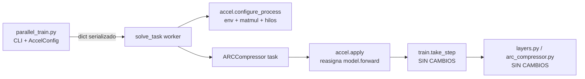

# Eje D — Implementación: eficiencia computacional y aprovechamiento del silicio

> Documentación técnica de los cambios implementados para el **Eje D** descrito en
> [COMPRESS_ARCHITECTURE_30_06.md](COMPRESS_ARCHITECTURE_30_06.md) §9.6, sobre hardware
> **AMD Radeon RX 9070 XT (RDNA4) + ROCm 7.2**.
>
> Este documento describe **qué** se cambió, **por qué** es correcto, **cómo** se activa y
> **cómo** se valida. No sustituye a §9.6 (que da el marco teórico); lo complementa con la
> realidad del código.

---

## Tabla de contenidos

- [1. Resumen ejecutivo](#1-resumen-ejecutivo)
- [2. Principio rector: el núcleo del modelo no se toca](#2-principio-rector-el-núcleo-del-modelo-no-se-toca)
- [3. Mapa de cambios](#3-mapa-de-cambios)
- [4. `accel.py` — la capa de aceleración](#4-accelpy--la-capa-de-aceleración)
- [5. Justificación numérica: por qué BF16 es seguro aquí](#5-justificación-numérica-por-qué-bf16-es-seguro-aquí)
- [6. `torch.compile`: por qué `dynamic=False`](#6-torchcompile-por-qué-dynamicfalse)
- [7. Adaptaciones específicas de ROCm/RDNA4 (§9.2)](#7-adaptaciones-específicas-de-rocmrdna4-92)
- [8. Enganche en el worker (`solve_task.py`)](#8-enganche-en-el-worker-solve_taskpy)
- [9. CLI, caché de VRAM y metadatos (`parallel_train.py`)](#9-cli-caché-de-vram-y-metadatos-parallel_trainpy)
- [10. Instrumentación y guardarraíles (`profile_parallel_train.py`)](#10-instrumentación-y-guardarraíles-profile_parallel_trainpy)
- [11. Protocolo de validación A/B](#11-protocolo-de-validación-ab)
- [12. Riesgos, limitaciones y fuera de alcance](#12-riesgos-limitaciones-y-fuera-de-alcance)
- [13. Trazabilidad con el documento de arquitectura](#13-trazabilidad-con-el-documento-de-arquitectura)

---

## 1. Resumen ejecutivo

El Eje D no cambia la matemática del modelo: cambia **cómo se ejecuta**. La implementación
añade una **capa de aceleración opt-in y externa al modelo** compuesta por:

| Sub-eje | Mecanismo | Dónde vive |
|---------|-----------|------------|
| §9.6.1 Mixed precision | `torch.autocast('cuda', bfloat16)` alrededor de `model.forward` | `accel.apply()` |
| §9.6.2 Fusión de kernels | `torch.compile(..., dynamic=False)` sobre `model.forward` | `accel.apply()` |
| §9.6.3 Silicio / host | Política de precisión de matmul, hilos por worker, allocator, caché Inductor | `accel.configure_process()` |
| §9.2 ROCm | Sustitución del `allow_tf32` no-op por `set_float32_matmul_precision` | `accel.configure_process()` |

**Todo está desactivado por defecto.** Una `AccelConfig()` sin argumentos reproduce
exactamente el comportamiento anterior (`is_enabled()` devuelve `False` y
`model.forward` no se toca). Esto garantiza que el *baseline* de las comparativas A/B es
el código original y no una variante.

---

## 2. Principio rector: el núcleo del modelo no se toca

El requisito explícito era **no modificar el núcleo del modelo**. La implementación lo
cumple de forma verificable: los siguientes archivos **no tienen ni una línea modificada**.

| Archivo | Contenido | Estado |
|---------|-----------|--------|
| [arc_compressor.py](../../arc_compressor.py) | Arquitectura y forward pass | Sin cambios |
| [layers.py](../../layers.py) | Todas las capas (`decode_latents`, `share_up/down`, `softmax`, `cummax`, `shift`, `direction_share`, `nonlinear`, `normalize`) | Sin cambios |
| [multitensor_systems.py](../../multitensor_systems.py) | `MultiTensor`, `@multify` | Sin cambios |
| [initializers.py](../../initializers.py) | Inicialización y equivarianzas | Sin cambios |
| [train.py](../../train.py) | `take_step`, pérdida MDL | Sin cambios |
| [solution_selection.py](../../solution_selection.py) | `Logger`, selección pass@2 | Sin cambios |
| [preprocessing.py](../../preprocessing.py) | `Task` | Sin cambios |

### 2.1 El truco que lo hace posible

`ARCCompressor` es una **clase plana de Python** (no hereda de `nn.Module`) y su método
`forward(self)` **no recibe argumentos**: lee todo su estado de `self`. Por tanto se puede
*reasignar el atributo de instancia* `model.forward` a un callable envuelto, sin tocar la
definición de la clase:

```python
# accel.apply(), simplificado
forward = model.forward                    # bound method original
forward = torch.compile(forward, ...)      # opcional
forward = _autocast_wrap(forward, dtype)   # opcional
model.forward = forward                    # el atributo de instancia oculta al de clase
```

Como `train.take_step` llama a `model.forward()` sin saber nada de esto, **`train.py` no
necesita cambiar**. El único punto de contacto de todo el Eje D con el modelo es esa
reasignación.



---

## 3. Mapa de cambios

| Archivo | Tipo | Alcance del cambio |
|---------|------|--------------------|
| [accel.py](../../accel.py) | **Nuevo** | Toda la lógica del Eje D: config, presets, configuración de proceso, envoltura del forward |
| [solve_task.py](../../solve_task.py) | Modificado | 1 parámetro nuevo (`accel_config`) + 2 llamadas |
| [parallel_train.py](../../parallel_train.py) | Modificado | Flags CLI, propagación a workers, fingerprint de caché, metadatos de ejecución |
| [profile_parallel_train.py](../../profile_parallel_train.py) | Modificado | Métricas de silicio/energía/exactitud, preset, guardarraíles nuevos |

Ningún cambio altera el algoritmo, la pérdida, el número de iteraciones ni la selección
pass@2.

---

## 4. `accel.py` — la capa de aceleración

### 4.1 `AccelConfig`

Dataclass serializable (debe cruzar la frontera de `multiprocessing.spawn` como `dict`).

| Campo | Tipo | Default | Significado |
|-------|------|---------|-------------|
| `amp` | `str` | `'off'` | `off` \| `bf16` \| `fp16`. Precisión mixta del forward (§9.6.1) |
| `compile_mode` | `str` | `'off'` | `off` \| `default` \| `reduce-overhead` \| `max-autotune` (§9.6.2) |
| `matmul_precision` | `str` | `'highest'` | Argumento de `torch.set_float32_matmul_precision` (§9.2) |
| `threads_per_worker` | `int` | `0` | `torch.set_num_threads` por worker; `0` = no tocar |
| `alloc_conf` | `str\|None` | `None` | `PYTORCH_HIP_ALLOC_CONF` / `PYTORCH_CUDA_ALLOC_CONF` |
| `inductor_cache_dir` | `str\|None` | `None` | `TORCHINDUCTOR_CACHE_DIR` persistente |
| `compile_threads` | `int` | `1` | `TORCHINDUCTOR_COMPILE_THREADS` por worker |

Métodos relevantes:

- `is_enabled()` — `True` si algo se desvía del baseline. Permite **afirmar** que una
  ejecución de referencia es el código original.
- `changes_forward()` — `True` sólo si `apply()` envolvería el forward.
- `to_dict()` / `from_dict()` — serialización; `from_dict(None)` devuelve el baseline.
- `describe()` — dict plano para metadatos y logs.
- `summary()` — línea legible: `accel amp=bf16 compile=default matmul=high threads=1 alloc=...`.

### 4.2 Presets

Para que las comparativas A/B estén etiquetadas de forma consistente y no dependan de que
el operador recuerde ocho flags:

| Preset | `amp` | `compile_mode` | `matmul_precision` | `threads_per_worker` | `alloc_conf` | `inductor_cache_dir` |
|--------|-------|----------------|--------------------|----------------------|--------------|----------------------|
| `baseline` | off | off | highest | 0 | — | — |
| `bf16` | bf16 | off | high | 1 | — | — |
| `compile` | off | default | high | 1 | — | `.inductor_cache` |
| `full` | bf16 | default | high | 1 | `expandable_segments:True` | `.inductor_cache` |

`config_from_preset(name, **overrides)` aplica el preset y luego los overrides **cuyo valor
no es `None`**, de modo que la CLI puede pasar todos los flags incondicionalmente.

### 4.3 `configure_process(cfg)`

Se llama **al principio del worker**. Aplica:

1. Variables de entorno (`_apply_env`): allocator y TorchInductor. Se usan
   `os.environ.setdefault` para no pisar una configuración explícita del operador.
2. `torch.set_float32_matmul_precision(cfg.matmul_precision)`.
3. `torch.set_num_threads(cfg.threads_per_worker)` si `> 0`.

**Restricción de diseño crítica**: esta función **no realiza ninguna llamada a
`torch.cuda`**. Se ejecuta antes de `torch.cuda.set_device(gpu_id)`; una llamada como
`torch.cuda.is_bf16_supported()` aquí inicializaría el contexto HIP en el dispositivo por
defecto en lugar del asignado, rompiendo el reparto multi-GPU del scheduler. Las
comprobaciones dependientes de dispositivo viven en `apply()`.

`configure_parent(cfg)` hace sólo el paso 1, en el proceso padre, para que los hijos
`spawn` hereden el entorno (el allocator lo lee en la primera reserva de memoria).

### 4.4 `apply(model, cfg)`

Punto único de contacto con el modelo. Se llama **después** de `set_device`.

```python
forward = model.forward

if cfg.compile_mode != 'off':
    compiled = torch.compile(forward, mode=cfg.compile_mode,
                             dynamic=False, fullgraph=False)
    forward = _EagerFallback(compiled, model.forward)

dtype = _AMP_DTYPES.get(cfg.amp)
if dtype is torch.bfloat16 and not _bf16_supported():
    dtype = None                      # degradación a FP32 con warning
if dtype is not None:
    forward = _autocast_wrap(forward, dtype)

model.forward = forward
```

Dos mecanismos de seguridad:

- **`_EagerFallback`**: `torch.compile` es perezoso — un fallo de compilación aparece en la
  *primera llamada*, no al decorar. Esta clase captura la primera excepción, emite un
  warning y **revierte a eager de forma permanente** para el resto de la tarea. Una tarea
  nunca muere por culpa del acelerador.
- **Degradación BF16**: si el dispositivo o la build no soportan BF16, se avisa y se corre
  en FP32.

### 4.5 `_autocast_wrap`

```python
def forward_with_autocast():
    with torch.autocast(device_type='cuda', dtype=dtype):
        logits, x_mask, y_mask, KL_amounts, KL_names = forward()
    return (logits.float(), x_mask.float(), y_mask.float(),
            [KL.float() for KL in KL_amounts], KL_names)
```

El casteo explícito a FP32 de las cinco salidas garantiza que `train.take_step` recibe
**exactamente los mismos dtypes que hoy**, aunque el análisis de §5 muestra que en la
práctica ya salen en FP32 por promoción de tipos. Es una red de seguridad barata.

### 4.6 `backend_info()`

Huella del backend (`torch.__version__`, `torch.version.hip`, `is_rocm`, nombres de GPU)
que se guarda en los metadatos de ejecución, para que una comparativa A/B sea trazable a
la build concreta con la que se obtuvo.

---

## 5. Justificación numérica: por qué BF16 es seguro aquí

§9.6.1 exige que **la acumulación de KL permanezca en FP32** y advierte del riesgo de que
BF16 trunque gradientes pequeños. La implementación usa `torch.autocast` **plano**, sin
excluir regiones a mano. Esto no es un atajo: es correcto por la estructura del código.

### 5.1 La KL nunca entra en BF16

`torch.autocast` sólo convierte a BF16 las operaciones de su *lista de autocast*
(esencialmente `matmul` / `addmm` / `bmm` / `linear` / `conv`). El resto ejecuta en el
dtype de sus entradas.

`layers.channel_layer` —la función que calcula el latente y su KL— **no contiene ningún
matmul**. Sus operaciones son `exp`, `mean`, `sqrt`, `where`, `randn` y aritmética
elemental. Por tanto, bajo autocast **permanece íntegramente en FP32**, sin necesidad de
`cache_enabled=False` ni de recortar la región del grafo.

### 5.2 El stream residual permanece en FP32

`layers.add_residual` termina en `return x + z`:

- `x` es el stream residual (FP32).
- `z` viene de `affine` → `torch.matmul` → BF16 bajo autocast.
- La promoción de tipos de PyTorch da **FP32 + BF16 → FP32**.

El mismo patrón aparece en:

| Ubicación | Expresión | Resultado |
|-----------|-----------|-----------|
| `add_residual` | `x + z` | FP32 |
| `direction_share` | `x_list[d1] + c * affine(z_list[d2], ...)` | FP32 |
| Cabeza de colores | `affine(x[...]) + 100 * head_weights[1]` | FP32 |

**Consecuencia**: sólo los *intermedios* son BF16; el estado que se propaga entre capas es
FP32. Esto acota el riesgo señalado en §9.6.1 para `normalize`, cuya media y varianza
siguen calculándose sobre tensores FP32.

### 5.3 Por qué BF16 y no FP16

BF16 tiene los mismos 8 bits de exponente que FP32. CompressARC **no implementa loss
scaling** ni clipping; un desbordamiento FP16 en cualquiera de los 27 tensores del
multitensor destruiría la KL. `fp16` queda disponible en la CLI pero explícitamente
desaconsejado en la documentación del flag.

---

## 6. `torch.compile`: por qué `dynamic=False`

§9.6.2 recomienda `dynamic=True` argumentando que "el multitensor tiene 27 tensores de
formas distintas por puzzle". Ese razonamiento aplica a un proceso que resuelve **varios**
puzzles. No es el caso aquí.

En [solve_task.py](../../solve_task.py), cada worker `spawn`:

1. carga **una** tarea,
2. construye **un** `ARCCompressor` dimensionado para ella,
3. ejecuta N iteraciones (`--iterations`, por defecto 1500) sobre esa misma tarea,
4. termina.

Las formas del multitensor (`n_examples`, `n_colors`, `n_x`, `n_y`) son **constantes
durante toda la vida del proceso**. Por tanto:

- `dynamic=False` produce **una sola compilación** y no paga guardas de forma dinámica en
  cada iteración.
- El coste de compilación se amortiza sobre 1500 pasos.
- `inductor_cache_dir` persistente permite reutilizar kernels entre ejecuciones para
  tareas con la misma geometría.

`fullgraph=False` es obligatorio: `layers.postprocess_mask` construye arrays NumPy y llama
a `torch.from_numpy` en cada forward, lo que produce un *graph break* inevitable sin tocar
el núcleo (ver §12).

`compile_threads=1` por defecto evita que N workers concurrentes lancen cada uno un pool
paralelo de compilación de Triton y vuelvan a saturar la CPU — la patología que el Eje H
(§9.11) intenta eliminar.

---

## 7. Adaptaciones específicas de ROCm/RDNA4 (§9.2)

| Antes | Problema en ROCm | Ahora |
|-------|------------------|-------|
| `torch.backends.cuda.matmul.allow_tf32 = True` en el import global de `parallel_train.py` | **No-op**: RDNA4 no tiene TF32; AMD ejecuta los matmul FP32 a precisión completa | Eliminado; sustituido por `torch.set_float32_matmul_precision(cfg.matmul_precision)` por worker, con default `highest` (comportamiento idéntico al anterior) |
| `torch.backends.cudnn.benchmark = True` | Funcional (alias de MIOpen) | Se mantiene sin cambios |
| — | Allocator con fragmentación bajo muchos procesos | `--alloc-conf expandable_segments:True` (opt-in) |
| — | Sobresuscripción de hilos intra-op con 13+ workers | `--threads-per-worker 1` |

Notas de portabilidad:

- `torch.autocast(device_type='cuda', ...)` es correcto también en ROCm: PyTorch mantiene
  `'cuda'` como identificador de dispositivo en las builds HIP.
- `_apply_env` escribe **tanto** `PYTORCH_HIP_ALLOC_CONF` como `PYTORCH_CUDA_ALLOC_CONF`;
  cada build lee la suya y la otra se ignora.
- No se ha escrito ningún kernel Triton a mano ni PTX/HIP inline. La aceleración usa
  exclusivamente rutas estándar de PyTorch, disponibles en CUDA y ROCm.

---

## 8. Enganche en el worker (`solve_task.py`)

Tres cambios mínimos:

```python
def solve_task(..., postprocess_stride=1, accel_config=None):
    try:
        # 1) Antes de cualquier tensor de GPU: env, matmul precision, hilos.
        accel_cfg = accel.configure_process(accel_config)

        torch.set_default_device('cuda')
        torch.cuda.set_device(gpu_id)
        torch.cuda.reset_peak_memory_stats()
        ...
        model = arc_compressor.ARCCompressor(task)
        # 2) Después de set_device: envuelve/compila model.forward.
        accel.apply(model, accel_cfg)
        optimizer = torch.optim.Adam(model.weights_list, lr=0.01, betas=(0.5, 0.9))
```

El orden importa y es deliberado:

| Paso | Debe ir antes de… | Motivo |
|------|-------------------|--------|
| `configure_process` | primera reserva de VRAM | el allocator lee su config en la primera reserva |
| `set_device(gpu_id)` | `apply` | `apply` consulta capacidades del dispositivo (BF16) |
| `apply` | primer `take_step` | reasigna `model.forward` |

El bucle de entrenamiento, la medición de VRAM y el volcado de soluciones **no cambian**.

---

## 9. CLI, caché de VRAM y metadatos (`parallel_train.py`)

### 9.1 Flags nuevos

Grupo *"Eje D — acceleration (all OFF by default: baseline behaviour)"*:

| Flag | Default | Descripción |
|------|---------|-------------|
| `--accel-preset {baseline,bf16,compile,full}` | `baseline` | Bundle de ajustes; los flags individuales lo sobrescriben |
| `--amp {off,bf16,fp16}` | del preset | Precisión mixta del forward |
| `--compile {off,default,reduce-overhead,max-autotune}` | del preset | Modo de `torch.compile` |
| `--matmul-precision {highest,high,medium}` | del preset | Sustituto ROCm de `allow_tf32` |
| `--threads-per-worker N` | del preset | `torch.set_num_threads` por worker |
| `--alloc-conf CONF` | del preset | Config del allocator HIP/CUDA |
| `--inductor-cache-dir DIR` | del preset | Caché persistente de TorchInductor |
| `--compile-threads N` | `1` | `TORCHINDUCTOR_COMPILE_THREADS` por worker |

Flag auxiliar, fuera de §9.6 pero necesario para abaratar los A/B:

| Flag | Default | Descripción |
|------|---------|-------------|
| `--iterations N` | `1500` | Pasos de la Fase 2 por tarea. Antes estaba **hardcodeado** dentro de `run_split` |

### 9.2 Propagación a los workers

`AccelConfig` se construye una vez en `__main__`, se aplica al entorno del padre con
`accel.configure_parent()` y se serializa a `dict` que viaja en `worker_args` de
`parallelize_runs` hasta `solve_task.solve_task`, exactamente igual que el ya existente
`postprocess_stride`.

### 9.3 Invalidación de la caché de medición de VRAM

**Este es el punto más sutil de la integración.** La Fase 1 mide el *footprint* de VRAM de
cada tarea y lo cachea en `memory_cache_{split}.json`, con un *fingerprint* del entorno.
BF16 y `torch.compile` **cambian ese footprint**, así que reutilizar una medición de
baseline para una ejecución acelerada haría que el scheduler de la Fase 2 empaquetase mal
las tareas en la GPU.

Solución: la configuración de aceleración forma parte del fingerprint.

```python
def _gpu_fingerprint(n_gpus, accel_config=None):
    return {
        'n_gpus': ...,
        'gpu_names': ...,
        'gpu_vram_total_gb': ...,
        'torch_version': torch.__version__,
        'accel': accel.AccelConfig.from_dict(accel_config).to_dict(),
    }
```

Cambiar de preset invalida la caché automáticamente: el log mostrará
`Phase 1 — Memory measurement` en lugar de `Phase 1 — SKIPPED`.

### 9.4 `run_metadata_{split}.json`

Al final de cada split se escribe un fichero legible por máquina que describe **lo que
realmente se ejecutó**:

```json
{
  "split": "training",
  "timestamp": "2026-07-27 12:00:00",
  "n_tasks": 20,
  "n_steps": 300,
  "n_solved": 7,
  "elapsed_s": 1234.5,
  "n_gpus": 1,
  "max_workers": 13,
  "postprocess_stride": 4,
  "accel": { "amp": "bf16", "compile_mode": "default", "...": "...", "enabled": true },
  "backend": { "torch_version": "...", "hip_version": "7.2", "is_rocm": true, "gpu_names": ["..."] }
}
```

Es el contrato de datos que consume el profiler para calcular throughput de entrenamiento
y exactitud (§10).

---

## 10. Instrumentación y guardarraíles (`profile_parallel_train.py`)

El profiler ya medía CPU, concurrencia, RSS y GPU. El Eje D necesita medir además
**aprovechamiento del silicio**, **energía** y **exactitud**, porque un speedup que rompe
los números no es una mejora.

### 10.1 Muestreo ampliado (sysfs, sin subprocess)

`_sample_gpu_sysfs` pasa de devolver `(util, vram)` a `(util, vram, mem_busy, power)`,
leyendo dos atributos adicionales del mismo `device_dir`:

| Métrica | Fuente sysfs | Significado |
|---------|--------------|-------------|
| `mem_busy_pct` | `device/mem_busy_percent` | Ocupación del controlador de memoria |
| `power_w` | `device/hwmon/hwmon*/power1_average` (µW) | Potencia de placa |

Se mantiene el diseño original de seguridad: lecturas de fichero puras, envueltas en
`try/except`, en la **cadencia lenta** de `--gpu-interval` (20 s por defecto), nunca por
subprocess. Esto respeta la advertencia del docstring sobre la inestabilidad del driver
amdgpu con polling SMI frecuente bajo carga concurrente.

La energía se integra rectangularmente: `energy_wh += power_w * Δt / 3600`.

### 10.2 Métricas nuevas en el resumen

| Bloque | Campo | Cálculo |
|--------|-------|---------|
| `gpu` | `mem_busy_mean_pct`, `power_mean_w`, `power_max_w`, `energy_wh` | De las series muestreadas |
| `efficiency` | `planned_train_steps` | `Σ (n_steps × n_tasks)` de los metadatos |
| `efficiency` | `steps_per_s_aggregate` | `planned_train_steps / wall_time` |
| `efficiency` | `energy_wh_per_1k_steps` | `energy_wh / (planned_steps/1000)` |
| `efficiency` | `energy_wh_per_worker` | `energy_wh / workers_completed` |
| `accuracy` | `n_solved`, `n_tasks`, `solved_fraction` | De los metadatos |
| — | `accel_preset`, `run_metadata` | Etiquetado y trazabilidad |

`_collect_run_metadata(t0)` lee los `run_metadata_*.json` del directorio de trabajo e
**ignora los que tengan `mtime` anterior al inicio de la ejecución**, de modo que un
fichero obsoleto de un experimento previo no contamine el resumen.

> **Nota sobre `steps_per_s_aggregate`**: usa los pasos *planificados* de la Fase 2 sobre el
> wall-clock *total* (incluida la Fase 1). Es comparable entre ejecuciones A/B siempre que
> ambas usen el mismo split, `--demo`, `--iterations` y estado de la caché de Fase 1. Se
> prefiere a `workers_per_hour` porque este último cuenta también los workers de la Fase 1,
> que sólo hacen 2 iteraciones.

### 10.3 Guardarraíles y códigos de salida

`compare()` mantiene el guardarraíl de CPU del Eje H y **añade uno de exactitud**:

| Código | Condición |
|--------|-----------|
| `0` | Todo correcto |
| `2` | **Regresión de CPU**: subió `cpu_mean_pct` o `cpu_saturation_fraction` |
| `3` | **Regresión de exactitud**: `solved_fraction` cayó más de `--accuracy-tolerance` |

Justificación del código 3: el Eje D es **semánticamente neutro por diseño**. Si pass@2
baja, la aceleración ha cambiado los números de forma dañina —típicamente BF16 truncando
gradientes de tensores con KL cercana a 0, el riesgo explícito de §9.6.1— y el speedup no
es gratis.

Detalles de presentación:

- La potencia media se marca como **informativa** (`[info]`), no como pass/fail: consumir
  más vatios haciendo mucho más trabajo es bueno. La métrica que decide es
  `energy_wh_per_1k_steps`.
- Si `n_tasks < 50` se emite un aviso de que pass@2 es ruidoso a ese tamaño muestral.
- Si falta el bloque de exactitud (p. ej. split `test`, sin ground truth) se informa y no
  se evalúa el guardarraíl.
- La lectura de métricas usa un `get()` tolerante: los resúmenes JSON generados por
  versiones anteriores del script siguen comparándose sin fallar (las métricas nuevas
  aparecen como `None`).

### 10.4 Flags nuevos del profiler

| Flag | Descripción |
|------|-------------|
| `--accel-preset {baseline,bf16,compile,full}` | Añade `--accel-preset X` al passthrough hacia `parallel_train.py` **y** lo registra en el resumen, evitando A/B mal etiquetados. Un `--accel-preset` explícito tras `--` tiene prioridad |
| `--accuracy-tolerance F` | Caída tolerada de `solved_fraction` antes de marcar regresión. Default `0.0` (estricto) |

---

## 11. Protocolo de validación A/B

> Las ejecuciones deben realizarse en el host **Linux + ROCm**: el repositorio llama a
> `torch.set_default_device('cuda')` en tiempo de import y el profiler lee `/sys/class/drm`.

### 11.1 Verificación de que el baseline sigue intacto

```bash
python parallel_train.py --split training --demo 3 --iterations 50
```

Comprobar en el log: `Acceleration (Eje D): accel=off (baseline)`. En ese estado
`accel.apply()` retorna sin tocar `model.forward`.

### 11.2 Sanidad numérica de BF16 (una tarea)

Ejecutar una tarea ~200 pasos con y sin `--amp bf16` y comparar, tras
`Logger.materialize_curves()`:

- `loss_curve` y `total_KL_curve`: trayectorias próximas, **sin** `NaN`/`Inf`.
- KL por tensor: ningún tensor debe colapsar a 0 **antes** que en el baseline (riesgo
  declarado en §9.6.1; mitigable con el *free-bits* del Eje B §9.4.1).

### 11.3 Comportamiento de la compilación

```bash
TORCH_LOGS=recompiles python parallel_train.py --split training --demo 1 --compile default
```

Esperado: **1–2 compilaciones** en total gracias a `dynamic=False`; coste concentrado en el
primer paso. Forzar un fallo (p. ej. `--compile max-autotune` sin Triton disponible) debe
producir el warning de `_EagerFallback` y **completar la tarea igualmente**.

### 11.4 Comparativa completa

```bash
python profile_parallel_train.py --label d_baseline --accel-preset baseline \
    -- --split training --demo 20 --iterations 300

python profile_parallel_train.py --label d_bf16 --accel-preset bf16 \
    -- --split training --demo 20 --iterations 300

python profile_parallel_train.py --label d_full --accel-preset full \
    -- --split training --demo 20 --iterations 300

python profile_parallel_train.py --compare .profile/d_baseline_summary.json \
                                            .profile/d_full_summary.json
```

Criterios de aceptación:

| Métrica | Criterio |
|---------|----------|
| `steps_per_s_aggregate` | ↑ ≥ 1,5× |
| `gpu_util_mean_pct` | ↑ |
| `energy_wh_per_1k_steps` | ↓ |
| `cpu_saturation_fraction` | no ↑ |
| `solved_fraction` | no ↓ |
| Código de salida | `0` |

### 11.5 Barrido de concurrencia

Con la configuración ganadora, barrer `--max-workers 4 / 8 / 13` y quedarse con el máximo
`steps_per_s_aggregate`. Esto cierra el punto 1 de §9.6.3 con evidencia en lugar de con
intuición.

---

## 12. Riesgos, limitaciones y fuera de alcance

### 12.1 Riesgos conocidos

| Riesgo | Mitigación implementada | Mitigación pendiente |
|--------|-------------------------|----------------------|
| BF16 agrava el *posterior collapse* (§8.2.4, §9.6.1) | Guardarraíl de exactitud (exit 3); KL siempre en FP32 | *Free-bits* del Eje B §9.4.1 |
| Coste de compilación no amortizado en runs cortos | `inductor_cache_dir` persistente; `--iterations` para dimensionar el A/B | — |
| N workers compilando a la vez saturan la CPU | `compile_threads=1` por defecto | Escalonar el arranque de workers |
| `reduce-overhead` (HIP graphs) infla VRAM con muchos procesos | No está en ningún preset; opt-in explícito y documentado | — |
| Caché de Fase 1 obsoleta tras cambiar de preset | La config accel forma parte del fingerprint | — |
| Fallo de compilación mata una tarea | `_EagerFallback` revierte a eager | — |

### 12.2 Fuera de alcance (deliberadamente)

- **Kernels Triton escritos a mano** (§9.6.2 último párrafo, §9.11.3 paso 7), incluido el
  scan diagonal de `cummax`. Sólo tienen sentido *después* de medir qué sigue caliente.
- **Eliminar el graph break de `layers.postprocess_mask`**, que construye arrays NumPy en
  cada forward. Es núcleo del modelo y su modificación viola la restricción del encargo.
- **§9.6.3 puntos 2–4**: prefetch de preprocesado en CPU, caché de pesos calientes en RAM y
  tensores en memoria compartida. Mayor riesgo y beneficio no demostrado; se reevalúan con
  los datos del barrido de §11.5.
- **Ejes A, B, C, E, F, G.**

### 12.3 Nota sobre reproducibilidad

`torch.compile` funcionaliza el RNG, de modo que la secuencia de `torch.randn` dentro de
`layers.channel_layer` puede diferir de la de eager. Los resultados **no son bit-a-bit
idénticos** entre modos. Esto es coherente con lo que ya documenta el
[README.md](../../README.md): las ejecuciones no son bit-a-bit reproducibles ni siquiera
con la misma semilla, y lo que se compara es el pass@2 agregado sobre el split.

---

## 13. Trazabilidad con el documento de arquitectura

| Sección de [COMPRESS_ARCHITECTURE_30_06.md](COMPRESS_ARCHITECTURE_30_06.md) | Estado | Dónde |
|-----------------------------------------------------------------------------|--------|-------|
| §9.6.1 Mixed precision BF16 | **Implementado** | `accel.apply` / `_autocast_wrap` |
| §9.6.2 `torch.compile` + Triton-ROCm | **Implementado** (sin kernels a mano) | `accel.apply` |
| §9.6.3 punto 1 — concurrencia | Ya existía (`--max-workers`); ahora **medible** | `parallel_train.py`, profiler |
| §9.6.3 puntos 2–4 | No implementado | Fuera de alcance (§12.2) |
| §9.2 sustitución de `allow_tf32` | **Implementado** | `accel.configure_process` |
| §9.2 acumulación de KL en FP32 | **Garantizado por construcción** | Análisis §5.1 |
| §9.11.3 paso 6 (`torch.compile`, único paso pendiente del Eje H) | **Implementado** vía Eje D | `accel.apply` |
| §9.11.4 contrato de instrumentación | **Ampliado** con silicio, energía y exactitud | `profile_parallel_train.py` |

**Impacto MDL**: cero. Este eje no añade ni un bit a θ, no modifica KL(z) ni el error de
reconstrucción. Cambia únicamente **cómo** se calculan valores cuyo resultado es el mismo.
Es MDL-neutro por construcción, igual que el Eje H.
