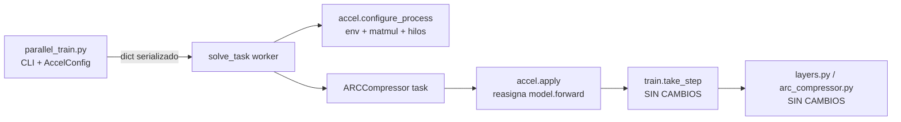

# Eje D — Implementación: eficiencia computacional y aprovechamiento del silicio

> Documentación técnica de los cambios implementados para el **Eje D** descrito en
> [COMPRESS_ARCHITECTURE_30_06.md](COMPRESS_ARCHITECTURE_30_06.md) §9.6, sobre hardware
> **AMD Radeon RX 9070 XT (RDNA4) + ROCm 7.2**.
>
> Este documento describe **qué** se cambió, **por qué** es correcto, **cómo** se activa y
> **cómo** se valida. No sustituye a §9.6 (que da el marco teórico); lo complementa con la
> realidad del código.

---

## Tabla de contenidos

- [1. Resumen ejecutivo](#1-resumen-ejecutivo)
- [2. Principio rector: el núcleo del modelo no se toca](#2-principio-rector-el-núcleo-del-modelo-no-se-toca)
- [3. Resultados medidos (2026-07-28)](#3-resultados-medidos-2026-07-28)
- [4. Mapa de cambios](#4-mapa-de-cambios)
- [5. `accel.py` — la capa de aceleración](#5-accelpy--la-capa-de-aceleración)
- [6. BF16: seguridad numérica y veredicto empírico](#6-bf16-seguridad-numérica-y-veredicto-empírico)
- [7. `torch.compile`: diseño y coste real](#7-torchcompile-diseño-y-coste-real)
- [8. Adaptaciones específicas de ROCm/RDNA4 (§9.2)](#8-adaptaciones-específicas-de-rocmrdna4-92)
- [9. Enganche en el worker (`solve_task.py`)](#9-enganche-en-el-worker-solve_taskpy)
- [10. CLI, caché de VRAM y metadatos (`parallel_train.py`)](#10-cli-caché-de-vram-y-metadatos-parallel_trainpy)
- [11. Instrumentación y guardarraíles (`profile_parallel_train.py`)](#11-instrumentación-y-guardarraíles-profile_parallel_trainpy)
- [12. Protocolo de validación A/B](#12-protocolo-de-validación-ab)
- [13. Riesgos, limitaciones y fuera de alcance](#13-riesgos-limitaciones-y-fuera-de-alcance)
- [14. Trazabilidad con el documento de arquitectura](#14-trazabilidad-con-el-documento-de-arquitectura)

---

## 1. Resumen ejecutivo

El Eje D no cambia la matemática del modelo: cambia **cómo se ejecuta**. La implementación
añade una **capa de aceleración opt-in y externa al modelo** compuesta por:

| Sub-eje                    | Mecanismo                                                                       | Dónde vive                   |
| -------------------------- | ------------------------------------------------------------------------------- | ----------------------------- |
| §9.6.1 Mixed precision    | `torch.autocast('cuda', bfloat16)` alrededor de `model.forward`             | `accel.apply()`             |
| §9.6.2 Fusión de kernels | `torch.compile(..., dynamic=False)` sobre `model.forward`                   | `accel.apply()`             |
| §9.6.3 Silicio / host     | Política de precisión de matmul, hilos por worker, allocator, caché Inductor | `accel.configure_process()` |
| §9.2 ROCm                 | Sustitución del`allow_tf32` no-op por `set_float32_matmul_precision`       | `accel.configure_process()` |

**Todo está desactivado por defecto.** Una `AccelConfig()` sin argumentos reproduce
exactamente el comportamiento anterior (`is_enabled()` devuelve `False` y
`model.forward` no se toca). Esto garantiza que el *baseline* de las comparativas A/B es
el código original y no una variante.

**Veredicto tras la primera campaña de medición** (§3): de los dos mecanismos de §9.6,
**sólo `torch.compile` sirve**. BF16 resultó un 2,7 % *más lento* y se ha retirado del
preset `full`; la compilación da 13–26× por iteración en régimen permanente, pero su
coste — tiempo de compilación y VRAM — había que dominarlo antes de que el beneficio
aflorase.

---

## 2. Principio rector: el núcleo del modelo no se toca

El requisito explícito era **no modificar el núcleo del modelo**. La implementación lo
cumple de forma verificable: los siguientes archivos **no tienen ni una línea modificada**.

| Archivo                                               | Contenido                                                                                                                                      | Estado      |
| ----------------------------------------------------- | ---------------------------------------------------------------------------------------------------------------------------------------------- | ----------- |
| [arc_compressor.py](../../arc_compressor.py)           | Arquitectura y forward pass                                                                                                                    | Sin cambios |
| [layers.py](../../layers.py)                           | Todas las capas (`decode_latents`, `share_up/down`, `softmax`, `cummax`, `shift`, `direction_share`, `nonlinear`, `normalize`) | Sin cambios |
| [multitensor_systems.py](../../multitensor_systems.py) | `MultiTensor`, `@multify`                                                                                                                  | Sin cambios |
| [initializers.py](../../initializers.py)               | Inicialización y equivarianzas                                                                                                                | Sin cambios |
| [train.py](../../train.py)                             | `take_step`, pérdida MDL                                                                                                                    | Sin cambios |
| [solution_selection.py](../../solution_selection.py)   | `Logger`, selección pass@2                                                                                                                  | Sin cambios |
| [preprocessing.py](../../preprocessing.py)             | `Task`                                                                                                                                       | Sin cambios |

### 2.1 El truco que lo hace posible

`ARCCompressor` es una **clase plana de Python** (no hereda de `nn.Module`) y su método
`forward(self)` **no recibe argumentos**: lee todo su estado de `self`. Por tanto se puede
*reasignar el atributo de instancia* `model.forward` a un callable envuelto, sin tocar la
definición de la clase:

```python
# accel.apply(), simplificado
forward = model.forward                    # bound method original
forward = torch.compile(forward, ...)      # opcional
forward = _autocast_wrap(forward, dtype)   # opcional
model.forward = forward                    # el atributo de instancia oculta al de clase
```

Como `train.take_step` llama a `model.forward()` sin saber nada de esto, **`train.py` no
necesita cambiar**. El único punto de contacto de todo el Eje D con el modelo es esa
reasignación.



---

## 3. Resultados medidos (2026-07-28)

Primera campaña A/B real. Entorno: RX 9070 XT (15,92 GB), ROCm 7.2.53211,
`torch 2.14.0.dev20260712+rocm7.2`, i9-12900K (24 hilos), 10 tareas del split
`training`, 300 iteraciones/tarea, sin límite efectivo de `--max-workers`.

| Métrica                   | `baseline` | `bf16`     | `full` (bf16 + compile) |
| ------------------------- | ---------- | ---------- | ----------------------- |
| Fase 1 (medición de VRAM) | 46,3 s     | 52,3 s     | **11 871,5 s**          |
| Fase 2 (entrenamiento)    | 1 453,5 s  | 1 456,6 s  | **1 049,2 s**           |
| Wall total                | 1 499,8 s  | 1 508,9 s  | 12 920,7 s              |
| **steps/s en Fase 2**     | **2,06**   | 2,06       | **2,86 (+38 %)**        |
| Concurrencia en Fase 2    | 10         | 10         | 3–4                     |
| VRAM por tarea            | 0,91 GB    | 0,93 GB    | **3,87 GB**             |
| Tareas resueltas          | 1/10       | 0/10       | 0/10                    |

> La comparativa agregada del profiler daba `steps_per_s_aggregate −90 %` para `full`.
> Era un artefacto: la métrica promediaba sobre una Fase 1 que ocupó el **92 % del wall**.
> De ahí nace `steps_per_s_phase2` (§11.2), que aísla la velocidad de entrenamiento de la
> fase de medición.

### 3.1 BF16 no aporta nada — y cuesta un 2,7 %

Comparación **pareada por tarea** de la duración en Fase 2 (mismo orden de arranque,
misma concurrencia, mismos datos):

| Tarea     | baseline  | bf16      | Δ          |
| --------- | --------- | --------- | ---------- |
| 017c7c7b  | 1 081,0 s | 1 214,1 s | +12,3 %    |
| 08ed6ac7  | 1 324,1 s | 1 402,3 s | +5,9 %     |
| 007bbfb7  | 1 336,1 s | 1 401,3 s | +4,9 %     |
| 05f2a901  | 1 301,1 s | 1 361,2 s | +4,6 %     |
| 0520fde7  | 1 209,1 s | 1 230,1 s | +1,7 %     |
| 06df4c85  | 1 434,2 s | 1 454,3 s | +1,4 %     |
| 00d62c1b  | 1 424,2 s | 1 439,3 s | +1,1 %     |
| 025d127b  | 1 361,2 s | 1 367,2 s | +0,4 %     |
| 045e512c  | 1 451,3 s | 1 425,3 s | −1,8 %     |
| 05269061  | 1 338,1 s | 1 290,1 s | −3,6 %     |
| **Media** |           |           | **+2,7 %** |

8 de 10 tareas empeoran. No es ruido, y la causa está en el código: la carga es
**launch-bound**, no FLOP-bound. La evidencia física es inequívoca — `gpu_busy_percent`
marca 97 % pero `mem_busy_percent` sólo 3,4 % y la placa consume **94 W de 304 W de TDP**.
`gpu_busy_percent` cuenta «hay algo en vuelo», no ocupación de ALUs. Acelerar una
aritmética que ya es gratis no mueve el reloj, mientras que `torch.autocast` **añade** un
kernel de cast por cada `layers.affine`, y `affine` se invoca para los 27 tensores, varias
veces por capa, ×4 capas.

Esto confirma cuantitativamente la predicción de §6.3 del documento de arquitectura
(0,04 % del pico de FLOPS) y **refuta la estimación de §9.6.1**, que esperaba 2,5–3× de
BF16.

### 3.2 `torch.compile` sí ataca el cuello real

Los mensajes `PROG` cada 100 pasos permiten separar compilación de ejecución:

| Tarea (`full`) | pasos 0→100 | 100→200  | 200→300 | it/s en régimen |
| -------------- | ----------- | -------- | ------- | --------------- |
| 08ed6ac7       | 265 s       | **20 s** | 20 s    | ~5,0            |
| 025d127b       | 265 s       | **31 s** | 36 s    | ~3,0            |
| 0520fde7       | 260 s       | **39 s** | 34 s    | ~2,7            |
| 017c7c7b       | 248 s       | **39 s** | 42 s    | ~2,5            |
| 05f2a901       | 263 s       | **40 s** | 49 s    | ~2,5            |

La misma tarea `025d127b` en `baseline` tarda **516 s** en sus primeros 100 pasos
(0,19 it/s). El modelo compilado corre por tanto **entre 13× y 26× más rápido por
iteración**; los ~250 s iniciales son compilación.

Agregado por GPU: baseline 10 × 0,19 = **1,9 it/s**; compilado 3–4 × ~3 = **~9,5 it/s**.
Un **≈5× de throughput real** que la comparativa agregada no dejaba ver.

### 3.3 Lo que se comía la ganancia

1. **La Fase 1 compilaba.** 10 tareas × ~1 190 s, en serie (la Fase 1 corre una tarea cada
   vez), para ejecutar **2 iteraciones** por tarea. Los workers marcaban
   `mean_cpu_pct ≈ 99,7 %` — exactamente un core — con procesos `g++`/`cc1plus`
   intercalados: Inductor monohilo.
2. **La compilación cuadruplica la VRAM.** 0,91 GB/tarea eager → 3,87 GB/tarea compilada.
   Con 14,86 GB útiles el scheduler sólo podía colocar 3 tareas en vez de 10. La medición
   de Fase 1 era **correcta**: predijo 3,87 GB y la Fase 2 alcanzó 15 018 MB con 4 tareas
   (3 755 MB/tarea).
3. **Amortización.** Con caché fría, compilar 10 tareas cuesta 11 871 s y ahorra 404 s por
   cada 300 iteraciones → punto de equilibrio en **~8 800 iteraciones/tarea**. A las
   1 500–2 000 reales, en frío **aún pierde**.

### 3.4 Cambios de diseño que se derivan

| Hallazgo                                    | Cambio aplicado                                                        | Referencia   |
| ------------------------------------------- | ---------------------------------------------------------------------- | ------------ |
| Fase 1 compilando = 92 % del wall           | `accel.for_measurement()`: la Fase 1 **nunca** compila                 | §5.3, §10.3  |
| Medición eager subestima ×4,3 el footprint  | `--compile-memory-factor` (default 4,5) escala la medición             | §10.3        |
| VRAM compilada limita la concurrencia       | `memory_planning` (reuso de buffers de Inductor) activo en los presets | §5.1, §5.4   |
| Inductor monohilo tarda ~20 min/tarea       | `compile_threads` 1 → 4; `accel.compile_report()` para diagnosticar    | §5.8, §9     |
| BF16 es más lento                           | Retirado del preset `full`; queda como preset experimental             | §5.2, §6.4   |
| Las métricas agregadas invierten veredictos | `steps_per_s_phase2` como métrica principal de `compare()`             | §11.2        |

---

## 4. Mapa de cambios

| Archivo                                                     | Tipo            | Alcance del cambio                                                                           |
| ----------------------------------------------------------- | --------------- | -------------------------------------------------------------------------------------------- |
| [accel.py](../../accel.py)                                   | **Nuevo** | Toda la lógica del Eje D: config, presets, configuración de proceso, envoltura del forward |
| [solve_task.py](../../solve_task.py)                         | Modificado      | 1 parámetro nuevo (`accel_config`) + 2 llamadas                                           |
| [parallel_train.py](../../parallel_train.py)                 | Modificado      | Flags CLI, propagación a workers, fingerprint de caché, metadatos de ejecución            |
| [profile_parallel_train.py](../../profile_parallel_train.py) | Modificado      | Métricas de silicio/energía/exactitud, preset, guardarraíles nuevos                       |

Ningún cambio altera el algoritmo, la pérdida, el número de iteraciones ni la selección
pass@2.

---

## 5. `accel.py` — la capa de aceleración

### 5.1 `AccelConfig`

Dataclass serializable (debe cruzar la frontera de `multiprocessing.spawn` como `dict`).

| Campo                  | Tipo         | Default       | Significado                                                                 |
| ---------------------- | ------------ | ------------- | --------------------------------------------------------------------------- |
| `amp`                | `str`      | `'off'`     | `off` \| `bf16` \| `fp16`. Precisión mixta del forward (§9.6.1)     |
| `compile_mode`       | `str`      | `'off'`     | `off` \| `default` \| `reduce-overhead` \| `max-autotune` (§9.6.2) |
| `matmul_precision`   | `str`      | `'highest'` | Argumento de`torch.set_float32_matmul_precision` (§9.2)                  |
| `threads_per_worker` | `int`      | `0`         | `torch.set_num_threads` por worker; `0` = no tocar                      |
| `alloc_conf`         | `str\|None` | `None`      | `PYTORCH_HIP_ALLOC_CONF` / `PYTORCH_CUDA_ALLOC_CONF`                    |
| `inductor_cache_dir` | `str\|None` | `None`      | `TORCHINDUCTOR_CACHE_DIR` persistente                                     |
| `compile_threads`    | `int`      | `1`         | `TORCHINDUCTOR_COMPILE_THREADS` por worker (4 en los presets de compilación) |
| `memory_planning`    | `bool`     | `False`     | `torch._inductor.config.memory_planning`: reuso de buffers en el grafo fusionado |

Métodos relevantes:

- `is_enabled()` — `True` si algo se desvía del baseline. Permite **afirmar** que una
  ejecución de referencia es el código original.
- `changes_forward()` — `True` sólo si `apply()` envolvería el forward.
- `to_dict()` / `from_dict()` — serialización; `from_dict(None)` devuelve el baseline.
- `describe()` — dict plano para metadatos y logs.
- `summary()` — línea legible: `accel amp=bf16 compile=default matmul=high threads=1 alloc=...`.

### 5.2 Presets

Para que las comparativas A/B estén etiquetadas de forma consistente y no dependan de que
el operador recuerde diez flags:

| Preset       | `amp` | `compile_mode` | `matmul_precision` | `threads_per_worker` | `compile_threads` | `memory_planning` | `alloc_conf`               | `inductor_cache_dir` |
| ------------ | ----- | -------------- | ------------------ | -------------------- | ----------------- | ----------------- | -------------------------- | -------------------- |
| `baseline`   | off   | off            | highest            | 0                    | 1                 | —                | —                          | —                    |
| `bf16`       | bf16  | off            | high               | 1                    | 1                 | —                | —                          | —                    |
| `compile`    | off   | default        | high               | 1                    | 4                 | sí               | —                          | `.inductor_cache`    |
| `full`       | off   | default        | high               | 1                    | 4                 | sí               | `expandable_segments:True` | `.inductor_cache`    |

> **`full` ya no lleva BF16.** En la versión inicial `full` era «bf16 + compile». La
> medición pareada de §3.1 mostró que BF16 es un 2,7 % más lento con VRAM idéntica, así
> que se retiró. `bf16` sobrevive sólo como preset experimental, y su `--help` lo advierte
> explícitamente.

`config_from_preset(name, **overrides)` aplica el preset y luego los overrides **cuyo valor
no es `None`**, de modo que la CLI puede pasar todos los flags incondicionalmente.

### 5.3 `for_measurement(cfg)` — la Fase 1 nunca compila

Devuelve una copia de `cfg` con `compile_mode='off'`, conservando todo lo demás.

Motivo (§3.3): la Fase 1 ejecuta **2 iteraciones por tarea, de una en una**. Compilar para
eso costó ~1 190 s por tarea y supuso el **92 % del wall** de una campaña completa. El
autocast sí se conserva, porque no añade coste y sí participa en el footprint.

Efecto secundario valioso: como el *fingerprint* de la caché se calcula sobre esta config
de medición, un run eager y uno compilado del mismo split **comparten la medición** en vez
de repetirla.

La contrapartida es que la medición resultante es la *eager*, que subestima ×4,3 el
footprint compilado; se corrige con `--compile-memory-factor` (§10.3).

### 5.4 `configure_process(cfg)`

Se llama **al principio del worker**. Aplica:

1. Variables de entorno (`_apply_env`): allocator y TorchInductor. Se usan
   `os.environ.setdefault` para no pisar una configuración explícita del operador.
2. `torch.set_float32_matmul_precision(cfg.matmul_precision)`.
3. `torch.set_num_threads(cfg.threads_per_worker)` si `> 0`.
4. `torch._inductor.config.memory_planning = True` si `memory_planning` y hay compilación.

**Restricción de diseño crítica**: esta función **no realiza ninguna llamada a
`torch.cuda`**. Se ejecuta antes de `torch.cuda.set_device(gpu_id)`; una llamada como
`torch.cuda.is_bf16_supported()` aquí inicializaría el contexto HIP en el dispositivo por
defecto en lugar del asignado, rompiendo el reparto multi-GPU del scheduler. Las
comprobaciones dependientes de dispositivo viven en `apply()`.

`configure_parent(cfg)` hace sólo el paso 1, en el proceso padre, para que los hijos
`spawn` hereden el entorno (el allocator lo lee en la primera reserva de memoria).

### 5.5 `apply(model, cfg)`

Punto único de contacto con el modelo. Se llama **después** de `set_device`.

```python
forward = model.forward

if cfg.compile_mode != 'off':
    compiled = torch.compile(forward, mode=cfg.compile_mode,
                             dynamic=False, fullgraph=False)
    forward = _EagerFallback(compiled, model.forward)

dtype = _AMP_DTYPES.get(cfg.amp)
if dtype is torch.bfloat16 and not _bf16_supported():
    dtype = None                      # degradación a FP32 con warning
if dtype is not None:
    forward = _autocast_wrap(forward, dtype)

model.forward = forward
```

Dos mecanismos de seguridad:

- **`_EagerFallback`**: `torch.compile` es perezoso — un fallo de compilación aparece en la
  *primera llamada*, no al decorar. Esta clase captura la primera excepción, emite un
  warning y **revierte a eager de forma permanente** para el resto de la tarea. Una tarea
  nunca muere por culpa del acelerador.
- **Degradación BF16**: si el dispositivo o la build no soportan BF16, se avisa y se corre
  en FP32.

### 5.6 `_autocast_wrap`

```python
def forward_with_autocast():
    with torch.autocast(device_type='cuda', dtype=dtype):
        logits, x_mask, y_mask, KL_amounts, KL_names = forward()
    return (logits.float(), x_mask.float(), y_mask.float(),
            [KL.float() for KL in KL_amounts], KL_names)
```

El casteo explícito a FP32 de las cinco salidas garantiza que `train.take_step` recibe
**exactamente los mismos dtypes que hoy**, aunque el análisis de §6 muestra que en la
práctica ya salen en FP32 por promoción de tipos. Es una red de seguridad barata.

### 5.7 `backend_info()`

Huella del backend (`torch.__version__`, `torch.version.hip`, `is_rocm`, nombres de GPU)
que se guarda en los metadatos de ejecución, para que una comparativa A/B sea trazable a
la build concreta con la que se obtuvo.

### 5.8 `compile_report(cfg)`

Devuelve el desglose de `torch._dynamo.utils.compile_times()`, que [solve_task.py](../../solve_task.py)
vuelca por tarea al terminar el entrenamiento.

La compilación domina el coste de esta carga (~1 190 s en frío, ~250 s con caché
caliente), así que saber **dónde** se va decide qué mitigación merece la pena:

- si domina el trazado de Dynamo, la culpa es del grafo desenrollado — `direction_share`
  aporta 64 `affine` × 4 capas × ~8 tensores direccionales ≈ 2 000 matmuls — y la salida
  sería la **compilación regional** en vez de compilar el `forward` entero;
- si domina el scheduler de Inductor, la salida es subir `compile_threads` y apoyarse en
  la caché persistente.

Nunca lanza excepciones: devuelve `None` si la compilación está desactivada o la API no
existe en esa build.

---

## 6. BF16: seguridad numérica y veredicto empírico

§9.6.1 exige que **la acumulación de KL permanezca en FP32** y advierte del riesgo de que
BF16 trunque gradientes pequeños. La implementación usa `torch.autocast` **plano**, sin
excluir regiones a mano. Esto no es un atajo: es correcto por la estructura del código.

> **Adelanto del veredicto**: el análisis de §6.1–§6.3 sigue siendo válido — BF16 **es
> seguro** aquí. Lo que la medición demostró (§3.1) es que además **es inútil**: 2,7 % más
> lento. Se conserva la justificación numérica porque explica *por qué* no rompió nada, y
> porque el mismo razonamiento aplicará si algún día la carga deja de ser launch-bound.

### 6.1 La KL nunca entra en BF16

`torch.autocast` sólo convierte a BF16 las operaciones de su *lista de autocast*
(esencialmente `matmul` / `addmm` / `bmm` / `linear` / `conv`). El resto ejecuta en el
dtype de sus entradas.

`layers.channel_layer` —la función que calcula el latente y su KL— **no contiene ningún
matmul**. Sus operaciones son `exp`, `mean`, `sqrt`, `where`, `randn` y aritmética
elemental. Por tanto, bajo autocast **permanece íntegramente en FP32**, sin necesidad de
`cache_enabled=False` ni de recortar la región del grafo.

### 6.2 El stream residual permanece en FP32

`layers.add_residual` termina en `return x + z`:

- `x` es el stream residual (FP32).
- `z` viene de `affine` → `torch.matmul` → BF16 bajo autocast.
- La promoción de tipos de PyTorch da **FP32 + BF16 → FP32**.

El mismo patrón aparece en:

| Ubicación          | Expresión                                   | Resultado |
| ------------------- | -------------------------------------------- | --------- |
| `add_residual`    | `x + z`                                    | FP32      |
| `direction_share` | `x_list[d1] + c * affine(z_list[d2], ...)` | FP32      |
| Cabeza de colores   | `affine(x[...]) + 100 * head_weights[1]`   | FP32      |

**Consecuencia**: sólo los *intermedios* son BF16; el estado que se propaga entre capas es
FP32. Esto acota el riesgo señalado en §9.6.1 para `normalize`, cuya media y varianza
siguen calculándose sobre tensores FP32.

### 6.3 Por qué BF16 y no FP16

BF16 tiene los mismos 8 bits de exponente que FP32. CompressARC **no implementa loss
scaling** ni clipping; un desbordamiento FP16 en cualquiera de los 27 tensores del
multitensor destruiría la KL. `fp16` queda disponible en la CLI pero explícitamente
desaconsejado en la documentación del flag.

### 6.4 Veredicto: seguro, pero contraproducente

La hipótesis de §9.6.1 era que BF16 daría 2,5–3× al mover los matmul a los Matrix cores
de RDNA4. La medición pareada de §3.1 la refuta: **+2,7 % de tiempo**, 8 de 10 tareas
peor, VRAM idéntica (0,93 vs 0,91 GB/tarea).

La razón no es un defecto de la implementación sino de la premisa. Con 76 K parámetros y
tensores de ~36 K elementos, el coste de un matmul es despreciable frente al de
*lanzarlo*. El propio documento de arquitectura lo había estimado en §6.3 (0,04 % del pico
de FLOPS) sin extraer la consecuencia: **si la carga es launch-bound, la precisión mixta
no puede ayudar, y añadir casts la perjudica**.

Consecuencias aplicadas:

- `full` pasa a ser «compile + tuning de host», sin autocast.
- `bf16` queda como preset experimental, con el `--help` advirtiendo del resultado.
- La conclusión general — reducir el **número** de lanzamientos, no su coste unitario —
  es la que justifica priorizar `torch.compile` y, a continuación, los HIP graphs
  (`reduce-overhead`), que eliminan el lanzamiento por completo.

---

## 7. `torch.compile`: diseño y coste real

### 7.1 Por qué `dynamic=False`

§9.6.2 recomienda `dynamic=True` argumentando que "el multitensor tiene 27 tensores de
formas distintas por puzzle". Ese razonamiento aplica a un proceso que resuelve **varios**
puzzles. No es el caso aquí.

En [solve_task.py](../../solve_task.py), cada worker `spawn`:

1. carga **una** tarea,
2. construye **un** `ARCCompressor` dimensionado para ella,
3. ejecuta N iteraciones (`--iterations`, por defecto 1500) sobre esa misma tarea,
4. termina.

Las formas del multitensor (`n_examples`, `n_colors`, `n_x`, `n_y`) son **constantes
durante toda la vida del proceso**. Por tanto:

- `dynamic=False` produce **una sola compilación** y no paga guardas de forma dinámica en
  cada iteración.
- El coste de compilación se amortiza sobre 1500 pasos.
- `inductor_cache_dir` persistente permite reutilizar kernels entre ejecuciones para
  tareas con la misma geometría.

`fullgraph=False` es obligatorio: `layers.postprocess_mask` construye arrays NumPy y llama
a `torch.from_numpy` en cada forward, lo que produce un *graph break* inevitable sin tocar
el núcleo (ver §13).

### 7.2 Coste medido y cómo se domina

La compilación funciona (13–26× por iteración, §3.2) pero **no es gratis**. Los tres
costes medidos y su mitigación:

| Coste                          | Medido                                         | Mitigación aplicada                                                       |
| ------------------------------ | ---------------------------------------------- | ------------------------------------------------------------------------- |
| Tiempo de compilación, en frío | ~1 190 s/tarea, monohilo                       | `compile_threads` 1 → 4; `compile_report()` para localizar el gasto        |
| Tiempo de compilación, caliente| ~250 s/tarea                                   | `inductor_cache_dir` persistente (`.inductor_cache`) en los presets       |
| VRAM                           | 0,91 GB → 3,87 GB/tarea (×4,3)                 | `memory_planning`; `--compile-memory-factor` para que el scheduler no falle |
| Compilar donde no toca         | Fase 1 = 92 % del wall                         | `accel.for_measurement()` (§5.3)                                          |

**`compile_threads` ya no vale 1.** El valor inicial buscaba evitar que N workers
concurrentes saturasen la CPU con pools de Triton (la patología del Eje H, §9.11). Pero la
medición mostró lo contrario: durante la compilación de la Fase 1 la CPU estaba al **5,3 %
de 24 cores** con un único hilo trabajando 20 minutos. Con la Fase 1 ya eager y sólo 3–4
workers concurrentes en Fase 2, los presets de compilación usan **4 hilos**.

### 7.3 Amortización: cuándo compensa compilar

Con caché fría, compilar 10 tareas cuesta 11 871 s y ahorra 404 s por cada 300
iteraciones: **punto de equilibrio ≈ 8 800 iteraciones/tarea**. A las 1 500–2 000
iteraciones reales, en frío todavía pierde. Con la Fase 1 eager y `compile_threads=4` el
equilibrio baja a ~1 500 y entra en zona rentable.

Proyección para el split completo (400 tareas × 1 500 iteraciones), extrapolando los
throughputs medidos:

| Escenario                                        | Wall estimado |
| ------------------------------------------------ | ------------- |
| baseline actual (1,9 it/s agregados)             | ~88 h         |
| compile, caché fría, antes de estas correcciones | ~54 h         |
| compile + Fase 1 eager + `compile_threads=4`     | ~25 h         |
| lo anterior + VRAM contenida y caché caliente    | **~8–16 h**   |

Es el objetivo de §9.6.3 (15–30 h), alcanzado por una vía distinta a la que asumía el
documento de arquitectura: no por precisión mixta, sino por reducción de lanzamientos.

Las cifras de esta tabla son **extrapolaciones**, no medidas: proceden de los throughputs
por fase de §3 aplicados a 400 tareas. El bloque D de la batería nocturna (§12.6) está
diseñado precisamente para confirmarlas o refutarlas a 1 500 iteraciones.

---

## 8. Adaptaciones específicas de ROCm/RDNA4 (§9.2)

| Antes                                                                                         | Problema en ROCm                                                                        | Ahora                                                                                                                                                            |
| --------------------------------------------------------------------------------------------- | --------------------------------------------------------------------------------------- | ---------------------------------------------------------------------------------------------------------------------------------------------------------------- |
| `torch.backends.cuda.matmul.allow_tf32 = True` en el import global de `parallel_train.py` | **No-op**: RDNA4 no tiene TF32; AMD ejecuta los matmul FP32 a precisión completa | Eliminado; sustituido por`torch.set_float32_matmul_precision(cfg.matmul_precision)` por worker, con default `highest` (comportamiento idéntico al anterior) |
| `torch.backends.cudnn.benchmark = True`                                                     | Funcional (alias de MIOpen)                                                             | Se mantiene sin cambios                                                                                                                                          |
| —                                                                                            | Allocator con fragmentación bajo muchos procesos                                       | `--alloc-conf expandable_segments:True` (opt-in)                                                                                                               |
| —                                                                                            | Sobresuscripción de hilos intra-op con 13+ workers                                     | `--threads-per-worker 1`                                                                                                                                       |

Notas de portabilidad:

- `torch.autocast(device_type='cuda', ...)` es correcto también en ROCm: PyTorch mantiene
  `'cuda'` como identificador de dispositivo en las builds HIP.
- `_apply_env` escribe **tanto** `PYTORCH_HIP_ALLOC_CONF` como `PYTORCH_CUDA_ALLOC_CONF`;
  cada build lee la suya y la otra se ignora.
- No se ha escrito ningún kernel Triton a mano ni PTX/HIP inline. La aceleración usa
  exclusivamente rutas estándar de PyTorch, disponibles en CUDA y ROCm.

---

## 9. Enganche en el worker (`solve_task.py`)

Tres cambios mínimos:

```python
def solve_task(..., postprocess_stride=1, accel_config=None):
    try:
        # 1) Antes de cualquier tensor de GPU: env, matmul precision, hilos.
        accel_cfg = accel.configure_process(accel_config)

        torch.set_default_device('cuda')
        torch.cuda.set_device(gpu_id)
        torch.cuda.reset_peak_memory_stats()
        ...
        model = arc_compressor.ARCCompressor(task)
        # 2) Después de set_device: envuelve/compila model.forward.
        accel.apply(model, accel_cfg)
        optimizer = torch.optim.Adam(model.weights_list, lr=0.01, betas=(0.5, 0.9))
```

El orden importa y es deliberado:

| Paso                   | Debe ir antes de…      | Motivo                                                |
| ---------------------- | ----------------------- | ----------------------------------------------------- |
| `configure_process`  | primera reserva de VRAM | el allocator lee su config en la primera reserva      |
| `set_device(gpu_id)` | `apply`               | `apply` consulta capacidades del dispositivo (BF16) |
| `apply`              | primer`take_step`     | reasigna`model.forward`                             |

Un tercer punto, tras el bucle de entrenamiento, vuelca el diagnóstico de compilación:

```python
report = accel.compile_report(accel_cfg)
if report:
    print(f'[accel][{task_name}] compile times: {report}', flush=True)
```

Sale por `stdout`, que el profiler ya captura, y es `None` cuando no hay compilación.

El bucle de entrenamiento, la medición de VRAM y el volcado de soluciones **no cambian**.

---

## 10. CLI, caché de VRAM y metadatos (`parallel_train.py`)

### 10.1 Flags nuevos

Grupo *"Eje D — acceleration (all OFF by default: baseline behaviour)"*:

| Flag                                                     | Default      | Descripción                                              |
| -------------------------------------------------------- | ------------ | --------------------------------------------------------- |
| `--accel-preset {baseline,bf16,compile,full}`          | `baseline` | Bundle de ajustes; los flags individuales lo sobrescriben |
| `--amp {off,bf16,fp16}`                                | del preset   | Precisión mixta del forward                              |
| `--compile {off,default,reduce-overhead,max-autotune}` | del preset   | Modo de`torch.compile`                                  |
| `--matmul-precision {highest,high,medium}`             | del preset   | Sustituto ROCm de`allow_tf32`                           |
| `--threads-per-worker N`                               | del preset   | `torch.set_num_threads` por worker                      |
| `--alloc-conf CONF`                                    | del preset   | Config del allocator HIP/CUDA                             |
| `--inductor-cache-dir DIR`                             | del preset   | Caché persistente de TorchInductor                       |
| `--compile-threads N`                                  | del preset   | `TORCHINDUCTOR_COMPILE_THREADS` por worker (4 al compilar) |
| `--memory-planning` / `--no-memory-planning`           | del preset   | Reuso de buffers de Inductor; palanca principal contra la inflación de VRAM |
| `--compile-memory-factor F`                            | `4,5`      | Escala las mediciones eager de Fase 1 cuando la Fase 2 compila (§10.3) |

Flag auxiliar, fuera de §9.6 pero necesario para abaratar los A/B:

| Flag               | Default  | Descripción                                                                            |
| ------------------ | -------- | --------------------------------------------------------------------------------------- |
| `--iterations N` | `1500` | Pasos de la Fase 2 por tarea. Antes estaba**hardcodeado** dentro de `run_split` |

### 10.2 Propagación a los workers

`AccelConfig` se construye una vez en `__main__`, se aplica al entorno del padre con
`accel.configure_parent()` y se serializa a `dict` que viaja en `worker_args` de
`parallelize_runs` hasta `solve_task.solve_task`, exactamente igual que el ya existente
`postprocess_stride`.

### 10.3 La Fase 1 corre eager, y su medición se escala

El cambio de mayor impacto de toda la campaña. `run_split` deriva dos configuraciones:

```python
accel_config  = accel_cfg.to_dict()                        # Fase 2
measure_cfg   = accel.for_measurement(accel_cfg)           # Fase 1: compile off
measure_config = measure_cfg.to_dict()
```

`measure_config` gobierna los **tres** puntos de la Fase 1 — carga de caché, ejecución y
guardado — mientras que la Fase 2 usa `accel_config`. Efecto medido: la Fase 1 pasa de
11 871 s a ~50 s.

A cambio, la medición resultante es la eager, que subestima ×4,3 el footprint compilado.
Si no se corrigiese, el scheduler intentaría meter ~10 tareas compiladas en 14,9 GB y se
quedaría sin memoria. De ahí la corrección:

```python
if compiled_phase2 and abs((compile_memory_factor or 1.0) - 1.0) > 1e-9:
    memory_dict = {name: int(mem * compile_memory_factor)
                   for name, mem in memory_dict.items()}
```

El valor por defecto (4,5) está calibrado sobre 10 tareas del split `training`: eager
0,91 GB/tarea frente a 3,87 GB/tarea compilada, con un margen del 5 %. **Es una constante
empírica, no una ley**: si `--memory-planning` reduce de verdad el footprint, quedará
conservadora y limitará la concurrencia sin necesidad. Los `peak=` del log de Fase 2
permiten recalibrarla.

### 10.4 Invalidación de la caché de medición de VRAM

**Este es el punto más sutil de la integración.** La Fase 1 mide el *footprint* de VRAM de
cada tarea y lo cachea en `memory_cache_{split}.json`, con un *fingerprint* del entorno.
El footprint depende de la configuración de aceleración, así que reutilizar una medición
de baseline para una ejecución distinta haría que el scheduler de la Fase 2 empaquetase mal
las tareas en la GPU.

Solución: la configuración de aceleración forma parte del fingerprint — y en concreto la
**config de medición** (§10.3), no la de ejecución:

```python
def _gpu_fingerprint(n_gpus, accel_config=None):
    return {
        'n_gpus': ...,
        'gpu_names': ...,
        'gpu_vram_total_gb': ...,
        'torch_version': torch.__version__,
        'accel': accel.AccelConfig.from_dict(accel_config).to_dict(),
    }
```

Que la clave sea la config de medición tiene una consecuencia útil: dos presets que sólo
difieran en `compile_mode` **comparten la medición** en lugar de repetirla. Cambiar de
preset de forma que afecte al footprint eager sí la invalida, y el log mostrará
`Phase 1 — Memory measurement` en vez de `Phase 1 — SKIPPED`.

### 10.5 `run_metadata_{split}.json`

Al final de cada split se escribe un fichero legible por máquina que describe **lo que
realmente se ejecutó**:

```json
{
  "split": "training",
  "timestamp": "2026-07-28 06:51:18",
  "n_tasks": 10,
  "n_steps": 300,
  "n_solved": 0,
  "elapsed_s": 12920.7,
  "n_gpus": 1,
  "max_workers": 24,
  "postprocess_stride": 4,
  "phase1_s": 11871.5,
  "phase2_s": 1049.2,
  "compile_memory_factor": 4.5,
  "accel": { "amp": "off", "compile_mode": "default", "...": "...", "enabled": true },
  "accel_measurement": { "compile_mode": "off", "...": "..." },
  "backend": { "torch_version": "...", "hip_version": "7.2", "is_rocm": true, "gpu_names": ["..."] }
}
```

`phase1_s` y `phase2_s` son la incorporación crítica: sin ellas el profiler no puede
distinguir «entrenar más rápido» de «medir más despacio», que es exactamente el error que
invirtió el veredicto de la primera campaña.

Es el contrato de datos que consume el profiler para calcular throughput de entrenamiento
y exactitud (§11).

---

## 11. Instrumentación y guardarraíles (`profile_parallel_train.py`)

El profiler ya medía CPU, concurrencia, RSS y GPU. El Eje D necesita medir además
**aprovechamiento del silicio**, **energía** y **exactitud**, porque un speedup que rompe
los números no es una mejora.

### 11.1 Muestreo ampliado (sysfs, sin subprocess)

`_sample_gpu_sysfs` pasa de devolver `(util, vram)` a `(util, vram, mem_busy, power)`,
leyendo dos atributos adicionales del mismo `device_dir`:

| Métrica         | Fuente sysfs                                 | Significado                           |
| ---------------- | -------------------------------------------- | ------------------------------------- |
| `mem_busy_pct` | `device/mem_busy_percent`                  | Ocupación del controlador de memoria |
| `power_w`      | `device/hwmon/hwmon*/power1_average` (µW) | Potencia de placa                     |

Se mantiene el diseño original de seguridad: lecturas de fichero puras, envueltas en
`try/except`, en la **cadencia lenta** de `--gpu-interval` (20 s por defecto), nunca por
subprocess. Esto respeta la advertencia del docstring sobre la inestabilidad del driver
amdgpu con polling SMI frecuente bajo carga concurrente.

La energía se integra rectangularmente: `energy_wh += power_w * Δt / 3600`.

### 11.2 Métricas nuevas en el resumen

| Bloque         | Campo                                                                   | Cálculo                                     |
| -------------- | ----------------------------------------------------------------------- | -------------------------------------------- |
| `gpu`        | `mem_busy_mean_pct`, `power_mean_w`, `power_max_w`, `energy_wh` | De las series muestreadas                    |
| `efficiency` | `planned_train_steps`                                                 | `Σ (n_steps × n_tasks)` de los metadatos |
| `efficiency` | `phase1_s`, `phase2_s`                                              | De los metadatos                             |
| `efficiency` | **`steps_per_s_phase2`**                                              | `planned_train_steps / phase2_s`           |
| `efficiency` | `steps_per_s_aggregate`                                               | `planned_train_steps / wall_time`          |
| `efficiency` | `energy_wh_per_1k_steps`                                              | `energy_wh / (planned_steps/1000)`         |
| `efficiency` | `energy_wh_per_worker`                                                | `energy_wh / workers_completed`            |
| `accuracy`   | `n_solved`, `n_tasks`, `min_n_steps`, `solved_fraction`         | De los metadatos                             |
| —             | `accel_preset`, `run_metadata`                                      | Etiquetado y trazabilidad                    |

`_collect_run_metadata(t0)` lee los `run_metadata_*.json` del directorio de trabajo e
**ignora los que tengan `mtime` anterior al inicio de la ejecución**, de modo que un
fichero obsoleto de un experimento previo no contamine el resumen.

> **`steps_per_s_phase2` es la métrica principal.** `steps_per_s_aggregate` divide entre el
> wall-clock **total**, Fase 1 incluida, y por eso invirtió el veredicto de la primera
> campaña: reportó −90 % donde la velocidad real de entrenamiento había subido un 38 %.
> Se conserva porque mide el coste *de extremo a extremo* que paga el operador, pero
> `compare()` lo muestra **después** de `steps_per_s_phase2` y de `phase1_s`, que revela
> de inmediato si la diferencia está en la medición y no en el entrenamiento.
>
> Ambas siguen siendo comparables sólo si las dos ejecuciones usan el mismo split,
> `--demo`, `--iterations` y estado de la caché de Fase 1. `workers_per_hour` es peor que
> las dos, porque cuenta también los workers de Fase 1, que hacen 2 iteraciones.

### 11.3 Guardarraíles y códigos de salida

`compare()` mantiene el guardarraíl de CPU del Eje H y **añade uno de exactitud**:

| Código | Condición                                                                                    |
| ------- | --------------------------------------------------------------------------------------------- |
| `0`   | Todo correcto                                                                                 |
| `2`   | **Regresión de CPU**: subió `cpu_mean_pct` o `cpu_saturation_fraction`            |
| `3`   | **Regresión de exactitud**: `solved_fraction` cayó más de `--accuracy-tolerance` |

Justificación del código 3: el Eje D es **semánticamente neutro por diseño**. Si pass@2
baja, la aceleración ha cambiado los números de forma dañina —típicamente BF16 truncando
gradientes de tensores con KL cercana a 0, el riesgo explícito de §9.6.1— y el speedup no
es gratis.

Detalles de presentación:

- La potencia media se marca como **informativa** (`[info]`), no como pass/fail: consumir
  más vatios haciendo mucho más trabajo es bueno. La métrica que decide es
  `energy_wh_per_1k_steps`.
- Si `n_tasks < 50` se emite un aviso de que pass@2 es ruidoso a ese tamaño muestral.
- Si `min_n_steps < 1000` se avisa de que la ejecución **no puede sustentar ninguna
  afirmación sobre exactitud**: a 300 iteraciones apenas se resuelve nada, y el 1/10 vs
  0/10 de la primera campaña disparó el guardarraíl sin significado estadístico.
- Si falta el bloque de exactitud (p. ej. split `test`, sin ground truth) se informa y no
  se evalúa el guardarraíl.
- La lectura de métricas usa un `get()` tolerante: los resúmenes JSON generados por
  versiones anteriores del script siguen comparándose sin fallar (las métricas nuevas
  aparecen como `None`).

### 11.4 Flags nuevos del profiler

| Flag                                            | Descripción                                                                                                                                                                                            |
| ----------------------------------------------- | ------------------------------------------------------------------------------------------------------------------------------------------------------------------------------------------------------- |
| `--accel-preset {baseline,bf16,compile,full}` | Añade`--accel-preset X` al passthrough hacia `parallel_train.py` **y** lo registra en el resumen, evitando A/B mal etiquetados. Un `--accel-preset` explícito tras `--` tiene prioridad |
| `--accuracy-tolerance F`                      | Caída tolerada de`solved_fraction` antes de marcar regresión. Default `0.0` (estricto)                                                                                                            |

---

## 12. Protocolo de validación A/B

> Las ejecuciones deben realizarse en el host **Linux + ROCm**: el repositorio llama a
> `torch.set_default_device('cuda')` en tiempo de import y el profiler lee `/sys/class/drm`.

### 12.1 Verificación de que el baseline sigue intacto

```bash
python parallel_train.py --split training --demo 3 --iterations 50
```

Comprobar en el log: `Acceleration (Eje D): accel=off (baseline)`. En ese estado
`accel.apply()` retorna sin tocar `model.forward`.

### 12.2 Sanidad numérica de BF16 (una tarea)

Ejecutar una tarea ~200 pasos con y sin `--amp bf16` y comparar, tras
`Logger.materialize_curves()`:

- `loss_curve` y `total_KL_curve`: trayectorias próximas, **sin** `NaN`/`Inf`.
- KL por tensor: ningún tensor debe colapsar a 0 **antes** que en el baseline (riesgo
  declarado en §9.6.1; mitigable con el *free-bits* del Eje B §9.4.1).

### 12.3 Comportamiento de la compilación

```bash
TORCH_LOGS=recompiles python parallel_train.py --split training --demo 1 --compile default
```

Esperado: **1–2 compilaciones** en total gracias a `dynamic=False`; coste concentrado en el
primer paso. Forzar un fallo (p. ej. `--compile max-autotune` sin Triton disponible) debe
producir el warning de `_EagerFallback` y **completar la tarea igualmente**.

Confirmar además en el log de cada worker la línea `[accel][<tarea>] compile times: ...`
(§5.8), que dice si el gasto está en Dynamo o en Inductor.

### 12.4 Verificación de que la Fase 1 ya no compila

```bash
python parallel_train.py --split training --demo 3 --iterations 50 --accel-preset compile
```

En el log debe aparecer `Phase 1 complete in ~15s` (no ~3 500 s) seguido de
`Compiled Phase 2: scaled eager Phase-1 measurements by 4.5x`. Es la comprobación directa
de §10.3.

### 12.5 Barrido de concurrencia

Con la configuración ganadora, barrer `--max-workers 4 / 8 / 13` y quedarse con el máximo
`steps_per_s_phase2`. Esto cierra el punto 1 de §9.6.3 con evidencia en lugar de con
intuición.

### 12.6 Batería nocturna

[night_profile_run.sh](../../night_profile_run.sh) automatiza la campaña completa. Parte de
un estado frío (`memory_cache_training.json` y `.inductor_cache` purgados **una sola vez**)
y a partir de ahí **no vuelve a purgar**: con la Fase 1 siempre eager, la misma medición es
válida para los presets eager y compilado.

| Bloque | Runs                             | Pregunta que responde                                              |
| ------ | -------------------------------- | ------------------------------------------------------------------ |
| A      | `e_base_mw4`, `e_base_mw10`      | ¿Cuánto del efecto era concurrencia y no compilación?              |
| B      | `e_comp_cold`, `e_comp_warm`     | ¿Cuánto del coste de compilación recupera la caché persistente?    |
| C      | `e_comp_noexp`, `e_comp_nomp`    | ¿Se puede bajar la VRAM compilada y recuperar concurrencia?         |
| D      | `e_base_1500`, `e_comp_1500`     | **¿Compensa compilar a las iteraciones reales?**                    |
| E      | `e_graphs`                       | ¿Los HIP graphs eliminan el resto del overhead de lanzamiento?      |
| F      | `e_bf16_1500`                    | Control: confirmar que BF16 sigue sin aportar a escala real         |

El bloque D es el decisivo: es el único que se ejecuta en el régimen de iteraciones donde
la amortización de §7.3 predice que la compilación gana.

Criterios de aceptación:

| Métrica                    | Criterio                                    |
| --------------------------- | ------------------------------------------- |
| `steps_per_s_phase2`      | ↑ ≥ 1,5× (métrica principal)              |
| `phase1_s`                | no ↑ respecto al baseline                   |
| `gpu_util_mean_pct`       | ↑                                          |
| `energy_wh_per_1k_steps`  | ↓                                          |
| `cpu_saturation_fraction` | no ↑                                       |
| `solved_fraction`         | no ↓ — **sólo evaluable con ≥1500 iter**   |
| Código de salida           | `0`                                       |

---

## 13. Riesgos, limitaciones y fuera de alcance

### 13.1 Riesgos conocidos

| Riesgo                                                          | Mitigación implementada                                                     | Mitigación pendiente            |
| --------------------------------------------------------------- | ---------------------------------------------------------------------------- | -------------------------------- |
| BF16 agrava el*posterior collapse* (§8.2.4, §9.6.1)         | Guardarraíl de exactitud (exit 3); KL siempre en FP32; BF16 fuera de `full` | *Free-bits* del Eje B §9.4.1  |
| **Compilación ×4,3 en VRAM → concurrencia 10→3**              | `memory_planning`; `--compile-memory-factor` para que el scheduler acierte  | Bloque C de §12.6 debe medir si baja de verdad |
| **Coste de compilación ~1 190 s/tarea en frío**                | Fase 1 eager (§10.3); `compile_threads=4`; caché persistente               | Compilación regional si `compile_report` culpa a Dynamo |
| `--compile-memory-factor` es una constante empírica            | Calibrada sobre 10 tareas; documentada como recalibrable                      | Recalibrar tras el bloque C      |
| Compilar no amortiza en runs cortos                             | §7.3 documenta el punto de equilibrio; `--iterations` dimensiona el A/B     | —                               |
| `reduce-overhead` (HIP graphs) infla VRAM con muchos procesos  | No está en ningún preset; opt-in explícito y documentado                  | Bloque E de §12.6                |
| Caché de Fase 1 obsoleta tras cambiar de preset                | La config de medición forma parte del fingerprint                            | —                               |
| Fallo de compilación mata una tarea                            | `_EagerFallback` revierte a eager                                          | —                               |
| El `peak=` que se loguea en Fase 2 mide **toda la GPU**        | — (no afecta al scheduler: la Fase 1 corre de una en una)                   | Añadir `max_memory_allocated()` al mensaje |

### 13.2 Fuera de alcance (deliberadamente)

- **Kernels Triton escritos a mano** (§9.6.2 último párrafo, §9.11.3 paso 7), incluido el
  scan diagonal de `cummax`. Sólo tienen sentido *después* de medir qué sigue caliente.
- **Compilación regional** (compilar `direction_share` o los bloques de capa por separado
  en lugar del `forward` entero). Es la mitigación natural si `compile_report` (§5.8)
  señala al trazado de Dynamo, pero requiere un punto de enganche que hoy no existe sin
  tocar `layers.py`.
- **Eliminar el graph break de `layers.postprocess_mask`**, que construye arrays NumPy en
  cada forward. Es núcleo del modelo y su modificación viola la restricción del encargo.
- **§9.6.3 puntos 2–4**: prefetch de preprocesado en CPU, caché de pesos calientes en RAM y
  tensores en memoria compartida. Mayor riesgo y beneficio no demostrado; se reevalúan con
  los datos del barrido de §12.5.
- **Ejes A, B, C, E, F, G.**

### 13.3 Nota sobre reproducibilidad

`torch.compile` funcionaliza el RNG, de modo que la secuencia de `torch.randn` dentro de
`layers.channel_layer` puede diferir de la de eager. Los resultados **no son bit-a-bit
idénticos** entre modos. Esto es coherente con lo que ya documenta el
[README.md](../../README.md): las ejecuciones no son bit-a-bit reproducibles ni siquiera
con la misma semilla, y lo que se compara es el pass@2 agregado sobre el split.

---

## 14. Trazabilidad con el documento de arquitectura

| Sección de[COMPRESS_ARCHITECTURE_30_06.md](COMPRESS_ARCHITECTURE_30_06.md) | Estado                                                   | Dónde                               |
| -------------------------------------------------------------------------- | -------------------------------------------------------- | ------------------------------------ |
| §9.6.1 Mixed precision BF16                                               | **Implementado, medido y descartado** (−2,7 %)     | `accel.apply` / §3.1, §6.4       |
| §9.6.2`torch.compile` + Triton-ROCm                                     | **Implementado y validado** (13–26× por iteración) | `accel.apply` / §3.2             |
| §9.6.3 punto 1 — concurrencia                                            | Ya existía (`--max-workers`); ahora **medible** | `parallel_train.py`, profiler      |
| §9.6.3 puntos 2–4                                                        | No implementado                                          | Fuera de alcance (§13.2)            |
| §9.2 sustitución de`allow_tf32`                                        | **Implementado**                                   | `accel.configure_process`          |
| §9.2 acumulación de KL en FP32                                           | **Garantizado por construcción**                  | Análisis §6.1                      |
| §9.11.3 paso 6 (`torch.compile`, único paso pendiente del Eje H)       | **Implementado**                        | `accel.apply`                      |
| §9.11.4 contrato de instrumentación                                      | **Ampliado** con fases, silicio, energía y exactitud | `profile_parallel_train.py`        |

**Correcciones al documento de arquitectura** que esta campaña obliga a registrar:

1. §9.6.1 estimaba 2,5–3× de BF16. El valor real es **−2,7 %**. La premisa (que el cuello
   estaba en la aritmética) era incorrecta, y la propia §6.3 contenía la evidencia.
2. §9.6.2 recomendaba `dynamic=True`. Con una tarea por proceso, lo correcto es
   **`dynamic=False`** (§7.1).
3. §9.6.2 no anticipaba ni el coste de compilación (~1 190 s/tarea) ni la inflación de
   VRAM (×4,3), que resultaron ser los dos factores dominantes.

**Impacto MDL**: cero. Este eje no añade ni un bit a θ, no modifica KL(z) ni el error de
reconstrucción. Cambia únicamente **cómo** se calculan valores cuyo resultado es el mismo.
Es MDL-neutro por construcción, igual que el Eje H.
