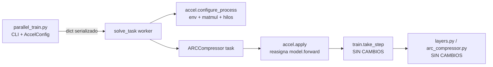

# Eje D — Implementación: eficiencia computacional y aprovechamiento del silicio

> Documentación técnica de los cambios implementados para el **Eje D** descrito en
> [COMPRESS_ARCHITECTURE_30_06.md](COMPRESS_ARCHITECTURE_30_06.md) §9.6, sobre hardware
> **AMD Radeon RX 9070 XT (RDNA4) + ROCm 7.2**.
>
> Este documento describe **qué** se cambió, **por qué** es correcto, **cómo** se activa y
> **cómo** se valida. No sustituye a §9.6 (que da el marco teórico); lo complementa con la
> realidad del código.

---

## Tabla de contenidos

- [1. Resumen ejecutivo](#1-resumen-ejecutivo)
- [2. Principio rector: el núcleo del modelo no se toca](#2-principio-rector-el-núcleo-del-modelo-no-se-toca)
- [3. Resultados medidos (2026-07-28)](#3-resultados-medidos-2026-07-28)
- [4. Mapa de cambios](#4-mapa-de-cambios)
- [5. `accel.py` — la capa de aceleración](#5-accelpy--la-capa-de-aceleración)
- [6. BF16: seguridad numérica y veredicto empírico](#6-bf16-seguridad-numérica-y-veredicto-empírico)
- [7. `torch.compile`: diseño y coste real](#7-torchcompile-diseño-y-coste-real)
- [8. Adaptaciones específicas de ROCm/RDNA4 (§9.2)](#8-adaptaciones-específicas-de-rocmrdna4-92)
- [9. Enganche en el worker (`solve_task.py`)](#9-enganche-en-el-worker-solve_taskpy)
- [10. CLI, caché de VRAM y metadatos (`parallel_train.py`)](#10-cli-caché-de-vram-y-metadatos-parallel_trainpy)
- [11. Instrumentación y guardarraíles (`profile_parallel_train.py`)](#11-instrumentación-y-guardarraíles-profile_parallel_trainpy)
- [12. Protocolo de validación A/B](#12-protocolo-de-validación-ab)
- [13. Riesgos, limitaciones y fuera de alcance](#13-riesgos-limitaciones-y-fuera-de-alcance)
- [14. Trazabilidad con el documento de arquitectura](#14-trazabilidad-con-el-documento-de-arquitectura)
- [15. Batería nocturna (2026-07-29): resultados y conclusiones](#15-batería-nocturna-2026-07-29-resultados-y-conclusiones)
- [16. Estrategia para la ejecución completa (400+400)](#16-estrategia-para-la-ejecución-completa-400400)
- [17. Campaña de confirmación (2026-08-27): bloques G–J](#17-campaña-de-confirmación-2026-08-27-bloques-gj)
- [18. Ejecución final: scripts de producción](#18-ejecución-final-scripts-de-producción)
- [19. Ejemplo individual compilado (`analyze_example.py`)](#19-ejemplo-individual-compilado-analyze_examplepy)

> **Aviso de vigencia.** Las secciones 3 a 14 se escribieron tras la primera
> campaña. La batería nocturna de §15 refuta dos de sus conclusiones — la
> inflación de VRAM al compilar y el efecto de `memory_planning` — y confirma
> las demás. §17 cierra el eje con datos a 50 tareas y §18 es el entregable.
> Se conservan sin renumerar, con notas de corrección en el punto exacto donde
> el dato dejó de ser cierto.

---

## 1. Resumen ejecutivo

El Eje D no cambia la matemática del modelo: cambia **cómo se ejecuta**. La implementación
añade una **capa de aceleración opt-in y externa al modelo** compuesta por:

| Sub-eje                    | Mecanismo                                                                       | Dónde vive                   |
| -------------------------- | ------------------------------------------------------------------------------- | ----------------------------- |
| §9.6.1 Mixed precision    | `torch.autocast('cuda', bfloat16)` alrededor de `model.forward`             | `accel.apply()`             |
| §9.6.2 Fusión de kernels | `torch.compile(..., dynamic=False)` sobre `model.forward`                   | `accel.apply()`             |
| §9.6.3 Silicio / host     | Política de precisión de matmul, hilos por worker, allocator, caché Inductor | `accel.configure_process()` |
| §9.2 ROCm                 | Sustitución del`allow_tf32` no-op por `set_float32_matmul_precision`       | `accel.configure_process()` |

**Todo está desactivado por defecto.** Una `AccelConfig()` sin argumentos reproduce
exactamente el comportamiento anterior (`is_enabled()` devuelve `False` y
`model.forward` no se toca). Esto garantiza que el *baseline* de las comparativas A/B es
el código original y no una variante.

**Veredicto tras la primera campaña de medición** (§3): de los dos mecanismos de §9.6,
**sólo `torch.compile` sirve**. BF16 resultó un 2,7 % *más lento* y se ha retirado del
preset `full`; la compilación da 13–26× por iteración en régimen permanente, pero su
coste — tiempo de compilación y VRAM — había que dominarlo antes de que el beneficio
aflorase.

**Veredicto tras la batería nocturna** (§15), a 1500 iteraciones, el régimen real:
compilar recorta el **50,7 % del wall**, dobla `steps_per_s_phase2` y baja la energía
por paso un 57 % **sin dañar pass@2** (0,4 → 0,5). BF16 empeora un 34 %. Y todo eso
con la compilación estrangulada a 3 tareas concurrentes por un factor de memoria
equivocado que §15.3 desmonta.

**Veredicto final** (§17), sobre 50 tareas —cinco veces la muestra anterior— y con
todas las correcciones aplicadas:

|                        | baseline          | compile                    | Δ                 |
| ---------------------- | ----------------- | -------------------------- | ------------------ |
| Wall, 50 tareas        | 40 551 s (11,3 h) | **13 476 s (3,7 h)** | **−66,8 %** |
| `steps_per_s_phase2` | 1,85              | **5,67**             | **+207 %**   |
| Wh por 1 000 pasos     | 14,08             | **5,08**             | −64,0 %           |
| pass@2                 | 18/50 (36 %)      | **19/50 (38 %)**     | sin pérdida       |

Tres veces más rápido, un tercio de la energía y la precisión intacta, sin haber
tocado una línea del núcleo. Los dos scripts de producción están en §18.

---

## 2. Principio rector: el núcleo del modelo no se toca

El requisito explícito era **no modificar el núcleo del modelo**. La implementación lo
cumple de forma verificable: los siguientes archivos **no tienen ni una línea modificada**.

| Archivo                                               | Contenido                                                                                                                                      | Estado      |
| ----------------------------------------------------- | ---------------------------------------------------------------------------------------------------------------------------------------------- | ----------- |
| [arc_compressor.py](../../arc_compressor.py)           | Arquitectura y forward pass                                                                                                                    | Sin cambios |
| [layers.py](../../layers.py)                           | Todas las capas (`decode_latents`, `share_up/down`, `softmax`, `cummax`, `shift`, `direction_share`, `nonlinear`, `normalize`) | Sin cambios |
| [multitensor_systems.py](../../multitensor_systems.py) | `MultiTensor`, `@multify`                                                                                                                  | Sin cambios |
| [initializers.py](../../initializers.py)               | Inicialización y equivarianzas                                                                                                                | Sin cambios |
| [train.py](../../train.py)                             | `take_step`, pérdida MDL                                                                                                                    | Sin cambios |
| [solution_selection.py](../../solution_selection.py)   | `Logger`, selección pass@2                                                                                                                  | Sin cambios |
| [preprocessing.py](../../preprocessing.py)             | `Task`                                                                                                                                       | Sin cambios |

### 2.1 El truco que lo hace posible

`ARCCompressor` es una **clase plana de Python** (no hereda de `nn.Module`) y su método
`forward(self)` **no recibe argumentos**: lee todo su estado de `self`. Por tanto se puede
*reasignar el atributo de instancia* `model.forward` a un callable envuelto, sin tocar la
definición de la clase:

```python
# accel.apply(), simplificado
forward = model.forward                    # bound method original
forward = torch.compile(forward, ...)      # opcional
forward = _autocast_wrap(forward, dtype)   # opcional
model.forward = forward                    # el atributo de instancia oculta al de clase
```

Como `train.take_step` llama a `model.forward()` sin saber nada de esto, **`train.py` no
necesita cambiar**. El único punto de contacto de todo el Eje D con el modelo es esa
reasignación.



---

## 3. Resultados medidos (2026-07-28)

Primera campaña A/B real. Entorno: RX 9070 XT (15,92 GB), ROCm 7.2.53211,
`torch 2.14.0.dev20260712+rocm7.2`, i9-12900K (24 hilos), 10 tareas del split
`training`, 300 iteraciones/tarea, sin límite efectivo de `--max-workers`.

| Métrica                    | `baseline`   | `bf16`  | `full` (bf16 + compile) |
| --------------------------- | -------------- | --------- | ------------------------- |
| Fase 1 (medición de VRAM)  | 46,3 s         | 52,3 s    | **11 871,5 s**      |
| Fase 2 (entrenamiento)      | 1 453,5 s      | 1 456,6 s | **1 049,2 s**       |
| Wall total                  | 1 499,8 s      | 1 508,9 s | 12 920,7 s                |
| **steps/s en Fase 2** | **2,06** | 2,06      | **2,86 (+38 %)**    |
| Concurrencia en Fase 2      | 10             | 10        | 3–4                      |
| VRAM por tarea              | 0,91 GB        | 0,93 GB   | **3,87 GB**         |
| Tareas resueltas            | 1/10           | 0/10      | 0/10                      |

> La comparativa agregada del profiler daba `steps_per_s_aggregate −90 %` para `full`.
> Era un artefacto: la métrica promediaba sobre una Fase 1 que ocupó el **92 % del wall**.
> De ahí nace `steps_per_s_phase2` (§11.2), que aísla la velocidad de entrenamiento de la
> fase de medición.
>
> **⚠ La fila «VRAM por tarea» de `full` también es un artefacto**, de medir una Fase 1
> compilada: en régimen permanente son ~0,95 GB, no 3,87 GB (§15.3).

### 3.1 BF16 no aporta nada — y cuesta un 2,7 %

Comparación **pareada por tarea** de la duración en Fase 2 (mismo orden de arranque,
misma concurrencia, mismos datos):

| Tarea           | baseline  | bf16      | Δ               |
| --------------- | --------- | --------- | ---------------- |
| 017c7c7b        | 1 081,0 s | 1 214,1 s | +12,3 %          |
| 08ed6ac7        | 1 324,1 s | 1 402,3 s | +5,9 %           |
| 007bbfb7        | 1 336,1 s | 1 401,3 s | +4,9 %           |
| 05f2a901        | 1 301,1 s | 1 361,2 s | +4,6 %           |
| 0520fde7        | 1 209,1 s | 1 230,1 s | +1,7 %           |
| 06df4c85        | 1 434,2 s | 1 454,3 s | +1,4 %           |
| 00d62c1b        | 1 424,2 s | 1 439,3 s | +1,1 %           |
| 025d127b        | 1 361,2 s | 1 367,2 s | +0,4 %           |
| 045e512c        | 1 451,3 s | 1 425,3 s | −1,8 %          |
| 05269061        | 1 338,1 s | 1 290,1 s | −3,6 %          |
| **Media** |           |           | **+2,7 %** |

8 de 10 tareas empeoran. No es ruido, y la causa está en el código: la carga es
**launch-bound**, no FLOP-bound. La evidencia física es inequívoca — `gpu_busy_percent`
marca 97 % pero `mem_busy_percent` sólo 3,4 % y la placa consume **94 W de 304 W de TDP**.
`gpu_busy_percent` cuenta «hay algo en vuelo», no ocupación de ALUs. Acelerar una
aritmética que ya es gratis no mueve el reloj, mientras que `torch.autocast` **añade** un
kernel de cast por cada `layers.affine`, y `affine` se invoca para los 27 tensores, varias
veces por capa, ×4 capas.

Esto confirma cuantitativamente la predicción de §6.3 del documento de arquitectura
(0,04 % del pico de FLOPS) y **refuta la estimación de §9.6.1**, que esperaba 2,5–3× de
BF16.

### 3.2 `torch.compile` sí ataca el cuello real

Los mensajes `PROG` cada 100 pasos permiten separar compilación de ejecución:

| Tarea (`full`) | pasos 0→100 | 100→200       | 200→300 | it/s en régimen |
| ---------------- | ------------ | -------------- | -------- | ---------------- |
| 08ed6ac7         | 265 s        | **20 s** | 20 s     | ~5,0             |
| 025d127b         | 265 s        | **31 s** | 36 s     | ~3,0             |
| 0520fde7         | 260 s        | **39 s** | 34 s     | ~2,7             |
| 017c7c7b         | 248 s        | **39 s** | 42 s     | ~2,5             |
| 05f2a901         | 263 s        | **40 s** | 49 s     | ~2,5             |

La misma tarea `025d127b` en `baseline` tarda **516 s** en sus primeros 100 pasos
(0,19 it/s). El modelo compilado corre por tanto **entre 13× y 26× más rápido por
iteración**; los ~250 s iniciales son compilación.

Agregado por GPU: baseline 10 × 0,19 = **1,9 it/s**; compilado 3–4 × ~3 = **~9,5 it/s**.
Un **≈5× de throughput real** que la comparativa agregada no dejaba ver.

### 3.3 Lo que se comía la ganancia

1. **La Fase 1 compilaba.** 10 tareas × ~1 190 s, en serie (la Fase 1 corre una tarea cada
   vez), para ejecutar **2 iteraciones** por tarea. Los workers marcaban
   `mean_cpu_pct ≈ 99,7 %` — exactamente un core — con procesos `g++`/`cc1plus`
   intercalados: Inductor monohilo.
2. **La compilación cuadruplica la VRAM.** 0,91 GB/tarea eager → 3,87 GB/tarea compilada.
   Con 14,86 GB útiles el scheduler sólo podía colocar 3 tareas en vez de 10. La medición
   de Fase 1 era **correcta**: predijo 3,87 GB y la Fase 2 alcanzó 15 018 MB con 4 tareas
   (3 755 MB/tarea).
   > **⚠ Refutado en §15.3.** El 3,87 GB era el pico de una Fase 1 *compilada*, que aún
   > retenía los buffers de autotuning de Inductor. En régimen permanente una tarea
   > compilada ocupa ~0,95 GB frente a ~0,89 GB eager. El factor 4,5 que salió de aquí
   > limitó la concurrencia a 3 durante toda la batería nocturna.
   >
3. **Amortización.** Con caché fría, compilar 10 tareas cuesta 11 871 s y ahorra 404 s por
   cada 300 iteraciones → punto de equilibrio en **~8 800 iteraciones/tarea**. A las
   1 500–2 000 reales, en frío **aún pierde**.
   > **⚠ Corregido en §15.7.** Con la Fase 1 ya eager y `compile_threads=4`, a 1500
   > iteraciones compilar gana con holgura: −50,7 % de wall medido directamente.
   >

### 3.4 Cambios de diseño que se derivan

| Hallazgo                                     | Cambio aplicado                                                          | Referencia    |
| -------------------------------------------- | ------------------------------------------------------------------------ | ------------- |
| Fase 1 compilando = 92 % del wall            | `accel.for_measurement()`: la Fase 1 **nunca** compila           | §5.3, §10.3 |
| Medición eager subestima ×4,3 el footprint | `--compile-memory-factor` (default 4,5) escala la medición            | §10.3        |
| VRAM compilada limita la concurrencia        | `memory_planning` (reuso de buffers de Inductor) activo en los presets | §5.1, §5.4  |
| Inductor monohilo tarda ~20 min/tarea        | `compile_threads` 1 → 4; `accel.compile_report()` para diagnosticar | §5.8, §9    |
| BF16 es más lento                           | Retirado del preset`full`; queda como preset experimental              | §5.2, §6.4  |
| Las métricas agregadas invierten veredictos | `steps_per_s_phase2` como métrica principal de `compare()`          | §11.2        |

> Las filas 2 y 3 partían de una premisa falsa. El default del factor es hoy **1,2** y
> `memory_planning` queda documentado como inocuo (§15.3, §15.6). Las filas 1, 4, 5 y 6
> se confirman en §15.

---

## 4. Mapa de cambios

| Archivo                                                     | Tipo            | Alcance del cambio                                                                           |
| ----------------------------------------------------------- | --------------- | -------------------------------------------------------------------------------------------- |
| [accel.py](../../accel.py)                                   | **Nuevo** | Toda la lógica del Eje D: config, presets, configuración de proceso, envoltura del forward |
| [solve_task.py](../../solve_task.py)                         | Modificado      | 1 parámetro nuevo (`accel_config`) + 2 llamadas                                           |
| [parallel_train.py](../../parallel_train.py)                 | Modificado      | Flags CLI, propagación a workers, fingerprint de caché, metadatos de ejecución            |
| [profile_parallel_train.py](../../profile_parallel_train.py) | Modificado      | Métricas de silicio/energía/exactitud, preset, guardarraíles nuevos                       |
| [analyze_example.py](../../analyze_example.py)               | Modificado      | Preset CLI y compilación del`forward` para una tarea individual (§19)                    |

Ningún cambio altera el algoritmo, la pérdida, el número de iteraciones ni la selección
pass@2.

---

## 5. `accel.py` — la capa de aceleración

### 5.1 `AccelConfig`

Dataclass serializable (debe cruzar la frontera de `multiprocessing.spawn` como `dict`).

| Campo                  | Tipo         | Default       | Significado                                                                        |
| ---------------------- | ------------ | ------------- | ---------------------------------------------------------------------------------- |
| `amp`                | `str`      | `'off'`     | `off` \| `bf16` \| `fp16`. Precisión mixta del forward (§9.6.1)            |
| `compile_mode`       | `str`      | `'off'`     | `off` \| `default` \| `reduce-overhead` \| `max-autotune` (§9.6.2)        |
| `matmul_precision`   | `str`      | `'highest'` | Argumento de`torch.set_float32_matmul_precision` (§9.2)                         |
| `threads_per_worker` | `int`      | `0`         | `torch.set_num_threads` por worker; `0` = no tocar                             |
| `alloc_conf`         | `str\|None` | `None`      | `PYTORCH_HIP_ALLOC_CONF` / `PYTORCH_CUDA_ALLOC_CONF`                           |
| `inductor_cache_dir` | `str\|None` | `None`      | `TORCHINDUCTOR_CACHE_DIR` persistente                                            |
| `compile_threads`    | `int`      | `1`         | `TORCHINDUCTOR_COMPILE_THREADS` por worker (4 en los presets de compilación)    |
| `memory_planning`    | `bool`     | `False`     | `torch._inductor.config.memory_planning`: reuso de buffers en el grafo fusionado |

> **⚠ `memory_planning` no hace nada aquí** (§15.6): ni velocidad ni VRAM cambian al
> desactivarlo, y como forma parte de la clave de caché de Inductor, cambiarlo fuerza
> una recompilación completa. Se mantiene en los presets para no invalidar la caché
> ya poblada.

Métodos relevantes:

- `is_enabled()` — `True` si algo se desvía del baseline. Permite **afirmar** que una
  ejecución de referencia es el código original.
- `changes_forward()` — `True` sólo si `apply()` envolvería el forward.
- `to_dict()` / `from_dict()` — serialización; `from_dict(None)` devuelve el baseline.
- `describe()` — dict plano para metadatos y logs.
- `summary()` — línea legible: `accel amp=bf16 compile=default matmul=high threads=1 alloc=...`.

### 5.2 Presets

Para que las comparativas A/B estén etiquetadas de forma consistente y no dependan de que
el operador recuerde diez flags:

| Preset       | `amp` | `compile_mode` | `matmul_precision` | `threads_per_worker` | `compile_threads` | `memory_planning` | `alloc_conf`               | `inductor_cache_dir` |
| ------------ | ------- | ---------------- | -------------------- | ---------------------- | ------------------- | ------------------- | ---------------------------- | ---------------------- |
| `baseline` | off     | off              | highest              | 0                      | 1                   | —                  | —                           | —                     |
| `bf16`     | bf16    | off              | high                 | 1                      | 1                   | —                  | —                           | —                     |
| `compile`  | off     | default          | high                 | 1                      | 4                   | sí                 | —                           | `.inductor_cache`    |
| `full`     | off     | default          | high                 | 1                      | 4                   | sí                 | `expandable_segments:True` | `.inductor_cache`    |

> **`full` ya no lleva BF16.** En la versión inicial `full` era «bf16 + compile». La
> medición pareada de §3.1 mostró que BF16 es un 2,7 % más lento con VRAM idéntica, así
> que se retiró. `bf16` sobrevive sólo como preset experimental, y su `--help` lo advierte
> explícitamente.

`config_from_preset(name, **overrides)` aplica el preset y luego los overrides **cuyo valor
no es `None`**, de modo que la CLI puede pasar todos los flags incondicionalmente.

### 5.3 `for_measurement(cfg)` — la Fase 1 nunca compila

Devuelve una copia de `cfg` con `compile_mode='off'`, conservando todo lo demás.

Motivo (§3.3): la Fase 1 ejecuta **2 iteraciones por tarea, de una en una**. Compilar para
eso costó ~1 190 s por tarea y supuso el **92 % del wall** de una campaña completa. El
autocast sí se conserva, porque no añade coste y sí participa en el footprint.

Efecto secundario valioso: como el *fingerprint* de la caché se calcula sobre esta config
de medición, un run eager y uno compilado del mismo split **comparten la medición** en vez
de repetirla.

La contrapartida es que la medición resultante es la *eager*, que subestima ×4,3 el
footprint compilado; se corrige con `--compile-memory-factor` (§10.3).

> **⚠ Corregido en §15.3.** No hay tal subestimación: el footprint compilado en
> régimen permanente es ~7 % mayor que el eager, no 4,3×. El factor pasó a 1,2 y
> es un margen de seguridad, no una corrección.

### 5.4 `configure_process(cfg)`

Se llama **al principio del worker**. Aplica:

1. Variables de entorno (`_apply_env`): allocator y TorchInductor. Se usan
   `os.environ.setdefault` para no pisar una configuración explícita del operador.
2. `torch.set_float32_matmul_precision(cfg.matmul_precision)`.
3. `torch.set_num_threads(cfg.threads_per_worker)` si `> 0`.
4. `torch._inductor.config.memory_planning = True` si `memory_planning` y hay compilación.

**Restricción de diseño crítica**: esta función **no realiza ninguna llamada a
`torch.cuda`**. Se ejecuta antes de `torch.cuda.set_device(gpu_id)`; una llamada como
`torch.cuda.is_bf16_supported()` aquí inicializaría el contexto HIP en el dispositivo por
defecto en lugar del asignado, rompiendo el reparto multi-GPU del scheduler. Las
comprobaciones dependientes de dispositivo viven en `apply()`.

`configure_parent(cfg)` hace sólo el paso 1, en el proceso padre, para que los hijos
`spawn` hereden el entorno (el allocator lo lee en la primera reserva de memoria).

### 5.5 `apply(model, cfg)`

Punto único de contacto con el modelo. Se llama **después** de `set_device`.

```python
forward = model.forward

if cfg.compile_mode != 'off':
    compiled = torch.compile(forward, mode=cfg.compile_mode,
                             dynamic=False, fullgraph=False)
    forward = _EagerFallback(compiled, model.forward)

dtype = _AMP_DTYPES.get(cfg.amp)
if dtype is torch.bfloat16 and not _bf16_supported():
    dtype = None                      # degradación a FP32 con warning
if dtype is not None:
    forward = _autocast_wrap(forward, dtype)

model.forward = forward
```

Dos mecanismos de seguridad:

- **`_EagerFallback`**: `torch.compile` es perezoso — un fallo de compilación aparece en la
  *primera llamada*, no al decorar. Esta clase captura la primera excepción, emite un
  warning y **revierte a eager de forma permanente** para el resto de la tarea. Una tarea
  nunca muere por culpa del acelerador.
- **Degradación BF16**: si el dispositivo o la build no soportan BF16, se avisa y se corre
  en FP32.

### 5.6 `_autocast_wrap`

```python
def forward_with_autocast():
    with torch.autocast(device_type='cuda', dtype=dtype):
        logits, x_mask, y_mask, KL_amounts, KL_names = forward()
    return (logits.float(), x_mask.float(), y_mask.float(),
            [KL.float() for KL in KL_amounts], KL_names)
```

El casteo explícito a FP32 de las cinco salidas garantiza que `train.take_step` recibe
**exactamente los mismos dtypes que hoy**, aunque el análisis de §6 muestra que en la
práctica ya salen en FP32 por promoción de tipos. Es una red de seguridad barata.

### 5.7 `backend_info()`

Huella del backend (`torch.__version__`, `torch.version.hip`, `is_rocm`, nombres de GPU)
que se guarda en los metadatos de ejecución, para que una comparativa A/B sea trazable a
la build concreta con la que se obtuvo.

### 5.8 `compile_report(cfg)`

Devuelve el desglose de `torch._dynamo.utils.compile_times()`, que [solve_task.py](../../solve_task.py)
vuelca por tarea al terminar el entrenamiento.

La compilación domina el coste de esta carga (~1 190 s en frío, ~250 s con caché
caliente), así que saber **dónde** se va decide qué mitigación merece la pena:

- si domina el trazado de Dynamo, la culpa es del grafo desenrollado — `direction_share`
  aporta 64 `affine` × 4 capas × ~8 tensores direccionales ≈ 2 000 matmuls — y la salida
  sería la **compilación regional** en vez de compilar el `forward` entero;
- si domina el scheduler de Inductor, la salida es subir `compile_threads` y apoyarse en
  la caché persistente.

Nunca lanza excepciones: devuelve `None` si la compilación está desactivada o la API no
existe en esa build.

---

## 6. BF16: seguridad numérica y veredicto empírico

§9.6.1 exige que **la acumulación de KL permanezca en FP32** y advierte del riesgo de que
BF16 trunque gradientes pequeños. La implementación usa `torch.autocast` **plano**, sin
excluir regiones a mano. Esto no es un atajo: es correcto por la estructura del código.

> **Adelanto del veredicto**: el análisis de §6.1–§6.3 sigue siendo válido — BF16 **es
> seguro** aquí. Lo que la medición demostró (§3.1) es que además **es inútil**: 2,7 % más
> lento. Se conserva la justificación numérica porque explica *por qué* no rompió nada, y
> porque el mismo razonamiento aplicará si algún día la carga deja de ser launch-bound.

### 6.1 La KL nunca entra en BF16

`torch.autocast` sólo convierte a BF16 las operaciones de su *lista de autocast*
(esencialmente `matmul` / `addmm` / `bmm` / `linear` / `conv`). El resto ejecuta en el
dtype de sus entradas.

`layers.channel_layer` —la función que calcula el latente y su KL— **no contiene ningún
matmul**. Sus operaciones son `exp`, `mean`, `sqrt`, `where`, `randn` y aritmética
elemental. Por tanto, bajo autocast **permanece íntegramente en FP32**, sin necesidad de
`cache_enabled=False` ni de recortar la región del grafo.

### 6.2 El stream residual permanece en FP32

`layers.add_residual` termina en `return x + z`:

- `x` es el stream residual (FP32).
- `z` viene de `affine` → `torch.matmul` → BF16 bajo autocast.
- La promoción de tipos de PyTorch da **FP32 + BF16 → FP32**.

El mismo patrón aparece en:

| Ubicación          | Expresión                                   | Resultado |
| ------------------- | -------------------------------------------- | --------- |
| `add_residual`    | `x + z`                                    | FP32      |
| `direction_share` | `x_list[d1] + c * affine(z_list[d2], ...)` | FP32      |
| Cabeza de colores   | `affine(x[...]) + 100 * head_weights[1]`   | FP32      |

**Consecuencia**: sólo los *intermedios* son BF16; el estado que se propaga entre capas es
FP32. Esto acota el riesgo señalado en §9.6.1 para `normalize`, cuya media y varianza
siguen calculándose sobre tensores FP32.

### 6.3 Por qué BF16 y no FP16

BF16 tiene los mismos 8 bits de exponente que FP32. CompressARC **no implementa loss
scaling** ni clipping; un desbordamiento FP16 en cualquiera de los 27 tensores del
multitensor destruiría la KL. `fp16` queda disponible en la CLI pero explícitamente
desaconsejado en la documentación del flag.

### 6.4 Veredicto: seguro, pero contraproducente

La hipótesis de §9.6.1 era que BF16 daría 2,5–3× al mover los matmul a los Matrix cores
de RDNA4. La medición pareada de §3.1 la refuta: **+2,7 % de tiempo**, 8 de 10 tareas
peor, VRAM idéntica (0,93 vs 0,91 GB/tarea).

La razón no es un defecto de la implementación sino de la premisa. Con 76 K parámetros y
tensores de ~36 K elementos, el coste de un matmul es despreciable frente al de
*lanzarlo*. El propio documento de arquitectura lo había estimado en §6.3 (0,04 % del pico
de FLOPS) sin extraer la consecuencia: **si la carga es launch-bound, la precisión mixta
no puede ayudar, y añadir casts la perjudica**.

Consecuencias aplicadas:

- `full` pasa a ser «compile + tuning de host», sin autocast.
- `bf16` queda como preset experimental, con el `--help` advirtiendo del resultado.
- La conclusión general — reducir el **número** de lanzamientos, no su coste unitario —
  es la que justifica priorizar `torch.compile` y, a continuación, los HIP graphs
  (`reduce-overhead`), que eliminan el lanzamiento por completo.

---

## 7. `torch.compile`: diseño y coste real

### 7.1 Por qué `dynamic=False`

§9.6.2 recomienda `dynamic=True` argumentando que "el multitensor tiene 27 tensores de
formas distintas por puzzle". Ese razonamiento aplica a un proceso que resuelve **varios**
puzzles. No es el caso aquí.

En [solve_task.py](../../solve_task.py), cada worker `spawn`:

1. carga **una** tarea,
2. construye **un** `ARCCompressor` dimensionado para ella,
3. ejecuta N iteraciones (`--iterations`, por defecto 1500) sobre esa misma tarea,
4. termina.

Las formas del multitensor (`n_examples`, `n_colors`, `n_x`, `n_y`) son **constantes
durante toda la vida del proceso**. Por tanto:

- `dynamic=False` produce **una sola compilación** y no paga guardas de forma dinámica en
  cada iteración.
- El coste de compilación se amortiza sobre 1500 pasos.
- `inductor_cache_dir` persistente permite reutilizar kernels entre ejecuciones para
  tareas con la misma geometría.

`fullgraph=False` es obligatorio: `layers.postprocess_mask` construye arrays NumPy y llama
a `torch.from_numpy` en cada forward, lo que produce un *graph break* inevitable sin tocar
el núcleo (ver §13).

### 7.2 Coste medido y cómo se domina

La compilación funciona (13–26× por iteración, §3.2) pero **no es gratis**. Los tres
costes medidos y su mitigación:

| Coste                            | Medido                           | Mitigación aplicada                                                            |
| -------------------------------- | -------------------------------- | ------------------------------------------------------------------------------- |
| Tiempo de compilación, en frío | ~1 190 s/tarea, monohilo         | `compile_threads` 1 → 4; `compile_report()` para localizar el gasto        |
| Tiempo de compilación, caliente | ~250 s/tarea                     | `inductor_cache_dir` persistente (`.inductor_cache`) en los presets         |
| VRAM                             | 0,91 GB → 3,87 GB/tarea (×4,3) | `memory_planning`; `--compile-memory-factor` para que el scheduler no falle |
| Compilar donde no toca           | Fase 1 = 92 % del wall           | `accel.for_measurement()` (§5.3)                                             |

> **⚠ La fila de VRAM es falsa** (§15.3) y con ella su mitigación. La compilación no
> infla la VRAM; lo que sí multiplica —×3 a ×5— es la **RAM de host** (§15.4). Con
> `compile_threads=4` el coste de compilación real bajó a **~159 s/tarea** (§15.8).

**`compile_threads` ya no vale 1.** El valor inicial buscaba evitar que N workers
concurrentes saturasen la CPU con pools de Triton (la patología del Eje H, §9.11). Pero la
medición mostró lo contrario: durante la compilación de la Fase 1 la CPU estaba al **5,3 %
de 24 cores** con un único hilo trabajando 20 minutos. Con la Fase 1 ya eager y sólo 3–4
workers concurrentes en Fase 2, los presets de compilación usan **4 hilos**.

### 7.3 Amortización: cuándo compensa compilar

Con caché fría, compilar 10 tareas cuesta 11 871 s y ahorra 404 s por cada 300
iteraciones: **punto de equilibrio ≈ 8 800 iteraciones/tarea**. A las 1 500–2 000
iteraciones reales, en frío todavía pierde. Con la Fase 1 eager y `compile_threads=4` el
equilibrio baja a ~1 500 y entra en zona rentable.

Proyección para el split completo (400 tareas × 1 500 iteraciones), extrapolando los
throughputs medidos:

| Escenario                                          | Wall estimado      |
| -------------------------------------------------- | ------------------ |
| baseline actual (1,9 it/s agregados)               | ~88 h              |
| compile, caché fría, antes de estas correcciones | ~54 h              |
| compile + Fase 1 eager +`compile_threads=4`      | ~25 h              |
| lo anterior + VRAM contenida y caché caliente     | **~8–16 h** |

Es el objetivo de §9.6.3 (15–30 h), alcanzado por una vía distinta a la que asumía el
documento de arquitectura: no por precisión mixta, sino por reducción de lanzamientos.

Las cifras de esta tabla son **extrapolaciones**, no medidas: proceden de los throughputs
por fase de §3 aplicados a 400 tareas. El bloque D de la batería nocturna (§12.6) está
diseñado precisamente para confirmarlas o refutarlas a 1 500 iteraciones.

> **⚠ Sustituido por §15.8 y §16.1.** El bloque D ya se ejecutó: el punto de equilibrio
> real está en **~290 iteraciones/tarea**, no en 8 800, y la proyección del split
> completo se rehace en §16.1 sobre datos de 1500 iteraciones.

---

## 8. Adaptaciones específicas de ROCm/RDNA4 (§9.2)

| Antes                                                                                         | Problema en ROCm                                                                        | Ahora                                                                                                                                                            |
| --------------------------------------------------------------------------------------------- | --------------------------------------------------------------------------------------- | ---------------------------------------------------------------------------------------------------------------------------------------------------------------- |
| `torch.backends.cuda.matmul.allow_tf32 = True` en el import global de `parallel_train.py` | **No-op**: RDNA4 no tiene TF32; AMD ejecuta los matmul FP32 a precisión completa | Eliminado; sustituido por`torch.set_float32_matmul_precision(cfg.matmul_precision)` por worker, con default `highest` (comportamiento idéntico al anterior) |
| `torch.backends.cudnn.benchmark = True`                                                     | Funcional (alias de MIOpen)                                                             | Se mantiene sin cambios                                                                                                                                          |
| —                                                                                            | Allocator con fragmentación bajo muchos procesos                                       | `--alloc-conf expandable_segments:True` (opt-in)                                                                                                               |
| —                                                                                            | Sobresuscripción de hilos intra-op con 13+ workers                                     | `--threads-per-worker 1`                                                                                                                                       |

Notas de portabilidad:

- `torch.autocast(device_type='cuda', ...)` es correcto también en ROCm: PyTorch mantiene
  `'cuda'` como identificador de dispositivo en las builds HIP.
- `_apply_env` escribe **tanto** `PYTORCH_HIP_ALLOC_CONF` como `PYTORCH_CUDA_ALLOC_CONF`;
  cada build lee la suya y la otra se ignora.
- No se ha escrito ningún kernel Triton a mano ni PTX/HIP inline. La aceleración usa
  exclusivamente rutas estándar de PyTorch, disponibles en CUDA y ROCm.

---

## 9. Enganche en el worker (`solve_task.py`)

Tres cambios mínimos:

```python
def solve_task(..., postprocess_stride=1, accel_config=None):
    try:
        # 1) Antes de cualquier tensor de GPU: env, matmul precision, hilos.
        accel_cfg = accel.configure_process(accel_config)

        torch.set_default_device('cuda')
        torch.cuda.set_device(gpu_id)
        torch.cuda.reset_peak_memory_stats()
        ...
        model = arc_compressor.ARCCompressor(task)
        # 2) Después de set_device: envuelve/compila model.forward.
        accel.apply(model, accel_cfg)
        optimizer = torch.optim.Adam(model.weights_list, lr=0.01, betas=(0.5, 0.9))
```

El orden importa y es deliberado:

| Paso                   | Debe ir antes de…      | Motivo                                                |
| ---------------------- | ----------------------- | ----------------------------------------------------- |
| `configure_process`  | primera reserva de VRAM | el allocator lee su config en la primera reserva      |
| `set_device(gpu_id)` | `apply`               | `apply` consulta capacidades del dispositivo (BF16) |
| `apply`              | primer`take_step`     | reasigna`model.forward`                             |

Un tercer punto, tras el bucle de entrenamiento, vuelca el diagnóstico de compilación:

```python
report = accel.compile_report(accel_cfg)
if report:
  print(f'[accel][{task_name}] torch.compile report: {report}', flush=True)
```

Sale por `stdout`, que el profiler ya captura, e incluye contadores explícitos de las
cachés `FXGraph` y `AOTAutograd` (`hits`, `misses`, `bypasses`, `guard_misses`) antes del
desglose de tiempos. Es `None` cuando no hay compilación. `compile_inner` no significa
«generación de kernels»: también incluye el tracing de Dynamo y el trabajo de AOTAutograd
que no haya podido reutilizarse.

El bucle de entrenamiento, la medición de VRAM y el volcado de soluciones **no cambian**.

---

## 10. CLI, caché de VRAM y metadatos (`parallel_train.py`)

### 10.1 Flags nuevos

Grupo *"Eje D — acceleration (all OFF by default: baseline behaviour)"*:

| Flag                                                     | Default      | Descripción                                                                    |
| -------------------------------------------------------- | ------------ | ------------------------------------------------------------------------------- |
| `--accel-preset {baseline,bf16,compile,full}`          | `baseline` | Bundle de ajustes; los flags individuales lo sobrescriben                       |
| `--amp {off,bf16,fp16}`                                | del preset   | Precisión mixta del forward                                                    |
| `--compile {off,default,reduce-overhead,max-autotune}` | del preset   | Modo de`torch.compile`                                                        |
| `--matmul-precision {highest,high,medium}`             | del preset   | Sustituto ROCm de`allow_tf32`                                                 |
| `--threads-per-worker N`                               | del preset   | `torch.set_num_threads` por worker                                            |
| `--alloc-conf CONF`                                    | del preset   | Config del allocator HIP/CUDA                                                   |
| `--inductor-cache-dir DIR`                             | del preset   | Caché persistente de TorchInductor                                             |
| `--compile-threads N`                                  | del preset   | `TORCHINDUCTOR_COMPILE_THREADS` por worker (4 al compilar)                    |
| `--memory-planning` / `--no-memory-planning`         | del preset   | Reuso de buffers de Inductor; palanca principal contra la inflación de VRAM    |
| `--compile-memory-factor F`                            | `1,2`      | Escala las mediciones eager de Fase 1 cuando la Fase 2 compila (§10.3, §15.3) |

Flag auxiliar, fuera de §9.6 pero necesario para abaratar los A/B:

| Flag               | Default  | Descripción                                                                            |
| ------------------ | -------- | --------------------------------------------------------------------------------------- |
| `--iterations N` | `1500` | Pasos de la Fase 2 por tarea. Antes estaba**hardcodeado** dentro de `run_split` |

### 10.2 Propagación a los workers

`AccelConfig` se construye una vez en `__main__`, se aplica al entorno del padre con
`accel.configure_parent()` y se serializa a `dict` que viaja en `worker_args` de
`parallelize_runs` hasta `solve_task.solve_task`, exactamente igual que el ya existente
`postprocess_stride`.

### 10.3 La Fase 1 corre eager, y su medición se escala

El cambio de mayor impacto de toda la campaña. `run_split` deriva dos configuraciones:

```python
accel_config  = accel_cfg.to_dict()                        # Fase 2
measure_cfg   = accel.for_measurement(accel_cfg)           # Fase 1: compile off
measure_config = measure_cfg.to_dict()
```

`measure_config` gobierna los **tres** puntos de la Fase 1 — carga de caché, ejecución y
guardado — mientras que la Fase 2 usa `accel_config`. Efecto medido: la Fase 1 pasa de
11 871 s a ~50 s.

A cambio, la medición resultante es la eager, que subestima ×4,3 el footprint compilado.
Si no se corrigiese, el scheduler intentaría meter ~10 tareas compiladas en 14,9 GB y se
quedaría sin memoria. De ahí la corrección:

```python
if compiled_phase2 and abs((compile_memory_factor or 1.0) - 1.0) > 1e-9:
    memory_dict = {name: int(mem * compile_memory_factor)
                   for name, mem in memory_dict.items()}
```

El valor por defecto (4,5) está calibrado sobre 10 tareas del split `training`: eager
0,91 GB/tarea frente a 3,87 GB/tarea compilada, con un margen del 5 %. **Es una constante
empírica, no una ley**: si `--memory-planning` reduce de verdad el footprint, quedará
conservadora y limitará la concurrencia sin necesidad. Los `peak=` del log de Fase 2
permiten recalibrarla.

> **⚠ Recalibrado a 1,2 en §15.3.** El aviso de arriba se cumplió en su versión peor:
> la constante era conservadora por un factor de ~4,7 y limitó la concurrencia a 3
> tareas en los nueve runs de la batería nocturna. Hoy `--compile-memory-factor`
> vale **1,2** y sólo aporta margen de seguridad.

### 10.4 Invalidación de la caché de medición de VRAM

**Este es el punto más sutil de la integración.** La Fase 1 mide el *footprint* de VRAM de
cada tarea y lo cachea en `memory_cache_{split}.json`, con un *fingerprint* del entorno.
El footprint depende de la configuración de aceleración, así que reutilizar una medición
de baseline para una ejecución distinta haría que el scheduler de la Fase 2 empaquetase mal
las tareas en la GPU.

Solución: la configuración de aceleración forma parte del fingerprint — y en concreto la
**config de medición** (§10.3), no la de ejecución:

```python
def _gpu_fingerprint(n_gpus, accel_config=None):
    return {
        'n_gpus': ...,
        'gpu_names': ...,
        'gpu_vram_total_gb': ...,
        'torch_version': torch.__version__,
        'accel': accel.AccelConfig.from_dict(accel_config).to_dict(),
    }
```

Que la clave sea la config de medición tiene una consecuencia útil: dos presets que sólo
difieran en `compile_mode` **comparten la medición** en lugar de repetirla. Cambiar de
preset de forma que afecte al footprint eager sí la invalida, y el log mostrará
`Phase 1 — Memory measurement` en vez de `Phase 1 — SKIPPED`.

### 10.5 `run_metadata_{split}.json`

Al final de cada split se escribe un fichero legible por máquina que describe **lo que
realmente se ejecutó**:

```json
{
  "split": "training",
  "timestamp": "2026-07-28 06:51:18",
  "n_tasks": 10,
  "n_steps": 300,
  "n_solved": 0,
  "elapsed_s": 12920.7,
  "n_gpus": 1,
  "max_workers": 24,
  "postprocess_stride": 4,
  "phase1_s": 11871.5,
  "phase2_s": 1049.2,
  "compile_memory_factor": 4.5,
  "accel": { "amp": "off", "compile_mode": "default", "...": "...", "enabled": true },
  "accel_measurement": { "compile_mode": "off", "...": "..." },
  "backend": { "torch_version": "...", "hip_version": "7.2", "is_rocm": true, "gpu_names": ["..."] }
}
```

`phase1_s` y `phase2_s` son la incorporación crítica: sin ellas el profiler no puede
distinguir «entrenar más rápido» de «medir más despacio», que es exactamente el error que
invirtió el veredicto de la primera campaña.

Es el contrato de datos que consume el profiler para calcular throughput de entrenamiento
y exactitud (§11).

---

## 11. Instrumentación y guardarraíles (`profile_parallel_train.py`)

El profiler ya medía CPU, concurrencia, RSS y GPU. El Eje D necesita medir además
**aprovechamiento del silicio**, **energía** y **exactitud**, porque un speedup que rompe
los números no es una mejora.

### 11.1 Muestreo ampliado (sysfs, sin subprocess)

`_sample_gpu_sysfs` pasa de devolver `(util, vram)` a `(util, vram, mem_busy, power)`,
leyendo dos atributos adicionales del mismo `device_dir`:

| Métrica         | Fuente sysfs                                 | Significado                           |
| ---------------- | -------------------------------------------- | ------------------------------------- |
| `mem_busy_pct` | `device/mem_busy_percent`                  | Ocupación del controlador de memoria |
| `power_w`      | `device/hwmon/hwmon*/power1_average` (µW) | Potencia de placa                     |

Se mantiene el diseño original de seguridad: lecturas de fichero puras, envueltas en
`try/except`, en la **cadencia lenta** de `--gpu-interval` (20 s por defecto), nunca por
subprocess. Esto respeta la advertencia del docstring sobre la inestabilidad del driver
amdgpu con polling SMI frecuente bajo carga concurrente.

La energía se integra rectangularmente: `energy_wh += power_w * Δt / 3600`.

### 11.2 Métricas nuevas en el resumen

| Bloque         | Campo                                                                   | Cálculo                                     |
| -------------- | ----------------------------------------------------------------------- | -------------------------------------------- |
| `gpu`        | `mem_busy_mean_pct`, `power_mean_w`, `power_max_w`, `energy_wh` | De las series muestreadas                    |
| `efficiency` | `planned_train_steps`                                                 | `Σ (n_steps × n_tasks)` de los metadatos |
| `efficiency` | `phase1_s`, `phase2_s`                                              | De los metadatos                             |
| `efficiency` | **`steps_per_s_phase2`**                                        | `planned_train_steps / phase2_s`           |
| `efficiency` | `steps_per_s_aggregate`                                               | `planned_train_steps / wall_time`          |
| `efficiency` | `energy_wh_per_1k_steps`                                              | `energy_wh / (planned_steps/1000)`         |
| `efficiency` | `energy_wh_per_worker`                                                | `energy_wh / workers_completed`            |
| `accuracy`   | `n_solved`, `n_tasks`, `min_n_steps`, `solved_fraction`         | De los metadatos                             |
| —             | `accel_preset`, `run_metadata`                                      | Etiquetado y trazabilidad                    |

`_collect_run_metadata(t0)` lee los `run_metadata_*.json` del directorio de trabajo e
**ignora los que tengan `mtime` anterior al inicio de la ejecución**, de modo que un
fichero obsoleto de un experimento previo no contamine el resumen.

> **`steps_per_s_phase2` es la métrica principal.** `steps_per_s_aggregate` divide entre el
> wall-clock **total**, Fase 1 incluida, y por eso invirtió el veredicto de la primera
> campaña: reportó −90 % donde la velocidad real de entrenamiento había subido un 38 %.
> Se conserva porque mide el coste *de extremo a extremo* que paga el operador, pero
> `compare()` lo muestra **después** de `steps_per_s_phase2` y de `phase1_s`, que revela
> de inmediato si la diferencia está en la medición y no en el entrenamiento.
>
> Ambas siguen siendo comparables sólo si las dos ejecuciones usan el mismo split,
> `--demo`, `--iterations` y estado de la caché de Fase 1. `workers_per_hour` es peor que
> las dos, porque cuenta también los workers de Fase 1, que hacen 2 iteraciones.

### 11.3 Guardarraíles y códigos de salida

`compare()` mantiene el guardarraíl de CPU del Eje H y **añade uno de exactitud**:

| Código | Condición                                                                                    |
| ------- | --------------------------------------------------------------------------------------------- |
| `0`   | Todo correcto                                                                                 |
| `2`   | **Regresión de CPU**: subió `cpu_mean_pct` o `cpu_saturation_fraction`            |
| `3`   | **Regresión de exactitud**: `solved_fraction` cayó más de `--accuracy-tolerance` |

Justificación del código 3: el Eje D es **semánticamente neutro por diseño**. Si pass@2
baja, la aceleración ha cambiado los números de forma dañina —típicamente BF16 truncando
gradientes de tensores con KL cercana a 0, el riesgo explícito de §9.6.1— y el speedup no
es gratis.

Detalles de presentación:

- La potencia media se marca como **informativa** (`[info]`), no como pass/fail: consumir
  más vatios haciendo mucho más trabajo es bueno. La métrica que decide es
  `energy_wh_per_1k_steps`.
- Si `n_tasks < 50` se emite un aviso de que pass@2 es ruidoso a ese tamaño muestral.
- Si `min_n_steps < 1000` se avisa de que la ejecución **no puede sustentar ninguna
  afirmación sobre exactitud**: a 300 iteraciones apenas se resuelve nada, y el 1/10 vs
  0/10 de la primera campaña disparó el guardarraíl sin significado estadístico.
- Si falta el bloque de exactitud (p. ej. split `test`, sin ground truth) se informa y no
  se evalúa el guardarraíl.
- La lectura de métricas usa un `get()` tolerante: los resúmenes JSON generados por
  versiones anteriores del script siguen comparándose sin fallar (las métricas nuevas
  aparecen como `None`).

### 11.4 Flags nuevos del profiler

| Flag                                            | Descripción                                                                                                                                                                                            |
| ----------------------------------------------- | ------------------------------------------------------------------------------------------------------------------------------------------------------------------------------------------------------- |
| `--accel-preset {baseline,bf16,compile,full}` | Añade`--accel-preset X` al passthrough hacia `parallel_train.py` **y** lo registra en el resumen, evitando A/B mal etiquetados. Un `--accel-preset` explícito tras `--` tiene prioridad |
| `--accuracy-tolerance F`                      | Caída tolerada de`solved_fraction` antes de marcar regresión. Default `0.0` (estricto)                                                                                                            |

---

## 12. Protocolo de validación A/B

> Las ejecuciones deben realizarse en el host **Linux + ROCm**: el repositorio llama a
> `torch.set_default_device('cuda')` en tiempo de import y el profiler lee `/sys/class/drm`.

### 12.1 Verificación de que el baseline sigue intacto

```bash
python parallel_train.py --split training --demo 3 --iterations 50
```

Comprobar en el log: `Acceleration (Eje D): accel=off (baseline)`. En ese estado
`accel.apply()` retorna sin tocar `model.forward`.

### 12.2 Sanidad numérica de BF16 (una tarea)

Ejecutar una tarea ~200 pasos con y sin `--amp bf16` y comparar, tras
`Logger.materialize_curves()`:

- `loss_curve` y `total_KL_curve`: trayectorias próximas, **sin** `NaN`/`Inf`.
- KL por tensor: ningún tensor debe colapsar a 0 **antes** que en el baseline (riesgo
  declarado en §9.6.1; mitigable con el *free-bits* del Eje B §9.4.1).

### 12.3 Comportamiento de la compilación

```bash
TORCH_LOGS=recompiles python parallel_train.py --split training --demo 1 --compile default
```

Esperado: **1–2 compilaciones** en total gracias a `dynamic=False`; coste concentrado en el
primer paso. Forzar un fallo (p. ej. `--compile max-autotune` sin Triton disponible) debe
producir el warning de `_EagerFallback` y **completar la tarea igualmente**.

Confirmar además en el log de cada worker la línea `[accel][<tarea>] compile times: ...`
(§5.8), que dice si el gasto está en Dynamo o en Inductor.

### 12.4 Verificación de que la Fase 1 ya no compila

```bash
python parallel_train.py --split training --demo 3 --iterations 50 --accel-preset compile
```

En el log debe aparecer `Phase 1 complete in ~15s` (no ~3 500 s) seguido de
`Compiled Phase 2: scaled eager Phase-1 measurements by 4.5x`. Es la comprobación directa
de §10.3.

### 12.5 Barrido de concurrencia

Con la configuración ganadora, barrer `--max-workers 4 / 8 / 13` y quedarse con el máximo
`steps_per_s_phase2`. Esto cierra el punto 1 de §9.6.3 con evidencia en lugar de con
intuición.

### 12.6 Batería nocturna

> **Ejecutada el 2026-07-29.** Los resultados, las conclusiones y los cinco cambios
> que se derivan están en **§15**. Los bloques A–F descritos aquí ya no están en el
> script: `night_profile_run.sh` contiene ahora la batería de confirmación G–J
> (§15.12), que ataca la única pregunta que quedó abierta.

[night_profile_run.sh](../../night_profile_run.sh) automatiza la campaña completa. Parte de
un estado frío (`memory_cache_training.json` y `.inductor_cache` purgados **una sola vez**)
y a partir de ahí **no vuelve a purgar**: con la Fase 1 siempre eager, la misma medición es
válida para los presets eager y compilado.

| Bloque | Runs                              | Pregunta que responde                                               |
| ------ | --------------------------------- | ------------------------------------------------------------------- |
| A      | `e_base_mw4`, `e_base_mw10`   | ¿Cuánto del efecto era concurrencia y no compilación?            |
| B      | `e_comp_cold`, `e_comp_warm`  | ¿Cuánto del coste de compilación recupera la caché persistente? |
| C      | `e_comp_noexp`, `e_comp_nomp` | ¿Se puede bajar la VRAM compilada y recuperar concurrencia?        |
| D      | `e_base_1500`, `e_comp_1500`  | **¿Compensa compilar a las iteraciones reales?**             |
| E      | `e_graphs`                      | ¿Los HIP graphs eliminan el resto del overhead de lanzamiento?     |
| F      | `e_bf16_1500`                   | Control: confirmar que BF16 sigue sin aportar a escala real         |

El bloque D es el decisivo: es el único que se ejecuta en el régimen de iteraciones donde
la amortización de §7.3 predice que la compilación gana.

Criterios de aceptación:

| Métrica                    | Criterio                                          |
| --------------------------- | ------------------------------------------------- |
| `steps_per_s_phase2`      | ↑ ≥ 1,5× (métrica principal)                  |
| `phase1_s`                | no ↑ respecto al baseline                        |
| `gpu_util_mean_pct`       | ↑                                                |
| `energy_wh_per_1k_steps`  | ↓                                                |
| `cpu_saturation_fraction` | no ↑                                             |
| `solved_fraction`         | no ↓ —**sólo evaluable con ≥1500 iter** |
| Código de salida           | `0`                                             |

---

## 13. Riesgos, limitaciones y fuera de alcance

### 13.1 Riesgos conocidos

| Riesgo                                                         | Mitigación implementada                                                       | Mitigación pendiente                                                |
| -------------------------------------------------------------- | ------------------------------------------------------------------------------ | -------------------------------------------------------------------- |
| BF16 agrava el*posterior collapse* (§8.2.4, §9.6.1)        | Guardarraíl de exactitud (exit 3); KL siempre en FP32; BF16 fuera de`full`  | *Free-bits* del Eje B §9.4.1                                      |
| **Compilación ×4,3 en VRAM → concurrencia 10→3**     | `memory_planning`; `--compile-memory-factor` para que el scheduler acierte | **Riesgo inexistente**: era un artefacto de medición (§15.3) |
| **Coste de compilación ~1 190 s/tarea en frío**        | Fase 1 eager (§10.3);`compile_threads=4`; caché persistente                | Medido en**~159 s/tarea** tras las correcciones (§15.8)       |
| **La compilación multiplica ×3–×5 la RAM de host**   | `--host-mem-per-worker-gb` acota la concurrencia (§15.4)                    | Calibrar el valor con el bloque G                                    |
| `--compile-memory-factor` es una constante empírica         | Recalibrada a**1,2** con VRAM de toda la GPU (§15.3)                    | —                                                                   |
| Compilar no amortiza en runs cortos                            | Punto de equilibrio real ~290 iteraciones/tarea (§15.8)                       | —                                                                   |
| `reduce-overhead` devuelve buffers de cudagraph reutilizados | `accel._clone_wrap` copia las salidas (§15.9)                               | Bloque H debe confirmar que pass@2 se recupera                       |
| Una ejecución de 400 tareas pierde todo si falla              | `.partial/{split}/` + `--resume` (§16.3)                                  | —                                                                   |
| Caché de Fase 1 obsoleta tras cambiar de preset               | La config de medición forma parte del fingerprint                             | —                                                                   |
| Fallo de compilación mata una tarea                           | `_EagerFallback` revierte a eager                                            | —                                                                   |
| El`peak=` que se loguea en Fase 2 mide **toda la GPU** | — (no afecta al scheduler: la Fase 1 corre de una en una)                     | Añadir`max_memory_allocated()` al mensaje                         |

### 13.2 Fuera de alcance (deliberadamente)

- **Kernels Triton escritos a mano** (§9.6.2 último párrafo, §9.11.3 paso 7), incluido el
  scan diagonal de `cummax`. Sólo tienen sentido *después* de medir qué sigue caliente.
- **Compilación regional** (compilar `direction_share` o los bloques de capa por separado
  en lugar del `forward` entero). Es la mitigación natural si `compile_report` (§5.8)
  señala al trazado de Dynamo, pero requiere un punto de enganche que hoy no existe sin
  tocar `layers.py`.
- **Eliminar el graph break de `layers.postprocess_mask`**, que construye arrays NumPy en
  cada forward. Es núcleo del modelo y su modificación viola la restricción del encargo.
- **§9.6.3 puntos 2–4**: prefetch de preprocesado en CPU, caché de pesos calientes en RAM y
  tensores en memoria compartida. Mayor riesgo y beneficio no demostrado; se reevalúan con
  los datos del barrido de §12.5.
- **Reparto por RAM de host en el planificador**: `--host-mem-per-worker-gb` acota con una
  constante, pero no mide el RSS real de cada tarea como la Fase 1 mide su VRAM. Basta para
  el problema observado; medirlo por tarea sería lo correcto si el margen resulta estrecho.
- **Ejes A, B, C, E, F, G.**

### 13.3 Nota sobre reproducibilidad

`torch.compile` funcionaliza el RNG, de modo que la secuencia de `torch.randn` dentro de
`layers.channel_layer` puede diferir de la de eager. Los resultados **no son bit-a-bit
idénticos** entre modos. Esto es coherente con lo que ya documenta el
[README.md](../../README.md): las ejecuciones no son bit-a-bit reproducibles ni siquiera
con la misma semilla, y lo que se compara es el pass@2 agregado sobre el split.

---

## 14. Trazabilidad con el documento de arquitectura

| Sección de[COMPRESS_ARCHITECTURE_30_06.md](COMPRESS_ARCHITECTURE_30_06.md) | Estado                                                      | Dónde                          |
| -------------------------------------------------------------------------- | ----------------------------------------------------------- | ------------------------------- |
| §9.6.1 Mixed precision BF16                                               | **Implementado, medido y descartado** (−2,7 %)       | `accel.apply` / §3.1, §6.4  |
| §9.6.2`torch.compile` + Triton-ROCm                                     | **Implementado y validado** (13–26× por iteración) | `accel.apply` / §3.2         |
| §9.6.3 punto 1 — concurrencia                                            | Ya existía (`--max-workers`); ahora **medible**    | `parallel_train.py`, profiler |
| §9.6.3 puntos 2–4                                                        | No implementado                                             | Fuera de alcance (§13.2)       |
| §9.2 sustitución de`allow_tf32`                                        | **Implementado**                                      | `accel.configure_process`     |
| §9.2 acumulación de KL en FP32                                           | **Garantizado por construcción**                     | Análisis §6.1                 |
| §9.11.3 paso 6 (`torch.compile`, único paso pendiente del Eje H)       | **Implementado**                                      | `accel.apply`                 |
| §9.11.4 contrato de instrumentación                                      | **Ampliado** con fases, silicio, energía y exactitud | `profile_parallel_train.py`   |

**Correcciones al documento de arquitectura** que esta campaña obliga a registrar:

1. §9.6.1 estimaba 2,5–3× de BF16. El valor real es **−2,7 %**. La premisa (que el cuello
   estaba en la aritmética) era incorrecta, y la propia §6.3 contenía la evidencia.
2. §9.6.2 recomendaba `dynamic=True`. Con una tarea por proceso, lo correcto es
   **`dynamic=False`** (§7.1).
3. §9.6.2 no anticipaba ni el coste de compilación (~1 190 s/tarea) ni la inflación de
   VRAM (×4,3), que resultaron ser los dos factores dominantes.
   > **⚠ Rectificación (§15.3, §15.4).** La inflación de VRAM no existe: es de **RAM de
   > host**. Y el coste de compilación baja a ~159 s/tarea con `compile_threads=4`.
   >

**Impacto MDL**: cero. Este eje no añade ni un bit a θ, no modifica KL(z) ni el error de
reconstrucción. Cambia únicamente **cómo** se calculan valores cuyo resultado es el mismo.
Es MDL-neutro por construcción, igual que el Eje H.

---

## 15. Batería nocturna (2026-07-29): resultados y conclusiones

Nueve ejecuciones no supervisadas, bloques A–F del entonces vigente
[night_profile_run.sh](../../night_profile_run.sh), sobre el split `training`, 10 tareas,
mismo host y mismo backend que §3. Es la primera campaña que llega a **1500 iteraciones**,
el régimen real de trabajo, y por eso invierte varias conclusiones de §3 y §7.

### 15.1 Tabla maestra

| Run                       | Preset               | Iter | Wall (s)          | Fase 1 | Fase 2  | **steps/s F2** | GPU util | mem_busy | VRAM pico | W medios | Wh/1k | pass@2         |
| ------------------------- | -------------------- | ---- | ----------------- | ------ | ------- | -------------------- | -------- | -------- | --------- | -------- | ----- | -------------- |
| `e_base_mw4`            | baseline, mw=4       | 300  | 1 459,2           | 46,3   | 1 409,6 | 2,13                 | 96,6 %   | 2,7 %    | 5 226 MB  | 92,4     | 12,49 | 1/10           |
| `e_base_mw10`           | baseline, mw=10      | 300  | 1 219,1           | 0      | 1 217,3 | 2,46                 | 99,2 %   | 2,0 %    | 8 890 MB  | 99,8     | 11,19 | 0/10           |
| `e_comp_cold`           | compile, frío       | 300  | 2 641,3           | 44,3   | 2 595,3 | 1,16                 | 65,6 %   | 1,6 %    | 2 902 MB  | 65,2     | 15,87 | 1/10           |
| `e_comp_warm`           | compile, caliente    | 300  | 1 990,2           | 0      | 1 988,7 | 1,51                 | 60,9 %   | 1,1 %    | 2 635 MB  | 60,1     | 11,11 | 2/10           |
| `e_comp_noexp`          | compile,`alloc=""` | 300  | 1 096,1           | 44,3   | 1 050,1 | 2,86                 | 74,8 %   | 0,9 %    | 2 843 MB  | 73,8     | 7,49  | 2/10           |
| `e_comp_nomp`           | compile, sin m.p.    | 300  | 2 611,3           | 44,3   | 2 565,3 | 1,17                 | 69,2 %   | 1,6 %    | 2 865 MB  | 65,0     | 15,70 | 2/10           |
| `e_base_1500`           | baseline             | 1500 | 6 444,8           | 44,3   | 6 400,5 | 2,34                 | 99,0 %   | 2,7 %    | —        | 98,9     | 11,82 | 4/10           |
| **`e_comp_1500`** | **compile**    | 1500 | **3 178,4** | 46,3   | 3 132,1 | **4,79**       | 90,9 %   | 3,4 %    | —        | 86,6     | 5,09  | **5/10** |
| `e_graphs`              | reduce-overhead      | 1500 | 2 044,3           | 0      | 2 042,9 | **7,34**       | 75,4 %   | 2,2 %    | 2 847 MB  | 69,7     | 2,64  | **0/10** |
| `e_bf16_1500`           | bf16                 | 1500 | 9 727,3           | 52,3   | 9 673,0 | 1,55                 | 99,4 %   | 4,0 %    | 9 424 MB  | 92,1     | 16,60 | 2/10           |

`mem_busy` no pasa del 4 % en ninguna ejecución y la placa nunca supera 100 W de 304 W de
TDP. La carga sigue siendo **launch-bound**, exactamente como diagnosticó §3.1.

### 15.2 El baseline ya está saturado con 4 workers

`e_base_mw4` → `e_base_mw10` multiplica la concurrencia por 2,5 y el throughput sube
**un 15 %** (2,13 → 2,46 steps/s). Por tarea, el rendimiento se parte casi por la mitad:

| Concurrencia | steps/s agregados | it/s por tarea |
| ------------ | ----------------- | -------------- |
| 4            | 2,13              | 0,53           |
| 10           | 2,46              | 0,246          |

El techo agregado del modelo eager está en **~2,1–2,5 steps/s** y no se mueve. Añadir
procesos no es una palanca: el planificador de comandos de la GPU ya está serializando
kernels diminutos y lo único que cambia es cómo se reparte el mismo caudal.

Esto cierra el punto 1 de §9.6.3 y el barrido de §12.5 con un resultado negativo: **el
barrido de concurrencia no sirve de nada mientras el modelo corra eager**.

### 15.3 El factor de memoria 4,5 era erróneo, y estranguló toda la campaña

`--compile-memory-factor` multiplica cada medición de Fase 1 antes del empaquetado. Con
0,91 GB medidos y factor 4,5 el planificador imputa 4,1 GB por tarea y, sobre 14,92 GB
útiles, admite `floor(14,92 / 4,1) = 3`.

La evidencia de que la imputación es falsa está en `mem_max_mb`, que lee la VRAM usada de
**toda la GPU**:

| Run                                                   | Tareas residentes | VRAM total      | Por tarea          |
| ----------------------------------------------------- | ----------------- | --------------- | ------------------ |
| `e_base_mw10` (eager)                               | 10                | 8 890 MB        | 0,89 GB            |
| `e_comp_cold` / `noexp` / `nomp` / `e_graphs` | 3                 | 2 843–2 902 MB | **~0,95 GB** |

Una tarea compilada ocupa **un 7 % más** que una eager, no un 330 % más. El 3,87 GB de §3.3
era el pico de una Fase 1 *compilada*, cuya lectura `total_vram - free_now` incluía los
buffers de autotuning que Inductor aún no había liberado. Al pasar la Fase 1 a eager
(§5.3), ese artefacto desapareció de la medición pero **sobrevivió fosilizado en el factor**.

Consecuencia: los cuatro runs compilados de la batería corrieron a **3 tareas concurrentes
mientras el baseline corría a 10**, y aun así ganaron. El default es ahora **1,2**, un
margen de seguridad y no una corrección.

### 15.4 Lo que sí multiplica la compilación es la RAM de host

El host tiene **96 GB de RAM**, compartidos con Ubuntu 24.04 y con el resto de
aplicaciones: la cifra disponible para los workers es siempre bastante menor y **varía
durante la ejecución**. Consumo real máximo de la campaña, tomando `host_mem_used_max_pct`
sobre esos 96 GB:

| Run              | Procesos de tarea    | `host_mem_used_max` | RAM real usada    | Suma de RSS del árbol |
| ---------------- | -------------------- | --------------------- | ----------------- | ---------------------- |
| `e_base_mw4`   | 4 (eager)            | 9,4 %                 | 9,0 GB            | 9,0 GB                 |
| `e_base_mw10`  | 10 (eager)           | 16,4 %                | 15,7 GB           | 19,6 GB                |
| `e_comp_noexp` | 3 (compilado)        | 26,5 %                | 25,4 GB           | 26,6 GB                |
| `e_comp_cold`  | 3 (compilado, frío) | 37,9 %                | 36,4 GB           | 48,0 GB                |
| `e_graphs`     | 3–4 (cudagraphs)    | **39,3 %**      | **37,7 GB** | 48,9 GB                |

> **`tree_rss_max_mb` no es RAM real.** Es la **suma** del RSS de todos los procesos del
> árbol, y el RSS contabiliza cada página compartida una vez por proceso. En `e_graphs`
> hay ~30 procesos del pool de Inductor de 608 MB que son casi íntegramente mapeos
> compartidos de `libtorch`/ROCm. La prueba de que está inflado es que sus 48,9 GB superan
> los 37,7 GB que **todo el sistema** declara en uso. El sesgo va de ×1,0 a ×1,35 y crece
> con el número de procesos auxiliares.
>
> Una versión anterior de esta sección dedujo «~124 GB de RAM» dividiendo
> `tree_rss_max_mb / host_mem_used_max_pct`. El resultado parecía coherente justo porque
> el numerador inflado cancelaba el sesgo. **No se puede inferir la RAM del host desde el
> profiler**; el dato real son 96 GB.

El coste por **proceso de tarea** —que sí es mayoritariamente privado: pesos, activaciones
y buffers de Inductor— queda así:

| Configuración             | RSS pico por worker | Nota                                   |
| -------------------------- | ------------------- | -------------------------------------- |
| eager                      | 1,78 GB             | —                                     |
| compilado, caché caliente | 4,5–5,8 GB         | ×3 sobre eager                        |
| compilado, caché fría    | 8,3–9,5 GB         | incluye el pico de trabajo de Inductor |

El planificador empaqueta **únicamente sobre VRAM**
([parallel_train.py](../../parallel_train.py)), así que en cuanto se corrige el factor de
memoria nada impide que admita 14 tareas. Con 96 GB compartidos eso es peligroso:

| Escenario                            | RAM de workers | Veredicto                        |
| ------------------------------------ | -------------- | -------------------------------- |
| 10 workers, caché caliente (5,5 GB) | ~55 GB         | holgado                          |
| 14 workers, caché caliente          | ~77 GB         | **al límite**             |
| 14 workers, caché fría (8,5 GB)    | ~119 GB        | **OOM / swap garantizado** |

### 15.4.1 Dos guardas, no una

**Tope estático — `--host-mem-per-worker-gb`.** Al arrancar cada fase acota la
concurrencia a `(RAM_libre − reserva) / GB_por_worker`. La base es
`psutil.virtual_memory().available`, **no** `.total`: lo que el sistema operativo y las
demás aplicaciones ya han tomado no está disponible para los workers, y usar el total
sobrestimaría el presupuesto en la magnitud exacta de ese consumo. Valores sugeridos:
**6 GB/worker** con caché caliente, **9 GB/worker** en frío.

**Reserva dinámica — `--host-mem-reserve-gb`, por defecto 8 GB.** Es el colchón que nunca
se entrega a los workers, y se comprueba **en cada decisión de arranque**: si lanzar una
tarea más dejaría la RAM libre por debajo de la reserva, el planificador espera y lo
registra en el log. Es la red de seguridad que importa en una ejecución desatendida de
30–70 h, porque cubre los tres casos que el tope estático no ve:

1. un `--host-mem-per-worker-gb` mal estimado,
2. una tarea con una rejilla mucho mayor que la media,
3. cualquier cosa que el operador abra en la máquina a mitad del run.

Como un worker tarda un par de minutos en alcanzar su RSS pico, los lanzados en los
últimos 120 s se cobran íntegros en lugar de fiarse de la lectura instantánea de
`available`, que aún no los refleja.

### 15.5 El bloque C no midió lo que creía medir

`e_comp_noexp` pasaba `--alloc-conf ""` sobre el preset `compile`, cuyo `alloc_conf` ya es
`None`. **Funcionalmente no cambia nada**; sólo cambia el *fingerprint* de la caché de
Fase 1. Lo que ese run midió en realidad fue la tercera pasada consecutiva con caché de
Inductor caliente:

| Pasada | Run              | Fase 2 (300 iter)   |
| ------ | ---------------- | ------------------- |
| 1ª    | `e_comp_cold`  | 2 595,3 s           |
| 2ª    | `e_comp_warm`  | 1 988,7 s           |
| 3ª    | `e_comp_noexp` | **1 050,1 s** |

La caché no se satura en una repetición: sigue mejorando en la tercera. Es una curva que
merece medirse sin confusiones — de ahí el bloque I de §15.12.

`e_comp_nomp` vuelve a 2 565,3 s, prácticamente el coste en frío, porque
`memory_planning=False` **forma parte de la clave de caché de Inductor** y provoca una
recompilación completa.

### 15.6 `memory_planning` no hace nada en esta carga

Comparando los dos runs que sólo difieren en ese flag, una vez descontado que uno recompila
desde cero:

| Métrica  | `memory_planning=True` | `=False`      |
| --------- | ------------------------ | --------------- |
| VRAM pico | 2 843 MB                 | 2 865 MB        |
| Fase 2    | 2 595 s (frío)          | 2 565 s (frío) |

Ni memoria ni velocidad. Se mantiene activado en los presets sólo para no invalidar la
caché de Inductor ya poblada, y el `--help` lo dice.

### 15.7 Bloque D: el veredicto, en el régimen real

| Métrica               | `e_base_1500` | `e_comp_1500` | Δ                 |
| ---------------------- | --------------- | --------------- | ------------------ |
| Wall                   | 6 444,8 s       | 3 178,4 s       | **−50,7 %** |
| `steps_per_s_phase2` | 2,34            | 4,79            | **+104,7 %** |
| CPU media (24 cores)   | 72,4 %          | 22,4 %          | −69,1 %           |
| Wh por 1 000 pasos     | 11,82           | 5,09            | −57,0 %           |
| Vida media por tarea   | 2 728,2 s       | 308,6 s         | −88,7 %           |
| pass@2                 | 4/10            | **5/10**  | +1                 |
| Tareas concurrentes    | 10              | **3**     | −7                |

Duplica el throughput con un tercio de la concurrencia y sin tocar la exactitud. El colapso
de CPU de 72,4 % a 22,4 % es un resultado del Eje H obtenido por la puerta de atrás: los
workers eager consumían ~196 % de CPU cada uno lanzando kernels, y el grafo fusionado
elimina la mayor parte de esos lanzamientos.

### 15.8 Modelo per-tarea: 159 s de compilación y 8× por iteración

Con dos puntos (300 y 1500 iteraciones) a la misma concurrencia de 3 slots, el tiempo por
tarea se resuelve como `T(N) = C + N/r`:

- `e_comp_noexp`: 1 050,1 × 3/10 = 315,0 s para N = 300
- `e_comp_1500`: 3 132,1 × 3/10 = 939,6 s para N = 1500

→ `r = 1200 / 624,6 = ` **1,92 it/s** y `C = ` **158,8 s**.

| Configuración  | Coste fijo | Régimen permanente | Frente a baseline |
| --------------- | ---------- | ------------------- | ----------------- |
| baseline        | ~0 s       | 0,234 it/s          | 1×               |
| compile         | 159 s      | **1,92 it/s** | **8,2×**   |
| reduce-overhead | ~159 s     | **3,30 it/s** | **14,1×**  |

El baseline no tiene coste fijo apreciable: 0,246 it/s medidos a 300 iteraciones y
0,234 a 1500 son la misma cifra.

**Punto de equilibrio.** A igual concurrencia, compilar gana a partir de **~42
iteraciones**. En las condiciones reales de la campaña (baseline con 10 slots, compilado
con 3) el cruce está en **~290 iteraciones/tarea**, que es justo lo que se observa: a 300
iteraciones ambos empatan y a 1500 el compilado dobla. La estimación de §7.3, que lo
situaba en 8 800, sobrevaloraba el coste de compilación en un factor de 7.

### 15.9 HIP graphs: el mejor throughput de la campaña y cero soluciones

`e_graphs` (`--compile reduce-overhead`) es el run más rápido y más eficiente que se ha
medido — 7,34 steps/s, 2,64 Wh/1k pasos, **4,5× mejor en energía que el baseline** — y
resolvió **0/10** frente a las 5/10 de `e_comp_1500` con las mismas tareas, las mismas
iteraciones y la misma semilla. No es ruido muestral: es una señal binaria.

El mecanismo está en el código. `reduce-overhead` activa cudagraph trees, que devuelven los
tensores de salida en un **pool estático que el siguiente replay sobrescribe**.
`accel.apply()` los devolvía tal cual, y
[solution_selection.py](../../solution_selection.py) retiene precisamente esos tensores:

```python
self._track_solution(train_step, logits.detach(), x_mask.detach(), y_mask.detach())
```

`.detach()` no copia: comparte almacenamiento. Con `postprocess_stride=4`, el candidato de
pass@2 se puntúa sobre un buffer que ya han reescrito hasta tres iteraciones posteriores.

**Corrección aplicada**: `accel._clone_wrap` copia las cinco salidas fuera del pool cuando
`compile_mode` es `reduce-overhead` o `max-autotune`. Cuesta una copia de `logits` por paso,
despreciable frente a un 14× por iteración.

**Hipótesis alternativa que el bloque H discrimina**: el `torch.randn` de
`layers.channel_layer` capturado dentro del grafo y reproducido con el mismo estado en cada
replay, lo que dejaría al VAE sin estocasticidad. Si tras el clonado sigue resolviendo ~0,
el culpable es el RNG y `reduce-overhead` queda descartado en este backend.

> **⚠ Resuelto en §17.5: sigue resolviendo 0/10 con el clonado aplicado.** La
> hipótesis del buffer sobrescrito queda descartada y `reduce-overhead` con ella.

### 15.10 BF16: el error crece con las iteraciones

| Métrica               | `e_base_1500` | `e_bf16_1500` | Δ       |
| ---------------------- | --------------- | --------------- | -------- |
| Wall                   | 6 444,8 s       | 9 727,3 s       | +50,9 %  |
| `steps_per_s_phase2` | 2,34            | 1,55            | −33,8 % |
| Wh por 1 000 pasos     | 11,82           | 16,60           | +40,4 %  |
| VRAM pico              | —              | 9 424 MB        | +6 %     |
| pass@2                 | 4/10            | 2/10            | −2      |

A 300 iteraciones BF16 costaba un 2,7 % (§3.1); a 1500 cuesta un **34 %**. La progresión es
la esperada de un sobrecoste **por paso**: cada `layers.affine` añade un kernel de cast, y
el número de pasos multiplica el daño. La medición de §3.1 no era pequeña por ser marginal,
sino por ser corta.

Con esto BF16 queda cerrado: no aporta velocidad, no ahorra memoria y a 1500 iteraciones
también daña pass@2. El preset se conserva sólo para reproducir la medida.

### 15.11 Tres defectos de instrumentación que la campaña destapó

1. **El profiler contaba los subprocesos de Inductor como workers.** `TreeTracker` recorría
   `children(recursive=True)`, de modo que `e_comp_cold` reportó **149 «workers
   completados» para 10 tareas** y `workers_per_hour +274 %` en una comparación donde el
   throughput real había caído. Ahora sólo cuentan los hijos **directos** de
   `parallel_train.py` que superan el 50 % de CPU; el pool de compilación se publica aparte
   como `max_helper_procs`, que sigue siendo información útil porque es quien consume la
   RAM de host de §15.4.
2. **El guardarraíl de CPU disparaba con el ruido.** Un movimiento de 22,4 % a 22,6 % —dos
   décimas— se marcaba `REGRESSION`. Hay ahora una tolerancia de ±2 puntos porcentuales,
   configurable con `--cpu-tolerance-pp`.
3. **El veredicto final anunciaba la métrica equivocada.** En la comparación
   `e_comp_1500 → e_graphs`, el banner gritaba «CPU pressure INCREASED» por esas dos
   décimas mientras pass@2 caía de 0,5 a 0,0. La exactitud se evalúa ahora **antes** que la
   CPU, porque el Eje D es semánticamente neutro por diseño y cualquier caída de pass@2
   invalida el resultado entero.

### 15.12 La batería de confirmación (bloques G–J)

> **Ejecutada el 2026-08-27.** Resultados y conclusiones en **§17**. Los cuatro bloques
> respondieron sus cuatro preguntas, y dos de las respuestas fueron negativas.

[night_profile_run.sh](../../night_profile_run.sh) contiene ahora los cuatro bloques que
cierran lo que quedó abierto:

| Bloque      | Runs                         | Pregunta                                                            |
| ----------- | ---------------------------- | ------------------------------------------------------------------- |
| **G** | `g_comp_mw03/06/10/14`     | Con el factor a 1,2, ¿hasta dónde escala el throughput compilado? |
| **H** | `h_graphs_clone`           | ¿El clonado de §15.9 recupera pass@2 con`reduce-overhead`?      |
| **I** | `i_warm_2`, `i_warm_3`   | La curva de calentamiento de caché, sin el confuso`--alloc-conf` |
| **J** | `j_base_50`, `j_comp_50` | ¿Son las 10 primeras tareas representativas de un split de 400?    |

**G es el bloque decisivo**: toda la proyección de §16 depende de si el rendimiento por
tarea se mantiene al subir de 3 a 10 slots o si la GPU satura antes. Los cuatro puntos
llevan `--host-mem-per-worker-gb 6 --host-mem-reserve-gb 10`, porque con 96 GB
compartidos el punto `mw14` en frío haría swap (§15.4); el tope degrada los puntos altos
en lugar de tumbar la máquina de madrugada. El script además redirige `stdout` a
`.profile/logs/<label>.log`, porque los `[accel][<tarea>] compile times:` de §5.8 no
llegaban a ningún fichero.

---

## 16. Estrategia para la ejecución completa (400+400)

> **Sección de planificación, escrita *antes* de los bloques G–J.** Sus proyecciones eran
> extrapolaciones desde 10 tareas y su receta recomendaba `--max-workers 10`, que §17.4
> desaconseja. Se conserva porque §16.3 (reanudación) sigue vigente y porque documenta qué
> se sabía antes de medir. **Para ejecutar, ir a §18.**

Objetivo: los 400 puzzles de `training` y los 400 de `evaluation` a 1500 iteraciones,
es decir **1,2 millones de pasos de entrenamiento**.

### 16.1 Proyecciones (superadas por §17.6)

Aplicando el modelo de §15.8 a 800 tareas:

| Escenario                                                     | steps/s | Wall estimado |
| ------------------------------------------------------------- | ------- | ------------- |
| baseline                                                      | 2,34    | ~142 h        |
| compile con el factor 4,5 de ayer (3 slots)                   | 4,79    | ~70 h         |
| compile, factor 1,2, si la GPU satura en el caudal ya visto   | ~5,8    | ~58 h         |
| compile, factor 1,2, si el ritmo por tarea aguanta a 10 slots | ~19     | ~21 h         |
| lo anterior +`reduce-overhead` con pass@2 recuperada        | ~33     | ~13 h         |

Las dos últimas filas son **cotas superiores optimistas**: suponen escalado lineal de 3 a
10 slots, que es justo lo que el bloque G va a medir. Las tareas reales son además mayores
que las diez primeras del split, así que hay que aplicar un multiplicador de **1,3–1,8**
que el bloque J calibra.

**Rango honesto de planificación: 30–70 h para los dos splits**, con la mitad superior si
el bloque G resulta plano.

> **⚠ Medido en §17.6: ~30 h por split, ~60–65 h los dos.** El bloque G resultó plano por
> encima de 6 workers, así que se cumplió la mitad conservadora del rango. Las dos últimas
> filas de la tabla —escalado lineal y `reduce-overhead`— no se materializaron: la primera
> porque la GPU satura, la segunda porque los HIP graphs no resuelven nada (§17.5).

Coste de la Fase 1: 4,43 s/tarea × 400 = **~30 min por split**, y se paga una sola vez
porque queda cacheada.

### 16.2 Prerrequisitos

| Prerrequisito                     | Estado | Nota                                                                |
| --------------------------------- | ------ | ------------------------------------------------------------------- |
| Reanudación tras un fallo        | ✅     | `--resume` + `.partial/{split}/` (§16.3)                       |
| Concurrencia compilada realista   | ✅     | `--compile-memory-factor 1.2`                                     |
| Límite de RAM de host            | ✅     | `--host-mem-per-worker-gb` + `--host-mem-reserve-gb` (§15.4.1) |
| Métricas de concurrencia fiables | ✅     | §15.11                                                             |
| Punto óptimo de`--max-workers` | ✅     | **6** — la GPU satura ahí (§17.4)                          |
| ¿`reduce-overhead` utilizable? | ❌     | No: 0/10 incluso con el clonado (§17.5)                            |
| Multiplicador de tareas reales    | ✅     | 50 tareas: 5,67 steps/s compilado (§17.6)                          |

No queda ningún pendiente: §18 es la receta definitiva.

### 16.3 Reanudación

Cada tarea que termina se persiste en `.partial/{split}/{tarea}.json` con su solución, sus
datos de logger y el `n_steps` con el que se generó. Antes, los resultados de 400 tareas
vivían exclusivamente en el `multiprocessing.Manager` del proceso padre y **un fallo a las
30 horas los perdía todos**.

- La escritura es siempre activa y atómica (`.tmp` + `os.replace`).
- El consumo es opt-in con `--resume`, que salta las tareas ya presentes.
- El `n_steps` del fichero debe coincidir: un parcial de un `--demo ... --iterations 300`
  nunca satisface una ejecución de 1500.
- Para forzar una ejecución limpia, borrar `.partial/{split}/`.

### 16.4 Receta (sustituida por §18)

> **⚠ No usar estos comandos.** Recomiendan `--max-workers 10`, que §17.4 muestra que no
> aporta throughput y lleva la RAM al 89,5 % en un split de 50 tareas. La receta vigente
> son los scripts de §18. Se conserva el bloque sólo por las cuatro advertencias del final,
> que siguen siendo válidas.

```bash
# Obsoleto — ver §18.
python parallel_train.py --split training --iterations 1500 \
    --accel-preset compile --max-workers 10 \
    --host-mem-per-worker-gb 6 --host-mem-reserve-gb 10 --resume
```

Tras una interrupción, **relanzar el mismo comando**: sólo se ejecutan las tareas que
falten.

Cuatro cosas que no hay que cambiar entre reanudaciones:

1. **Los flags de aceleración.** Forman parte del *fingerprint* de
   `memory_cache_{split}.json` (§10.4); alterarlos vuelve a pagar los 30 min de Fase 1.
2. **`--iterations`.** Invalida todos los parciales (§16.3).
3. **`.inductor_cache`.** Es lo que convierte los 159 s de compilación por tarea en una
   fracción; conviene vigilar su tamaño en disco al acumular 400 geometrías distintas.
4. **`--postprocess-stride 4`.** Con la CPU al 22 % ya no aprieta, pero subirlo cambia la
   granularidad del seguimiento de candidatos pass@2 y por tanto los resultados.

### 16.5 Contingencias

| Síntoma                                  | Causa probable                                | Acción                                                                                                       |
| ----------------------------------------- | --------------------------------------------- | ------------------------------------------------------------------------------------------------------------- |
| `Holding back new tasks` en el log      | La reserva de RAM está frenando arranques    | Normal si es puntual; si es constante, subir`--host-mem-per-worker-gb` para que el tope estático lo prevea |
| OOM de host / swapping                    | RSS de compilación con caché fría (§15.4) | Subir`--host-mem-per-worker-gb` a 9 y `--host-mem-reserve-gb` a 12                                        |
| Cierran otras aplicaciones de la máquina | Los workers agotaron la RAM libre             | Subir`--host-mem-reserve-gb`; el default de 8 asume un escritorio ligero                                    |
| OOM de VRAM                               | Alguna tarea grande supera el margen de 1 GB  | Subir`--compile-memory-factor` a 1,5                                                                        |
| El throughput no mejora al subir workers  | La GPU satura, como el baseline en §15.2     | Quedarse en el óptimo del bloque G                                                                           |
| pass@2 anormalmente baja                  | Cudagraphs, si se usó`reduce-overhead`     | Volver a`--compile default` (§15.9)                                                                        |
| La Fase 1 se re-ejecuta sin motivo        | Cambió algún flag de aceleración           | Restaurar los flags exactos de la primera ejecución                                                          |

---

## 17. Campaña de confirmación (2026-08-27): bloques G–J

Nueve ejecuciones más, ya con el factor de memoria corregido a 1,2, el clonado de salidas
de cudagraph y el recuento de workers arreglado. Es la campaña que cierra el eje: mide la
concurrencia óptima, mata definitivamente los HIP graphs y da el primer dato sobre **50
tareas**, cinco veces la muestra de §15.

### 17.1 Tabla maestra

| Run                     | Preset            | `--max-workers` | Tareas       | Wall (s)           | **steps/s F2** | Workers medios | CPU    | GPU util | VRAM pico | RAM host | Wh/1k | pass@2          |
| ----------------------- | ----------------- | ----------------- | ------------ | ------------------ | -------------------- | -------------- | ------ | -------- | --------- | -------- | ----- | --------------- |
| `g_comp_mw03`         | compile           | 3                 | 10           | 4 633,5            | 3,27                 | 2,72           | 18,2 % | 91,1 %   | 3 745 MB  | 36,7 %   | 7,43  | 3/10            |
| `g_comp_mw06`         | compile           | 6                 | 10           | 1 996,2            | **7,52**       | 4,85           | 32,0 % | 98,7 %   | 5 411 MB  | 45,8 %   | 3,79  | 3/10            |
| `g_comp_mw10`         | compile           | 10                | 10           | 1 923,2            | 7,81                 | 7,76           | 56,7 % | 98,0 %   | 7 856 MB  | 59,5 %   | 3,69  | 3/10            |
| `g_comp_mw14`         | compile           | 14                | 10           | 1 842,2            | 8,15                 | 7,81           | 56,9 % | 97,7 %   | 7 862 MB  | 59,6 %   | 3,51  | 3/10            |
| `h_graphs_clone`      | reduce-overhead   | 10                | 10           | 1 018,2            | **14,76**      | 9,04           | 61,9 % | 98,1 %   | 7 048 MB  | 79,9 %   | 1,72  | **0/10**  |
| `i_warm_2`            | compile           | 10                | 10           | 1 845,2            | 8,14                 | 7,73           | 56,2 % | 97,7 %   | 7 848 MB  | 59,6 %   | 3,49  | 3/10            |
| `i_warm_3`            | compile           | 10                | 10           | 1 756,2            | 8,55                 | 6,74           | 48,6 % | 98,7 %   | 7 022 MB  | 55,1 %   | 3,33  | 3/10            |
| `j_base_50`           | baseline          | 10                | **50** | 40 550,7           | 1,85                 | 9,70           | 79,4 % | 99,9 %   | 15 768 MB | 21,9 %   | 14,08 | 18/50           |
| **`j_comp_50`** | **compile** | 10                | **50** | **13 476,0** | **5,67**       | 9,53           | 61,2 % | 98,8 %   | 9 417 MB  | 89,5 %   | 5,08  | **19/50** |

### 17.2 El barrido G tiene un punto muerto: `mw14` nunca existió

`g_comp_mw14` reporta `concurrency.max_workers: 10`. Con `--demo 10` **no puede haber 14
tareas**: subir el tope de 10 a 14 no cambió absolutamente nada. La prueba cruzada es
exacta:

| Run             | `--max-workers` | steps/s F2 |
| --------------- | ----------------- | ---------- |
| `g_comp_mw14` | 14                | 8,15       |
| `i_warm_2`    | 10                | 8,14       |

Dos runs con topes distintos y el mismo número. El «+4,4 %» de `mw10 → mw14` no era
concurrencia.

### 17.3 La curva de calentamiento de caché, por fin aislada

El bloque I repite el mismo comando tres veces sin cambiar nada más — que es lo que el
bloque C de §15.5 creyó estar haciendo y no hizo:

| Pasada | Run             | steps/s F2 | Δ     |
| ------ | --------------- | ---------- | ------ |
| 1ª    | `g_comp_mw10` | 7,81       | —     |
| 2ª    | `i_warm_2`    | 8,14       | +4,2 % |
| 3ª    | `i_warm_3`    | 8,55       | +5,0 % |

**~4,5 % por pasada** con la concurrencia fija. Como los puntos del bloque G se ejecutaron
en orden (3, 6, 10, 14), cada uno arrastra esa ventaja sobre el anterior y hay que
descontarla antes de atribuir nada a la concurrencia.

### 17.4 La GPU satura a 6 tareas compiladas

Con el sesgo de caché descontado, el barrido real es de tres puntos, no de cuatro:

| Concurrencia | steps/s bruto  | Ganancia bruta   | Ganancia neta     |
| ------------ | -------------- | ---------------- | ----------------- |
| 3            | 3,27           | —               | —                |
| **6**  | **7,52** | **+130 %** | **~+120 %** |
| 10           | 7,81           | +3,9 %           | **~0 %**    |
| 14 (= 10)    | 8,15           | +4,4 %           | ~0 %              |

De 3 a 6 el throughput se dobla largo. De 6 a 10 la ganancia bruta (+3,9 %) es **menor que
el calentamiento de caché de una sola pasada** (+4,5 %): neta, es cero. Y `gpu_util` ya
marca **98,7 % con 6 workers**; el caudal está tomado.

Lo que sí cuesta subir de 6 a 10:

| Métrica                   | mw6    | mw10   | Δ              |
| -------------------------- | ------ | ------ | --------------- |
| CPU media                  | 32,0 % | 56,7 % | **+77 %** |
| RAM de host                | 45,8 % | 59,5 % | +30 %           |
| Procesos auxiliares (máx) | 32     | 52     | +63 %           |
| `steps_per_s_phase2`     | 7,52   | 7,81   | ~0 neto         |

**Se pagan 25 puntos de CPU y 14 de RAM por nada.** Ésa es la decisión de fondo de §18.

### 17.5 Bloque H: los HIP graphs quedan descartados

`h_graphs_clone` es, otra vez, el run más rápido y más eficiente jamás medido en este
proyecto: **14,76 steps/s** —casi el doble que compile— y **1,72 Wh/1k pasos**, un 4,5×
mejor que el baseline. Y resolvió **0/10**.

Lo decisivo es que ya llevaba la corrección de §15.9: `accel._clone_wrap` copia las cinco
salidas fuera del pool estático de cudagraph antes de que el `Logger` las retenga. El
resultado no se movió ni un punto:

|            | Antes del clonado (`e_graphs`) | Después (`h_graphs_clone`) |
| ---------- | -------------------------------- | ----------------------------- |
| steps/s F2 | 7,34                             | 14,76                         |
| pass@2     | 0/10                             | **0/10**                |

**La hipótesis del buffer sobrescrito queda refutada.** Queda la alternativa que §15.9
dejaba planteada: el `torch.randn` de `layers.channel_layer` capturado dentro del grafo y
reproducido con el mismo estado en cada replay. Sin estocasticidad, el muestreo del latente
del VAE degenera y el modelo no explora nada — lo cual es coherente con que además vaya el
doble de rápido, porque tampoco genera números nuevos.

Es una **inferencia, no una medición**: no se ha instrumentado el RNG. Pero la decisión no
depende de cuál de las dos sea: arreglarlo exigiría sacar el `randn` fuera del grafo
compilado, y eso es núcleo del modelo — fuera del encargo (§13.2). `reduce-overhead` se
descarta.

> Nota de coste: `h_graphs_clone` también fue el run más caro en RAM de host de toda la
> campaña (**79,9 %**), y el único que saturó la CPU (`cpu_saturation_fraction 0,126`).

### 17.6 Bloque J: el dato que sostiene toda la proyección

Cincuenta tareas, mismo split, mismos 1500 pasos, sólo cambia el preset:

| Métrica                | `j_base_50`       | `j_comp_50`                | Δ                 |
| ----------------------- | ------------------- | ---------------------------- | ------------------ |
| Wall                    | 40 550,7 s (11,3 h) | **13 476,0 s (3,7 h)** | **−66,8 %** |
| `steps_per_s_phase2`  | 1,85                | **5,67**               | **+206,5 %** |
| Vida media por tarea    | 7 869,1 s           | 1 259,7 s                    | −84,0 %           |
| CPU media               | 79,4 %              | 61,2 %                       | −22,9 %           |
| VRAM pico (toda la GPU) | 15 768 MB           | **9 417 MB**           | −40,3 %           |
| RAM de host pico        | 21,9 %              | **89,5 %**             | +307 %             |
| Wh por 1 000 pasos      | 14,08               | **5,08**               | −64,0 %           |
| **pass@2**        | 18/50 (36 %)        | **19/50 (38 %)**       | **+1**       |

Cuatro lecturas:

1. **Tres veces más rápido en el régimen de producción.** No es una extrapolación desde 10
   tareas: son 75 000 pasos de entrenamiento reales por cada lado.
2. **La exactitud no sufre.** 18 vs 19 de 50 sigue siendo ruido estadístico, pero es la
   primera comparación con muestra suficiente para descartar un daño *grande*, y va en la
   dirección buena. El 38 % encaja con el ~34,75 % que CompressARC publica en `evaluation`.
3. **Compilar reduce la VRAM.** 15 768 → 9 417 MB a concurrencia equivalente (9,70 vs 9,53
   workers medios). Inductor fusiona y reutiliza buffers, así que los intermedios pesan
   menos. Confirma §15.3 por tercera vía y deja el factor 1,2 como margen inofensivo.
4. **La RAM de host es el límite real, y estuvo al borde.** 89,5 % de 96 GB = 86 GB, con
   `cpu_saturation_fraction 0,032`. En 50 tareas. Con 400 —y las mayores programadas
   primero— eso es un OOM esperando a ocurrir.

De aquí sale la cifra operativa: **~8,6 GB de RAM real por worker compilado** en un split
representativo, frente a los 5,7 GB de las 10 tareas pequeñas de §15.4.

### 17.7 Dónde está realmente el ahorro de CPU

§15.7 midió la CPU cayendo de 72,4 % a 22,4 %, pero eso comparaba 10 workers eager contra 3
compilados. A concurrencia igualada el cuadro es otro:

|                             | CPU por worker |
| --------------------------- | -------------- |
| baseline (`j_base_50`)    | ~195 %         |
| compilado (`g_comp_mw10`) | ~175 %         |

Un worker compilado consume casi lo mismo que uno eager. **El ahorro no es por worker: es
que cada tarea termina 3 veces antes**, así que el coste integrado de CPU por tarea
resuelta se desploma. Por eso `j_comp_50` baja del 79,4 % al 61,2 % pese a mantener la
misma concurrencia.

### 17.8 Dos falsos positivos del guardarraíl

El comparador marcó `⚠ CPU pressure INCREASED` en cuatro de las siete comparaciones. En
ninguna es una regresión real:

- **Barrido G.** Subir de 3 a 6 a 10 workers sube la CPU por definición. El guardarraíl
  está diseñado para A/B **a igual concurrencia**; aplicado a un barrido, siempre dispara.
- **`j_base_50 → j_comp_50`.** `cpu_mean_pct` **bajó** de 79,4 % a 61,2 % y el aviso lo
  disparó `cpu_saturation_fraction` (0 → 0,032), que a diferencia de `cpu_mean_pct` no
  tiene tolerancia. Defecto menor conocido de §11.3.

Conviene leerlos así al interpretar [resultsprofile_27_8_26.txt](../../.profile/resultsprofile_27_8_26.txt).

### 17.9 Decisiones que se derivan

| Hallazgo                                              | Decisión                                         | Referencia      |
| ----------------------------------------------------- | ------------------------------------------------- | --------------- |
| La GPU satura a 6 workers compilados                  | `--max-workers 6` en los scripts de producción | §17.4, §17.10 |
| `reduce-overhead` resuelve 0/10 incluso con clonado | Descartado;`--compile default` es la vía       | §17.5          |
| BF16 pierde un 34 % a 1500 iteraciones                | Descartado (confirmado en §15.10)                | §15.10         |
| RAM real ~8,6 GB/worker en un split representativo    | `--host-mem-per-worker-gb 9`, reserva 12 GB     | §17.6          |
| 5,67 steps/s sobre 50 tareas compiladas               | Proyección firme de ~30 h por split              | §18.3          |
| pass@2 36 % → 38 % con compilación                  | El Eje D es neutro en exactitud, como se diseñó | §17.6          |

### 17.10 El coste de compilación y qué hace realmente la caché de Inductor

Este dato estaba en los logs desde que §15.12 añadió el volcado a `.profile/logs/` —son los
`[accel][<tarea>] compile times:` de §5.8— y ninguna sección lo recogía. La métrica es
`_compile.compile_inner`, el tiempo de Dynamo por proceso.

Como [night_profile_run.sh](../../night_profile_run.sh) hace `rm -rf .inductor_cache` antes
del bloque G, sus cuatro runs son una curva de calentamiento sobre **las mismas 10 tareas**:

| Run             | Estado de la caché | Compilación media/tarea |
| --------------- | ------------------- | ------------------------ |
| `g_comp_mw03` | **fría**     | **538,1 s**        |
| `g_comp_mw06` | 2ª pasada          | 305,5 s (mediana 222,5)  |
| `g_comp_mw10` | 3ª pasada          | 254,5 s                  |
| `i_warm_3`    | 5ª pasada          | **241,4 s**        |

1. **La caché sirve, y mucho: 538 → ~250 s, un −53 %.** Dentro del propio run frío los
   tiempos caen de 621,9 s a 404,0 s a lo largo de diez tareas **distintas**, así que hay
   reutilización real *entre* tareas, no sólo entre repeticiones de la misma.
2. **Se satura en una sola pasada.** De la 3ª a la 5ª sólo baja un 5 % más. Ese −5 %
   residual es del mismo orden que el +4,5 %/pasada de §17.3: es la misma señal vista desde
   el otro lado.
3. **Hay un suelo de ~240 s que ninguna caché elimina.** `compile_inner` incluye el tracing
   de Dynamo y AOTAutograd; la `FXGraphCache` sólo cortocircuita el codegen de Inductor. Y
   como aquí hay **un proceso por tarea**, el tracing se paga íntegro 400 veces.

#### Por qué no tiene sentido «precalentar» la caché

Porque habría que precalentarla con las mismas 400 tareas, es decir, ejecutando el split.
Se calienta sola: las primeras tareas pagan el precio frío y dejan la caché lista para las
siguientes, exactamente como se ve dentro de `g_comp_mw03`. Es también la razón por la que
la vieja receta de §16.4 —calibrar con 50 tareas «para calentar» y luego bajar a 6 GB/worker—
no tenía fundamento.

#### Un argumento independiente para `--max-workers 6`

Los 50 valores de `j_comp_50` se separan en dos grupos limpios:

| Grupo                                             | Compilación           |
| ------------------------------------------------- | ---------------------- |
| Las 10 tareas que`--demo 10` ya había cacheado | ~250–400 s            |
| Las 40 nuevas                                     | **~690–1050 s** |
| Media de las 50                                   | 673,5 s                |

(`--demo 50` toma las 50 primeras tareas, luego es un superconjunto de `--demo 10`.)

Esos ~800 s de las tareas nuevas a 10 workers contrastan con los 538 s en frío del
`mw03` a 3 workers. La compilación es CPU-bound y cada worker levanta
`compile_threads=4`, así que diez compilaciones simultáneas se pelean por 24 hilos.

> **Límite honesto del dato:** con estos logs **no se puede separar** cuánto de esos ~800 s
> es contención y cuánto es que las 40 tareas nuevas son mayores que las 10 del demo. Las
> dos explicaciones encajan. Lo único que se afirma es que la hipótesis de contención es
> **consistente** con §17.4, no que quede demostrada aquí.

Lo que sí queda firme es la magnitud: a ~700 s de compilación por tarea nueva, la
compilación es del orden de un tercio de la vida de cada tarea a 1500 iteraciones. No es
un detalle de arranque, es una partida de primer orden — y ya está dentro de la proyección
de §18.3, porque `j_comp_50` la pagó entera.

---

## 18. Ejecución final: scripts de producción

El entregable del Eje D son dos scripts que resuelven los splits completos con la
configuración que las tres campañas han dejado establecida.

### 18.1 Los ficheros

| Fichero                                               | Papel                                                 |
| ----------------------------------------------------- | ----------------------------------------------------- |
| [run_training_full.sh](../../run_training_full.sh)     | Lanza los 400 puzzles de`training`                  |
| [run_evaluation_full.sh](../../run_evaluation_full.sh) | Lanza los 400 puzzles de`evaluation`                |
| [run_full_split.sh](../../run_full_split.sh)           | Implementación compartida; no se invoca directamente |

La implementación está en un solo fichero **a propósito**: si los ajustes divergieran entre
los dos splits, sus resultados dejarían de ser comparables entre sí.

**No hay telemetría.** Nada de `profile_parallel_train.py`, ni CSV de series temporales, ni
resúmenes JSON de análisis. Sólo el log de la ejecución en `run_logs/`, los `.log/` que
`arc_logging` ya escribía y el `run_metadata_{split}.json` de siempre.

### 18.2 Configuración y por qué

| Ajuste                       | Valor        | Justificación                                                                      |
| ---------------------------- | ------------ | ----------------------------------------------------------------------------------- |
| `--accel-preset compile`   | —           | 3× de wall, −64 % de energía, pass@2 intacta (§17.6)                            |
| `--max-workers`            | **6**  | La GPU satura ahí; 10 no aporta nada neto y cuesta +77 % de CPU (§17.4)           |
| `--host-mem-per-worker-gb` | **9**  | ~8,6 GB reales/worker en el split de 50; el completo tiene puzzles mayores (§17.6) |
| `--host-mem-reserve-gb`    | **12** | Ubuntu 24.04 y aplicaciones, sobre 96 GB compartidos (§15.4)                       |
| `--task-stall-timeout`     | 2700 s       | Los workers reportan cada 10 pasos; margen de dos órdenes de magnitud              |
| `--resume`                 | siempre      | Reanudación por tarea (§16.3)                                                     |
| `--iterations`             | 1500         | El régimen en el que se midió todo                                                |
| Reintentos                   | 5            | Con`--resume`, cada reintento sólo ejecuta lo que falta                          |

Y lo que **no** llevan: `reduce-overhead` (0/10 dos veces, §17.5), `bf16` (−34 %, §15.10) y
`--demo` (se quiere el split entero).

Con 6 workers a 9 GB, el tope estático de RAM ni siquiera llega a activarse en una máquina
despejada; queda como red de seguridad junto a la reserva dinámica (§15.4.1).

### 18.3 Duración esperada

Extrapolando `j_comp_50` (13 476 s para 50 tareas):

| Fase                               | Estimación         |
| ---------------------------------- | ------------------- |
| Fase 1, 400 tareas                 | ~34 min por split   |
| Fase 2,`training` (400 tareas)   | **~30 h**     |
| Fase 2,`evaluation` (400 tareas) | **~30–35 h** |
| **Total**                    | **~60–65 h** |

Frente a las ~142 h que habría costado el baseline.

> **Corrección (§17.10).** Una versión anterior de este párrafo decía que `evaluation` va
> después «porque reutiliza la `.inductor_cache` que `training` deja poblada». Es cierto
> sólo a medias: con `dynamic=False` las formas entran en la clave de caché, y `evaluation`
> son 400 tareas nuevas. La reutilización es **parcial** —kernels que coinciden en forma— y
> cada tarea nueva sigue pagando del orden de 700 s de compilación. Por eso `evaluation`
> lleva ~30–35 h y no menos que `training`: el rango era correcto, el motivo no lo era.

Las dos estimaciones de Fase 2 salen de `j_comp_50`, que corrió 50 tareas **distintas** con
la caché ya poblada por los bloques G–I. El coste de compilación, por tanto, ya está dentro
de la cifra: no hay sorpresa escondida en las horas.

El orden `training` → `evaluation` se mantiene, pero por una razón más modesta: la caché
compartida ahorra el arranque en frío del primer puñado de tareas (§17.10), no el grueso.

### 18.4 Cómo lanzarlos

```bash
cd src/SuperCompressARC
chmod +x run_training_full.sh run_evaluation_full.sh run_full_split.sh

./run_training_full.sh      # ~30 h
./run_evaluation_full.sh    # ~30-35 h
```

Se pueden interrumpir con Ctrl-C en cualquier momento: relanzar el mismo script continúa
por donde iba. Cualquier ajuste se sobrescribe por entorno sin editar nada:

```bash
MAX_WORKERS=8 ./run_training_full.sh        # si el barrido de 6 se queda corto
MEM_RESERVE_GB=20 ./run_evaluation_full.sh  # si la máquina tiene más cosas abiertas
```

Variables disponibles: `ITERATIONS`, `MAX_WORKERS`, `MEM_PER_WORKER_GB`,
`MEM_RESERVE_GB`, `STALL_TIMEOUT_S`, `MAX_ATTEMPTS`, `CACHE_MOUNT`,
`CACHE_EXPECTED_UUID`, `CACHE_EXPECTED_SERIAL`, `INDUCTOR_CACHE_DIR`, `CACHE_WARN_FREE_GB`,
`CACHE_MIN_FREE_GB`, `CACHE_MIN_FREE_INODES`, `CACHE_PREFLIGHT_ONLY` y `PYTHON_BIN`.
El runner usa por defecto `arcagi/bin/python`, por lo que no depende de que el entorno
virtual se haya activado en la shell.

### 18.5 Qué vigilar en el log

| Línea                                             | Significado                                                      |
| -------------------------------------------------- | ---------------------------------------------------------------- |
| `Phase 2 VRAM budget: GPU0=...`                  | Presupuesto tras el margen; debe dejar ~1 GiB                    |
| `Host RAM: N GB free − 12 GB reserved → cap M` | Si`M < 6`, la máquina está cargada y el tope está mordiendo |
| `[6 running, X.X it/s, eta Nm]`                  | Ritmo agregado y ETA. Sin`it/s` tras unos minutos, algo va mal |
| `<tarea>:init`                                   | El worker aún no ha entrado al bucle; normal durante ~1 min     |
| `Holding back new tasks`                         | La reserva de RAM está frenando arranques (§16.5)              |
| `Inductor cache filesystem has ...`              | El disco de caché cruzó el mínimo; no arrancan tareas nuevas  |
| `<tarea> stalled ... terminating it`             | Watchdog; la tarea se reintentará en la siguiente pasada        |

Al terminar quedan `submission_{split}.json` y `predictions_{split}.npz`, y
`list_solved_puzzles.py` / `plot_accuracy.py` funcionan sobre ellos sin cambios.

### 18.6 Primera hora: la comprobación que conviene hacer

El `--max-workers 6` sale del barrido de §17.4, que se midió sobre **10 tareas**; el split
completo es más variado. Merece la pena mirar el log a la primera hora:

- Si el ritmo agregado ronda los **5,5–6 it/s** de `j_comp_50`, la elección es correcta.
- Si se queda claramente por debajo, relanzar con `MAX_WORKERS=8`. La reanudación conserva
  todo lo hecho, así que la prueba cuesta minutos.

Es la única decisión de los scripts que descansa en una extrapolación y no en una medida
directa.

### 18.7 Caché Inductor en el NVMe dedicado

La caché calentada alcanzó **76 710 181 114 bytes** y **1 962 120 ficheros** antes de la
ronda completa. Para no consumir el SSD del sistema se copió, con verificación `rsync`
por checksum sin diferencias, al Corsair MP600 PRO LPX cuyo UUID es
`7171729e-8a92-40d6-a172-634a85f1ce7f`. El original se conserva temporalmente para
rollback.

El runner espera ese filesystem en `/mnt/supercompressarc-cache` y usa
`/mnt/supercompressarc-cache/.inductor_cache`. El montaje persistente se configura una
sola vez como administrador:

```bash
sudo mkdir -p /mnt/supercompressarc-cache
echo 'UUID=7171729e-8a92-40d6-a172-634a85f1ce7f /mnt/supercompressarc-cache ext4 defaults,nosuid,nodev,noatime,nofail,x-systemd.device-timeout=10s 0 2' \
  | sudo tee -a /etc/fstab
sudo systemctl daemon-reload
sudo mount /mnt/supercompressarc-cache
```

No se usa `noexec`: TorchInductor carga objetos compilados desde esa ruta. Antes de cada
intento, `run_full_split.sh` comprueba el punto de montaje exacto, UUID, `ext4`, opciones,
permisos, espacio e inodos. Esto evita que un montaje ausente convierta accidentalmente
la ruta en una carpeta del filesystem raíz.

El preflight puede ejecutarse sin iniciar PyTorch ni ningún worker:

```bash
CACHE_PREFLIGHT_ONLY=1 ./run_training_full.sh
```

Los defaults operativos son:

| Guarda                    | Default       | Acción                                                  |
| ------------------------- | ------------- | -------------------------------------------------------- |
| Aviso de espacio          | 400 GB libres | Escribe un warning antes de arrancar                     |
| Corte de espacio          | 250 GB libres | No inicia el intento                                     |
| Corte dinámico en Fase 2 | 250 GB libres | Deja terminar workers activos, persiste parciales y sale |
| Reserva de inodos         | 1 000 000     | No inicia el intento                                     |

`parallel_train.py` recibe la misma ruta mediante `--inductor-cache-dir` y
`TORCHINDUCTOR_CACHE_DIR`, y guarda la ruta y el espacio final en
`run_metadata_{split}.json`. Cambiar la ruta forma parte de la configuración usada por el
fingerprint de Fase 1: la primera ejecución puede repetir esa medición, pero `--resume`
conserva todas las tareas ya terminadas.

No hay borrado automático ni *eviction* por hashes: los artefactos internos no tienen una
dependencia suficientemente trazable para podarlos con seguridad durante una campaña. Si
se alcanza el corte, se libera o archiva una caché completa obsoleta y se relanza el mismo
script. Para rollback, se detiene la campaña y se relanza con `CACHE_MOUNT` e
`INDUCTOR_CACHE_DIR` apuntando a la copia original; los parciales siguen siendo válidos.

### 18.8 Validación del traslado (2026-08-29)

La copia se verificó con `rsync -aicn --delete`: tras un smoke test compilado, origen y
destino siguieron siendo idénticos salvo por el `mtime` del directorio `locks/`. La tarea
`007bbfb7`, ya ejecutada previamente, produjo:

| Métrica                                   | LPX externo                  |
| ------------------------------------------ | ---------------------------- |
| `FXGraph cache`                          | 2 hits, 0 misses, 0 bypasses |
| Ficheros nuevos o modificados en la caché | 0                            |
| `compile_inner`                          | 222,9 s                      |
| `fx_codegen_and_compile`                 | 6,4 s                        |
| `PyCodeCache.load_by_key_path`           | 2,4 s                        |
| Fase 2 completa, una iteración            | 241,5 s                      |

Que `compile_inner` marque ~223 s **no significa que se recompilasen kernels**. La métrica
engloba el tracing de Dynamo y AOTAutograd, que vuelven a recorrer el `forward` en cada
proceso. La caché persistente actúa después: los dos grafos fueron hits y el backend cargó
el código existente. Es el mismo suelo de ~240 s documentado en §17.10.

Como prueba de almacenamiento independiente, recorrer los metadatos de los 1 962 120
ficheros tardó 1,47 s en el SSD raíz y 1,43 s en el LPX. No se observa penalización por el
traslado en este patrón; la compilación está dominada por CPU/tracing, no por ancho de banda
del NVMe.

### 18.9 Donde esta la cache

No hay checkpoint ni fichero de estado global. **Cada tarea que termina escribe su propio fichero** en `parallel_train.py:117`:

```
.partial/training/007bbfb7.json     →  {"n_steps": 1500, "solution": [...], "logger": {...}}
.partial/training/00d62c1b.json
...
```

La escritura es atómica (`.tmp` + `os.replace`), así que un corte a media escritura no deja un JSON corrupto. Y ocurre **siempre**, lleves o no `--resume`: lo que activa el flag es sólo la *lectura*.

Al arrancar, `parallel_train.py:142` recorre las tareas del split y acepta un parcial sólo si pasa **tres** filtros:

| Filtro                       | Código                               | Qué descarta                            |
| ---------------------------- | ------------------------------------- | ---------------------------------------- |
| El fichero existe            | `os.path.exists(path)`              | Tareas nunca ejecutadas                  |
| `n_steps` coincide         | `payload.get('n_steps') != n_steps` | Parciales de otra`--iterations`        |
| La solución no está vacía | `not payload.get('solution')`       | Tareas que fallaron o no produjeron nada |

Las que pasan se eliminan de la lista de Fase 2 y verás en el log:

```
Resume: 137/400 tasks already complete in .partial/training — Phase 2 will run the remaining 263
```

**Tres consecuencias que conviene tener claras:**

1. **La granularidad es la tarea completa, no el paso.** Una tarea interrumpida en el paso 1 400 de 1 500 se rehace desde cero. Con ~1 260 s por tarea, un corte te cuesta como mucho ~20 min de trabajo perdido por cada worker activo (6 en tu configuración).
2. **Una tarea sin solución no se guarda** (`if not solution: return`), así que se reintenta sola en la siguiente pasada. Es también lo que hace que el bucle de 5 reintentos del script sirva de algo.
3. **Cambiar `--iterations` invalida los 400 parciales en silencio.** No hay aviso: simplemente `n_steps` no coincide y vuelve a ejecutarlo todo. Es deliberado —un parcial de 300 iteraciones no puede satisfacer una ejecución de 1 500— pero es fácil pegarse el tiro solo con `ITERATIONS=1000 ./run_training_full.sh`.

#### Cómo forzar la ejecución completa

Borrar el directorio de parciales del split:

```bash
cd src/SuperCompressARC
rm -rf .partial/training        # o .partial/evaluation
./run_training_full.sh
```

Es lo único que hace falta. Alternativa sin borrar nada, ejecutando el comando a mano sin `--resume` (el script lo lleva fijo):

```bash
python -u parallel_train.py --split training --iterations 1500 \
    --accel-preset compile --max-workers 6 \
    --host-mem-per-worker-gb 9 --host-mem-reserve-gb 12 \
    --task-stall-timeout 2700
```

#### Ojo: hay tres cachés distintas y sólo una controla el resume

Es la confusión más probable, porque las tres se llaman «caché» en la documentación:

| Qué                       | Dónde                        | Efecto de borrarla                                          |
| -------------------------- | ----------------------------- | ----------------------------------------------------------- |
| Tareas ya resueltas        | `.partial/{split}/`         | **Reejecuta el split entero**                         |
| Medición de VRAM (Fase 1) | `memory_cache_{split}.json` | Vuelve a medir, ~34 min                                     |
| Kernels compilados         | `.inductor_cache/`          | Compilación en frío: 538 s/tarea en vez de ~250 (§17.10) |

Si lo que quieres es un split limpio **pero rápido**, borra sólo `.partial/`. Borrar las otras dos no cambia qué tareas se ejecutan, sólo te hace pagar tiempo de más.

Si te resulta útil, puedo añadir a `run_full_split.sh` un `FRESH=1` que borre `.partial/${SPLIT}/` antes de arrancar, con confirmación explícita para que no se dispare por accidente. Son cuatro líneas.

---

## 19. Ejemplo individual compilado (`analyze_example.py`)

El flujo de análisis y visualización de una tarea reutiliza la misma capa `accel.py` que
los workers paralelos. El núcleo del modelo permanece intacto: después de construir
`ARCCompressor`, `accel.apply(model, accel_cfg)` reasigna únicamente el `forward` de esa
instancia.

La aceleración es **opt-in**. El comando sin flags conserva el baseline y los valores
históricos (`training`, `007bbfb7`, 2000 pasos):

```bash
python analyze_example.py
```

Una ejecución compilada sobre cualquier ejemplo se lanza así:

```bash
python analyze_example.py --split training --task-name 007bbfb7 \
   --iterations 2000 --accel-preset compile --run-label compile-2000
```

La CLI expone `--split`, `--task-name`, `--iterations`, `--accel-preset`,
`--inductor-cache-dir` y `--run-label`. Los presets son los definidos por
`accel.PRESETS`; el único override operativo expuesto aquí es la ruta de caché.
`compile` es la opción recomendada por §17; `bf16` se conserva sólo para reproducir
experimentos y `reduce-overhead` no forma parte de ningún preset promovido.

Los presets compilados usan por defecto la caché trasladada al NVMe dedicado:

```text
/mnt/supercompressarc-cache/.inductor_cache
```

`--inductor-cache-dir` permite seleccionar otra ruta. Como `_apply_env()` usa
`os.environ.setdefault`, una variable `TORCHINDUCTOR_CACHE_DIR` ya definida tiene máxima
precedencia. El script imprime la ruta efectiva antes de crear el modelo. La ruta no se
inyecta en `baseline` ni en `bf16`, para que `AccelConfig.is_enabled()` siga identificando
correctamente el baseline intacto.

El orden de enganche replica `solve_task.py`:

1. `accel.configure_process()` aplica entorno, precisión de matmul e hilos antes de que el
   preprocesado cree tensores GPU.
2. Se construyen la tarea y el modelo.
3. `accel.apply()` envuelve o compila `model.forward` antes del primer `take_step`.
4. Tras entrenar, `Logger.materialize_curves()` agrupa la transferencia de curvas a CPU y
   `accel.compile_report()` imprime hits/misses y tiempos de Dynamo/Inductor.

La sincronización CUDA por paso se mantiene deliberadamente: el CSV pretende medir cada
paso completo, no sólo el tiempo de encolado en CPU. Sus cuatro columnas históricas se
conservan y se añaden `accel_preset`, `accel_summary` e `inductor_cache_dir` al final. Las
gráficas periódicas y el análisis posterior de latentes no cambian.

Validación mínima:

```bash
python analyze_example.py --iterations 21 --accel-preset baseline --run-label smoke-baseline
python analyze_example.py --iterations 21 --accel-preset compile --run-label smoke-compile
```

Para comparar rendimiento deben usarse la misma tarea y al menos 300 pasos, porque el
primer paso compilado incluye el tracing. No se exige igualdad bit a bit: como documenta
§13.3, `torch.compile` funcionaliza el RNG. Sí se exigen curvas finitas, artefactos
completos y ausencia de regresión de pass@2 en una muestra representativa.
