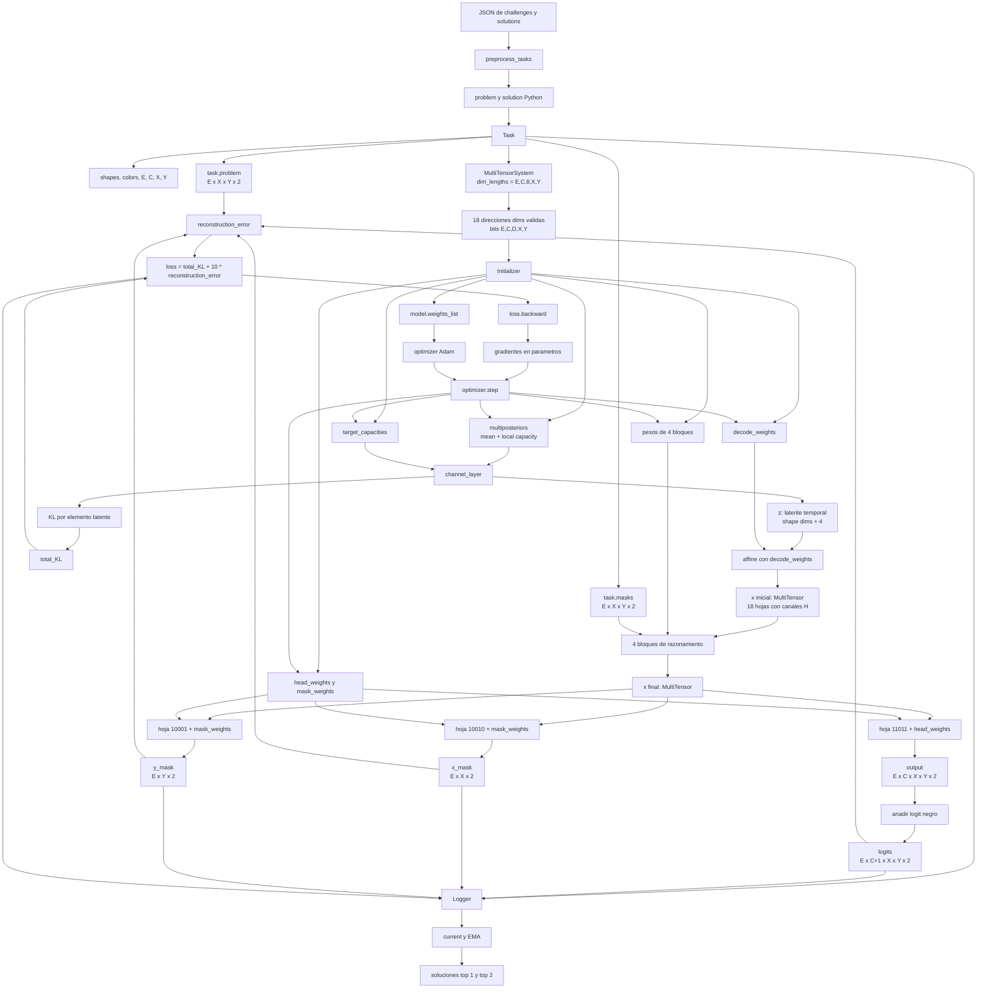
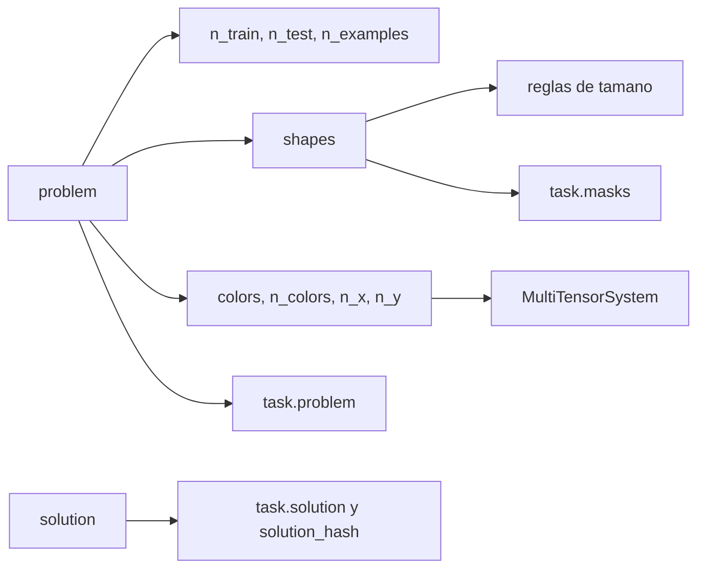
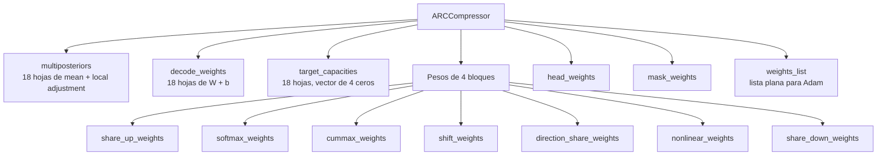
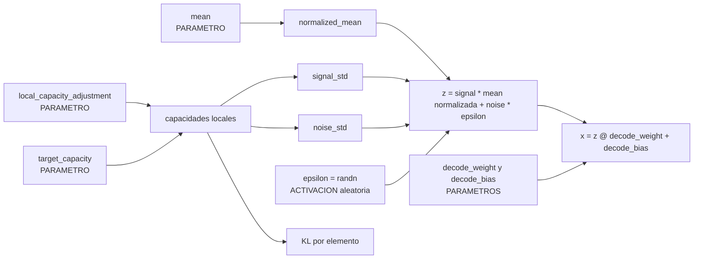
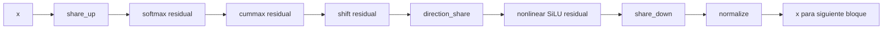
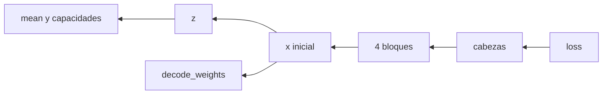

# Mapa de variables de una tarea en SuperCompressARC

## Objetivo

Este documento sigue una sola tarea desde el JSON hasta las soluciones finales.
Ordena las variables por el momento en que se crean y muestra:

- quien crea cada variable;
- que contiene;
- su tipo y forma;
- si persiste o se recalcula;
- que variable la consume despues.

El recorrido de referencia es el de `analyze_example.py` para la tarea
`007bbfb7`, pero las relaciones son las mismas para cualquier tarea.

## Leyenda

Usaremos estos nombres para las longitudes dependientes de la tarea:

| Simbolo | Significado | Variable |
| --- | --- | --- |
| `E` | Numero total de ejemplos | `task.n_examples` |
| `T` | Numero de ejemplos de test | `task.n_test` |
| `C` | Numero de colores no negros | `task.n_colors` |
| `D` | Numero fijo de direcciones | `8` |
| `X` | Maximo numero de filas | `task.n_x` |
| `Y` | Maximo numero de columnas | `task.n_y` |
| `L` | Canales latentes | `decoding_dim = 4` |
| `H` | Canales del residual | `16` sin direccion, `8` con direccion |

Las variables se clasifican en cuatro familias:

| Familia | Marca | Persiste entre pasos | Adam la modifica |
| --- | --- | --- | --- |
| Dato observado | DATO | Si | No |
| Parametro del modelo | PARAMETRO | Si | Si, si participa en la perdida |
| Activacion temporal | ACTIVACION | No | No directamente |
| Estado de seguimiento | ESTADO | Si | No |

## Mapa general



La flecha de `optimizer.step` de vuelta a los parametros representa el ciclo de
entrenamiento: el paso siguiente vuelve a crear `z`, `x` y `logits` usando los
parametros ya modificados.

## Fase 1: variables del programa conductor

`analyze_example.py` crea primero las opciones de ejecucion:

| Orden | Variable | Tipo | Contenido | Consumidor |
| --- | --- | --- | --- | --- |
| 1 | `args.accel_preset` | `str` | Preset `baseline`, `bf16`, `compile` o `full` | `accel.config_from_preset` |
| 2 | `args.inductor_cache_dir` | `str` | Cache dedicada; por defecto `/mnt/supercompressarc-cache/.inductor_cache` | Presets compilados |
| 3 | `accel_cfg` | `AccelConfig` | Configuracion efectiva del proceso y del `forward` | `accel.configure_process`, `accel.apply` |
| 4 | `effective_cache_dir` | `str \| None` | `TORCHINDUCTOR_CACHE_DIR` efectivo tras aplicar precedencias | Log y CSV |
| 5 | `run_label` | `str` | `--run-label` o, por defecto, el preset | Nombre del CSV de tiempos |
| 6 | `split` | `str` | `training`, `evaluation` o `test` | `preprocess_tasks` |
| 7 | `task_name` | `str` | Identificador de la tarea | Carga del JSON y nombres de archivos |
| 8 | `n_iterations` | `int` | Pasos solicitados por `--iterations` | Bucle de entrenamiento |
| 9 | `folder` | `str` | `results/<task_name>/` | Graficas, NPZ y CSV |

Todavia no existe ningun tensor neuronal.

## Fase 2: carga de los JSON

`preprocess_tasks(split, [task_name])` crea:

| Variable | Tipo | Contenido |
| --- | --- | --- |
| `problems` | `dict` | Todas las tareas del archivo `challenges.json` |
| `solutions` | `dict` o `None` | Soluciones verdaderas del split, si existen |
| `task_names` | `list[str]` | Claves de `problems` |
| `problem` | `dict` | Una sola tarea, con listas `train` y `test` |
| `solution` | Lista o `None` | Outputs verdaderos de test para evaluar |

`problem` conserva las cuadriculas tal como aparecen en JSON. Estos valores
son datos, no parametros entrenables.

## Fase 3: construccion de `Task`

El constructor crea sus atributos en este orden:



### 3.1 Identidad y cantidades

| Variable | Familia | Tipo | Significado |
| --- | --- | --- | --- |
| `task.task_name` | DATO | `str` | Identificador de la tarea |
| `task.n_train` | DATO | `int` | Demostraciones con input y output |
| `task.n_test` | DATO | `int` | Ejemplos cuyo output se predice |
| `task.n_examples` | DATO | `int` | `n_train + n_test` |
| `task.unprocessed_problem` | DATO | `dict` | Referencia al problema JSON original |

### 3.2 Formas reales

`task.shapes` es una lista con esta estructura:

```text
task.shapes[example_num][in_out_mode][axis]
                   E         0/1         0/1
```

| Indice | Valor |
| --- | --- |
| `in_out_mode = 0` | Input |
| `in_out_mode = 1` | Output |
| `axis = 0` | Filas, eje `x` en el codigo |
| `axis = 1` | Columnas, eje `y` en el codigo |

Las variables `in_out_same_size`, `all_in_same_size` y `all_out_same_size`
resumen regularidades de tamaño. Tambien permiten inferir el tamaño esperado
del output de test.

### 3.3 Colores y espacio rectangular

| Variable | Tipo | Significado |
| --- | --- | --- |
| `task.colors` | `list[int]` | Colores ARC presentes, incluido el negro `0` |
| `task.n_colors` | `int` | Colores no negros; longitud del eje `C` del multitensor |
| `task.n_x` | `int` | Maximo de filas reservado |
| `task.n_y` | `int` | Maximo de columnas reservado |

Todas las cuadriculas se alojan en un rectangulo comun `X x Y`. Las celdas que
sobran son padding.

### 3.4 `task.masks`: mascara espacial

```text
tipo    = torch.Tensor float32
forma   = [E, X, Y, 2]
valores = 1 para celda real, 0 para padding
familia = DATO
```

Esta mascara se calcula con las formas reales. La consumen `cummax`, `shift` y
algunas reducciones de `share_down` para no tratar el padding como contenido.

### 3.5 `task.problem`: colores observados

Se construye primero en one-hot:

```text
numpy.ndarray [E, C+1, X, Y, 2]
```

Despues `argmax(axis=1)` elimina el eje one-hot:

```text
torch.Tensor entero [E, X, Y, 2]
```

Cada celda contiene un indice interno de `task.colors`. Es el objetivo de la
reconstruccion; no es una entrada pasada a `model.forward()`.

### 3.6 `task.solution`

```text
task.solution      Tensor [T, X, Y] o None
task.solution_hash int o None
```

Solo se emplean para evaluar la respuesta. No participan en el entrenamiento.

## Fase 4: `MultiTensorSystem` y `dims`

`Task` crea:

```text
task.multitensor_system.dim_lengths = [E, C, 8, X, Y]
                                       E  C  D  X  Y
```

Una variable `dims` contiene cinco bits:

```text
[example, color, direction, x, y]
```

Ejemplo:

```text
dims = [1, 1, 0, 1, 1]
```

No contiene datos ni tamaños. Indica que una representacion distingue ejemplo,
color, fila y columna, pero no direccion.

`MultiTensorSystem` examina las 32 combinaciones y conserva exactamente 18
validas. Cada `dims` valida es una direccion dentro del contenedor
`MultiTensor` y selecciona una hoja.

### Dos mascaras diferentes

| Nombre | Forma | Funcion |
| --- | --- | --- |
| `dims` | Lista de 5 bits | Elegir los ejes de una hoja del multitensor |
| `task.masks` | `[E,X,Y,2]` | Marcar celdas reales frente a padding |

No existe una unica mascara binaria de cinco dimensiones aplicada al problema.
Existen 18 listas `dims` validas que describen 18 vistas, y por separado existe
la mascara espacial `task.masks`.

## Fase 5: construccion del modelo

`model = ARCCompressor(task)` crea un modelo nuevo y especifico para la tarea.

### 5.1 Tamaños fijos de arquitectura

| Variable de clase | Valor | Funcion |
| --- | --- | --- |
| `n_layers` | 4 | Numero de bloques de razonamiento |
| `decoding_dim` | 4 | Canales del latente `z` |
| `share_up_dim` | 16 | Ancho interno de `share_up` |
| `share_down_dim` | 8 | Ancho interno de `share_down` |
| `softmax_dim` | 2 | Ancho de entrada de la operacion softmax |
| `cummax_dim` | 4 | Ancho interno de cummax |
| `shift_dim` | 4 | Ancho interno de shift |
| `nonlinear_dim` | 16 | Ancho interno de SiLU |

`channel_dim_fn(dims)` decide el ancho estable de las hojas de `x`:

```text
dims[2] = 0, sin eje direccion -> H = 16 canales
dims[2] = 1, con eje direccion -> H = 8 canales por direccion
```

### 5.2 `Initializer`

El objeto temporal `initializer` conserva:

```text
initializer.multitensor_system
initializer.channel_dim_fn
initializer.weights_list = []
```

Cada parametro creado se añade a `weights_list`.

#### Inicializacion lineal

```text
[weight, bias]
weight = randn(n_in, n_out) / sqrt(n_in)
bias   = randn(n_out) / sqrt(n_in)
```

#### Inicializacion posterior

Para cada una de las 18 hojas:

```text
mean                      = 0.01 * randn(shape(dims, 4))
local_capacity_adjustment = zeros(shape(dims, 4))
posterior                 = [mean, local_capacity_adjustment]
```

Ambos son PARAMETROS. `mean` comienza como ruido normal pequeño; sus ejes los
determinan `dims` y sus ultimos cuatro valores son canales latentes.

### 5.3 Parametros persistentes del modelo



| Atributo | Estructura | Funcion |
| --- | --- | --- |
| `multiposteriors` | `MultiTensor[[mean, local_adjustment]]` | Memoria latente entrenable |
| `decode_weights` | `MultiTensor[[W,b]]` | Convertir 4 canales latentes en 16 u 8 canales |
| `target_capacities` | `MultiTensor[Tensor[4]]` | Regular la capacidad informativa de `z` |
| `*_weights[layer]` | Lista de 4 `MultiTensor` | Transformar y comunicar `x` |
| `head_weights` | `[W,b]` | Convertir 16 rasgos en logits input/output |
| `mask_weights` | `[W,b]` | Producir puntuaciones de filas y columnas |
| `weights_list` | `list[Tensor]` | Referencias planas que recibe Adam |

Un bloque residual almacena dos lineales:

```text
[[W_down, b_down], [W_up, b_up]]
```

`direction_share_weights` es distinto: cada hoja contiene una tabla `8 x 8`
de pares `[W,b]`, uno por combinacion direccion destino/origen.

## Fase 6: optimizador y logger

Antes del primer paso se crean:

```python
optimizer = torch.optim.Adam(
    model.weights_list,
    lr=0.01,
    betas=(0.5, 0.9),
)
train_history_logger = Logger(task)
```

`optimizer` no contiene las activaciones `z` o `x`. Contiene referencias a los
PARAMETROS de `weights_list` y, tras el primer paso, crea para cada parametro
activo sus momentos `exp_avg` y `exp_avg_sq`.

El `Logger` crea curvas vacias, buffers de logits actuales y medias
exponenciales para los ejemplos de test.

## Fase 7: una iteracion de entrenamiento

El bucle llama 2000 veces a:

```python
train.take_step(task, model, optimizer, train_step, train_history_logger)
```

### 7.1 Limpiar gradientes anteriores

```python
optimizer.zero_grad()
```

Esto limpia `.grad`. No cambia los parametros ni el estado de Adam.

### 7.2 `decode_latents`: crear `z`, KL y `x`

`model.forward()` empieza con:

```python
x, KL_amounts, KL_names = layers.decode_latents(
    model.target_capacities,
    model.decode_weights,
    model.multiposteriors,
)
```

`multify` repite el siguiente recorrido para cada una de las 18 hojas.



#### Variables de `channel_layer`

| Orden | Variable | Familia | Forma por hoja | Funcion |
| --- | --- | --- | --- | --- |
| 1 | `mean` | PARAMETRO | `shape(dims,4)` | Señal latente aprendida |
| 2 | `local_capacity_adjustment` | PARAMETRO | `shape(dims,4)` | Distribuir capacidad local |
| 3 | `target_capacity` | PARAMETRO | `[4]` | Capacidad global por canal latente |
| 4 | `desired_global_capacity` | ACTIVACION | `[4]` | Capacidad positiva transformada |
| 5 | `output_scaling` | ACTIVACION | `[4]` | Escala final de `z` |
| 6 | `desired_local_capacity` | ACTIVACION | `shape(dims,4)` | Capacidad de cada elemento |
| 7 | `noise_std`, `noise_var` | ACTIVACION | `shape(dims,4)` | Ruido permitido |
| 8 | `signal_std`, `signal_var` | ACTIVACION | `shape(dims,4)` | Señal permitida |
| 9 | `normalized_mean` | ACTIVACION | `shape(dims,4)` | `mean` centrada y escalada |
| 10 | `z` | ACTIVACION | `shape(dims,4)` | Muestra latente temporal |
| 11 | `KL` | ACTIVACION | `shape(dims,4)` | Coste de informacion por elemento |

`z` no persiste. Se vuelve a muestrear en cada `forward()`.

#### Decodificar `z` para obtener `x`

```text
z [...,4] @ decode_weight [4,H] + decode_bias [H] = x [...,H]
```

`decode_latents` devuelve:

| Variable | Tipo | Contenido |
| --- | --- | --- |
| `x` | `MultiTensor[Tensor]` | 18 hojas de activaciones con canales `H` |
| `KL_amounts` | `list[Tensor]` | Un tensor KL por hoja |
| `KL_names` | `list[str]` | El `dims` correspondiente a cada KL |

Ejemplo sin direccion:

```text
dims = [1,1,0,1,1]
x[dims].shape = [E,C,X,Y,16]
```

Ejemplo con direccion:

```text
dims = [1,1,1,1,1]
x[dims].shape = [E,C,8,X,Y,8]
```

Una posicion y una direccion concretas contienen 8 canales. Si se conservan
las ocho direcciones, la estructura local es una matriz `[8,8]`, no un unico
vector de 64 canales.

### 7.3 Cuatro bloques modifican `x`



| Operacion | Variables que consume | Efecto sobre `x` |
| --- | --- | --- |
| `share_up` | Todas las hojas y `share_up_weights` | Lleva vistas generales a vistas detalladas |
| `softmax` | Cada hoja y `softmax_weights` | Compara subconjuntos de ejes |
| `cummax` | Hojas direccionales, `task.masks`, pesos | Propaga maximos espaciales |
| `shift` | Hojas direccionales, `task.masks`, pesos | Desplaza informacion entre vecinos |
| `direction_share` | Ocho direcciones y pesos `8 x 8` | Mezcla informacion entre direcciones |
| `nonlinear` | Cada hoja y pesos | Introduce no linealidad SiLU |
| `share_down` | Todas las hojas, mascaras y pesos | Resume vistas detalladas |
| `normalize` | Cada hoja | Controla media y escala |

Los bloques residuales calculan conceptualmente:

```text
delta = W_up(operacion(W_down(x)))
x_nuevo = x_anterior + delta
```

La forma estable de cada hoja sigue terminando en `H`; cambian sus valores.

### 7.4 Cabezas de salida

Las cabezas no consumen las 18 hojas directamente. Seleccionan tres:

| Hoja | Forma antes de la cabeza | Cabeza | Salida |
| --- | --- | --- | --- |
| `x[[1,1,0,1,1]]` | `[E,C,X,Y,16]` | `head_weights [16,2]` | `output [E,C,X,Y,2]` |
| `x[[1,0,0,1,0]]` | `[E,X,16]` | `mask_weights [16,2]` | `x_mask [E,X,2]` |
| `x[[1,0,0,0,1]]` | `[E,Y,16]` | `mask_weights [16,2]` | `y_mask [E,Y,2]` |

El ultimo eje de tamaño 2 representa modo input/output. `output` contiene solo
los `C` colores no negros. `take_step` antepone un plano fijo de ceros para el
negro:

```text
output [E,C,X,Y,2] -> logits [E,C+1,X,Y,2]
```

### 7.5 Calculo de la perdida

Primero se suman todos los elementos de `KL_amounts`:

```text
total_KL = escalar
```

Despues, para cada ejemplo conocido y modo, se crean:

| Variable | Forma | Procedencia |
| --- | --- | --- |
| `logits_slice` | `[C+1,X,Y]` | Corte de `logits` |
| `problem_slice` | `[X,Y]` | Corte de `task.problem` |
| `output_shape` | `[2]` | `task.shapes` |
| `x_logprobs` | `[n_x_offsets]` | `x_mask` |
| `y_logprobs` | `[n_y_offsets]` | `y_mask` |
| `target_crop` | `[out_x,out_y]` | Zona real de `problem_slice` |
| `logits_crops` | `[n_offsets,C+1,out_x,out_y]` | Todas las ventanas candidatas |
| `target_batch` | `[n_offsets,out_x,out_y]` | Objetivo repetido |
| `ce` | `[n_offsets,out_x,out_y]` | Error por pixel y ventana |
| `ce_sum` | `[n_x_offsets,n_y_offsets]` | Error de color por ventana |
| `logprobs` | `[n_x_offsets,n_y_offsets]` | Evidencia de forma, posicion y color |
| `logprob` | Escalar | Evidencia agregada |

La suma de `-logprob` produce `reconstruction_error`.

$$
loss = total\_KL + 10 \cdot reconstruction\_error
$$

### 7.6 Retropropagacion y actualizacion



`loss.backward()` no modifica nada. Calcula `.grad` para cada PARAMETRO usado.

`optimizer.step()` modifica los parametros usando esos gradientes y el estado
de Adam. Por ejemplo:

```text
mean_nueva = mean_anterior - correccion_Adam
```

En el paso siguiente:

```text
parametros modificados
  -> nuevo z aleatorio condicionado por mean
  -> nuevo x
  -> nuevos logits
  -> nueva loss
```

Los valores de `z` y `x` cambian, pero no porque Adam los almacene y edite.
Cambian porque son ACTIVACIONES recalculadas a partir de PARAMETROS nuevos.

## Fase 8: registro y seleccion de soluciones

El logger recibe tensores con `.detach()`, por lo que ya no participan en los
gradientes.

| Variable de estado | Forma o tipo | Funcion |
| --- | --- | --- |
| `KL_curves` | `dict[str,list]` | KL escalar de cada hoja por paso |
| `total_KL_curve` | Lista | KL total por paso |
| `reconstruction_error_curve` | Lista | Error de reconstruccion por paso |
| `loss_curve` | Lista | Perdida por paso |
| `current_logits` | `[T,C+1,X,Y]` | Prediccion test actual |
| `current_x_mask` | `[T,X]` | Scores actuales de filas |
| `current_y_mask` | `[T,Y]` | Scores actuales de columnas |
| `ema_logits` | `[T,C+1,X,Y]` | Media exponencial de predicciones |
| `ema_x_mask` | `[T,X]` | Media exponencial de filas |
| `ema_y_mask` | `[T,Y]` | Media exponencial de columnas |
| `solution_hashes_count` | `dict[int,float]` | Evidencia acumulada por candidata |
| `solution_most_frequent` | Tupla | Primer intento pass@2 |
| `solution_second_most_frequent` | Tupla | Segundo intento pass@2 |

La conversion de logits a una candidata sigue:

```text
logits
  -> argmax de color
  -> mejor recorte segun x_mask e y_mask
  -> indices internos convertidos con task.colors
  -> tupla de cuadriculas
  -> hash y score
  -> actualizar top 1 y top 2
```

## Fase 9: analisis posterior de `analyze_example.py`

Una vez terminados los 2000 pasos se guardan:

| Variable | Archivo o estructura | Contenido |
| --- | --- | --- |
| `step_profile` | CSV | Tiempo wall y CPU por paso |
| `KL_curves` | NPZ | Evolucion del KL de cada hoja |
| `reconstruction_error_curve` | NPZ | Evolucion del error |
| `multiposteriors` | NPZ | `mean` y ajustes ya entrenados |
| `target_capacities` | NPZ | Capacidades ya entrenadas |
| `decode_weights` | NPZ | Pesos de decodificacion entrenados |

El script vuelve a llamar 100 veces a `decode_latents`:

```text
samples = 100 MultiTensor x muestreados
means   = promedio de esos samples
```

En esta parte `means` no es el PARAMETRO `mean` del posterior. Es una variable
de analisis que promedia activaciones `x` para reducir el ruido de muestreo.
Despues SVD obtiene componentes principales para visualizar los patrones
aprendidos en las hojas con KL significativo.

## Variables con nombres faciles de confundir

| Nombre parecido | Significado real |
| --- | --- |
| `dims` | Cinco bits que seleccionan ejes de una hoja |
| `task.masks` | Mascara espacial de celdas reales y padding |
| `x_mask`, `y_mask` | Scores aprendidos para recortar la prediccion |
| `mean` en `posterior` | PARAMETRO latente entrenable |
| `mean` en `average_samples` | Promedio temporal de muestras `x` para graficar |
| `z` en `channel_layer` | Latente estocastico de cuatro canales |
| `z` en `add_residual` | Variable local temporal que representa `delta` |
| `x` | MultiTensor de activaciones del flujo residual |
| `output` | Logits de colores no negros al salir de `forward` |
| `logits` | `output` despues de añadir el plano negro |
| `task.solution` | Verdad de test usada solo para evaluar |
| `solution_most_frequent` | Prediccion seleccionada por el logger |

## Linea temporal resumida

```text
UNA VEZ POR TAREA
JSON
  -> problem, solution
  -> Task
  -> MultiTensorSystem
  -> parametros del modelo
  -> optimizer y Logger

2000 VECES
parametros
  -> z
  -> x inicial
  -> x tras cuatro bloques
  -> output, x_mask, y_mask
  -> logits
  -> total_KL + reconstruction_error
  -> loss
  -> gradientes
  -> parametros actualizados
  -> registro y candidatas

AL FINAL
curvas + pesos aprendidos + 100 muestras
  -> promedio
  -> SVD
  -> graficas de componentes latentes
```

## Preguntas para identificar cualquier variable

Al detenerse en el debugger, conviene responder siempre en este orden:

1. ¿Es DATO, PARAMETRO, ACTIVACION o ESTADO?
2. ¿Quien la crea?
3. ¿Que significa cada eje de su forma?
4. ¿Persiste hasta el paso siguiente?
5. ¿Quien la consume?
6. ¿Recibe cambios de Adam o se recalcula desde otros valores?

Con esas seis preguntas se puede ubicar cualquier nombre del flujo sin
confundir la estructura del problema con la representacion aprendida.