Genera un diagrama de bloques arquitectónico o esquema de sistemas altamente estructurado, utilizando un estilo artístico estrictamente técnico, que combine estéticas de 'esquema de hardware', 'wireframe digital', 'interfaz de terminal hacker' y 'plano de microchip ciberpunk'.

Fondo y Atmósfera: El lienzo completo debe tener un fondo de color oscuro muy profundo, casi negro o un gris antracita oscuro, plano y completamente limpio, sin texturas ni gradientes. Esto es fundamental para emular el aspecto de una terminal de comandos o un editor de código en modo oscuro puro, maximizando el contraste con las líneas del diagrama.

Estructura y Composición (Geometría): La arquitectura gráfica debe basarse única y exclusivamente en rectángulos anidados, apilados y dispuestos en cuadrículas perfectas. Absolutamente todas las figuras deben ser rectángulos con esquinas de 90 grados perfectamente ortogonales (estrictamente sin esquinas redondeadas). La composición debe mostrar un sistema jerárquico claro: un gran contenedor exterior, subdividido simétricamente en grandes cuadrantes internos. Dentro de estos cuadrantes, diseña filas horizontales largas en la parte superior y bloques tipo matriz (filas y columnas de rectángulos idénticos más pequeños) en la parte inferior. Deja márgenes precisos, uniformes y matemáticos (espacio negativo oscuro) entre cada borde para delinear claramente qué bloque está dentro de cuál.

Estilización de los Elementos (Bordes y Rellenos): Se trata de un diseño basado puramente en contornos (estilo delineado/wireframe). Los rectángulos no deben estar rellenados con colores sólidos brillantes; su interior debe permanecer del color oscuro del fondo. El peso visual completo debe recaer en líneas finas, nítidas, lumínicas y limpias que dibujan los bordes uniformes de cada rectángulo.

Paleta de Colores (Colores Neón de Sintaxis): Utiliza una paleta restringida de colores neón vibrantes, similares al resaltado de sintaxis de los editores de código modernos, y asocia cada color estrictamente a una jerarquía o "tipo" de bloque:

Verde neón pálido / Verde lima brillante: Para las líneas divisorias principales, los contenedores de los grandes bloques y para las matrices densas de pequeños bloques que simulan núcleos computacionales. El título general en la esquina superior izquierda también debe ir en este verde vibrante.
Cian oscuro / Azul cian eléctrico: Para los rectángulos horizontales muy anchos y planos (que parecen representar memorias cachés a nivel principal estructural).
Amarillo eléctrico / Dorado neón: Para bloques de tamaño medio en formato horizontal (que parecen representar unidades de control o programadores), ubicados entre las secciones azules y verdes.
Magenta neón / Rosa brillante: Reservado específicamente para filas singulares de pequeños bloques ubicados en la parte más inferior de las matrices principales, aportando un toque de contraste intenso a la escala de verdes y amarillos.
Tipografía y Textos: Todo el texto del esquema debe estar escrito usando obligatoriamente una tipografía monoespaciada (tipo terminal, consola, sans-serif limpia y cuadriculada). El texto debe ser pequeño, puramente funcional y técnico, con caracteres precisos. El color de la fuente de cada texto debe coincidir exactamente con el color neón del borde del rectángulo que lo rodea. El texto de las unidades pequeñas debe estar centrado perfectamente en ambas direcciones; el texto principal de los bloques largos puede estar ligeramente desplazado hacia arriba y al centro.

Estética General (Vibe): El resultado debe parecer indiscutiblemente el plano esquemático de un microprocesador hiperavanzado de una corporación de ciencia ficción, un diseño HUD táctico o los diagramas internos de arquitectura de hardware renderizados por una interfaz vectorial en los años 90 o 2000. Debe sentirse matemáticamente perfecto, lógico, de alto contraste visual, luminoso y austero.

https://prnt.sc/202mH1q3L6-r
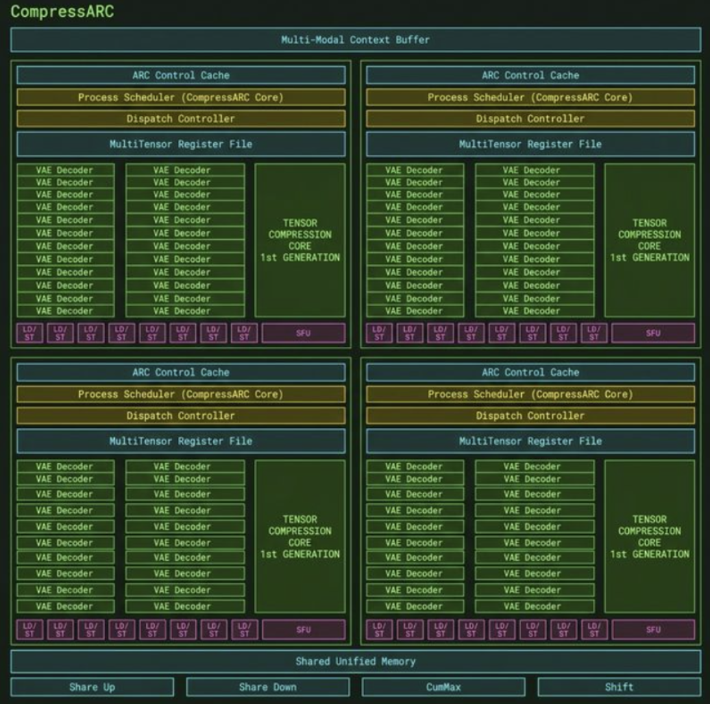

https://prnt.sc/9YnVAxRpP_7s
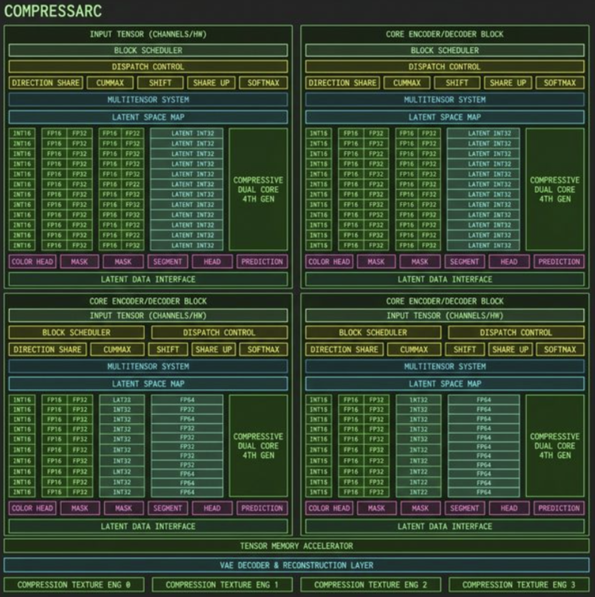

https://prnt.sc/q1mmuuQ2LYNx
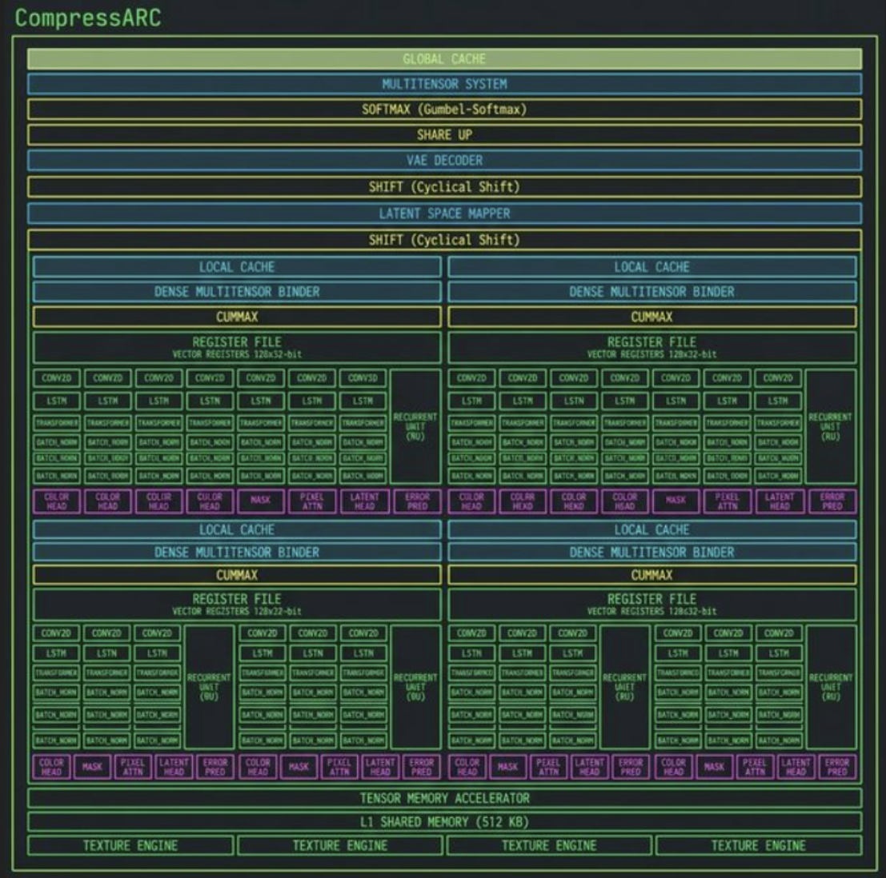

https://prnt.sc/cci12jmFbv2U
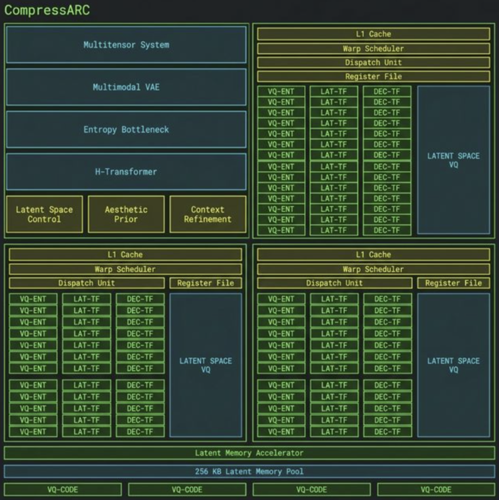

https://prnt.sc/z4Vzk0hHNxF-
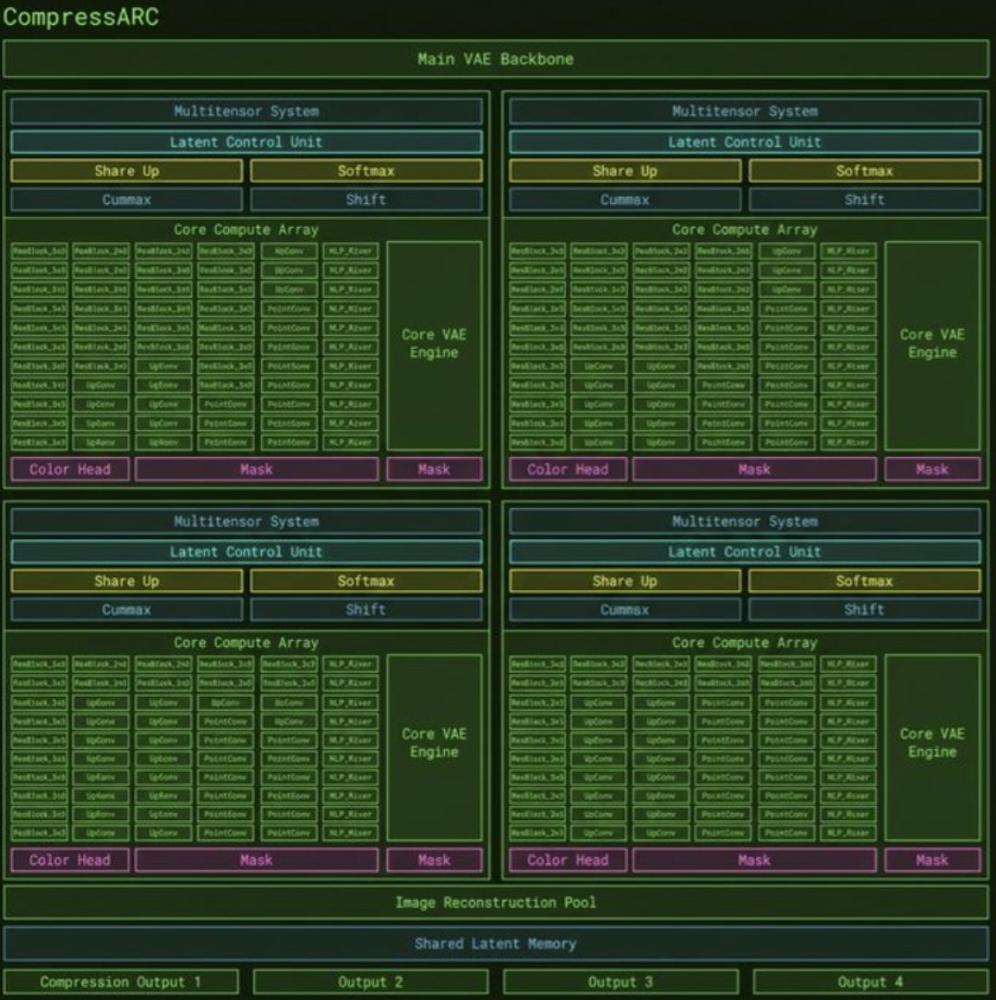

https://prnt.sc/U1Lu28tOMfqL
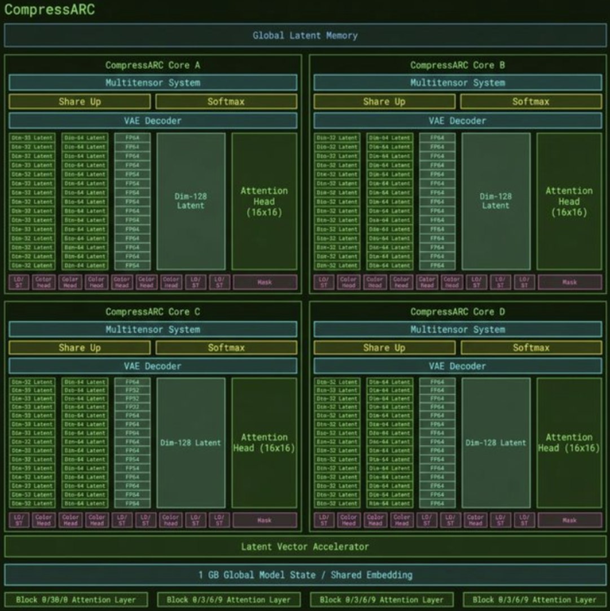

https://prnt.sc/uq1J1VI7_z8p
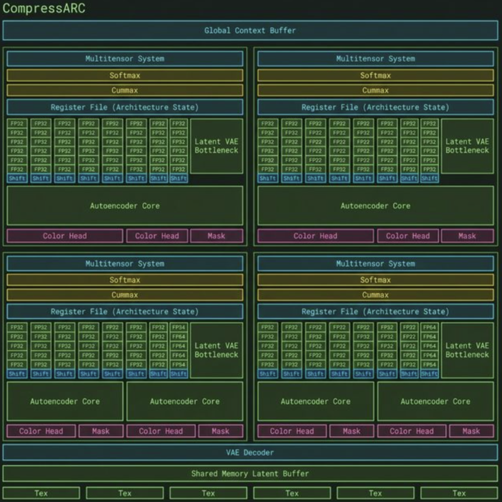

https://prnt.sc/ApvnoUzVqjN1
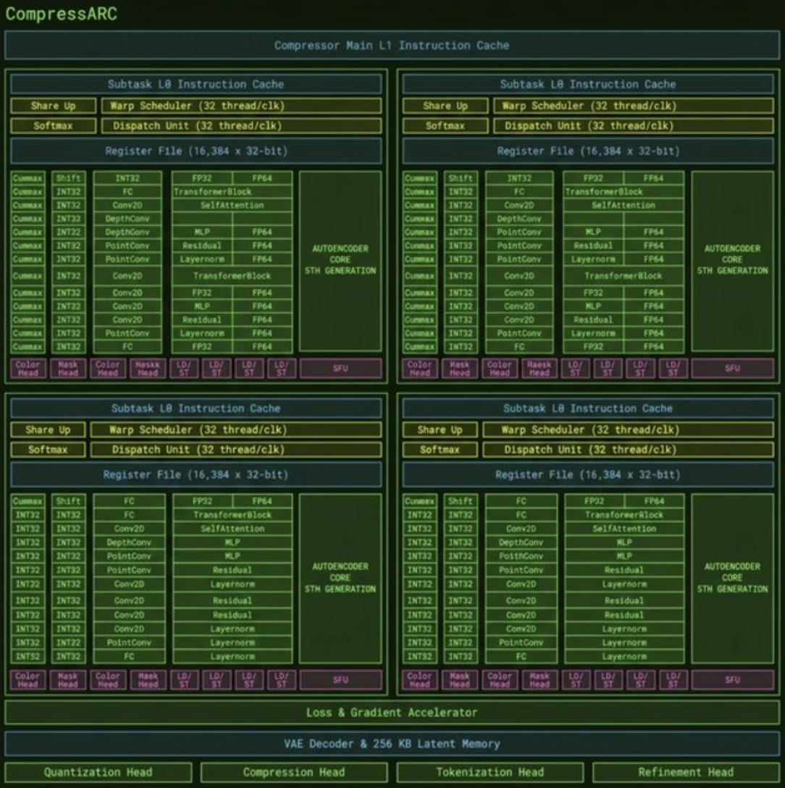

https://prnt.sc/OBTcAR6E6fhl
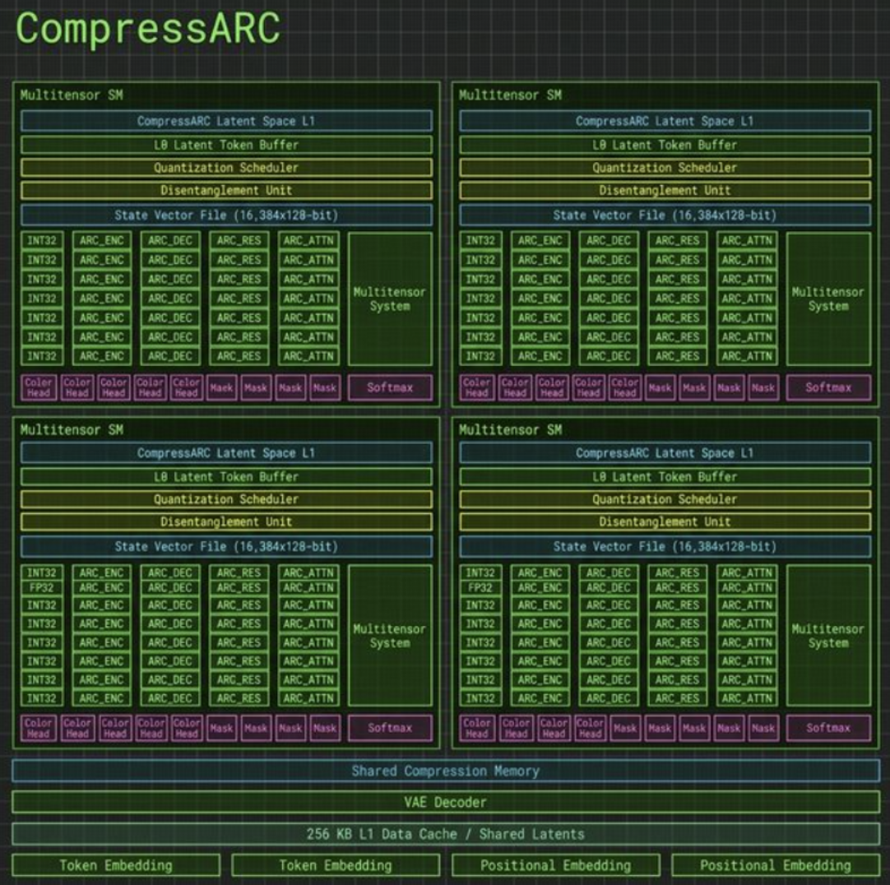

https://prnt.sc/9Aiitwetx567
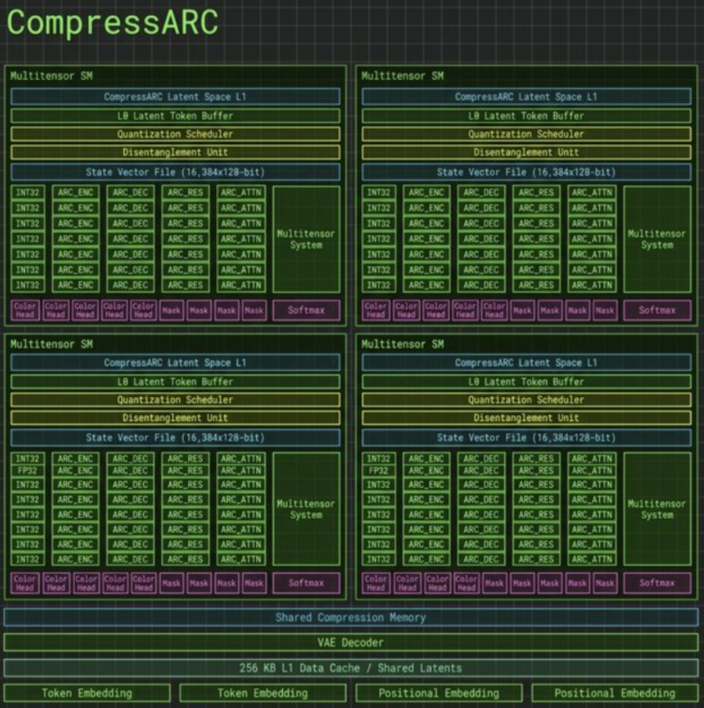

```mermaid
flowchart TD
    %%-------------------------------------------
    %% ESTILOS CYBERPUNK / HARDWARE SCHEMATIC
    %%-------------------------------------------
    classDef default fill:#0d0d0d,stroke:#333,stroke-width:1px,color:#fff,font-family:monospace;
    classDef cyanNode fill:#0a1a1a,stroke:#00ffff,stroke-width:2px,color:#00ffff,font-family:monospace;
    classDef greenNode fill:#0a1a0a,stroke:#39ff14,stroke-width:2px,color:#39ff14,font-family:monospace;
    classDef yellowNode fill:#1a1a0a,stroke:#ffdf00,stroke-width:2px,color:#ffdf00,font-family:monospace;
    classDef pinkNode fill:#1a0a1a,stroke:#ff00ff,stroke-width:2px,color:#ff00ff,font-family:monospace;
    
    %%-------------------------------------------
    %% ESTRUCTURA PRINCIPAL DEL DIAGRAMA
    %%-------------------------------------------
    subgraph MasterContainer [COMPRESSARC SYSTEM ARCHITECTURE]
        direction TB

        %% CUADRANTES SUPERIORES (Cachés/Estructuras Lógicas: Azul Cyan)
        subgraph DataStruct [1. FUNDAMENTAL MULTITENSOR STATE]
            direction LR
            TENS["[0,1,...,1]<br/>MULTITENSOR BUFFER<br/>(27 Valid Tensors)"]:::cyanNode
            EQ["SYMMETRY KERNEL<br/>(D4 | x-y | colors)"]:::cyanNode
        end
        
        %% BLOQUES DE CONTROL (Control/Schedulers: Amarillo Eléctrico)
        subgraph Decoder [2. LATENT VAE DECODER]
            direction LR
            Z["LATENT CODE 'Z'<br/>(Mu, Capacity)"]:::yellowNode
            CHAN["CHANNEL LAYER<br/>(AWGN Decoding)"]:::yellowNode
        end
        
        %% NÚCLEOS DE COMPUTACIÓN MATRICIALES (Matrices Centrales: Verde Lima)
        subgraph CoreLoops [3. CENTRAL COMPUTATION CORES - x4 LAYERS]
            direction TB
            RS["RESIDUAL STREAM"]:::greenNode
            UP["1. SHARE_UP<br/>(Upward tensor aggr)"]:::greenNode
            SMAX["2. SOFTMAX<br/>(Axis Attention)"]:::yellowNode
            CMAX["3. CUMMAX<br/>(Blelloch 8-Dir Scan)"]:::greenNode
            SHFT["4. SHIFT<br/>(1-Pixel Transl.)"]:::greenNode
            DSHR["5. DIRECTION_SHARE<br/>(D4 Angular Kernel)"]:::greenNode
            NLIN["6. NONLINEAR<br/>(SiLU / Swish)"]:::pinkNode
            DWN["7. SHARE_DOWN<br/>(Down tensor pool)"]:::greenNode
            NRM["8. NORMALIZE<br/>(Channel variance=1)"]:::greenNode
            
            RS --> UP --> SMAX --> CMAX --> SHFT --> DSHR --> NLIN --> DWN --> NRM
            NRM -. "add_residual" .-> RS
        end
        
        %% MÓDULOS INFERIORES SINGULARES (Magenta Neón)
        subgraph OutputHeads [4. LINEAR OUTPUT HEADS & MASKS]
            direction LR
            C_HEAD["COLOR HEAD<br/>(Input/Output Logits)"]:::yellowNode
            X_MASK["X MASK HEAD"]:::pinkNode
            Y_MASK["Y MASK HEAD"]:::pinkNode
        end
        
        FINAL["FINAL SOLUTION<br/>(pass@2 EMA Selection)"]:::cyanNode

        %% CONEXIONES INTERGRUPALES
        TENS ==> EQ ==> Z
        Z ==> CHAN ==> RS
        NRM ==> C_HEAD
        NRM ==> X_MASK
        NRM ==> Y_MASK
        C_HEAD ==> FINAL
        X_MASK ==> FINAL
        Y_MASK ==> FINAL
    end

    %% ESTILOS DE LOS CONTENEDORES (Márgenes perfectos delineados)
    style MasterContainer fill:#000000,stroke:#39ff14,stroke-width:2px,color:#39ff14,stroke-dasharray: 4 4,font-family:monospace
    style DataStruct fill:#050505,stroke:#00ffff,stroke-width:1px,color:#00ffff,font-family:monospace
    style Decoder fill:#050505,stroke:#ffdf00,stroke-width:1px,color:#ffdf00,font-family:monospace
    style CoreLoops fill:#050505,stroke:#39ff14,stroke-width:1px,color:#39ff14,font-family:monospace
    style OutputHeads fill:#050505,stroke:#ff00ff,stroke-width:1px,color:#ff00ff,font-family:monospace
```

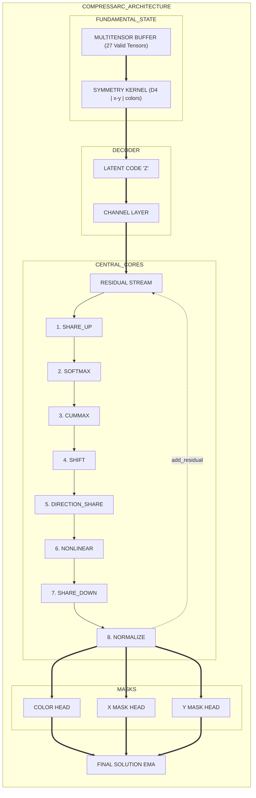
```mermaid
flowchart TD
    subgraph COMPRESSARC_ARCHITECTURE
        direction TB

        subgraph FUNDAMENTAL_STATE
            TENS["MULTITENSOR BUFFER (27 Valid Tensors)"]
            EQ["SYMMETRY KERNEL (D4 | x-y | colors)"]
        end
        
        subgraph DECODER
            Z["LATENT CODE 'Z'"]
            CHAN["CHANNEL LAYER"]
        end
        
        subgraph CENTRAL_CORES
            direction TB
            RS["RESIDUAL STREAM"] --> UP["1. SHARE_UP"] --> SMAX["2. SOFTMAX"] 
            SMAX --> CMAX["3. CUMMAX"] --> SHFT["4. SHIFT"] --> DSHR["5. DIRECTION_SHARE"] 
            DSHR --> NLIN["6. NONLINEAR"] --> DWN["7. SHARE_DOWN"] --> NRM["8. NORMALIZE"]
            NRM -. "add_residual" .-> RS
        end
        
        subgraph MASKS
            C_HEAD["COLOR HEAD"]
            X_MASK["X MASK HEAD"]
            Y_MASK["Y MASK HEAD"]
        end
        
        FINAL["FINAL SOLUTION EMA"]

        TENS ==> EQ ==> Z ==> CHAN ==> RS
        NRM ==> C_HEAD & X_MASK & Y_MASK
        C_HEAD & X_MASK & Y_MASK ==> FINAL
    end
```

## Prompt 2

A highly detailed, flat 2D vector-style architectural block diagram and technical schematic, inspired by cyberpunk aesthetics, retro-futuristic hacker terminals, and complex microcircuit layouts. The background is a stark, solid, ultra-dark matte olive-black color (#1a1f18). The entire composition is strictly orthogonal, featuring precise 90-degree angles, perfect horizontal and vertical alignments, and zero curved lines. The aesthetic strictly follows a 'dark mode' IDE theme.

Visual Elements and Geometry: The structure is composed of dozens of meticulously arranged rectangular blocks and bounding boxes, varying in size to represent a rigid structural hierarchy. There are large container boxes housing grids of perfectly identical, smaller square matrices (resembling memory banks, GPU cores, or logic gates). The layout is highly symmetrical, incredibly organized, and spaced with mathematical precision.

Colors and Stroke Style: The linework consists of very thin, crisp, luminous monoline strokes (no fill inside most boxes, only wireframe outlines). The dominant stroke color is a vibrant, glowing terminal neon green. Secondary specialized modules are outlined in a stark neon magenta/purple, and tertiary memory block components are outlined in a muted neon yellow/gold. The colors pop sharply against the pitch-black background, giving a glowing phosphor-display or 'Matrix' digital blueprint vibe.

Connections and Data Flow: The various rectangular modules are interconnected by a complex but impeccably clean network of orthogonal routing lines and solid arrowheads. The connecting lines never curve or use diagonal paths; they strictly bend at 90 degrees, creating a pristine circuit-board data flow web.

Typography and Labels: Inside the boxes, there is crisp, perfectly centered, monospace terminal typography (like Courier or Consolas) in the same bright neon green color. The text consists of short, technical-looking acronyms and hardware labels (e.g., 'SP', 'TF', 'L1', 'L2', 'FB', 'Host'). The font sizing is uniform, legible, and contributes to the technical, data-driven, engineering blueprint atmosphere.

Overall Vibe: A clean, complex, highly technical system architecture diagram, infographic style, minimal but dense with information, flat ui design, wireframe, silicon chip schematic, high-tech interface, glowing wireframes, masterfully organized, crisp vector art masterpiece, 8k resolution, razor-sharp edges.